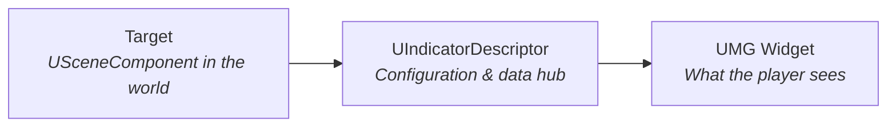
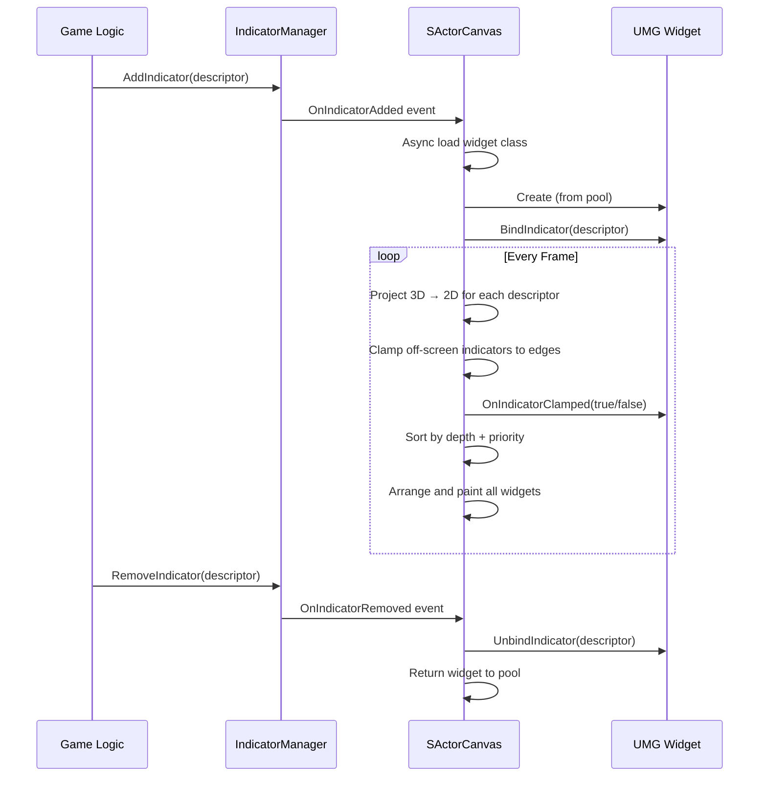

# Core Concepts & Architecture

To display an indicator on the player's screen, three things need to exist: a **target** in the world (the thing being tracked), a **descriptor** (the configuration for how to display it), and a **widget** (the visual the player sees). The system connects these through a registration-projection-rendering pipeline.

***

## The Three Pieces

```mermaid
flowchart LR
    Target["Target<br/><i>USceneComponent in the world</i>"]
    Descriptor["UIndicatorDescriptor<br/><i>Configuration & data hub</i>"]
    Widget["UMG Widget<br/><i>What the player sees</i>"]

    Target --> Descriptor
    Descriptor --> Widget
```

**The Target** is a `USceneComponent` in the world. a character's head bone, an objective marker actor, a pickup item. Optionally, you can specify a socket name on the component for precise tracking.

**The Descriptor** (`UIndicatorDescriptor`) is a `UObject` that ties everything together. It knows _what_ to track (the target component), _how_ to project it onto the screen (projection mode, offsets, alignment), _what widget_ to display (`IndicatorWidgetClass`), and _how to behave_ at screen edges (clamping, arrows). Think of it as the specification sheet for one indicator.

**The Widget** is a standard UMG `UUserWidget` that implements `IIndicatorWidgetInterface`. It receives four callbacks from the system:

| Callback                        | When It Fires                                                           |
| ------------------------------- | ----------------------------------------------------------------------- |
| `BindIndicator`                 | Widget is created and paired with a descriptor, initialize visuals here |
| `UnbindIndicator`               | Widget is being released, clean up references                           |
| `OnIndicatorClamped`            | Each frame the indicator is clamped to a screen edge (or unclamped)     |
| `OnIndicatorDisplayModeChanged` | Indicator switches between 3D world-tracking and 2D screen-locked mode  |

***

## The Lifecycle

```mermaid
sequenceDiagram
    participant Game as Game Logic
    participant Mgr as IndicatorManager
    participant Canvas as SActorCanvas
    participant Widget as UMG Widget

    Game->>Mgr: AddIndicator(descriptor)
    Mgr->>Canvas: OnIndicatorAdded event

    Canvas->>Canvas: Async load widget class
    Canvas->>Widget: Create (from pool)
    Canvas->>Widget: BindIndicator(descriptor)

    loop Every Frame
        Canvas->>Canvas: Project 3D → 2D for each descriptor
        Canvas->>Canvas: Clamp off-screen indicators to edges
        Canvas->>Widget: OnIndicatorClamped(true/false)
        Canvas->>Canvas: Sort by depth + priority
        Canvas->>Canvas: Arrange and paint all widgets
    end

    Game->>Mgr: RemoveIndicator(descriptor)
    Mgr->>Canvas: OnIndicatorRemoved event
    Canvas->>Widget: UnbindIndicator(descriptor)
    Canvas->>Canvas: Return widget to pool
```

#### Step by Step

<!-- gb-stepper:start -->
<!-- gb-step:start -->
**Registration**

Game logic creates a `UIndicatorDescriptor`, configures it (target, widget class, projection mode, clamping), and adds it to the `ULyraIndicatorManagerComponent` on the player's controller. The manager broadcasts `OnIndicatorAdded`.
<!-- gb-step:end -->

<!-- gb-step:start -->
**Widget Creation**

`SActorCanvas` receives the event, asynchronously loads the specified widget class, creates an instance from its `FUserWidgetPool`, and calls `BindIndicator` on the widget. The widget initializes its visuals from the descriptor's data.
<!-- gb-step:end -->

<!-- gb-step:start -->
**Projection**

Each frame, the canvas iterates all visible descriptors. For 3D indicators, `FIndicatorProjection::Project` converts the target's world position to screen coordinates using the player's view matrices. For screen-locked indicators, the `ScreenLockedPosition` is used directly.
<!-- gb-step:end -->

<!-- gb-step:start -->
**Clamping & Arrows**

If an indicator is off-screen and `bClampToScreen` is true, the canvas repositions it to the screen edge. If `bShowClampToScreenArrow` is also true, an arrow widget is shown pointing toward the actual off-screen location. The widget receives `OnIndicatorClamped` each frame so it can adjust its appearance.
<!-- gb-step:end -->

<!-- gb-step:start -->
**Arrangement & Rendering**

All indicators are sorted by depth (distance from camera) and then by `Priority`. The canvas arranges the UMG widgets as child Slate elements and Slate handles the final draw.
<!-- gb-step:end -->

<!-- gb-step:start -->
**Removal**

When `UnregisterIndicator()` is called on the descriptor (or the manager's `RemoveIndicator`), the canvas calls `UnbindIndicator` on the widget, returns it to the pool, and removes it from the layout. Indicators with `bAutoRemoveWhenIndicatorComponentIsNull` clean up automatically if their target becomes invalid.
<!-- gb-step:end -->
<!-- gb-stepper:end -->

***

### 2D / 3D Mode Switching

Indicators can toggle between tracking a 3D world point and being fixed to a 2D screen position. `SwitchTo2DMode()` on the descriptor stores the current projection mode, switches to `ScreenLocked`, and notifies the widget via `OnIndicatorDisplayModeChanged`. `SwitchTo3DMode()` restores the original projection mode.
