# Core Concepts & Architecture

To effectively use and modify Lyra's UI Indicator System, it's essential to understand its fundamental components and how they interact. This section breaks down the core concepts and outlines the overall architectural flow.

***

### **The Anatomy of an Indicator**

At its heart, a single UI indicator is comprised of a few key elements working in concert:

* **The "Target": What the Indicator Points To**
  * This is the actual entity in the game world that the indicator is associated with.
  * Typically, this is a `USceneComponent` (allowing attachment to specific points on an actor, including sockets) or, by extension, the `AActor` owning that component.
  * The indicator's primary job is to visually represent this target on the player's screen.
* **The "Indicator Descriptor" (`UIndicatorDescriptor`): The Brain and Configuration**
  * This `UObject` serves as the central data store and configuration hub for a single indicator instance.
  * It defines _what_ the indicator is tracking (the `SceneComponent`), _how_ its screen position should be calculated (`ProjectionMode`, offsets, alignment), _what_ UMG widget should represent it visually (`IndicatorWidgetClass`), and _how_ it should behave under various conditions (e.g., clamping, visibility, priority, 2D screen-lock behavior).
  * It also holds a reference to the actual UMG widget instance once created (`IndicatorWidget`) and any arbitrary associated data (`DataObject`).
  * Think of the Descriptor as the "blueprint" or "specification" for a live indicator.
* **The "Indicator Widget" (UMG Widget implementing `IIndicatorWidgetInterface`): The Visual Representation**
  * This is the UMG `UUserWidget` that the player actually sees on their screen.
  * It is responsible for the indicator's visual appearance (e.g., an icon, text, an arrow).
  * To interact correctly with the system, it's highly recommended (and often necessary) for this widget to implement the `IIndicatorWidgetInterface` interface. This interface provides functions for:
    * `BindIndicator()`: Called when the widget is associated with a `UIndicatorDescriptor`, allowing it to access and display data from the descriptor.
    * `UnbindIndicator()`: Called when the widget is being disassociated or destroyed.
    * `OnIndicatorClamped()`: Notifies the widget if its screen position is being clamped to the edge of the viewport.
    * `OnIndicatorDisplayModeChanged()`: Informs the widget when the indicator switches between its 3D world-tracking mode and a 2D screen-locked mode.
  * The `IndicatorWidgetClass` property on the `UIndicatorDescriptor` specifies which UMG widget class to spawn for this indicator.

***

### **System Workflow: From World to Screen**

The journey of an indicator from a concept to a visible element on screen involves several stages:

1. **Registration:**
   * An indicator is initiated by creating an instance of `UIndicatorDescriptor`.
   * This descriptor is then configured with the target component, desired UMG widget class, projection mode, and other properties.
   * Finally, it's added to the `ULyraIndicatorManagerComponent` (typically obtained from the player's `AController`). This manager component now "knows" about this indicator and is responsible for its lifecycle.
2. **Widget Creation & Binding:**
   * The `SActorCanvas` (the Slate widget responsible for rendering indicators, hosted within a `UIndicatorLayer`) observes the `ULyraIndicatorManagerComponent`.
   * When a new `UIndicatorDescriptor` is added, `SActorCanvas` asynchronously loads the specified `IndicatorWidgetClass`.
   * Once loaded, an instance of the UMG widget is created (often from a `FUserWidgetPool` for efficiency).
   * The `IIndicatorWidgetInterface::BindIndicator()` event is called on this new widget, passing it the `UIndicatorDescriptor`. This allows the widget to initialize itself based on the descriptor's data. The `UIndicatorDescriptor` also stores a weak pointer to this widget.
3. **Projection & Positioning (The Tick/Update Loop):**
   * On its tick (managed by `SActorCanvas` via an active timer), the system iterates through all active and visible `UIndicatorDescriptor`s.
   * For each descriptor not in `ScreenLocked` mode:
     * The `FIndicatorProjection::Project()` function is called. This function takes the `UIndicatorDescriptor` (containing the target component, projection mode, offsets, etc.), the current player's view projection data, and screen size.
     * It calculates the 2D screen coordinates (and depth) for the indicator based on its 3D world target and chosen `EActorCanvasProjectionMode`. This involves complex calculations like projecting a component's point, its bounding box, or an actor's bounding box onto the screen.
   * For descriptors in `EActorCanvasProjectionMode::ScreenLocked` mode:
     * The `ScreenLockedPosition` (a normalized 2D screen coordinate) and screen offsets are used directly to determine the indicator's position, bypassing 3D world projection.
4. **Clamping & Arrow Display:**
   * If an indicator is configured to `bClampToScreen` and its projected 3D position is off-screen (or behind the camera), `SActorCanvas` calculates a new position along the screen edge.
   * If `bShowClampToScreenArrow` is true and the indicator is clamped, `SActorCanvas` will manage and display an `SActorCanvasArrowWidget` pointing from the clamped position towards the off-screen target.
   * The `IIndicatorWidgetInterface::OnIndicatorClamped()` event is fired to inform the UMG widget of its clamped status.
5. **Arrangement & Rendering:**
   * `SActorCanvas` takes all the calculated screen positions, considers indicator priorities (`Priority` on the descriptor), and desired sizes of the UMG widgets.
   * It then arranges these widgets as children within its Slate layout. The actual UMG widgets (or rather, their Slate representations obtained via `TakeWidget()`) are added as slots to the `SActorCanvas`.
   * Slate handles the final rendering of these widgets onto the viewport.
6. **State Changes & Communication:**
   * **Visibility:** The `bVisible` property on `UIndicatorDescriptor` controls whether the system attempts to project and display the indicator.
   * **2D/3D Mode Switching:** Functions like `SwitchTo2DMode()` and `SwitchTo3DMode()` on `UIndicatorDescriptor` allow an indicator to toggle between tracking a 3D world point and being fixed to a 2D screen location. This triggers the `IIndicatorWidgetInterface::OnIndicatorDisplayModeChanged()` event.
   * **Data Updates:** If data within the `UIndicatorDescriptor` (or its associated `DataObject`) changes, the UMG widget, having been bound, can be designed to reflect these changes (though this often requires custom logic within the widget's `Tick` or in response to specific events).
7. **Removal & Cleanup:**
   * An indicator can be explicitly removed by calling `UnregisterIndicator()` on its `UIndicatorDescriptor` or `RemoveIndicator()` on the `ULyraIndicatorManagerComponent`.
   * Indicators can also be configured for `bAutoRemoveWhenIndicatorComponentIsNull`, automatically cleaning themselves up if their target component becomes invalid.
   * When an indicator is removed, `SActorCanvas` calls `IIndicatorWidgetInterface::UnbindIndicator()` on the UMG widget, releases the widget back to the pool (if applicable), and removes it from its layout.

***

### **Key Architectural Layers**

The system can be conceptualized in distinct layers, each with specific responsibilities:

* **Data Layer (`UIndicatorDescriptor`): Defines the "What" and "How"**
  * Purely data-oriented, describing an indicator's properties, target, and desired behavior.
  * Acts as the single source of truth for an individual indicator's configuration.
* **Management Layer (`ULyraIndicatorManagerComponent`): The "Orchestrator"**
  * Attached to a controller, it maintains a collection of all active `UIndicatorDescriptor`s for that player.
  * Handles the registration and unregistration of indicators.
  * Broadcasts events when indicators are added or removed, which other systems (like `SActorCanvas`) can subscribe to.
* **Interface Layer (`IIndicatorWidgetInterface`): The "Contract" for Visuals**
  * Defines a standard interface that UMG widgets must implement to participate in the indicator system.
  * Ensures that `SActorCanvas` and `UIndicatorDescriptor` can communicate with any indicator widget in a consistent way (binding data, notifying of state changes).
* **Presentation & Projection Layer (`UIndicatorLayer`, `SActorCanvas`, `FIndicatorProjection`): The "Renderer" and "Calculator"**
  * **`UIndicatorLayer` (UMG):** A simple UMG widget that acts as a container in your HUD, responsible for creating and hosting the `SActorCanvas`.
  * **`SActorCanvas` (Slate):** The core workhorse for rendering. It manages the lifecycle of UMG widget instances, calculates their screen positions (delegating to `FIndicatorProjection` for 3D targets), handles clamping and arrow logic, arranges the widgets, and draws them.
  * **`FIndicatorProjection` (Struct with static method):** Contains the pure mathematical logic for projecting 3D world coordinates (points or bounding boxes) to 2D screen space based on different `EActorCanvasProjectionMode` settings.

***

### High Level Diagram

```mermaid
graph LR
    %% Subgraph for external initiation
    subgraph Game_Logic ["Game Logic (Initiation Phase)"]
        direction LR
        A["1\. System/Actor Decides to Show Indicator"] --> B("2\. Creates & Configures UIndicatorDescriptor");
        B -- Data: Target, WidgetClass, Projection, etc. --> DESC_Data["(UIndicatorDescriptor Data)"];
        B --> C("3\. Gets ULyraIndicatorManagerComponent");
        C --> D("4\. Calls AddIndicator()");
    end

    %% Subgraph for the core system processing
    subgraph Indicator_System_Processing ["Indicator System (Processing & Rendering)"]
        direction TB

        MANAGER["ULyraIndicatorManagerComponent"] -- 5\. OnIndicatorAdded Event --> SAC["SActorCanvas"];
        SAC -- Hosted by --> UIL[UIndicatorLayer];
        
        subgraph SActorCanvas_Operations ["SActorCanvas Operations"]
            direction TB
            SAC_Reads_Desc["6\. Reads UIndicatorDescriptor from Event"] --> SAC_Load_Widget["7\. Async Loads UMG Widget Class"];
            SAC_Load_Widget --> SAC_Create_Widget["8\. Creates/Pools UMG Widget Instance"];
            SAC_Create_Widget -- Instance of --> WIDGET_INSTANCE["\IIndicatorWidgetInterface (UMG Widget)/"];
            WIDGET_INSTANCE -- 9\. BindIndicator(Descriptor) Called --> DESC_Data;
            WIDGET_INSTANCE -- Can Access --> DESC_Data;
            
            SAC_Tick["10\. On Tick/Update Loop for each Descriptor:"] --> SAC_Project["11\. If 3D: Calls FIndicatorProjection::Project"];
            DESC_Data_For_Proj["(UIndicatorDescriptor for Projection)"] --> SAC_Project;
            PLAYER_VIEW[Player View / Screen Info] --> SAC_Project;
            SAC_Project -- Screen Pos & Depth --> SAC_Arrange["12\. Arranges Widget (Position, Clamping, Arrows)"];
            DESC_Data_For_Arrange["(UIndicatorDescriptor for Clamping/2D)"] --> SAC_Arrange;
            SAC_Arrange -- Layout Info --> WIDGET_INSTANCE;
            WIDGET_INSTANCE -- 13\. Receives OnClamped / OnDisplayModeChanged events --> DESC_Events["(Descriptor/Canvas state changes)"];

        end
        SAC_Arrange --> RENDERED_WIDGET[14\. UMG Widget Rendered on Screen];
    end

    %% Connections between subgraphs and key components
    D -- Passes UIndicatorDescriptor to --> MANAGER;
    MANAGER -- Holds collection of --> DESC_Data;

    %% Styling
    classDef gameLogic fill:#ffe0b2,stroke:#333,stroke-width:2px;
    classDef systemCore fill:#c8e6c9,stroke:#333,stroke-width:2px;
    classDef data fill:#b3e5fc,stroke:#333,stroke-width:1px,linetype:dashed;
    classDef component fill:#e1bee7,stroke:#333,stroke-width:2px;
    classDef widget fill:#fff9c4,stroke:#333,stroke-width:2px;
    
    class A,B,C,D gameLogic;
    class MANAGER,SAC,UIL,SAC_Reads_Desc,SAC_Load_Widget,SAC_Create_Widget,SAC_Tick,SAC_Project,SAC_Arrange,RENDERED_WIDGET systemCore;
    class DESC_Data,DESC_Data_For_Proj,DESC_Data_For_Arrange,PLAYER_VIEW,DESC_Events data;
    class WIDGET_INSTANCE widget;

    %% Emphasize key components
    style MANAGER fill:#a5d6a7,stroke:#388e3c,stroke-width:3px
    style SAC fill:#a5d6a7,stroke:#388e3c,stroke-width:3px
    style DESC_Data fill:#81d4fa,stroke:#0288d1,stroke-width:3px
    style WIDGET_INSTANCE fill:#fff59d,stroke:#fbc02d,stroke-width:3px
```

This layered architecture promotes modularity, making it easier to understand, maintain, and extend different parts of the system independently. For example, you could change how projection is calculated (`FIndicatorProjection`) without altering how UMG widgets are designed, or add new management logic (`ULyraIndicatorManagerComponent`) without affecting the core rendering pipeline in `SActorCanvas`.

