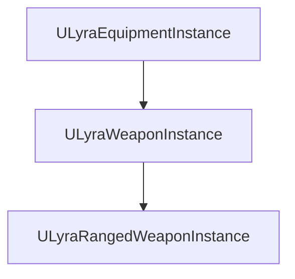
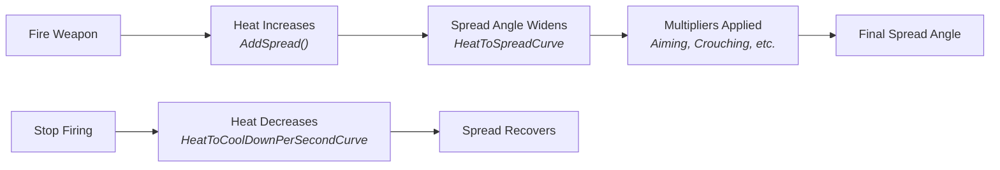

# range weapon instance

Your rifle starts accurate, gets wilder as you spray, then recovers when you stop firing. Your shotgun fires 8 pellets in a tight cone. Your sniper deals full damage up close but drops off past 100 meters. `ULyraRangedWeaponInstance` models all of this — it extends [ULyraWeaponInstance](/broken/pages/6b85f20839557bc5d4848f049fae45b129209a3d) with a dynamic spread/heat system and damage calculation hooks that firing abilities query every shot.

It also implements `ILyraAbilitySourceInterface`, allowing Gameplay Effects to query the weapon for distance and material-based damage multipliers. Set the **Instance Type** in your weapon's `ULyraEquipmentDefinition` to this class (or a Blueprint derived from it).

***

### The Spread & Heat Model

The accuracy system uses a **heat metaphor**: firing generates heat, heat determines spread, and heat cools down over time. This creates the natural feel of weapons becoming less accurate during sustained fire and recovering during pauses.

#### Heat and Spread

Three designer curves control the core relationship:

| Curve                          | X Axis       | Y Axis                              | Controls                                    |
| ------------------------------ | ------------ | ----------------------------------- | ------------------------------------------- |
| `HeatToSpreadCurve`            | Current heat | Spread angle (degrees, diametrical) | How much heat translates to inaccuracy      |
| `HeatToHeatPerShotCurve`       | Current heat | Heat added per shot                 | Whether heat builds faster when already hot |
| `HeatToCoolDownPerSecondCurve` | Current heat | Cooldown rate per second            | Whether cooling is slower when overheated   |

After each shot, `AddSpread()` increases `CurrentHeat` based on `HeatToHeatPerShotCurve` and immediately recalculates `CurrentSpreadAngle`. During `Tick`, heat decreases based on `HeatToCoolDownPerSecondCurve` (after an optional `SpreadRecoveryCooldownDelay`).

#### Spread Multipliers

Player state dynamically adjusts the effective spread angle. Each factor interpolates smoothly toward its target value at a configurable rate:

| Multiplier                               | Condition                                      | Effect                         |
| ---------------------------------------- | ---------------------------------------------- | ------------------------------ |
| `SpreadAngleMultiplier_Aiming`           | Camera blend alpha from `ULyraCameraComponent` | Tighter spread while ADS       |
| `SpreadAngleMultiplier_StandingStill`    | Pawn speed below `StandingStillSpeedThreshold` | Tighter spread when stationary |
| `SpreadAngleMultiplier_Crouching`        | Character is crouching                         | Tighter spread when crouched   |
| `SpreadAngleMultiplier_JumpingOrFalling` | Character is airborne                          | Wider spread when jumping      |

All four are multiplied together to produce `CurrentSpreadAngleMultiplier`, which scales `CurrentSpreadAngle` for the final effective spread.

The standing-still multiplier feathers out over a configurable speed range (`StandingStillToMovingSpeedRange`) so the transition feels smooth rather than binary.

#### First-Shot Accuracy

When `bAllowFirstShotAccuracy` is enabled, the weapon achieves perfect accuracy only if _both_ conditions are met:

* Heat is at minimum (spread angle is minimal)
* All multipliers are at their most favorable values (standing still, crouching, aiming, on the ground)

Firing abilities check `HasFirstShotAccuracy()` to determine if the first shot should bypass spread entirely.

#### Spread Distribution

`SpreadExponent` (also exposed as a Tag Attribute via `TAG_Lyra_RangeWeapon_Stat_SpreadExponent`) controls how shots distribute within the spread cone:

| Value           | Distribution                    |
| --------------- | ------------------------------- |
| `1.0` (default) | Uniform random within the cone  |
| `> 1.0`         | Shots cluster toward the center |
| `< 1.0`         | Shots cluster toward the edges  |

***

### Firing Configuration

| Property                 | Type    | Purpose                                          |
| ------------------------ | ------- | ------------------------------------------------ |
| `BulletsPerCartridge`    | `int32` | Traces per shot (1 for rifles, >1 for shotguns)  |
| `MaxDamageRange`         | `float` | Maximum distance for damage (also Tag Attribute) |
| `BulletTraceSweepRadius` | `float` | Sweep radius (0 = line trace, >0 = sphere trace) |

***

### Damage Calculation

The weapon implements `ILyraAbilitySourceInterface` so that damage-applying Gameplay Effects can query it for hit-specific multipliers.

**Distance attenuation** — `GetDistanceAttenuation()` evaluates the `DistanceDamageFalloff` curve using the hit distance. Returns 1.0 at close range, falling off at longer distances. If the curve has no data, returns 1.0 (full damage at all ranges).

**Physical material attenuation** — `GetPhysicalMaterialAttenuation()` checks the hit `UPhysicalMaterialWithTags` for matching Gameplay Tags (e.g., `Gameplay.Zone.Headshot`, `Gameplay.Damage.TypeWeakness.Fire`) and looks them up in the `MaterialDamageMultiplier` map. Matching values are multiplied together for the final material modifier.

A typical damage execution calculation gets the weapon from the effect context, calls both functions with hit result data, and applies the returned multipliers to the base damage value.
