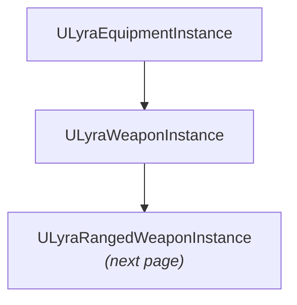

# weapon instance

When a player equips a rifle, the equipment system spawns a `ULyraWeaponInstance` — the live runtime object that manages everything weapon-specific for as long as it's equipped. It selects the right animation layers based on cosmetic tags, activates controller haptics like trigger resistance, tracks when the weapon was last fired for idle animations, and cleans up gracefully when the player dies.



Because it inherits from `ULyraEquipmentInstance`, it gets all standard equipment functionality — lifecycle events, instigator tracking, the attribute container, and subobject replication. You configure which weapon instance class to spawn using the **Instance Type** property on the weapon's `ULyraEquipmentDefinition`.

***

## Animation Layer Selection

Weapons need different animation sets depending on whether they're held or holstered, and those animations may vary based on cosmetic choices (iron sights vs. scope, wood vs. polymer stock). The weapon instance handles this through two `FLyraAnimLayerSelectionSet` properties:

* `EquippedAnimSet` — animation layers for when the weapon is **actively held**
* `UnequippedAnimSet` — animation layers for when the weapon is **equipped but holstered**

Each selection set maps Gameplay Tags to Animation Layer Interface classes. When the animation system needs to know which layer to apply, it calls `PickBestAnimLayer`:

```cpp
TSubclassOf<UAnimInstance> PickBestAnimLayer(
    bool bEquipped,
    const FGameplayTagContainer& CosmeticTags) const;
```

This evaluates the appropriate set against the provided cosmetic tags (e.g., `Weapon.Material.Wood`, `Weapon.Sight.Scope`) and returns the best matching animation layer. The character's animation blueprint uses this to swap layers when weapons change or cosmetic states update.

***

## Input Device Feedback

Modern controllers support features like adaptive trigger resistance and persistent vibration patterns. The weapon instance manages these through `ApplicableDeviceProperties` — an array of `UInputDeviceProperty` assets configured in Blueprint defaults.

When the weapon is equipped, `ApplyDeviceProperties()` activates each property in **looping mode** through the `UInputDeviceSubsystem`, so effects like trigger resistance persist while the weapon is held. When the weapon is unequipped (or the player dies), `RemoveDeviceProperties()` deactivates them using stored handles.

***

## Interaction Timing

Two timestamps track weapon activity:

| Property           | Updated When                                         | Purpose                        |
| ------------------ | ---------------------------------------------------- | ------------------------------ |
| `TimeLastEquipped` | `OnEquipped` fires                                   | Know when the weapon was drawn |
| `TimeLastFired`    | `UpdateFiringTime()` is called by the firing ability | Know when the player last shot |

`GetTimeSinceLastInteractedWith()` returns the time since whichever happened more recently — useful for triggering idle animations or weapon-lowering logic after a period of inactivity.

***

## Death Handling

If the player dies while holding a weapon with active haptic effects, those effects need to stop immediately. The constructor binds to the owning pawn's `ULyraHealthComponent::OnDeathStarted` delegate, and the handler calls `RemoveDeviceProperties()` to clean up any lingering vibrations or trigger effects.

***

## Tick

The base `Tick(float DeltaSeconds)` is empty but virtual — `ULyraRangedWeaponInstance` overrides it to update spread and heat. Note that `ULyraWeaponStateComponent` typically drives this tick for the currently held weapon.

***

## Customization

* **Blueprint subclassing** — for weapons that need unique `ApplicableDeviceProperties` configurations or simple Blueprint logic in `K2_` lifecycle events. Set the `Instance Type` in the equipment definition.
* **C++ subclassing** — for weapons requiring complex state management (like [Ranged Weapon Instance](/broken/pages/c218a408f44dc2318bf34a32ec6ac5f4170017dd)) or custom interfaces.
