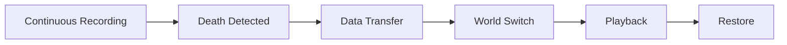

# Kill Cam

The Kill Cam transforms one of the most frustrating moments in multiplayer gaming, dying without understanding why, into a valuable and often entertaining experience. Instead of leaving players confused about how they were eliminated, the system replays the final moments from their killer's perspective, revealing positioning, tactics, and skill that led to the kill.

### Why Kill Cam Matters

A well-implemented kill cam serves multiple purposes that improve your game:

* **Reduces Frustration**: Understanding _how_ you died makes death feel less arbitrary and more fair
* **Creates Learning Moments**: Players can observe enemy tactics, positioning, and aim patterns
* **Showcases Skill**: Impressive kills become memorable highlights rather than anonymous deaths
* **Builds Anticipation**: The brief pause before respawn creates natural tension and pacing
* **Validates Hit Registration**: Players can verify that kills were legitimate, building trust in game systems

### The Core Concept

At a high level, the Kill Cam system works through a clever combination of continuous recording and world duplication:



#### Record

Each client continuously records recent gameplay into an in-memory replay buffer.



#### Capture

When a player dies, the killer's perspective data (aim, camera, hit markers) is captured.



#### Transfer

This data is relayed through the server to the victim's client.



#### Duplicate World

An invisible, pre-created copy of the game world becomes active.



#### Playback

The replay plays in this isolated world while overlay data shows the killer's view.



#### Restore

After playback, the view returns to the live game and recording resumes.



The key innovation is the **world duplication approach**, rather than trying to replay within the live game (which would cause conflicts), the system plays back in a completely isolated copy of the world. This ensures the kill cam never interferes with ongoing gameplay.

***

## <mark style="color:red;">**Critical Limitations**</mark>

<mark style="color:red;">**Read these carefully before using or modifying the Kill Cam system.**</mark>

<strong>Standalone Mode ONLY</strong>

The Kill Cam system **will not function** in Play-In-Editor (PIE) mode. It **only works** when running as a Standalone executable:

* Launch via command line with `-game`
* Use the "Launch" button targeting Standalone Game
* Run a packaged build

This limitation exists because the system relies on world duplication, which the engine only performs during standalone startup. <mark style="color:red;">**This is an unreal engine limitation**</mark>.

<strong>Experimental Engine API</strong>

This system depends on `Experimental_ShouldPreDuplicateMap`, an experimental Unreal Engine feature. This API:

* May change in future engine versions
* Could be deprecated or removed by Epic
* Might behave differently across engine updates

If upgrading to a new UE version, test kill cam functionality early in your validation process.

<strong>Standalone / Listen Server Host Limitation</strong>

Players hosting a listen server **cannot use the kill cam**. When a client enters kill cam mode, its network driver temporarily switches to replay mode. For a listen server host, this would disconnect all connected clients.

Standalone clients can use the killcam but gameplay cues won't show in the killcam. This is because the killcam records replicated data. GAS gameplay cues aren't detected in standalone game.

The system automatically disables kill cam for non clients to preserve game integrity.

<strong>Modification Risk</strong>

The core playback logic in `UKillcamPlayback` interacts with complex engine systems:

* Replay streaming and `UDemoNetDriver`
* World context and level collection management
* Actor spawning across worlds

**Modifying `UKillcamPlayback` directly is strongly discouraged** unless you deeply understand these systems. Instead, customize through:

* Gameplay Abilities (safe to modify)
* Action Set configuration
* Timing parameters
* UI overlays

***

### System Components

| Component                | Role                                                               |
| ------------------------ | ------------------------------------------------------------------ |
| **`ULyraGameEngine`**    | Enables world duplication via `Experimental_ShouldPreDuplicateMap` |
| **`UKillcamManager`**    | Client-side coordinator that orchestrates the entire kill cam flow |
| **`UKillcamPlayback`**   | Core engine handling world switching, replay playback, and cleanup |
| **`UKillcamEventRelay`** | Server-side relay that routes killer data to victims               |
| **Recorder Components**  | Capture aim, hit markers, and camera state on each player          |
| **Playback Components**  | Render the killer's perspective data during playback               |
| **Gameplay Abilities**   | Handle death, camera control, skip input, and respawn              |

***

### Documentation Guide

This documentation is organized to help you understand the system progressively:

| Page                                                                                    | What You'll Learn                                                            |
| --------------------------------------------------------------------------------------- | ---------------------------------------------------------------------------- |
| [Architecture Overview](architecture-overview.md)                                       | The big picture—how all components connect and data flows through the system |
| [World Duplication Deep Dive](world-duplication-deep-dive.md)                           | The engine-level magic that makes isolated playback possible                 |
| [Recording System](recording-system.md)                                                 | How gameplay data is continuously captured for potential kill cam use        |
| [Data Transfer & Networking](data-transfer-and-networking.md)                           | How killer data moves from killer → server → victim                          |
| [Playback System](playback-system.md)                                                   | The mechanics of world switching, time scrubbing, and view control           |
| [Setup & Integration](../accolades/setup-and-integration.md)                            | Practical guide to enabling kill cam in your experiences                     |
| [Customization & Extension](../gamestate-scoring-system/customization-and-extension.md) | Safe ways to modify behavior and add new features                            |

***
