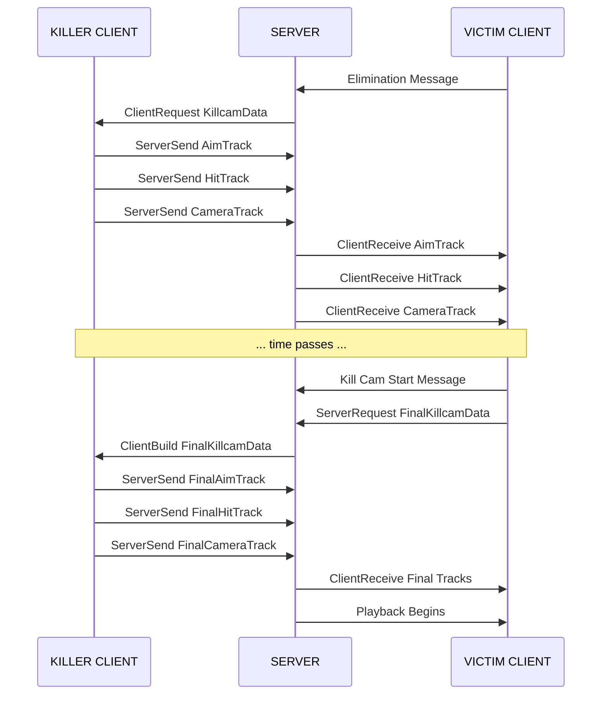

# Data Transfer and Networking

When a player dies, their Kill Cam needs data from the killer's perspective, but that data exists on the killer's client. This page details the complete RPC flow that transfers recorded data from killer to victim via the server.

***

### Why Transfer is Needed

The Kill Cam faces a fundamental networking challenge:

```
┌─────────────────────┐          ┌─────────────────────┐
│    KILLER CLIENT    │          │    VICTIM CLIENT    │
│                     │          │                     │
│  Has: Aim data      │          │  Needs: Aim data    │
│       Hit markers   │    ???   │        Hit markers  │
│       Camera state  │ ───────► │        Camera state │
│                     │          │                     │
│  (Locally recorded) │          │  (For playback)     │
└─────────────────────┘          └─────────────────────┘
```

The victim's client needs the killer's recorded perspective data, but:

* Clients can't directly communicate (no P2P)
* The server doesn't record this data (bandwidth/CPU)
* Data must transfer quickly for responsive Kill Cam

Solution: The server acts as a trusted relay, routing data from killer to victim.

***

### The Server Relay: `UKillcamEventRelay`

The `UKillcamEventRelay` is a `UGameplayMessageProcessor` that runs on the server. It listens for elimination messages and orchestrates data transfer.

### How It Starts

```cpp
void UKillcamEventRelay::StartListening()
{
    // Subscribe to elimination messages
    UGameplayMessageSubsystem& MessageSubsystem =
        UGameplayMessageSubsystem::Get(GetWorld());

    MessageSubsystem.RegisterListener(
        TAG_Lyra_Elimination_Message,
        this,
        &UKillcamEventRelay::OnEliminationMessage);
}
```

### Handling Eliminations

When an elimination occurs:

```plaintext
OnEliminationMessage(Payload):
    Extract victim and killer PlayerStates from payload
    Record death server time

    If killer is a human player:
        HandleHumanKiller(victim, killer, deathTime)
    Else (AI killer):
        HandleAIKiller(victim, killer, deathTime)
```

***

### Human Killer Flow

When the killer is a human player, data must be requested from their client.

#### Step 1: Server Requests Data from Killer

```cpp
void UKillcamEventRelay::HandleHumanKiller(
    APlayerState* VictimPS,
    APlayerState* KillerPS,
    float DeathServerTime) const
{
    APlayerController* KillerPC = Cast<APlayerController>(
        KillerPS->GetOwningController());

    if (UKillcamManager* KillerManager =
        KillerPC->FindComponentByClass<UKillcamManager>())
    {
        // Client RPC: Tell killer's client to send their recorded data
        KillerManager->ClientRequestKillcamData(VictimPS, DeathServerTime);
    }
}
```

#### Step 2: Killer's Client Gathers Data

On the killer's client, `ClientRequestKillcamData` collects data from all recorders:

```plaintext
ClientRequestKillcamData(victim, deathTime):
    Find all recorder components on this controller

    For aim recorder:
        Get raw samples from buffer
        Convert to network-optimized format (compressed)
        Send to server: ServerSendKillcamAimTrack(victim, netTrack)

    For hit marker recorder:
        Get raw samples from buffer
        Send to server: ServerSendKillcamHitTrack(victim, hitTrack)

    For camera recorder:
        Get recorded events
        Send to server: ServerSendKillcamCameraTrack(victim, cameraTrack)
```

#### Step 3: Killer Sends to Server

Each track type has its own Server RPC:

```cpp
// Aim data
UFUNCTION(Server, Reliable)
void ServerSendKillcamAimTrack(
    APlayerState* VictimPS,
    const FKillcamAimTrackNet& NetTrack);

// Hit marker data
UFUNCTION(Server, Reliable)
void ServerSendKillcamHitTrack(
    APlayerState* VictimPS,
    const FKillcamHitMarkerTrackRaw& Track);

// Camera data
UFUNCTION(Server, Reliable)
void ServerSendKillcamCameraTrack(
    APlayerState* VictimPS,
    const FKillcamCameraTrackRaw& Track);
```

#### Step 4: Server Forwards to Victim

The server doesn't process the data, it simply forwards to the victim:

```cpp
void UKillcamEventRelay::SendNetTrackToVictim(
    const FKillcamAimTrackNet& NetTrack,
    APlayerState* VictimPS) const
{
    APlayerController* VictimPC = Cast<APlayerController>(
        VictimPS->GetOwningController());

    if (UKillcamManager* VictimManager =
        VictimPC->FindComponentByClass<UKillcamManager>())
    {
        // Client RPC: Forward data to victim's client
        VictimManager->ClientReceiveKillcamAimTrack(NetTrack);
    }
}
```

#### Step 5: Victim Caches Data

The victim's client receives and stores the data:

```cpp
void UKillcamManager::ClientReceiveKillcamAimTrack_Implementation(
    const FKillcamAimTrackNet& NetTrack)
{
    // Convert from network format back to raw format
    LastReceivedAimTrack = KillcamAimTypes::BuildRawTrackFromNet(NetTrack);
}

void UKillcamManager::ClientReceiveKillcamHitTrack_Implementation(
    const FKillcamHitMarkerTrackRaw& Track)
{
    LastReceivedHitTrack = Track;
}

void UKillcamManager::ClientReceiveKillcamCameraTrack_Implementation(
    const FKillcamCameraTrackRaw& Track)
{
    LastReceivedCameraTrack = Track;
}
```

***

### AI Killer Flow

When the killer is an AI, the flow is simpler, the server has direct access to the AI's components:

```plaintext
HandleAIKiller(victim, killer, deathTime):
    Get AI's controller (runs on server, so direct access)

    For each recorder component on AI:
        Extract samples directly from buffer
        Build track window for the time range
        Convert to network format
        Send directly to victim (skip killer client RPCs)
```

The AI case skips the killer client RPCs entirely, data goes directly from server to victim.

***

### Final Data Request

The initial data transfer happens immediately after death. But the Kill Cam doesn't start immediately, there's typically a delay. During this time, more actions may occur that should be included.

#### Why a Second Request?

```
Timeline:
─────────────────────────────────────────────────────────►
    │                    │                    │
  Death             Initial Data           Kill Cam
  Event             Transfer               Starts
    │                    │                    │
    │◄──── 100ms ────────►│                    │
    │                    │◄──── 500ms ────────►│
                         │                    │
              Data transferred        More events may
              at this point           have occurred!
```

To get the most complete picture, the system requests final data when Kill Cam actually starts.

#### Final Data Request Flow

When the Kill Cam Start message arrives:

```cpp
void UKillcamManager::OnKillCamStartMessage(
    FGameplayTag Channel,
    const FLyraKillCamMessage& Payload)
{
    // Store timing parameters
    PendingStartTime = Payload.KillCamStartTime;
    PendingDuration = Payload.KillCamFullDuration;

    // Request final, complete data from killer
    ServerRequestFinalKillcamData(
        Payload.KillerPlayerState,
        Payload.KilledPlayerState,
        /* DeathServerTime from cache */,
        Payload.KillCamFullDuration);
}
```

The server forwards this request to the killer:

```cpp
UFUNCTION(Server, Reliable)
void ServerRequestFinalKillcamData(
    APlayerState* KillerPS,
    APlayerState* VictimPS,
    float DeathServerTime,
    float KillCamFullDuration);
```

#### Killer Builds Final Window

The killer's client builds a precise data window:

```plaintext
ClientBuildFinalKillcamData(victim, deathTime, duration):
    Calculate exact playback window:
        windowStart = deathTime - duration
        windowEnd = deathTime

    For each track type (aim, hit markers, camera):
        Filter samples to only those within the window
        Normalize timestamps relative to window start
        Build playback-ready track structure

    Send final windowed data back to server
    (Server forwards to victim)
```

#### Seamless Data Integration During Playback

An important detail: the final data is **not guaranteed to arrive before the kill cam starts playing**. The system handles this gracefully through seamless data integration.

When the victim's client receives final data, the playback components automatically incorporate it, even if playback is already in progress. Here's why this works reliably:

```plaintext
Timeline (typical case):
─────────────────────────────────────────────────────────────────────►
    │                │                    │              │
  Death          Initial Data         Killcam       Final Data
  Event          Arrives              Starts         Arrives
    │                │                    │              │
    │◄── 100ms ─────►│                    │              │
                     │◄──── 200ms ───────►│◄── 50ms ────►│
```

In practice:

* **Initial data arrives quickly** (within \~100ms of death)
* **Kill cam starts after a brief delay** (player sees death animation, server triggers start message)
* **Final data typically arrives shortly after playback begins**

The playback components are designed to use whatever data is available:

1. Playback starts with the initial data set
2. When final data arrives, it seamlessly replaces/extends the initial data
3. Since the initial data covers the same time window (just with slightly less complete coverage), there's no jarring transition

**Why this rarely causes issues:**

* Initial data provides several seconds of buffer
* Final data usually arrives within the first 100-200ms of playback
* Even in high-latency scenarios, the initial data alone is typically enough to cover most of the kill cam duration

**Edge case handling:**

* If final data never arrives (killer disconnected), initial data is used entirely
* If initial data is insufficient and final data is late, the playback may end early but won't crash

***

***

### Complete RPC Diagram



***

### Data Structures

#### Track Types

Each data type has three struct variants:

| Suffix     | Purpose                       | Used By                |
| ---------- | ----------------------------- | ---------------------- |
| `Raw`      | Full precision, local storage | Recorders, local cache |
| `Net`      | Bandwidth-optimized           | Network transfer       |
| `Playback` | Time-normalized for playback  | Playback components    |

#### Aim Track Structures

```cpp
// Raw: Full precision for local storage
struct FKillcamAimTrackRaw
{
    TArray<FKillcamAimSampleRaw> Samples;
    float DeathServerTime;
    float EndServerTime;
};

// Net: Compressed for network transfer
struct FKillcamAimTrackNet
{
    float DeathServerTime;
    float MaxRecordLengthSeconds;
    TArray<FKillcamAimSampleNet> Samples;  // Compressed samples
};

// Playback: Time-normalized for smooth interpolation
struct FKillcamAimTrackPlayback
{
    TArray<FKillcamAimSamplePlayback> Samples;
    float WindowSeconds;  // Total duration
};
```

#### BuildTrackForWindow Functions

These functions convert cached raw data into playback-ready format:

```cpp
void UKillcamManager::BuildAimTrackForWindow(
    const FKillcamAimTrackRaw& Raw,
    float KillCamStartTime,
    float KillCamFullDuration,
    FKillcamAimTrackPlayback& Out)
{
    Out.WindowSeconds = KillCamFullDuration;
    Out.Samples.Reset();

    float WindowStart = Raw.DeathServerTime - KillCamStartTime;
    float WindowEnd = Raw.DeathServerTime;

    for (const FKillcamAimSampleRaw& Sample : Raw.Samples)
    {
        // Only include samples within our window
        if (Sample.ServerTime >= WindowStart &&
            Sample.ServerTime <= WindowEnd)
        {
            FKillcamAimSamplePlayback PlaybackSample;

            // Normalize time to [0, WindowDuration]
            PlaybackSample.Time = Sample.ServerTime - WindowStart;
            PlaybackSample.ViewRotation = Sample.ViewRotation;
            PlaybackSample.ViewLocation = Sample.ViewLocation;

            Out.Samples.Add(PlaybackSample);
        }
    }
}
```

***

## Network Optimization

### Bandwidth Considerations

At 60Hz aim sampling over 7 seconds:

* 420 samples per kill cam
* Raw format: 420 × 28 bytes = \~12KB
* Net format: 420 × \~14 bytes = \~6KB (50% savings)

### Compression Techniques

* Time Compression: Store time as normalized offset from death time, scaled to int16 range (4-byte float -> 2-byte int).
* Rotation Compression: Use Unreal's `CompressAxisToShort` (maps rotation axis to 16-bit integer).
* Location Quantization: Use `FVector_NetQuantize10` (1 decimal place precision).

### Reliable vs Unreliable

All Kill Cam RPCs use `Reliable`:

* Data loss would cause incomplete Kill Cam
* Latency is acceptable (not frame-critical)
* Retransmission is preferred over data gaps

***

## Error Handling

### Missing Killer

If the killer disconnects before data transfer completes:

* Victim's client will have partial or no data
* `IsPlaybackAllowed()` check may fail
* Kill Cam simply won't play (fails gracefully)

### Network Delays

The two-phase approach (initial + final request) handles delays:

* Initial transfer gives rough data quickly
* Final request ensures complete, precise window
* If final request fails, initial data is still usable

### Data Validation

Receivers validate incoming data:

* Array bounds checking
* Time range validation
* Null pointer guards on PlayerState references

***

## Summary



### Server as trusted relay

No P2P; server validates kill and relays data between killer and victim.



### Two-phase transfer

Initial rough data immediately after death, then a precise final window when the Kill Cam starts.



### Separate tracks

Aim, hit markers, and camera are handled independently (separate RPCs & structures).



### Network optimization

Compressed formats (time, rotation, location) reduce bandwidth 50%+.



### Human vs AI paths

Human killer: data requested from killer client. AI killer: server extracts data directly.



### Graceful degradation

If data is missing or invalid, playback is prevented but the game remains stable.



***

## Next Steps

* [**Playback System**](/broken/pages/a5c96a2dd441489d6d8b9a0506dd737daf2224e3) - How the received data is actually played back
