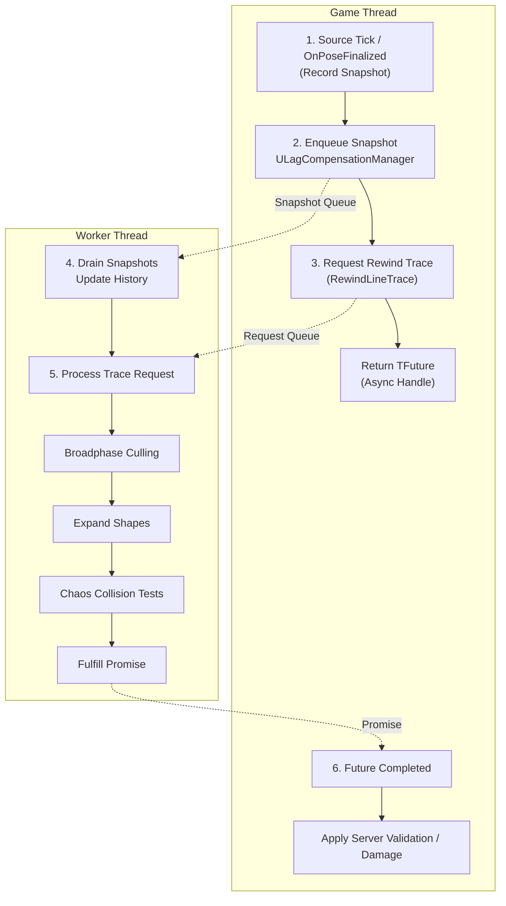

# Architecture

ShooterBase's lag compensation is built around three components: **Sources** that record history, a **Manager** that coordinates requests, and a **Worker Thread** that performs traces without blocking gameplay. This separation keeps expensive computation off the game thread while maintaining server-authoritative results.

***

### Component Overview

| Component                            | Thread        | Role                                                                                |
| ------------------------------------ | ------------- | ----------------------------------------------------------------------------------- |
| **`ULagCompensationSource`**         | Game Thread   | Records per-frame world-space snapshots for one actor's hit geometry                |
| **`ULagCompensationManager`**        | Game Thread   | Central registry of sources, manages threading, and provides async rewind-trace API |
| **`FLagCompensationThreadRunnable`** | Worker Thread | Owns per-actor history buffers, performs interpolation, and executes rewind traces  |

All gameplay interaction occurs through the manager. Sources only push snapshots, and the worker performs all heavy operations in isolation.

***

### Chaos Physics Integration

The lag compensation system uses **Unreal's Chaos physics library** directly for collision queries, bypassing the main physics scene entirely. This is critical for thread safety, Chaos geometry queries are stateless and can run on any thread without locks.

#### Why Not Use `LineTraceSingleByChannel`?

Standard Unreal trace functions access the physics scene, which requires game thread synchronization. The lag compensation worker thread runs independently and cannot safely call these functions.

#### Chaos Queries Used

| Query                   | Purpose                                              |
| ----------------------- | ---------------------------------------------------- |
| `Chaos::SweepQuery()`   | Sweep a shape along a path to find intersection time |
| `Chaos::OverlapQuery()` | Check if shapes overlap at t=0 (starting inside)     |
| `Chaos::FMTDInfo`       | Minimum Translation Distance for overlap resolution  |

#### Shape Primitives

Collision shapes are constructed as Chaos types for thread-safe queries. These primitives are built on-demand from stored shape definitions, allowing efficient memory usage while maintaining full collision fidelity.

***

### `ULagCompensationSource`: Actor Snapshot Recorder

Each actor that should participate in lag compensation must have one `ULagCompensationSource` component attached. It identifies what kind of mesh (static or skeletal) the actor uses, constructs a table of collision shapes at registration, and records snapshots each frame.

#### Registration Lifecycle



#### Find Mesh Component

Locate the skeletal or static mesh on the actor.



#### Build Shape Tables

Extract collision shapes from the physics asset (static tables describing local-space geometry).



#### Register with Manager

Add this source to the central registry (`ULagCompensationManager`).



#### Begin Snapshot Capture

Start recording per-frame transforms.



On `EndPlay`, the source unregisters itself and stops capturing.

#### Shape Table Construction

At registration, the source extracts collision shapes from the physics asset and stores them in static tables. These tables describe the local-space geometry and never change at runtime.

* For skeletal meshes: shapes are extracted from `UPhysicsAsset` body setups.
* For static meshes: shapes come from the mesh's `UBodySetup`.
* Each shape's type, dimensions, and local offset are recorded for later expansion.

#### Snapshot Capture

Skeletal Meshes:

* Skeletal sources bind to the skeletal mesh's `OnBoneTransformsFinalized` delegate, which fires after all animation graph evaluation is complete. This ensures the snapshot captures the exact pose the player saw.

Static Meshes:

* Static sources tick every frame at `TG_PostUpdateWork` to capture their component transform.

Both paths capture bounds, collision responses, and transforms, then submit the snapshot to the manager for queueing.

***

### `ULagCompensationManager`: Central Coordinator

The manager acts as the bridge between gameplay code and the background worker. It lives on the `GameState` actor, ensuring exactly one instance exists per world.

#### Source Management

Sources register and unregister themselves during their lifecycle. Registration uses thread-safe locking to allow concurrent access.

#### Thread Lifecycle

On experience load, the manager creates the worker thread:

```plaintext
OnExperienceLoaded():
    // Create the worker
    LagCompensationThread = new FLagCompensationThreadRunnable(
        World,
        this,
        &DebugService
    )

    // Worker spawns its own FRunnableThread internally
    // Creates GameTickEvent for synchronization
```

On `EndPlay`, the manager safely shuts down the worker:

```plaintext
EndPlay():
    if LagCompensationThread:
        LagCompensationThread.EnsureCompletion()  // Sets bStopRequested, triggers event
        delete LagCompensationThread
        LagCompensationThread = nullptr
```

#### Tick Synchronization

Every `TickComponent`, the manager wakes the worker and processes debug output:

```plaintext
TickComponent(DeltaTime):
    if LagCompensationThread:
        // Wake worker to process any pending snapshots/requests
        LagCompensationThread.GameTickEvent.Trigger()

    // Flush debug drawing to game thread
    DebugService.Flush(World)
```

#### Snapshot Intake

When sources submit snapshots, the manager enqueues them for the worker:

```plaintext
IngestSnapshot_GameThread(source, snapshot):
    LagCompensationThread.EnqueueSnapshot(source, Move(snapshot))
    LagCompensationThread.GameTickEvent.Trigger()
```

#### Public API

The manager exposes asynchronous rewind tracing:

```cpp
TFuture<FRewindLineTraceResult> RewindLineTrace(
    float LatencyInMs,                    // How far back to rewind
    const FVector& Start,                  // Trace start
    const FVector& End,                    // Trace end
    const FRewindTraceInfo& TraceInfo,     // Shape, radius, etc.
    ECollisionChannel Channel,             // Collision channel
    const TArray<AActor*>& ActorsToIgnore  // Excluded actors
);
```

Internally, this creates a `TPromise`, packages a request, and enqueues it:

```plaintext
RewindLineTrace(...):
    request = FRewindLineTraceRequest()
    request.Timestamp = WorldTime - (LatencyMs / 1000.0)
    request.Start = Start
    request.End = End
    request.TraceInfo = TraceInfo
    request.TraceChannel = Channel
    request.ActorsToIgnore = ActorsToIgnore
    request.Promise = MakeShared<TPromise<FRewindLineTraceResult>>()

    LagCompensationThread.EnqueueRequest(Move(request))
    LagCompensationThread.GameTickEvent.Trigger()

    return request.Promise.GetFuture()
```

> [!INFO]
> **`TPromise` / `TFuture` (UE5 async result pair):** Think of this like a **“result that will arrive later.”**
> 
> * The **caller** gets a `TFuture<T>` immediately, which is basically a handle to a value that **isn’t ready yet**.
> * The **worker thread** holds the matching `TPromise<T>` and, when it finishes the rewind trace, it **fulfills** the promise (sets the result).
> * Once the promise is fulfilled, the future becomes ready and the caller can **wait for it**, **poll it**, or attach a continuation.

***

### `FLagCompensationThreadRunnable`: Background Worker

This thread owns all historical data and executes rewind traces asynchronously. It is completely isolated from gameplay and only communicates through lock-free queues.

#### Thread Configuration

```plaintext
FLagCompensationThreadRunnable(World, Manager, DebugService):
    // Create synchronization event
    GameTickEvent = FPlatformProcess::GetSynchEventFromPool(false)

    // Spawn thread with above-normal priority
    Thread = FRunnableThread::Create(
        this,
        TEXT("LagCompensationThread"),
        128 * 1024,  // 128KB stack
        TPri_AboveNormal
    )
```

#### Main Loop



#### Wait for Game Tick Event

Thread sleeps until the manager signals a new tick/work.



#### Step 1: Update History

Drain all pending snapshots into per-actor history structures.



#### Step 2: Process Requests

For each pending rewind trace request: process and fulfill its promise.



#### Step 3: Debug Visualization

If debug is enabled, queue pose drawings for the game thread to render.



#### History Data Structure

Each source maintains a doubly-linked list of historical poses:

```plaintext
ActorHistoryData: TMap<ULagCompensationSource*, TDoubleLinkedList<FLagCompensationData>*>
```

| Structure                  | Purpose                                                     |
| -------------------------- | ----------------------------------------------------------- |
| `FLagCompensationSnapshot` | Captured per-frame data from sources (game thread)          |
| `FLagCompensationData`     | Processed, thread-owned historical record for interpolation |
| `TDoubleLinkedList`        | Efficient head insertion and tail pruning                   |

#### Shutdown Sequence

When shutdown is requested, the worker completes any pending work, cleans up all history data, and returns the synchronization event to the pool.

***

### Data Flow



#### Phase Summary

| Phase              | Thread        | Operation                                  |
| ------------------ | ------------- | ------------------------------------------ |
| Snapshot Recording | Game          | Sources capture poses via delegate or tick |
| Snapshot Draining  | Worker        | Move into per-actor history buffers        |
| Rewind Request     | Game          | Enqueued via manager API                   |
| Broadphase         | Worker        | Multi-stage AABB filtering                 |
| Shape Expansion    | Worker        | Transform local shapes to world space      |
| Collision Testing  | Worker        | Chaos sweep queries                        |
| Results Returned   | Worker → Game | Promise fulfilled, callback executed       |
| Debug Draw         | Game          | Flush deferred commands                    |

***

### Thread Safety Guarantees

| Guarantee                | Implementation                                                                        |
| ------------------------ | ------------------------------------------------------------------------------------- |
| **No UObject access**    | Worker never touches live game objects after snapshot ingestion                       |
| **Immutable asset data** | Shape tables read from `UPhysicsAsset` and `UBodySetup` which don't change at runtime |
| **Lock-free queues**     | MPSC queues use atomic operations, no mutexes on hot paths                            |
| **Deferred debug**       | Debug drawing enqueued to game thread via `FLagCompensationDebugService`              |
