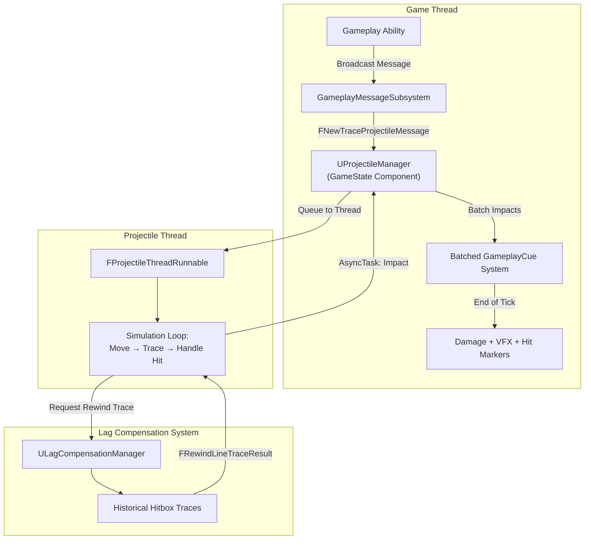
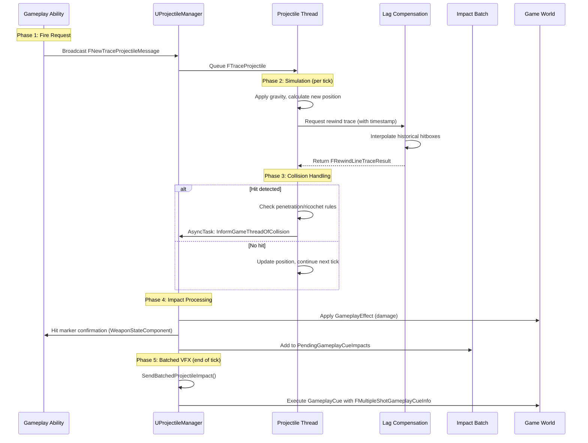

# Architecture

Before diving into configuration details, it's essential to understand how the Projectile Manager's components work together. This page provides the mental model you need to understand the system's design and troubleshoot issues effectively.

***

## The Big Picture

The Projectile Manager spans two threads and coordinates between multiple systems:



***

## Component Roles

#### `UProjectileManager`

The coordinator living on the GameState. It:

* Listens for `FNewTraceProjectileMessage` broadcasts
* Converts messages to `FTraceProjectile` structs and queues them to the thread
* Receives impact notifications from the thread
* Applies damage via GameplayEffects
* **Batches impacts** by GameplayCue tag for efficient VFX
* Sends hit marker confirmations to the shooter

#### `FProjectileThreadRunnable`

The worker running on a dedicated background thread. It:

* Maintains a list of all active projectiles (`TMap<int32, FTraceProjectile>`)
* Runs a simulation loop synchronized with the game tick
* Moves projectiles, applies gravity
* Initiates lag-compensated collision traces
* Handles penetration/ricochet logic
* Notifies the main thread when impacts occur

#### `ULagCompensationManager`

The time machine. When the projectile thread needs to check for collisions, it doesn't trace against current world state, it traces against where targets _were_ when the shooter fired. This ensures fair hit detection despite network latency.

> [!INFO]
> Read the [lag compensation manager](../lag-compensation/) for more indepth details

***

### The Thread Model

#### Why a Separate Thread?

Simulating hundreds of projectiles involves:

* Movement calculations every frame
* Collision traces against the world
* Penetration logic on hit

Doing all this on the main game thread would steal CPU time from rendering, input handling, and replication. By offloading to a dedicated thread, the main thread stays responsive.

#### Synchronization

The projectile thread doesn't run freely, it's synchronized with the game tick:

```plaintext
UProjectileManager::TickComponent():
    GameTickEvent->Trigger()    // Wake the projectile thread
    SendBatchedProjectileImpact()  // Send all batched VFX from last tick

FProjectileThreadRunnable::Run():
    while (bRunThread):
        GameTickEvent->Wait()   // Sleep until triggered
        ProcessBatchQueue()     // Add new projectiles
        MoveProjectiles()       // Simulate all active projectiles
```

This ensures projectiles advance in lockstep with the game, preventing drift between simulation and world state.

***

### Data Flow Timeline



***

### The Batched GameplayCue System

Instead of firing a VFX event for every single impact, the manager batches all impacts that share the same characteristics:

```plaintext
FProjectileGameplayCueBatchKey:
    CueTag          // Which GameplayCue to trigger (e.g., GC.Impact.Bullet.Concrete)
    Instigator      // Who fired
    Causer          // What weapon
    HitEffect       // Effect handle (for damage calculation reference)
```

All impacts with the same key are grouped together. At the end of each tick, `SendBatchedProjectileImpact()` fires a single GameplayCue containing:

```plaintext
FMultipleShotGameplayCueInfo:
    StartLocations[]       // Trace origins (for tracers)
    EndLocations[]         // All impact points
    Normals[]              // Surface normals at each impact
    PhysicalMaterials[]    // Material at each impact (for material-specific VFX)
```

This dramatically reduces network traffic and GameplayCue overhead when a minigun is spraying.

***

### Design Decisions & Trade-offs

#### Why Struct-Based Simulation?

Problem: Spawning an `AActor` for every bullet creates overhead, memory allocation, component initialization, tick registration, garbage collection pressure.

Solution: Represent projectiles as `FTraceProjectile` structs. No actors, no components, just data.

Trade-off: You can't attach components or use actor-specific features. For complex projectiles (homing, detonation), use the [predictive projectile system](../weapons/projectile-system/) instead.

#### Why a Dedicated Thread?

Problem: Simulating hundreds of projectiles on the main thread would hurt frame rate.

Solution: Move simulation to a background thread, synchronized with game tick.

Trade-off: Adds complexity. Cross-thread communication requires careful synchronization. This is why the internals are marked as "don't modify."

#### Why Batched GameplayCues?

Problem: Firing 60 bullets per second means 60 GameplayCue executions per second, per weapon. Multiply by players and it becomes expensive.

Solution: Group impacts by cue tag, instigator, and causer. Fire one GameplayCue per group with arrays of impact data.

Trade-off: Your GameplayCue Notifies must handle arrays rather than single impacts. The `FMultipleShotGameplayCueInfo` struct provides all the data you need.

#### Why No Replication?

Problem: Replicating position updates for hundreds of fast-moving projectiles would saturate bandwidth.

Solution: Simulate entirely on the server. Clients never know about projectile positions, they only see:

* The firing event (local prediction spawns a cosmetic tracer)
* The impact result (damage, VFX via batched GameplayCue)

Trade-off: Clients see cosmetic tracers that may not perfectly match server simulation. In practice, this is invisible because impacts are authoritative.

#### Why Lag Compensation?

Problem: Without compensation, a player with 100ms ping would have to lead targets by 100ms worth of movement, unfair and frustrating.

Solution: Store target positions over time. When tracing, rewind to where targets were when the shooter fired.

Trade-off: Requires the [Lag Compensation system](../lag-compensation/) to be active and configured. Adds computational cost for historical lookups.

***

### When to use Projectile Manager vs Actor-Based Projectiles

ShooterBase offers two distinct systems for handling projectiles, each suited for different scenarios:

1. **The Projectile Manager:** A high-performance, multithreaded system simulating projectiles as data structures (`FTraceProjectile`) with lag-compensated, trace-based collision.
2. [**Predictive Projectile System**](../weapons/projectile-system/)**:** Using standard `AActor` subclasses (typically inheriting from `AProjectileBase`) spawned directly into the world, often utilizing `UProjectileMovementComponent` for physics and potentially `UGameplayAbility_PredictiveProjectile` for client-side prediction.

Choosing the right system depends heavily on the specific requirements of the weapon and the desired gameplay characteristics.

> [!SUCCESS]
> **Note:** This asset includes Blueprint examples demonstrating both projectile systems:
> 
> * `GA_Weapon_Fire_BulletDrop`: Inherits from [`UGameplayAbility_RangedWeapon_Projectile`](/broken/pages/EZx33EHd0BUVTTa7TiOI). This ability requests projectile spawns via the **Projectile Manager** system (by sending an `FNewTraceProjectileMessage`). It's intended as a base for weapons firing standard, fast-moving bullets where performance and lag compensation are key. Weapons typically subclass this Blueprint ability to customize parameters like HitEffect, ImpactCueNotify, penetration rules, etc.
> * `GA_Weapon_Fire_Projectile`: Inherits from [`UGameplayAbility_PredictiveProjectile`](/broken/pages/ahBFoV1NgbIaNJVGR8aX). This ability directly spawns [**Actor-Based Projectiles**](../weapons/projectile-system/) (`AProjectileBase` subclasses) with client-side prediction. It serves as a base for weapons launching special projectiles like grenades or rockets where actor-specific logic or high-fidelity prediction is required. Weapons subclass this Blueprint ability to define the specific AProjectileBase class to spawn and customize other parameters.

#### Use the Projectile Manager When:

* **High Volume / High Fire Rate is Expected:** This is the primary reason for the Manager's existence. If a weapon fires very rapidly (e.g., automatic rifles, SMGs, miniguns) or if you anticipate many players firing simultaneously, the performance overhead of spawning hundreds or thousands of individual projectile actors can become prohibitive. The Manager's data-oriented, threaded approach scales much better.
* **Performance is Critical:** If maintaining high server frame rates under heavy load is paramount, offloading projectile simulation and collision to a separate thread significantly reduces the burden on the main game thread.
* **Accurate Lag-Compensated Hits are Essential for Fast "Bullets":** The Manager's tight integration with the Lag Compensation system ensures that collisions for these fast-moving traces are validated against historical character positions, providing fair and accurate hit registration crucial for typical bullet weapons.
* **Simpler Physics Suffice:** The Manager currently implements gravity and basic penetration. If your projectile only needs these, the Manager is efficient.
* **Standard Bullet Behavior is Desired:** If the projectile primarily needs to travel in a predictable path (straight or parabolic) and register hits or penetrate thin surfaces, the Manager provides this efficiently.

**In short: Use the Projectile Manager for typical "bullet" weapons found in most modern shooters where performance and accurate hit registration at high volumes are key.**

#### Use Actor-Based Projectiles (`AProjectileBase`) When:

* **Complex or Unique Behaviors are Needed:** [Actor-based projectiles](../weapons/projectile-system/) are far more flexible for implementing custom logic. Use them if your projectile needs to:
  * Perform complex homing or seeking behavior.
  * Have timed detonation or proximity triggers.
  * Split into multiple projectiles mid-flight.
  * Interact with the world in ways beyond simple collision (e.g., attaching to surfaces, applying persistent area effects).
  * Utilize complex physics interactions beyond basic gravity and bouncing (though `UProjectileMovementComponent` offers significant features).
* **Slower Projectiles:** For grenades, rockets, arrows, fireballs, etc., where the travel time is significant and the number of active projectiles at any given time is relatively low, the performance overhead of actors is usually acceptable.
* **Detailed Visual Prediction is Paramount:** The [`UGameplayAbility_PredictiveProjectile`](/broken/pages/ahBFoV1NgbIaNJVGR8aX) ability, working with `AProjectileBase`, provides sophisticated client-side prediction including the visual actor itself, which is crucial for making slower projectiles feel responsive and visually synchronized for the firing player. The Projectile Manager only provides hit validation, not full predictive actor spawning/synchronization.
* **Easier Blueprint Implementation:** Implementing complex behaviors is often more straightforward using Blueprint logic within an `AActor` subclass compared to modifying the C++ simulation thread of the Projectile Manager.
* **Leveraging Existing Actor/Component Features:** You can easily add other standard components (Particle Systems, Audio Components, other logic components) directly to an actor-based projectile.

**In short: Use Actor-based projectiles for slower, less numerous projectiles that require unique gameplay logic, complex physics interactions, or detailed client-side visual prediction.**

> [!SUCCESS]
> **In essence, think of Actor-Based Projectiles for grenades, rockets, specialized ammunition, magic spells, or anything that doesn't behave like a standard bullet.**

<div class="gb-stack">
<details class="gb-toggle">

<summary>Can They Coexist?</summary>

Yes, absolutely. A typical project using the ShooterBase plugin will likely use **both** systems:

* Assault rifles, SMGs, pistols might use the **Projectile Manager** (spawned via `GA_Weapon_Fire_BulletDrop`).&#x20;
* Rocket launchers, grenade launchers, bows might use **Actor-Based Projectiles** (spawned via `GA_Weapon_Fire_Projectile`).&#x20;

The choice is made at the Gameplay Ability level, the ability determines whether to send a message to the `UProjectileManager` or to spawn an `AProjectileBase` actor. Different weapons granted by the `ULyraEquipmentDefinition` can simply grant different firing abilities.

</details>
<details class="gb-toggle">

<summary>Can You Mix Them?</summary>

Yes, absolutely. A single weapon could potentially have:

* A primary fire mode using the **Projectile Manager** (via a message-sending ability like `GA_Weapon_Fire_BulletDrop`) for its standard bullets.
* An alternate fire mode using an **Actor-Based Projectile** ability (like `GA_Weapon_Fire_Projectile`) to launch a grenade (`AGrenadeProjectile` subclass of `AProjectileBase`).

</details>
</div>

### Extending the Projectile Manager (Caution Advised)

While the Actor-based system is easily extended by subclassing `AProjectileBase` and `UGameplayAbility_PredictiveProjectile`, extending the **Projectile Manager** to support fundamentally different projectile behaviors (e.g., adding complex homing logic to the simulation thread) is **significantly more difficult**.

* It requires modifying the C++ code of `FProjectileThreadRunnable`.
* You need strong expertise in multithreading, thread safety, physics simulation, and the existing architecture.
* Adding complex logic can negatively impact the performance benefits the system was designed to provide.

**Recommendation:** If your projectile requires custom logic or a travel path not supported by the parameters in `FNewTraceProjectileMessage` and simple gravity simulation, **strongly prefer using the Actor-Based Projectile system** (`AProjectileBase`). Only consider extending the Projectile Manager's thread logic if you have a very specific, performance-critical need for simulating large numbers of projectiles with that new behavior and possess the required expertise.

By choosing the appropriate system based on the projectile's intended behavior and performance requirements, you can leverage the strengths of both approaches provided by ShooterBase.

***

## Key Files

All Projectile Manager files live in: `Plugins/GameFeatures/ShooterBase/Source/ShooterBaseRuntime/.../Game/`

**Core:**

* `ProjectileManager.h/.cpp` — Manager component and thread runnable

**Data Structures:**

* `FTraceProjectile` — Runtime projectile state
* `FNewTraceProjectileMessage` — Spawn message payload
* `FProjectileMaterialPenetrationInfo` — Per-material penetration rules
* `FProjectileGameplayCueBatchKey` — Groups impacts for batching
* `FMultipleShotGameplayCueInfo` — Batched impact data (defined in GameplayAbility_RangedWeapon.h)

***
