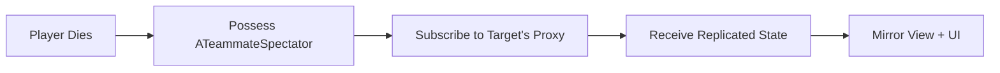

# Spectator System

When you die in a competitive shooter, you want to see the game through your teammate's eyes, not hover as a ghost with a detached free-cam. You want to see their weapon, their ammo count, their crosshair. You want to feel like you're watching _their_ screen.

The **Spectator System** provides exactly this: immersive POV spectating where the spectator's view mirrors the observed player's experience as closely as possible.

### Why Immersive Spectating Matters

Standard spectator systems give you a floating camera or a simple follow-cam. This system goes further:

* **Engagement**: Keeps eliminated players invested in the match
* **Learning**: Watch how teammates handle situations
* **Modern expectation**: Players expect Call of Duty/Apex-style spectating
* **Information parity**: Spectators see exactly what the player sees (weapons, ammo, camera modes)

***

### The Core Concept



#### When death happens

When a player dies, they are switched to a specialized spectator flow:

* They possess a specialized spectator pawn (`ATeammateSpectator`).



#### Server subscription

The server subscribes the spectator to the target player's data proxy (`USpectatorDataProxy`). The proxy manages the "who's watching me" list.



#### Replication

The target player's gameplay state (quickbar, camera mode, ADS, etc.) is replicated selectively to subscribers via `USpectatorDataContainer`.



#### Mirror view + UI

The spectator pawn and spectator UI update to mirror the observed player's view as closely as possible.



#### S**elective replication**

Instead of broadcasting player state to everyone which is bandwith heavy, the system only sends data to players who are actively watching.

***

### System Components

| Component                       | Role                                                                            |
| ------------------------------- | ------------------------------------------------------------------------------- |
| **`ATeammateSpectator`**        | The spectator pawn you possess, contains a camera that mimics the target's view |
| **`USpectatorDataProxy`**       | Lives on every PlayerState, manages "who's watching me" subscription list       |
| **`USpectatorDataContainer`**   | Holds the replicated state (quickbar, camera mode, ADS status)                  |
| **`GA_Spectate`**               | The ability that initiates spectating, spawns the pawn, sets up subscriptions   |
| **`GA_Spectate_Next/Previous`** | Input-driven abilities to cycle through teammates                               |

***

### Quick Integration

Add spectating to your game mode in one step:



Open your Experience Definition asset.



Add `LAS_ShooterBase_Spectator` to the Action Sets array.



Done, the Action Set grants the abilities, components, and input bindings.



See [Integration](integration.md) for details on what the Action Set includes and dependencies to verify.

***

### Documentation Guide

| Page                                      | What You'll Learn                                                            |
| ----------------------------------------- | ---------------------------------------------------------------------------- |
| [Architecture](spectator-architecture.md) | How components connect, data flow, subscription model                        |
| [Live Spectating](live-spectating.md)     | The workflow of how live spectating works                                    |
| [Camera & UI](camera-and-ui.md)           | How camera mimicking and UI updates work                                     |
| [Integration](integration.md)             | Step-by-step setup and extension points                                      |
| [Advanced Usage](advanced-usage.md)       | Using components in other systems (e.g., how killcam uses TeammateSpectator) |

***

### Quick Reference

**Key Classes:**

* `ATeammateSpectator`
* `USpectatorDataProxy`&#x20;
* `USpectatorDataContainer`&#x20;

**Message Tags:**

* `ShooterGame.Spectator.Message.SlotsChanged` — Quickbar slots updated
* `ShooterGame.Spectator.Message.ActiveIndexChanged` — Active weapon slot changed
* `ShooterGame.Spectator.Message.CameraModeChanged` — Camera mode changed
* `ShooterGame.Spectator.Message.ToggleADS` — ADS state changed
* `ShooterGame.Spectator.Message.SpectatePlayerChanged` — Now watching a different player

***
