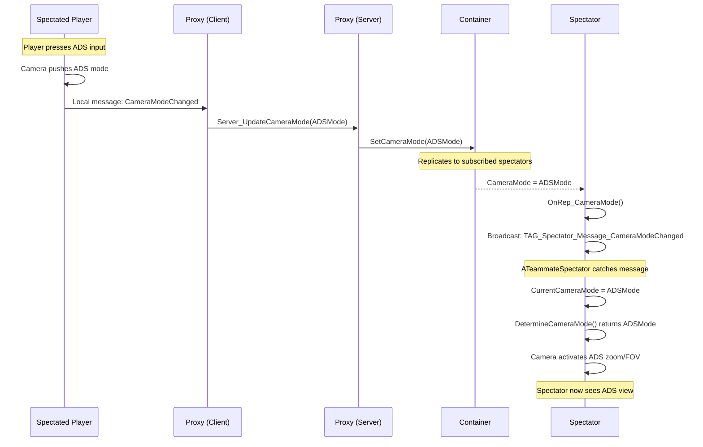

# Camera and UI

The goal is to make spectators feel like they're looking at the spectated player's screen. This means matching the camera exactly, including zoom, FOV, and offsets from ADS, and displaying the same UI elements (quickbar, ammo, crosshair).

### Camera Mimicking

Both the player pawn and `ATeammateSpectator` use `ULyraCameraComponent` with a stack of `ULyraCameraMode` instances. The spectator achieves camera matching by activating the **same camera mode class** as the player.

#### How It Works



Player enters ADS.



Player's camera component pushes ADS camera mode.



Player's camera broadcasts "CameraModeChanged" message locally.



Player's SpectatorDataProxy listener catches it.



Proxy calls `Server_UpdateCameraMode` RPC.



Server updates `SpectatorDataContainer.CameraMode`.



Container replicates to spectator.



Spectator's `OnRep_CameraMode` fires, broadcasts local message.



`ATeammateSpectator.OnCameraChangeMessage` catches it.



Spectator's `DetermineCameraMode()` now returns the ADS mode.



Spectator's camera activates ADS mode.



Spectator sees the same zoom/FOV as the player.



### Why Same Class = Same View

Camera modes define their view parameters (FOV, offset, blend time) internally. When both pawns activate the same mode class, they use identical settings. The spectator's camera component computes the view relative to the **target pawn** (the spectated player's pawn), so the result matches.

***

### UI Updates via Messages

UI widgets don't bind directly to the `SpectatorDataContainer`. Instead, they listen for **local Gameplay Messages** broadcast when container properties replicate.

#### The Message Pattern

```plaintext
Container property changes (via replication)
    → OnRep_ function fires on spectator client
    → OnRep_ broadcasts a local message with the new data
    → UI widget listener receives message
    → Widget updates its display
```

Why messages? Decoupling. The container doesn't know (or care) which widgets exist. Any widget can listen for the messages it needs. You can add new widgets without modifying the container.

#### Available Messages

| Tag                                                | Payload                 | Triggered When           |
| -------------------------------------------------- | ----------------------- | ------------------------ |
| `ShooterGame.Spectator.Message.SlotsChanged`       | Array of item instances | Quickbar contents change |
| `ShooterGame.Spectator.Message.ActiveIndexChanged` | New active slot index   | Selected weapon changes  |
| `ShooterGame.Spectator.Message.CameraModeChanged`  | New camera mode class   | Camera mode changes      |
| `ShooterGame.Spectator.Message.ToggleADS`          | ADS state (bool)        | ADS on/off               |

### Example: The ADS Flow

A complete walkthrough of what happens when the spectated player toggles ADS:



### Building Spectator UI Widgets

When creating custom spectator UI, follow this pattern.



Listen for Messages

In your widget's initialization:

```plaintext
// Blueprint pseudocode
OnInitialized:
    GameplayMessageSubsystem.RegisterListener(
        TAG_ShooterGame_Spectator_Message_SlotsChanged,
        self,
        OnSlotsChanged
    )
    GameplayMessageSubsystem.RegisterListener(
        TAG_ShooterGame_Spectator_Message_ActiveIndexChanged,
        self,
        OnActiveIndexChanged
    )
```



Handle the Message

Extract data from the payload and update your widget:

```plaintext
OnSlotsChanged(Message):
    QuickBarSlots = Message.Slots
    RebuildSlotWidgets(QuickBarSlots)

OnActiveIndexChanged(Message):
    ActiveIndex = Message.ActiveIndex
    HighlightSlot(ActiveIndex)
```



Read Item Data

The quickbar slots contain actual `ULyraInventoryItemInstance` pointers. You can read their properties:

```plaintext
// Get the active weapon instance
ActiveWeapon = QuickBarSlots[ActiveIndex]

// Read ammo (updated via inventory query system)
SpareAmmo = ActiveWeapon.GetStatTagStackCount(TAG_Lyra_Weapon_SpareAmmo)

// Get weapon definition for icon/name
WeaponDef = ActiveWeapon.GetItemDefinition()
```




### Ammo Tracking

Ammo counts deserve special mention because they're stored in the player's **inventory**, not on the weapon instance. The system handles this through a server-side query mechanism:



Container notices quickbar weapon has InventoryAmmoTypes.



Container creates a `ULyraInventoryQuery` for those ammo types.



Query monitors inventory for stack changes.



When ammo changes, query calls `HandleInventoryAmmoUpdated`.



Handler sets `TAG_Lyra_Weapon_SpareAmmo` on the weapon instance.



Weapon instance replicates to spectator.



Spectator UI reads the stat tag.



This ensures the spectator sees accurate ammo counts even though they don't have direct access to the player's inventory.

## Summary

| System     | How It Works                                                                           |
| ---------- | -------------------------------------------------------------------------------------- |
| **Camera** | Same mode class = same view parameters. Mode class replicates, spectator activates it. |
| **UI**     | Container OnRep_ → local messages → widgets listen and update                         |
| **Ammo**   | Server queries inventory, sets stat tag on weapon, weapon replicates to spectator      |

The message-based approach means you can build any spectator UI without touching the core system. Just listen for the messages you need and update accordingly.
