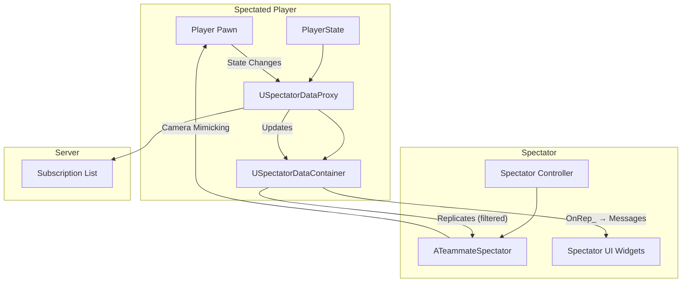
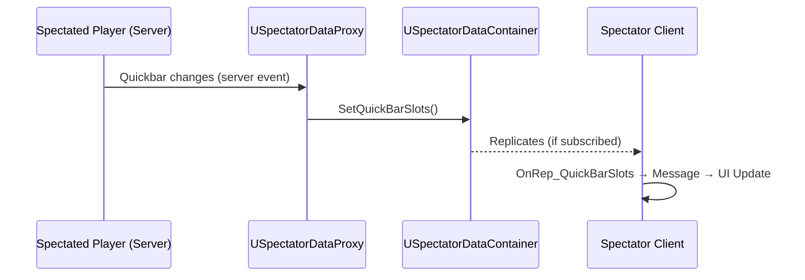
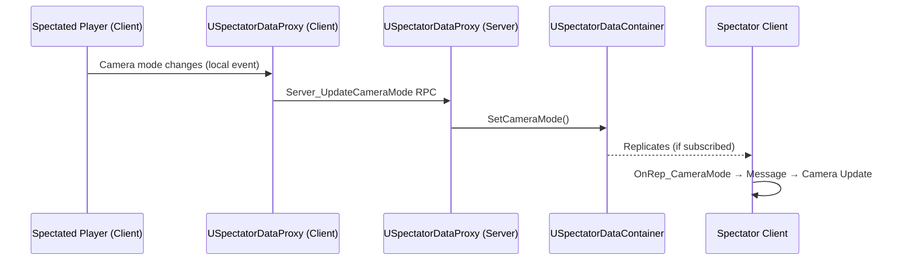

# Spectator Architecture

Before diving into integration, it's essential to understand how the Spectator System's components work together to achieve immersive, bandwidth-efficient spectating.

***

## The Big Picture



***

### The Bandwidth Challenge

Broadcasting every player's gameplay state to every other player is expensive. If Player A's camera mode changes, does Player B (on the other side of the map) need to know? Usually not.

The Solution: Subscription-Based Replication

Only spectators actively watching a player receive that player's detailed state. The system tracks who's watching whom and filters replication accordingly.

***

### Component Roles

### `USpectatorDataProxy`

The gatekeeper. Attached to every PlayerState, it answers "Who's watching me?"

Responsibilities:

* Maintains `SubscribedSpectators` list, controllers currently authorized to receive data
* Filters replication via `ReplicateSubobjects()`, only sends data to subscribers
* Listens for state changes (quickbar on server, camera mode on client)
* Relays client state to server via RPCs

```plaintext
// When someone starts watching this player:
SetSpectatorSubscribed(SpectatorController, true)
    → Add to SubscribedSpectators
    → Container data now replicates to that controller

// When they stop watching:
SetSpectatorSubscribed(SpectatorController, false)
    → Remove from SubscribedSpectators
    → Container data no longer replicates
```

### `USpectatorDataContainer`

The data packet. Contains all the state spectators need to see:

| Property          | Description                                       |
| ----------------- | ------------------------------------------------- |
| `QuickBarSlots`   | Array of inventory item instances in the quickbar |
| `ActiveSlotIndex` | Currently selected weapon slot                    |
| `CameraMode`      | `TSubclassOf<ULyraCameraMode>` currently active   |
| `ToggleADS`       | Whether player is aiming down sights              |

OnRep_ Pattern: When properties replicate to the spectator, `OnRep_` functions fire and broadcast local Gameplay Messages. This decouples the container from UI widgets, widgets listen for messages, not container changes directly.

### `ATeammateSpectator`

The camera platform. The pawn you possess when spectating.

Responsibilities:

* Contains `ULyraCameraComponent` that mimics the target's camera
* Manages which player you're currently watching (`CurrentObservablePawnIndex`)
* Handles target cycling (`WatchNextPawn`, `WatchPreviousPawn`)
* Listens for camera mode messages and updates its own camera accordingly
* Sets up tick prerequisites to reduce visual lag

```plaintext
// Camera mimicking flow:
1. Container's CameraMode replicates, OnRep_ broadcasts message
2. ATeammateSpectator::OnCameraChangeMessage receives it
3. Updates internal CurrentCameraMode
4. DetermineCameraMode() returns this mode on next tick
5. Spectator's camera now uses the same mode as the target
```

***

### Data Flow: Where State Originates

### Server-Authoritative State

Some state changes happen on the server and flow outward:



Examples: Quickbar slot contents, active slot index

### Client-Authoritative State

Some state only the client knows and must relay to the server:



Examples: Camera mode, ADS toggle

***

### The Replication Filter

The proxy controls what gets sent to whom via `ReplicateSubobjects()`:

```plaintext
ReplicateSubobjects(Channel, Bunch, RepFlags):
    if IsSpectatorSubscribed(Channel.Viewer):
        ReplicateSubobject(SpectatorData, ...)

        for each ItemInstance in SpectatorData.QuickBarSlots:
            ReplicateSubobject(ItemInstance, ...)
```

This is where the bandwidth savings come from. The container only replicate itself and items to actual spectators.

***

### TeammateSpectator as a Reusable Platform

The `ATeammateSpectator` is designed to be reusable beyond live teammate spectating. It's a camera platform that can:

* Attach to any pawn and mimic its camera
* Receive data from any source (not just the Proxy/Container system)
* Be spawned locally without server possession

Example: Killcam

The [Kill Cam system](../kill-cam/) reuses `ATeammateSpectator` but bypasses the Proxy/Container entirely:

1. Killcam has recorded killer data from the replay system
2. It spawns `ATeammateSpectator` locally on the victim's client
3. It passes the killer's pawn directly to `SpectatePlayerState`
4. Camera data comes from killcam playback, not live replication

This is possible because the spectator pawn doesn't care _where_ its data comes from, it just needs a target pawn and camera mode information.

***
