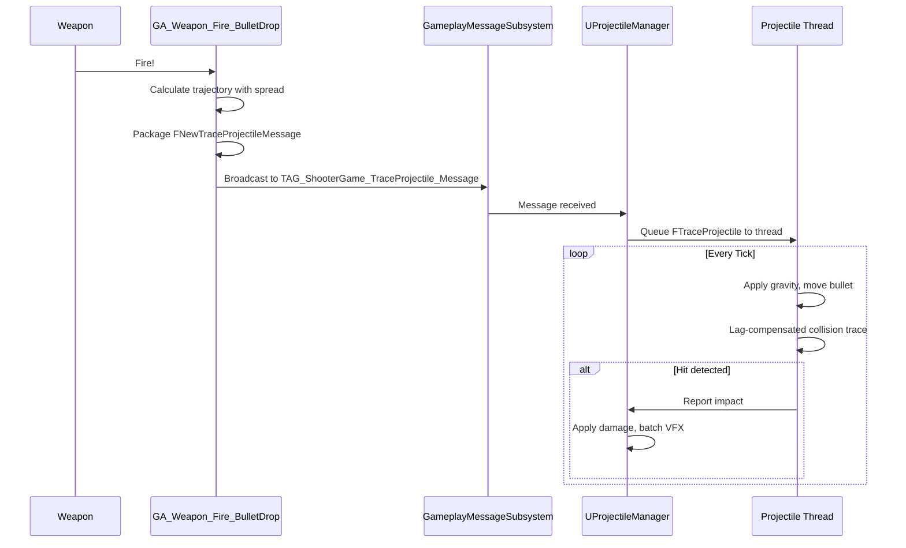
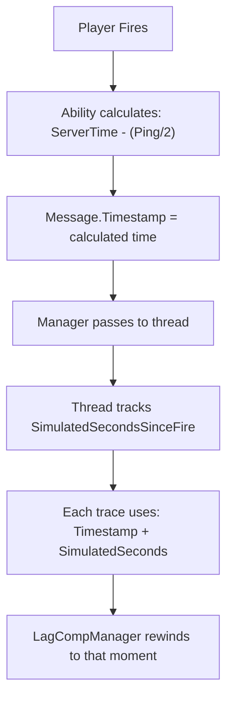

# Bullet Drop

High fire-rate weapons can generate thousands of simultaneous projectiles. Spawning an actor for each creates unsustainable overhead. Bullet Drop uses struct-based simulation on a background thread with full gravity, penetration, and lag-compensated hit detection.

***

### The Scaling Challenge

Traditional actor-based projectiles work for rockets, you might have a dozen in flight at once. Automatic weapons break this model:

| Fire Rate          | Bullets/Second | 32 Players | Actors/Minute |
| ------------------ | -------------- | ---------- | ------------- |
| Pistol (200 RPM)   | 3              | 96         | 5,760         |
| SMG (600 RPM)      | 10             | 320        | 19,200        |
| Minigun (6000 RPM) | 100            | 3,200      | **192,000**   |

Each actor carries overhead:

* **Memory**: Component allocation, tick registration, GC tracking
* **CPU**: Initialization, tick functions, destruction
* **Network**: Replication, relevancy checks

At 192,000 actors per minute, server performance degrades significantly.

***

### Struct-Based Architecture

The [Projectile Manager](../../projectile-manager/) solves this with a different approach: **no actors, just data**.

Instead of spawning an `AActor` for each bullet, bullets exist as `FTraceProjectile` structs, lightweight data containing position, velocity, and hit tracking. A dedicated background thread simulates all active bullets, freeing the main game thread.

| Aspect          | Actor Projectile   | Struct Projectile      |
| --------------- | ------------------ | ---------------------- |
| **Memory**      | \~1KB per actor    | \~200 bytes per struct |
| **Tick**        | Per-actor overhead | Batch processing       |
| **Replication** | Position updates   | None (server-only)     |
| **Thread**      | Main thread        | Background thread      |

The result: thousands of simultaneous bullets with minimal performance impact.

***

## Integration Flow

The `GA_Weapon_Fire_BulletDrop` Blueprint ability bridges your weapon to the Projectile Manager:



#### What the Blueprint Does

In the `OnRangedWeaponTargetDataReady` event:

```plaintext
OnRangedWeaponTargetDataReady(TargetData):
    for each Hit in TargetData:
        // Create the projectile message
        Message = FNewTraceProjectileMessage()

        // Trajectory
        Message.StartLocation = MuzzleSocketLocation
        Message.StartVelocity = TrajectoryDirection * BulletSpeed

        // Limits
        Message.MaxRange = WeaponMaxRange
        Message.MaxLifespan = 2.0  // seconds

        // Attribution
        Message.Instigator = OwningController
        Message.Causer = WeaponActor

        // Effects
        Message.HitEffect = DamageGameplayEffect
        Message.ImpactCueNotify = TAG_GameplayCue_Impact_Bullet

        // Penetration (from weapon config)
        Message.MaterialPenetrationMap = WeaponPenetrationSettings
        Message.MaxPenetrations = WeaponMaxPenetrations

        // Lag compensation
        Message.Timestamp = TargetData.Timestamp
        Message.Latency = ClientPing

        // Fire!
        BroadcastMessage(TAG_ShooterGame_TraceProjectile_Message, Message)
```

#### Targeting Difference from Hitscan

**Important**: Bullet Drop uses `CameraTowardsFocus` targeting, while Hitscan uses `WeaponTowardsFocus`.

For instant-hit weapons, the trace should originate from the muzzle. For projectiles with travel time, starting from the camera provides better aiming feel—the player aims where they're looking, and the bullet arcs toward that point.

***

### Projectile Manager Processing

The bullet lifecycle in the Projectile Manager is best represented as a sequence of steps:



#### Queuing

The manager converts your message to an `FTraceProjectile` struct and queues it to the background thread:

```plaintext
UProjectileManager::OnProjectileMessage(Message):
    Projectile = FTraceProjectile()
    Projectile.StartLocation = Message.StartLocation
    Projectile.Velocity = Message.StartVelocity
    Projectile.Timestamp = Message.Timestamp
    // ... copy all fields

    ProjectileThread.QueueProjectile(Projectile)
```



#### Simulation

Every game tick, the thread processes all active bullets:

```plaintext
FProjectileThreadRunnable::MoveProjectiles():
    for each Projectile:
        // Apply gravity
        Projectile.Velocity.Z -= WorldGravity * DeltaTime

        // Calculate new position
        NewPosition = Projectile.Location + Projectile.Velocity * DeltaTime

        // Lag-compensated trace
        TraceResult = LagCompManager.RewindLineTrace(
            Projectile.Location,
            NewPosition,
            Projectile.Timestamp + Projectile.SimulatedTime
        )

        if TraceResult.Hit:
            HandleCollision(Projectile, TraceResult)
        else:
            Projectile.Location = NewPosition
```



#### Impact

When a bullet hits something:

```plaintext
HandleCollision(Projectile, HitResult):
    // 1. Can we penetrate?
    if CanPenetrate(HitResult, Projectile.MaterialMap):
        ApplyPenetration(Projectile, HitResult)
        continue simulation...

    // 2. Can we ricochet?
    if CanRicochet(HitResult, Projectile.MaterialMap):
        ApplyRicochet(Projectile, HitResult)
        continue simulation...

    // 3. Bullet stops - report impact
    NotifyMainThread(Projectile, HitResult)
    RemoveProjectile(Projectile)
```

The main thread then applies damage, sends hit markers, and queues VFX via the [batched GameplayCue system](../../projectile-manager/architecture.md#the-batched-gameplaycue-system).



***

### Lag Compensation Chain

Even with struct-based simulation, fairness matters. The Projectile Manager integrates with [Lag Compensation](../../lag-compensation/) to ensure hits register against where targets _were_ when the player fired.



**Why `SimulatedSecondsSinceFire`?**

If a bullet takes 200ms to reach its target, the rewind timestamp needs to account for that travel time. The trace should hit where the target was 200ms after the player fired, not where they were at fire time.

***

### Configuration

### `FNewTraceProjectileMessage` Fields

| Field                    | Type          | Description                    |
| ------------------------ | ------------- | ------------------------------ |
| `StartLocation`          | FVector       | World-space origin             |
| `StartVelocity`          | FVector       | Direction × Speed              |
| `MaxRange`               | float         | Maximum travel distance (cm)   |
| `MaxLifespan`            | float         | Maximum lifetime (seconds)     |
| `ProjectileRadius`       | float         | Sphere sweep radius (0 = line) |
| `Instigator`             | AController\* | Who fired                      |
| `Causer`                 | AActor\*      | The weapon                     |
| `HitEffect`              | TSubclassOf   | Damage effect                  |
| `ImpactCueNotify`        | FGameplayTag  | Tag for batched VFX            |
| `MaterialPenetrationMap` | TMap          | Per-material penetration rules |
| `MaxPenetrations`        | int32         | Max surfaces (-1 = unlimited)  |
| `Timestamp`              | double        | Server time when fired         |
| `Latency`                | float         | Client ping (ms)               |

### Penetration Configuration

Bullet Drop uses the same penetration system as Hitscan. See [Hitscan - Penetration & Ricochet](hitscan.md#penetration-and-ricochet) for material setup details.

***

### When to Use This vs Actor Projectiles

| Scenario               | Bullet Drop | Actor Projectile |
| ---------------------- | ----------- | ---------------- |
| Fire rate > 100 RPM    | Best choice | Avoid            |
| Needs gravity          | Yes         | Yes              |
| Needs penetration      | Yes         | No               |
| Needs homing/seeking   | No          | Yes              |
| Needs detonation/timer | No          | Yes              |
| Needs visible mesh     | Tracer only | Full mesh        |
| Server performance     | Excellent   | Scales poorly    |

General guideline: If it's a "bullet," use Bullet Drop. If it's a "projectile" with special behavior (homing, detonation, physics interactions), use actor projectiles.

***

### Extension Points

#### `OnRangedWeaponTargetDataReady`

This Blueprint event is where you construct and broadcast the projectile message. Customize:

* Bullet speed and gravity multiplier
* Penetration settings per weapon
* Impact cue tags for different bullet types
* Sphere sweep radius for larger projectiles

#### `VFX via GameplayCues`

Impact effects are handled automatically via the Projectile Manager's batched GameplayCue system. Create `GCN_` (GameplayCue Notify) assets that respond to your `ImpactCueNotify` tag. See [Handling Results](../../projectile-manager/handling-results.md) for details.

#### Custom Ability Subclass

For advanced customization, subclass `UGameplayAbility_RangedWeapon_Projectile` in C++. Note that this ability does **not** perform server-side validation, it relies on the Projectile Manager's collision system.

***

## Quick Reference

**Blueprint Ability**: `GA_Weapon_Fire_BulletDrop`\
**C++ Base**: `UGameplayAbility_RangedWeapon_Projectile`\
**Targeting Default**: `CameraTowardsFocus`

**Key Systems**:

* [Projectile Manager](../../projectile-manager/) - Struct-based simulation
* [Lag Compensation](../../lag-compensation/) - Fair hit detection

**Key Tags**:

* `ShooterGame.TraceProjectile.Message` - Broadcast tag for spawning

***
