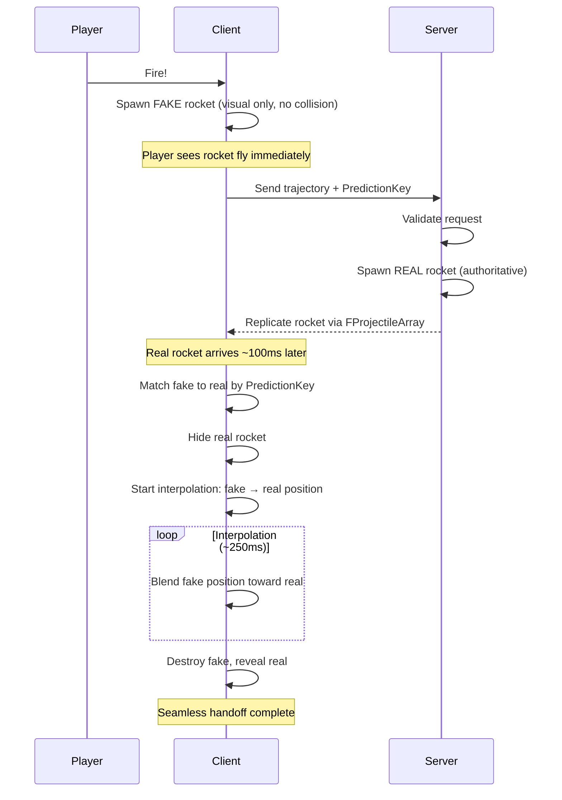

# Predictive Projectile

Visible projectiles like rockets need to appear immediately when fired, but the authoritative projectile is spawned on the server 50–150ms away. Predictive Projectile solves this by spawning a client-side "fake" immediately, then smoothly handing off to the server's "real" projectile when it arrives.

***

### The Latency Problem

With a naive server-authoritative approach:

| Time      | What Happens                          |
| --------- | ------------------------------------- |
| 0ms       | Player clicks fire                    |
| 0ms       | Client sends "fire" request to server |
| 50ms      | Server receives request               |
| 50ms      | Server spawns rocket actor            |
| 100ms     | Actor replicates back to client       |
| **100ms** | **Player finally sees rocket**        |

That 100ms gap creates a noticeable delay between input and visual feedback. For hitscan weapons, this is hidden with instant hit markers. For bullets with travel time, tracer particles hide it. But for a rocket, a big, slow, visible projectile, there's nowhere to hide the delay.

***

### Fake-Real Architecture

The solution: spawn a "fake" rocket immediately on the client, then smoothly replace it with the "real" server rocket when it arrives.



The player sees the rocket fly immediately. By the time the server's rocket arrives, the fake has been smoothly moved to match, then swapped. The player never notices the transition.

***

### Client-Side Spawning



#### When the ability activates on the client

SpawnProjectile_Client(Params):

* Calculate if we should delay (high latency)
* Estimate PredictionTime and compute SleepTime

Logic (pseudocode):

```plaintext
PredictionTime = EstimatedServerDelay()
SleepTime = max(0, PredictionTime - MaxLatency)

if SleepTime > 0:
    // High latency - delay spawn to reduce visual desync
    ScheduleDelayedSpawn(SleepTime, Params)
else:
    // Normal latency - spawn immediately
    SpawnFakeProjectile(Params)
```



#### Spawn fake projectile (visual only)

SpawnFakeProjectile(Params):

* Spawn with deferred initialization
* Disable collision (visual-only)
* Set launch params and finish spawning
* Track the fake by PredictionKey for later matching

Pseudocode:

```plaintext
Projectile = SpawnActorDeferred(ProjectileClass)
Projectile.SetCollisionEnabled(false)  // Visual only!
Projectile.SetLaunchParams(Params.Velocity, Params.BridgeAcceleration)
FinishSpawningActor(Projectile)

ClientProjectiles.Add(Params.PredictionKey, Projectile)
```



***

### Server-Side Spawning



#### Spawn authoritative projectile

SpawnProjectile_Server(Params):

* Spawn authoritative projectile with collision enabled
* Initialize launch params, finish spawning

Pseudocode:

```plaintext
Projectile = SpawnActorDeferred(ProjectileClass)
Projectile.SetCollisionEnabled(true)  // Real collision!
Projectile.SetLaunchParams(Params.Velocity, Params.BridgeAcceleration)
FinishSpawningActor(Projectile)
```



#### Add to replicated array

* Add the real projectile to `ServerProjectiles` (FProjectileArray)
* Mark item dirty to trigger replication to owning client

Pseudocode:

```plaintext
ServerProjectiles.Add(Projectile, Params.PredictionKey)
ServerProjectiles.MarkItemDirty(NewProjectile)
```



***

### Client Receives Server Projectile



#### Match server projectile to fake

When the replicated projectile arrives on the client:

Pseudocode:

```plaintext
OnServerProjectileReplicated(ServerProjectile, PredictionKey):
    FakeProjectile = ClientProjectiles.Find(PredictionKey)

    if FakeProjectile not found:
        // Edge case: fake expired or never spawned
        ServerProjectile.SetHidden(false)
        return
```



#### Hide real and start interpolation

Pseudocode:

```plaintext
// 2. Hide the real, keep the fake visible
ServerProjectile.SetHidden(true)

// 3. Begin interpolation
StartInterpolation(FakeProjectile, ServerProjectile)
```



***

### The Muzzle Offset Problem

In third-person shooters, the weapon muzzle is below and to the side of the camera. If the rocket fires straight from the muzzle, it travels at an angle to where the player is aiming:

```
        Camera (where player aims)
           ↓
           ○─────────────────→ Target
          /
         /
        /
       ◆ Muzzle (where rocket spawns)
```

Firing "straight" from the muzzle would miss the target by the offset distance. But firing from the camera would look wrong, the rocket would appear to spawn from thin air.

#### Converging Paths

The rocket starts at the muzzle but curves toward the camera's aim line, joining it at a "merge point":

```
        Camera
           ↓
           ○═══════════════════→ Target
          /↗
         / ↗  (merge point)
        /↗
       ◆ Muzzle
```

The rocket travels along a bridge trajectory for `PathJoinTime` seconds (default 0.15s), then continues straight along the camera's aim line.

#### The Kinematic Solution

Solve for acceleration so the rocket reaches the camera's trajectory in exactly `PathJoinTime` seconds:

```plaintext
CalculateProjectileLaunchParams():
    // Where we want to end up (on camera's line)
    MergePoint = CameraLine.GetPointAtDistance(MergeDistance)

    // Displacement from muzzle to merge point
    Displacement = MergePoint - MuzzleLocation

    // Final velocity (along camera line)
    FinalVelocity = CameraDirection * ProjectileSpeed

    // Solve kinematic equation for initial velocity:
    // Displacement = (v_initial + v_final) / 2 * time
    // v_initial = (2 * Displacement / time) - v_final
    InitialVelocity = (2 * Displacement / PathJoinTime) - FinalVelocity

    // Acceleration during bridge
    BridgeAcceleration = (FinalVelocity - InitialVelocity) / PathJoinTime

    return {
        InitialVelocity: InitialVelocity,
        BridgeAcceleration: BridgeAcceleration,
        PathJoinTime: PathJoinTime
    }
```

> [!INFO]
> You can read [Converging Path System](/broken/pages/k4nx6XgdNAaxTRWww1eh) for more details

***

### Interpolation System

Interpolation happens in two phases, handling different projectile states.



#### Bridge Phase (Converging Path)

During the first \~150ms both projectiles are in their bridge trajectory, curving from the muzzle toward the camera's aim line. Interpolation syncs their time-in-curve rather than position directly.

Pseudocode:

```plaintext
InterpolateProjectile_BridgePhase():
    FakeTime = FakeProjectile.TimeInBridge
    RealTime = ServerProjectile.TimeInBridge

    BlendedTime = Lerp(FakeTime, RealTime, Alpha)

    FakeProjectile.SetStateFromTimeInBridge(BlendedTime)

    // Alpha increases over 0.3 seconds
    if Alpha >= 1.0 or both exited bridge:
        TransitionToNormalPhase()
```



#### Normal Phase (Position & Velocity Lerp)

Once both projectiles are past the bridge, position and velocity are lerped directly.

Pseudocode:

```plaintext
InterpolateProjectile_NormalPhase():
    FakePosition = FakeProjectile.GetLocation()
    RealPosition = ServerProjectile.GetLocation()

    BlendedPosition = Lerp(FakePosition, RealPosition, Alpha)
    FakeProjectile.SetLocation(BlendedPosition)

    FakeVelocity = FakeProjectile.GetVelocity()
    RealVelocity = ServerProjectile.GetVelocity()

    BlendedVelocity = Lerp(FakeVelocity, RealVelocity, Alpha)
    FakeProjectile.SetVelocity(BlendedVelocity)

    // Alpha increases over 0.2 seconds (speed = 15)
    if PositionClose(Fake, Real):
        FinalizeInterpolation()
```

Finalize:

```plaintext
FinalizeInterpolation():
    FakeProjectile.Destroy()
    ServerProjectile.SetHidden(false)
    ServerNotifyProjectileReplicated(PredictionKey)
```



***

### High Latency Handling

When the player has 300ms ping, the fake spawns immediately but the server's rocket arrives much later. If the fake is far ahead when interpolation begins, the correction would be visible.

#### Delayed Spawn

When latency exceeds `MaxLatency` (default 200ms), the client delays spawning the fake:

```plaintext
SleepTime = (EstimatedLatency - MaxLatency) * 0.001  // Convert to seconds

if SleepTime > 0:
    // Don't spawn yet - schedule for later
    SetTimer(SleepTime, SpawnFakeProjectile)
```

This ensures the fake and real projectiles are closer in position when interpolation begins, reducing visible correction.

#### The Trade-off

Delayed spawning hides the latency correction but introduces input lag. A player with 300ms ping won't see their rocket for `(300 - 200) = 100ms` after clicking. This is better than seeing a rocket snap backward, but less responsive than low-latency play.

***

### The Matching System

Fake and real projectiles are linked via `PredictionKey`, a unique identifier generated when the ability activates.

#### `FProjectileArray` (Replication)

Server projectiles are stored in an `FProjectileArray`, an `FFastArraySerializer` that efficiently replicates to clients. When a new projectile is added:

```plaintext
ServerProjectiles.MarkItemDirty(NewProjectile)
// Triggers replication to owning client
// Client's PostReplicatedAdd() called on arrival
```

#### Edge Cases

<details class="gb-toggle">

<summary>Edge case behaviors</summary>

* Key not found: The fake may have been destroyed (hit something, expired) before the real arrived. The server projectile simply becomes visible immediately.
* Duplicate keys: Shouldn't happen in normal operation. If it does, the first fake is used and the system logs a warning.
* Fake ahead of real: Normal due to latency. Interpolation pulls the fake back toward the real.
* Fake behind real: Can happen if server validation took extra time. Interpolation pushes the fake forward.

</details>

***

### Configuration

#### Key Properties

| Property       | Default        | Description                         |
| -------------- | -------------- | ----------------------------------- |
| `MaxLatency`   | 200ms          | Threshold for delayed spawn         |
| `PathJoinTime` | 0.15s          | Duration of converging path curve   |
| `AimingMode`   | ConvergingPath | Direct (no curve) or ConvergingPath |

#### Aiming Modes

* ConvergingPath (default): Rocket curves from muzzle to camera line. Use for third-person or weapons with significant muzzle offset.
* Direct: Rocket fires straight from muzzle toward target. Use for first-person with minimal offset.

#### Interpolation Timing

| Phase  | Duration | Method                   |
| ------ | -------- | ------------------------ |
| Bridge | \~0.3s   | Time-domain sync         |
| Normal | \~0.2s   | Position lerp (speed=15) |
| Total  | \~0.5s   | Worst case               |

These values are tuned for typical competitive latency. Higher latency may require adjustment.

***

### Extension Points

#### `OnRangedWeaponTargetDataReady`

This Blueprint event fires after targeting. Use it for muzzle flash, sound, and spawning the projectile:

```plaintext
OnRangedWeaponTargetDataReady(TargetData):
    // Play cosmetics
    PlayMuzzleFlash()
    PlaySound(FireSound)

    // Spawn the projectile
    for each Hit in TargetData:
        SpawnParams = CalculateLaunchParams(Hit)
        SpawnProjectile(SpawnParams)
```

#### `Custom Projectile Actor`

The ability spawns `AProjectileBase` actors. Subclass this for custom behavior:

* Override `SetStateFromTimeInBridge()` for custom bridge trajectories
* Add visual effects that differ between fake/real
* Implement detonation or proximity triggers

#### Fake vs Real Differences

The fake projectile has `CollisionEnabled = false`. If you need different visuals:

```plaintext
AMyProjectile::BeginPlay():
    if CollisionEnabled == false:
        // This is a fake - maybe add "ghost" effect
        SetMaterial(GhostMaterial)
```

***

### Quick Reference

**Blueprint Ability**: `GA_Weapon_Fire_Projectile`\
**C++ Base**: `UGameplayAbility_PredictiveProjectile`\
**Targeting Default**: `CameraTowardsFocus`

**Key Properties**:

* `MaxLatency` - Delay spawn threshold (200ms)
* `AimingMode` - Direct or ConvergingPath
* `PathJoinTime` - Bridge duration (0.15s)

**Related Systems**:

* [Predictive Projectile System](../projectile-system/) - `AProjectileBase` details
* [Converging Path System](/broken/pages/k4nx6XgdNAaxTRWww1eh) - Merge point math

**Key Concepts**:

* Fake projectile: Visual only, no collision, client-spawned
* Real projectile: Authoritative, collision enabled, server-spawned
* Interpolation: Smoothly blend fake to real over \~250ms

***
