# InventoryFragment_Inspect

A flat 2D icon tells the player they have a shotgun. But let them grab it, spin it around, zoom in on the engravings, and tilt it to catch the light - now they _feel_ like they have a shotgun. That is the difference 3D item inspection makes.

`InventoryFragment_Inspect` is the data fragment that bridges your item definitions to the 3D inspection viewport. It tells the system which mesh to display, how the camera should behave, how far the player can rotate the model, and how to capture a 2D icon snapshot from the 3D render. The heavy lifting happens in the [Item Inspection system](../item-inspection-system/), this fragment is the per-item configuration that feeds it.

***

### What It Does

* **Visual Representation** - Specifies the Static Mesh or Skeletal Mesh rendered in the 3D inspection viewport.
* **Camera Control** - Configures FOV limits and zoom behavior for the inspection camera.
* **Rotation Control** - Defines how the player can rotate the model: free rotation, axis clamping, spring arm mode, and reset behavior.
* **Icon Snapshots** - Provides settings for the `UItemIconGeneratorComponent` to capture cached 2D icons from the 3D model.

***

### Configuration

Add `InventoryFragment_Inspect` to a `ULyraInventoryItemDefinition` and configure the following sections.


#### Visual Mesh

| Property           | Description                                                                                |
| ------------------ | ------------------------------------------------------------------------------------------ |
| **`StaticMesh`**   | The static mesh to display in the inspection view.                                         |
| **`SkeletalMesh`** | The skeletal mesh to display (use this for animated items like weapons with moving parts). |

> [!INFO]
> Set one or the other, whichever represents the item's 3D appearance. Setting both is not necessary.

#### Camera (Zoom)

| Property            | Description                                             |
| ------------------- | ------------------------------------------------------- |
| **`bCanZoom`**      | Whether the player can zoom in/out during inspection.   |
| **`InitialFOV`**    | Field of view when inspection begins.                   |
| **`MaxZoomInFOV`**  | Minimum FOV (closest zoom). Smaller values = more zoom. |
| **`MaxZoomOutFOV`** | Maximum FOV (widest view).                              |

#### Rotation

| Property                        | Description                                                                    |
| ------------------------------- | ------------------------------------------------------------------------------ |
| **`bCanRotate`**                | Whether the player can rotate the item model.                                  |
| **`bRotateSpringArm`**          | Enables unrestricted rotation using a virtual spring arm (orbiting the item).  |
| **`bResetRotationOnLoseFocus`** | Snaps the item back to its default rotation when the player stops interacting. |
| **`bClampXRotationAxis`**       | Limits rotation on the X axis to the range defined below.                      |
| **`bClampYRotationAxis`**       | Limits rotation on the Y axis to the range defined below.                      |
| **`RotationXAxisClamp`**        | Min/max angles for X-axis rotation.                                            |
| **`RotationYAxisClamp`**        | Min/max angles for Y-axis rotation.                                            |
| **`DefaultInspectionRotation`** | The initial rotation applied to the item when inspection opens.                |

### Icon Snapshot (Optional)

These settings control how the `UItemIconGeneratorComponent` captures a 2D icon from the 3D model. The icon system is not just a one-time screenshot -- it can regenerate icons on the fly whenever an item's visual appearance changes.

| Property                                      | Description                                                                                                                                                                                                      |
| --------------------------------------------- | ---------------------------------------------------------------------------------------------------------------------------------------------------------------------------------------------------------------- |
| **`InventoryIconImage.bUseAsInventoryImage`** | Enables 3D-rendered icon generation for this item. When `true`, the icon generator captures a 2D snapshot from the item's 3D model instead of using a static texture.                                            |
| **`ImageRotation`**                           | Rotation applied to the item model during icon capture. Use this to present the item from its most recognizable angle -- a rifle shown in profile, a helmet shown at a three-quarter view, etc.                  |
| **`FitToScreenRatio`**                        | How much of the capture frame the item fills, from `0.0` (tiny, centered) to `1.0` (edge-to-edge). A value around `0.85` works well for most items, leaving a small margin so attachments do not clip the frame. |
| **`bCacheRenderTarget`**                      | Controls whether icon render targets are shared across instances or unique per instance. See the decision guide below.                                                                                           |

#### Choosing `bCacheRenderTarget`

<details class="gb-toggle">

<summary><strong>When to cache vs. when to isolate render targets</strong></summary>

**`bCacheRenderTarget = true`** (default for most items)\
All instances that share the same `ULyraInventoryItemDefinition` reuse a single render target. A stack of 30 bandages does not need 30 separate icon textures, one snapshot covers them all. This is the memory-friendly default and the right choice for any item whose appearance is fully determined by its definition.

**`bCacheRenderTarget = false`** (per-instance icons)\
Each item instance gets its own dedicated render target. Use this when two items of the same definition can _look different at runtime_, for example, a rifle that accepts barrel, optic, and magazine attachments. Player A's rifle with a red-dot sight needs a different icon than Player B's rifle with a 4x scope, even though both items share the same base definition.

</details>

> [!INFO]
> Setting `bCacheRenderTarget = false` increases GPU memory usage proportionally to the number of live instances. Only disable caching for item categories where visual uniqueness matters to the player.

#### Real-Time Icon Regeneration

A static icon captured once at spawn would go stale the moment a player modifies the item. The icon snapshot system solves this with an event-driven regeneration pipeline, add a scope to a rifle, and the inventory icon updates to show the scope, automatically.

**How it works:**

When any system changes an item's visual appearance, an attachment is added or removed, equipment visuals are modified, a skin is applied, it broadcasts an `FItemInstanceVisualChangeMessage` through the **Gameplay Message Subsystem** on the channel:

```
Lyra.Inventory.Message.ItemVisualChange
```

Each item's ViewModel (`ULyraTetrisItemViewModel`) listens for messages on this channel and filters by its own item instance. When a matching message arrives, the ViewModel calls `RegenerateIcon()`, which requests a new asynchronous icon capture. The `UItemIconGeneratorComponent` re-renders the item inside its pocket level with the current visual state,  including all attachments in their current configuration, and the resulting texture feeds back through the MVVM binding layer. The UI widget picks up the change and displays the updated icon with no manual refresh needed.

```mermaid
flowchart TD

    A["Visual change occurs<br/>(e.g., attachment added)"]
    B["Broadcast FItemInstanceVisualChange<br/>via Gameplay Message Subsystem<br/>"]
    C["ULyraTetrisItemViewModel<br/>(per-item listener)<br/>Filters by matching item instance"]
    D["RegenerateIcon()<br/>Requests async icon capture"]
    E[UItemIconGeneratorComponent<br/>Re-renders item in pocket level<br/>with current visual state]
    F[New icon texture flows through<br/>MVVM bindings → UI updates]

    A --> B
    B --> C
    C -->|match found| D
    D --> E
    E --> F
```



> [!SUCCESS]
> You do not need to manually trigger icon updates. Any system that modifies item visuals just needs to broadcast the `FItemInstanceVisualChangeMessage`, the rest of the chain is automatic.

***

### Runtime Flow

This fragment is primarily a **data container**, it does not execute game logic itself. Other systems read its properties during the inspection pipeline:



#### Player Triggers Inspection

The player initiates inspection through the UI (typically firing a Gameplay Ability System event). This kicks off the PocketWorlds pipeline.



#### Pocket Level Spawns

The inspection system (via `UPocketLevelBridgeSubsystem`) spawns the appropriate pocket level, an isolated rendering environment, and retrieves the `APocketLevelStageManager` inside it.



#### Stage Manager Reads the Fragment

The `APocketLevelStageManager::Initialise` function receives the `ULyraInventoryItemInstance` being inspected. It calls `FindFragmentByClass` to locate the `InventoryFragment_Inspect` and reads:

* **Mesh** - Sets the `StaticMesh` or `SkeletalMesh` on the stage's mesh component.
* **Camera** - Configures FOV, zoom limits, and initial zoom from the fragment's camera properties.
* **Rotation** - Applies `DefaultInspectionRotation`, sets up clamping, and configures spring arm behavior.
* **Attachments** - If the item also has an `InventoryFragment_Attachment`, the stage manager recursively spawns and attaches visuals for those.



#### Player Interacts

The `UInventoryRepresentationWidget` reads `bCanZoom` and `bCanRotate` to enable or disable input. When the player drags (rotate) or scrolls (zoom), inputs are relayed to the stage manager, which applies the clamp and limit values from the fragment.



#### Icon Generation (Optional)

If the `UItemIconGeneratorComponent` is active and `bUseAsInventoryImage` is `true`, the generator reads `ImageRotation` and `FitToScreenRatio` to position the item for capture via `APocketLevelStageManager::InitialiseSnapCaptor`. The `bCacheRenderTarget` flag determines whether the resulting icon is shared across instances of the same definition or unique per instance.

This is not a one-time capture. Whenever the item's visual state changes at runtime, an attachment is added, a skin is swapped, equipment visuals are modified, the system broadcasts an `FItemInstanceVisualChangeMessage`. The item's ViewModel picks up the message, calls `RegenerateIcon()`, and the `UItemIconGeneratorComponent` re-renders the item with its current appearance. The updated icon flows through MVVM bindings back to the UI automatically. See [Async Icon Generation](../item-inspection-system/async-icon-generation.md) for the full event chain.



***

### Architecture at a Glance


> [!SUCCESS]
> This fragment configures a single item's inspection behavior. For the full architecture, pocket levels, stage managers, widget integration, and icon generation, see the [Item Inspection System](../item-inspection-system/) section.
