# Item Inspection System

Your player hovers over a weapon in their inventory and sees a flat 2D icon. Useful, but what if they could rotate a full 3D model, zoom into the details, and see every attachment mounted on it? Or what if the icon itself could update dynamically, showing that red dot sight they just equipped, instead of a generic pre-made image?

That is exactly what the Item Inspection System delivers. Built on top of Lyra's **PocketWorlds** plugin, it provides two features from a shared foundation:

* **Live Item Inspection** - Players rotate, zoom, and examine a high-fidelity 3D model of any item (with all its current attachments) directly inside the UI.
* **Dynamic Icon Generation** - The same 3D rendering pipeline generates static 2D icons asynchronously, capturing every possible attachment combination on the fly.

Both features read their configuration from the [`InventoryFragment_Inspect`](../item-fragments-tetris-specific/inventoryfragment_inspect.md) fragment, which defines meshes, camera angles, rotation constraints, icon poses, and more.

***

### Why PocketWorlds?

Rendering a 3D item preview sounds straightforward until you think about what happens in the main game world. Lighting changes, other actors interfere, and the player's camera is busy doing its own thing.

PocketWorlds solve this by streaming small, isolated levels far away from the action:

```mermaid
flowchart LR

  subgraph MW[Main Game World]
    MW1[Player, NPCs, etc.]
    MW2[Main camera]
    MW3[Game lighting]
    MWN[No interference]
  end

  subgraph PW["Pocket World (far away)"]
    PW1[Isolated environment]
    PW2[Item mesh + attachments]
    PW3[Dedicated camera]
    PW4[Controlled lighting]
    SC[SceneCapture]
    RT[RT]
  end

  %% Explicit "do not interact" relationship
  MWN -. "✘ no interference" .- PW1

  %% Render pipeline
  SC --> RT --> TRT[UTextureRenderTarget2D] --> OUT[UMG Image / UTexture2D]

  %% Pocket world contains the capture inputs
  PW2 --> SC
  PW3 --> SC
  PW4 --> SC
```

Each pocket world has its own actors, lighting, post-processing, and scene capture components -- a fully controlled environment tailored for rendering items.

> [!INFO]
> PocketWorlds are managed by engine subsystems (`UPocketLevelSubsystem`, `UPocketCaptureSubsystem`). The Item Inspection System wraps these with its own `UPocketLevelBridgeSubsystem` to simplify spawning, tracking, and cleanup.

***

### High-Level Workflow

Both live inspection and icon generation follow the same five-step pipeline:



#### Trigger

An action initiates the process for a specific `ULyraInventoryItemInstance`, a UI button click for inspection, or an internal request for icon generation.



#### Pocket Level Management

The `UPocketLevelBridgeSubsystem` provides a pocket level instance (identified by `UIdentifyingPocketLevel`). It handles spawning, streaming, and lifecycle management.



#### Scene Staging

An `APocketLevelStageManager` actor inside the pocket level receives the item instance. It spawns the item's 3D mesh and recursively spawns meshes for every attached item, reading configuration from `InventoryFragment_Inspect` and `InventoryFragment_Attachment`.



#### Rendering / Capture

The Stage Manager's `UPocketCapture` component renders the staged scene from its internal camera onto `UTextureRenderTarget2D` textures (one for diffuse color, one for the alpha mask).



#### Output

**Live Inspection:** A `UInventoryRepresentationWidget` displays the render target in UMG and forwards player input (mouse drag/wheel) back to the Stage Manager for interactive rotation and zoom.

**Icon Generation:** The `UItemIconGeneratorComponent` performs an asynchronous GPU readback of the render target, creates a static `UTexture2D`, and fires a delegate back to the requesting system.



***

## Workflow Diagrams

<!-- tabs:start -->
#### **Live Item Inspection Workflow**

#### **Asynchronous Icon Generation Workflow**

<!-- tabs:end -->

***

## Key Components at a Glance

| Component                        | Role                                                                                                                                                    |
| -------------------------------- | ------------------------------------------------------------------------------------------------------------------------------------------------------- |
| `UIdentifyingPocketLevel`        | Data Asset that pairs a pocket level with a `FGameplayTag` for easy lookup                                                                              |
| `UPocketLevelBridgeSubsystem`    | World subsystem that manages creation, tracking (by tag or unique ID), and lifecycle of pocket level instances                                          |
| `APocketLevelStageManager`       | Actor inside the pocket level that spawns meshes, controls the camera, and handles interaction                                                          |
| `UInventoryRepresentationWidget` | UMG widget that displays the live render target and translates player input into rotation/zoom commands                                                 |
| `UItemIconGeneratorComponent`    | Component that asynchronously generates and caches static 2D icons, keeping UI icons in sync with the item's current visual state (attachments and all) |

***

## Section Structure

The following pages dive into each layer of the system:

| Page                                                  | What You Will Learn                                                                                             |
| ----------------------------------------------------- | --------------------------------------------------------------------------------------------------------------- |
| [Pocket Level Management](pocket-level-management.md) | How `UPocketLevelBridgeSubsystem` and `UIdentifyingPocketLevel` spawn and track isolated rendering environments |
| [Scene Staging](scene-staging.md)                     | How `APocketLevelStageManager` builds the 3D scene from item data, including recursive attachment spawning      |
| [Scene Capture](scene-capture.md)                     | How `UPocketCapture` renders the 3D scene onto 2D render targets                                                |
| [Live Inspection UI](live-inspection-ui.md)           | How `UInventoryRepresentationWidget` displays the live preview and handles player interaction                   |
| [Async Icon Generation](async-icon-generation.md)     | How `UItemIconGeneratorComponent` generates static icons with GPU readback and caching                          |
