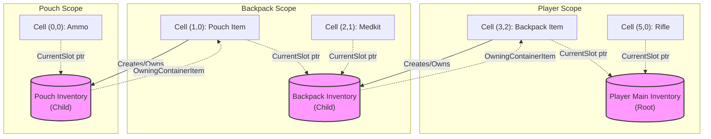
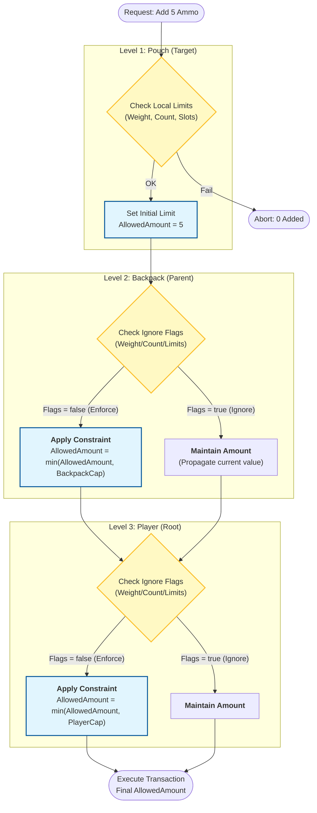

# Nested Containers

A backpack sits in slot (3,2) of the player's inventory. Inside that backpack is a pouch. Inside that pouch is ammo. When you add ammo to the pouch, the player's inventory needs to know about the weight change, three levels up.

The Tetris Inventory supports arbitrary nesting depth. Any item can become a container by adding the right fragment, and the system handles constraint propagation, ownership chains, and prediction transfer across the entire hierarchy.

***

### How Items Become Containers

An item becomes a container when its definition includes an `InventoryFragment_Container`. When that item is instantiated at runtime, the fragment creates a dedicated child `ULyraTetrisInventoryManagerComponent` with its own grid, limits, and starting items, all configured on the fragment.


The child component's configuration comes entirely from the fragment: layout dimensions, weight limits, item count limits, allowed/disallowed items, and starting items. The fragment is the blueprint; the child component is the runtime instance.

> [!INFO]
> For full setup details on configuring a container item, see [InventoryFragment_Container](../item-fragments-tetris-specific/inventoryfragment_container.md).

***

### The Ownership Chain

Every child inventory stores a replicated reference to the item that created it, its `OwningContainerItem`. This is set once at creation and never changes. The parent _inventory_ is then resolved dynamically by reading where that item currently lives:



**Upward traversal:** Starting from any child inventory, call `GetOwningContainerItem()` to get the item that _is_ this container, then read that item's `CurrentSlot` to resolve which inventory it currently lives in. Repeat until you reach an inventory with no `OwningContainerItem`, that's the root.

The key insight is that the parent chain is **always resolved dynamically** from the item's current slot, not stored as an explicit pointer. When a backpack moves from one inventory to another, no ownership update is needed, the item's slot reference already points to its new location, and `GetParentInventoryFromOwner()` resolves correctly from that.

#### Key Functions for Traversal

| Function                        | Returns                                       | Use Case                                           |
| ------------------------------- | --------------------------------------------- | -------------------------------------------------- |
| `GetOwningContainerItem()`      | The item instance that spawned this inventory | Finding which item "is" this container             |
| `GetParentInventoryFromOwner()` | The inventory containing the owning item      | Walking one level up the chain                     |
| `GetBaseInventory()`            | The root inventory (no owning item)           | Finding the player's main inventory from any depth |

`GetBaseInventory()` walks up the chain by repeatedly calling `GetParentInventoryFromOwner()` until it reaches an inventory with no `OwningContainerItem`, that's the root. This is useful for permission checks that need to reach the player controller, or for UI that needs to identify which player owns a deeply nested item.

#### Circular Reference Prevention

Before placing a container item into another inventory, the system checks whether doing so would create a circular reference, a backpack inside itself, or a pouch inside a bag that's inside the pouch.

```cpp
// Checks if TargetInventory exists anywhere in this inventory's parent chain
bool IsInParentInventory(ULyraTetrisInventoryManagerComponent* TargetInventory);
```

This traverses upward from the destination inventory and returns `true` if the source inventory appears anywhere in the chain. The transaction system calls this automatically to prevent impossible configurations.

***

### Constraint Propagation

When adding items to a child inventory, limits cascade upward through the hierarchy. A backpack inside a player inventory must respect both its own weight limit and the player inventory's weight limit.

#### The Cascade



Each parent level can independently opt out of specific constraint types:

| Flag                              | When `true`                                             | When `false`                               |
| --------------------------------- | ------------------------------------------------------- | ------------------------------------------ |
| `bIgnoreChildInventoryWeights`    | Child item weight does not propagate upward             | Child weight adds to parent's total weight |
| `bIgnoreChildInventoryItemCounts` | Child items do not count toward parent's item limit     | Child item count adds to parent's total    |
| `bIgnoreChildInventoryItemLimits` | Child items do not affect parent's per-item-type limits | Per-type limits cascade through parent     |

#### Propagation Stops When...

The upward walk terminates when:

* `AllowedAmount` reaches 0 (a parent rejected everything)
* The top of the hierarchy is reached (`OwningContainerItem` is null)
* Both weight and count propagation are disabled at the current level (no further information flows upward)

#### Weight and Count Updates

When items are actually added or removed, `UpdateItemCount` propagates the changes upward through the same chain. Each parent's tracked weight and item count are updated based on the same ignore flags, keeping the hierarchy consistent.

***

### GUID-Based Resolution

Container items are resolved by GUID, not by direct pointer. This design choice matters because prediction reconciliation can replace the authoritative item instance, the `ULyraInventoryItemInstance*` pointer changes when the server's version of the item arrives and replaces the predicted one.

The `OwningContainerItem` is stored as a `TWeakObjectPtr` and is replicated so clients can resolve the parent chain. The item's GUID remains stable through reconciliation, so lookup by GUID always finds the correct item even after pointer replacement.

***

### Prediction in Nested Containers

When reconciliation replaces a container item (the server's authoritative version arrives), the old item's child inventory had active prediction overlays, in-flight moves or adds that the server hasn't confirmed yet.

`TransferPredictionOverlaysFrom()` solves this. It transfers all pending predictions (adds, removes, changes) from the old child inventory's runtime to the new one:

```cpp
// Called during container reconciliation
NewChildInventory->TransferPredictionOverlaysFrom(OldChildInventory);
```

This preserves any in-flight predictions so the player doesn't see items snap back and forth. The predictions continue tracking against the new authoritative state, and reconciliation proceeds normally when the server catches up.

> [!INFO]
> The `FTransientFragmentData_Container` handles this automatically in its `ReconcileWithPredictedFragment()` callback. You only need `TransferPredictionOverlaysFrom()` if you are building custom container reconciliation logic.

***

### Lifecycle Management

Child inventories are created and destroyed automatically:



**Creation**

When a container item is instantiated, `InventoryFragment_Container::CreateNewTransientFragment` creates the child `ULyraTetrisInventoryManagerComponent` and stores it in `FTransientFragmentData_Container`.



**Placement**

When the container item enters a parent inventory, the child component's `OwningContainerItem` is set, establishing the parent-child link.



**Movement**

When the container item moves between inventories, no ownership update is needed. The `OwningContainerItem` stays the same, the item's `CurrentSlot` updates to reflect its new location, and parent traversal resolves dynamically from there.



**Destruction**

When the container item is destroyed, the child inventory and all its contents are destroyed through the `UGlobalInventoryManager`, cascading downward through any further nesting.


