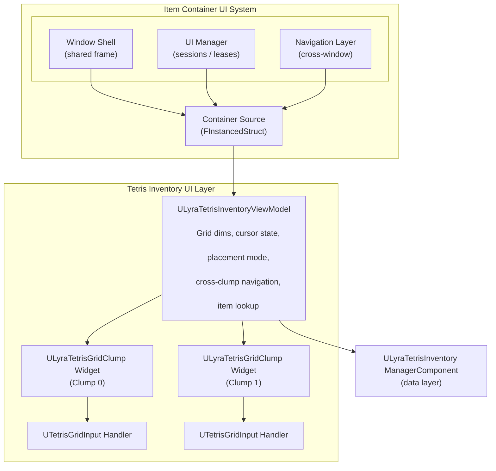
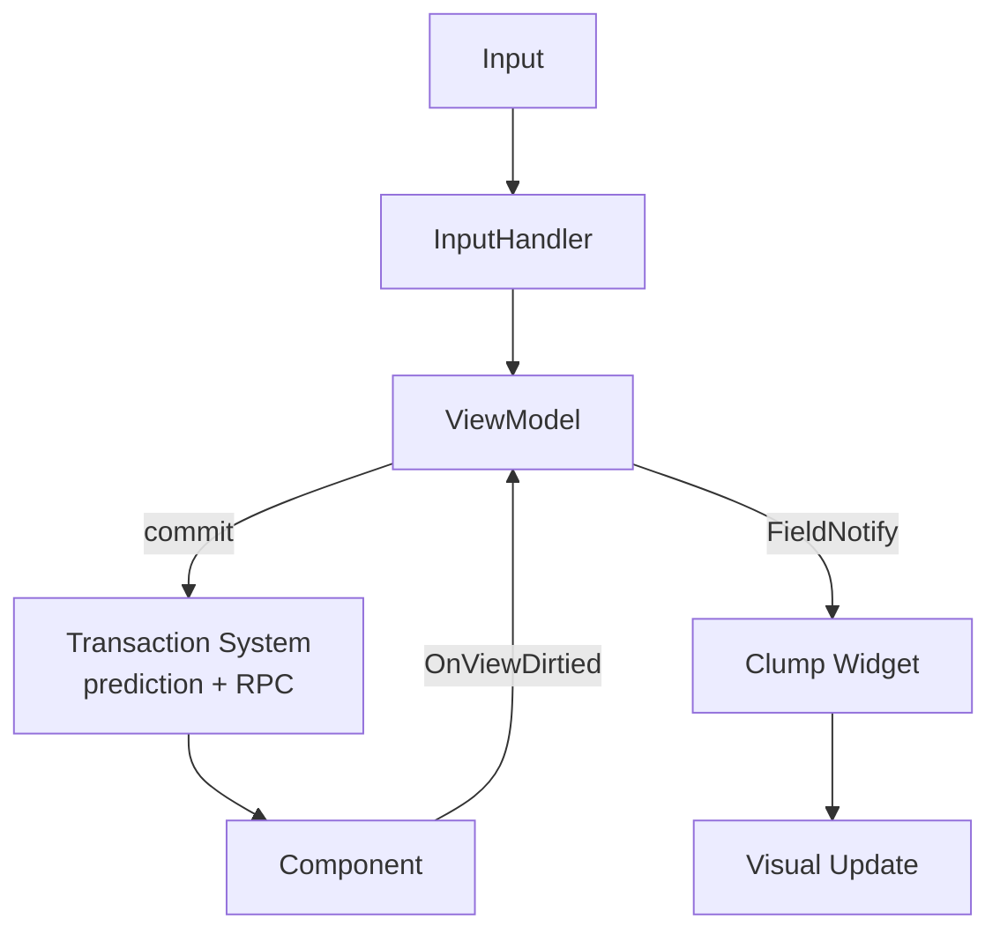

# Tetris Inventory UI

You have a grid of cells, items with irregular shapes, a cursor that needs to hop between separate grid sections, and a placement preview that shows whether a rotated L-shaped item will actually fit. All of this needs to feel responsive under prediction, update reactively when the server confirms, and work seamlessly with both gamepad and mouse. How do you build a UI layer for that?

The Tetris Inventory UI layer sits between the raw data (the `ULyraTetrisInventoryManagerComponent` and its dual-data architecture) and the pixels on screen. It transforms grid state into bindable ViewModel properties, renders individual grid sections through clump widgets, and processes input through a dedicated handler -- all while plugging cleanly into the shared [Item Container UI System](/broken/pages/12c32adebf963fc77fe62c5168ffed1f804ac52b).

***

### Where It Fits

***

### The Data Flow

The relationship follows a clean downward data flow:

1. **ViewModel** (`ULyraTetrisInventoryViewModel`) subscribes to the `ULyraTetrisInventoryManagerComponent` and transforms raw grid data into FieldNotify-bindable properties. It owns all navigation state (cursor position, held item, placement mode) and manages cross-clump navigation logic.
2. **Clump Widget** (`ULyraTetrisGridClumpWidget`) renders a single rectangular grid section. It reads from the ViewModel for its assigned clump and fires BlueprintNativeEvent callbacks when the grid rebuilds, the cursor moves, or placement validity changes.
3. **Input Handler** (`UTetrisGridInputHandler`) translates D-pad presses, analog stick movement, and action buttons into ViewModel operations, cursor movement, item pickup, rotation, and confirm/cancel.

***

### Plugging Into the Item Container UI System

The Tetris UI layer does not exist in isolation. It participates in the shared [Item Container UI System](../../../base-lyra-modified/ui/item-container-ui-system/) through two key integration points:

#### Container Sources

When the UI Manager opens a Tetris inventory window, it passes a [Container Source](../../../base-lyra-modified/ui/item-container-ui-system/core-architecture-and-data-structures/polymorphic-container-sources.md) (wrapped in `FInstancedStruct`) that identifies which Tetris inventory to display. The source's `CreateViewModel()` factory produces a `ULyraTetrisInventoryViewModel`, which the Window Shell delivers to the content widget via `SetContainerSource()`.

#### Window Content Interface

`ULyraTetrisGridClumpWidget` implements [`ILyraItemContainerWindowContentInterface`](../../../base-lyra-modified/ui/item-container-ui-system/the-windowing-system/the-window-content-interface.md). This means each clump widget can:

* Report its cursor's screen position for [cross-window navigation](../../../base-lyra-modified/ui/item-container-ui-system/geometric-navigation/cross-window-navigation.md)
* Receive navigation entries when a player moves from another window into this grid
* Provide focusable content for the Shell's focus management

This is what allows a player to press "right" on their backpack grid and have the cursor seamlessly jump into an adjacent equipment panel or loot window, the shared navigation layer handles the geometry, and the clump widget handles the entry.

***

### Structure of This Section

> [!INFO]
> Each subpage focuses on one layer of the Tetris UI stack. Read them top-to-bottom for the full picture, or jump to the specific layer you need.

1. [**Tetris ViewModel**](tetris-view-model.md) - `ULyraTetrisInventoryViewModel` and `ULyraTetrisItemViewModel`. Grid properties, cursor navigation, placement modes, cross-clump navigation, and GUID-based child container resolution.
2. [**Tetris Grid Clump Widget**](tetris-grid-clump.md) - `ULyraTetrisGridClumpWidget`. Single-section rendering, BlueprintNativeEvent callbacks, and implementing custom grid visuals.
3. [**Tetris Grid Input Handler**](tetris-grid-input-handler.md) - `UTetrisGridInputHandler`. D-pad navigation, analog stick handling, action mapping, and input customization.
