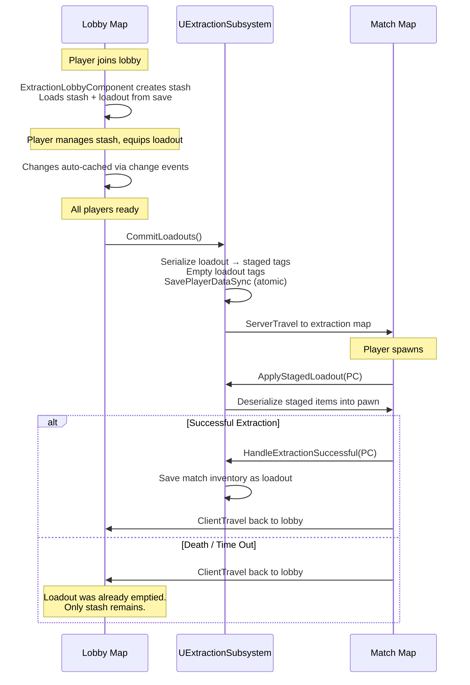

# Extraction

> [!INFO]
> **Plugin:** `Plugins/GameFeatures/Extraction/`\
> **Dependencies:** ShooterBase, TetrisInventory, GameplayMaps

A high-stakes raid-and-extract mode. Players keep a persistent stash between sessions, bring a chosen loadout into a match, scavenge for loot, and must physically reach an extraction zone to keep everything they are carrying. Dying drops the loadout, leaves a lootable body, and ends the run for that player. The mode spans two maps, a lobby where the stash and loadout are managed and a match map where the raid happens, and a game-instance subsystem carries player data across the travel between them.

***

## How it plays

In the lobby map each player has a stash, a persistent grid inventory loaded from disk, and a loadout, the items and equipment they will take into the next raid. Players move gear between stash and loadout, then ready up. When everyone is ready their loadouts are committed to disk and the party travels to a match map.

In the match each player spawns with the loadout they committed and raids: scavenging loot, fighting other players, and looting the bodies of the fallen. Their only goal is to reach an extraction zone and hold it. Standing in a zone starts an extraction timer; surviving it extracts the player, whose entire current inventory becomes their new loadout, saved back to the stash side of their save. Dying instead drops the run, the player's body becomes lootable and they are removed from the match a few seconds later. If the match clock runs out, every remaining player is treated as a failed extraction. The loss is real because the loadout was already emptied on disk when it was committed, so anything not extracted is gone.

***

## Match flow



In the match map the round is driven by `B_Scoring_Extraction`, a Blueprint child of the C++ `UShooterScoring_Base` on the game state. On the server it waits for the experience, starts the playing phase, and applies each player's staged loadout to their pawn. When the playing phase starts it arms the extraction time limit as a one-second countdown; when that countdown reaches zero every remaining player is failed and the match enters post-game.

<details class="gb-toggle">

<summary>Verified match-map phase chain</summary>

`B_Scoring_Extraction` event flow, read from the Blueprint graph:

* **BeginPlay (authority)** waits for the experience, binds `PlayPhaseStarted` to `ShooterGame.GamePhase.Playing.Neutral`, starts `Phase_Playing`, and calls `SetupPlayersLoadouts`.
* **SetupPlayersLoadouts** iterates the player array and calls `ApplyLoadoutToPlayer` for each spawned pawn (binding to `OnPawnSet` for any not yet spawned). `ApplyLoadoutToPlayer` calls `UExtractionSubsystem::ApplyStagedLoadout`, which deserializes the committed loadout into the pawn.
* **PlayPhaseStarted** sets `CountDownTime` to `ExtractionTimeLimit` and starts the one-second `CountDown` timer.
* **CountDown** decrements each tick; at zero it calls `ExtractionTimeRanOut` (which fails every remaining player) and starts `Phase_PostGame_Extraction`.
* **OnEliminationMessage** (override) resolves the eliminated player and calls `HandleFailedExtraction`.
* `HandleSuccessfulExtraction` adds the finished cue, calls `UExtractionSubsystem::HandleExtractionSuccessful` to save the player's current match inventory as their loadout, then removes the player after a five-second delay. `HandleFailedExtraction` adds the same cue and removes the player after the delay without saving.

</details>

***

## Win conditions

Extraction has no team win, each player's outcome is individual. A player succeeds by surviving an extraction timer inside a zone, which saves their current inventory as their new loadout. A player fails by dying, which drops the run and leaves a lootable body, or by being caught in the match when the clock expires. Success and failure both end that player's participation and route them back to the lobby; the difference is whether their match inventory was saved.

| Outcome   | Trigger                                     | Result                                           |
| --------- | ------------------------------------------- | ------------------------------------------------ |
| Extracted | Survived the extraction timer inside a zone | Current match inventory saved as the new loadout |
| Failed    | Eliminated during the match                 | Run dropped, body left lootable, no save         |
| Failed    | Match clock reaches zero                    | All remaining players failed, no save            |

***

## Key systems

### The extraction objective

Extraction zones are `B_BaseExtractionZone` actors (the placed variant is `B_ExtractionItemZone`). A zone is a box trigger: when a pawn overlaps it the zone checks `CanExtractPlayer` and, if allowed, sends the pawn an `Ability.Extraction.StartExtration` gameplay event carrying the zone's extraction time; leaving the box sends a `StopExtraction` event. The event activates `GA_Extraction` on the player, which starts a timer for the zone's duration and shows an on-screen extraction status. If the player takes damage during the timer the ability resets it, so the player must hold the zone unharmed for the full duration. When the timer completes the ability tells the scoring component the extraction succeeded and ends.

<details class="gb-toggle">

<summary>Verified extraction objective</summary>

From `B_BaseExtractionZone` and `GA_Extraction`, read from the Blueprint graphs:

* `HandlePlayerOverlapBegin` casts the overlapping actor to a pawn, calls `CanExtractPlayer` (the base returns true; override it to gate extraction), and on success sends `Ability.Extraction.StartExtration` to the pawn with the zone's `ExtractionTime`. `HandlePlayerOverlapEnd` sends `Ability.Extraction.StopExtraction`.
* The base zone's `ExtractionTime` defaults to 0; the placed `B_ExtractionItemZone` sets it to 5 seconds.
* `GA_Extraction` (activated from the event) reads the extraction time, registers the `W_ExtractionStatus` widget into the `HUD.Slot.LowerModeStatus` slot, and starts a timer. It binds to the health component, and `HealthChanged` calls `ResetExtraction` (clearing and restarting the timer) whenever health drops. On `FinishExtraction` it calls `B_Scoring_Extraction::HandleSuccessfulExtraction` on the server and ends. A `StopExtraction` event (from leaving the zone) clears the timer and ends the ability.

</details>

### Stash, loadout, and the save flow

Persistence is orchestrated by `UExtractionSubsystem`, a game-instance subsystem that survives the travel between lobby and match. It does not implement its own serialization; it uses the generic [Save System](../../base-lyra-modified/save-system/), reading and writing inventory and equipment under six gameplay tags. The split into stash, loadout, and staged tags is what makes "death equals loss" enforceable: committing a loadout writes it to the staged tags and empties the loadout tags in a single synchronous save, so the on-disk loadout is gone the instant a player travels into a match, and only a successful extraction writes a new one back.

In the lobby, `UExtractionLobbyComponent` (a game-state component) creates and destroys a stash inventory per player on login and logout, loads and saves loadouts, and runs the ready-up system. Stash access points in the world use `UExtractionStashComponent`, placed on NPCs or terminals; it resolves the player's stash from the lobby component and auto-saves when the stash window is closed.

<details class="gb-toggle">

<summary>Verified save flow</summary>

From `ExtractionSubsystem.h`, `ExtractionLobbyComponent.h`, and `ExtractionStashComponent.h`:

* `LoadStash` / `SaveStash` load and persist the stash in the lobby. `CommitLoadouts` serializes every player's loadout to the staged tags, empties the loadout tags, and saves synchronously before travel. `ApplyStagedLoadout` deserializes the staged items into the pawn after it spawns. `HandleExtractionSuccessful` saves the player's current match inventory and equipment as their loadout. `TravelPlayerToMap` and `TravelPartyToExtractionMap` handle the map transitions (the party travel can pick randomly from a pool of maps).
* `UExtractionLobbyComponent` creates a `ULyraTetrisInventoryManagerComponent` stash on login (server-side so it replicates) and destroys it on logout. Its ready system (`ReadyUp` / `Unready` / `AreAllPlayersReady`) fires `OnAllPlayersReady`, and `SetCommitted` guards against a logout overwriting staged data. `HandlePreLoadMap` persists each loadout while the equipment and inventory components still exist, before travel tears the pawns down.
* `UExtractionStashComponent::SetWindowSession` binds a stash UI window so `HandleSessionClosed` auto-saves the stash when the player closes it.

</details>

The six save tags:

| Tag                               | Contents                                      | Lifecycle                                      |
| --------------------------------- | --------------------------------------------- | ---------------------------------------------- |
| `Save.ExtractionStashInventory`   | Player's stash inventory (persistent storage) | Persists across all sessions                   |
| `Save.ExtractionStashEquipment`   | Player's stash equipment                      | Persists across all sessions                   |
| `Save.ExtractionLoadoutInventory` | Items the player is bringing into a match     | Populated in lobby, emptied on commit          |
| `Save.ExtractionLoadoutEquipment` | Equipment the player is bringing into a match | Populated in lobby, emptied on commit          |
| `Save.ExtractionStagedInventory`  | Committed loadout inventory (in-transit)      | Written before travel, consumed on match spawn |
| `Save.ExtractionStagedEquipment`  | Committed loadout equipment (in-transit)      | Written before travel, consumed on match spawn |

The staged tags exist to survive map travel. `CommitLoadouts` writes the loadout to staged tags and empties the loadout tags atomically with a synchronous save. If the player crashes mid-match, the save on disk has the stash intact and an empty loadout, the staged items are lost, which is the intended behavior (death = loss).

#### Players can be looted after death

Death in Extraction does not destroy the pawn or hide its gear, because a dead player becomes a loot source for everyone else. The custom death ability ragdolls the player, keeps their equipment visible, gives the body a Tetris inventory and a proximity collision so nearby players get read-only access, and registers an interaction so a player can open the body's inventory for full access.

* Allowing the character mesh to be overlap with the interaction trace when dead, this means interactions are only possible when dead
* Override the death start functions, so the player ragdolls and the equipment of the player isn't hidden. This also handles setting up the looting inventory.
* Give the dead player an Tetris Inventory Component at the time of death, and a sphere collision so that players can get read only access when near by (full access is provided by opening the dead player inventory in the `GA_Interact_LootDeadPlayer` ability).
* Setup the interaction options to make the player open an inventory
* The `Extraction_Hero`, has a custom death ability, this is not a child of the default Lyra Death ability that comes with Lyra. This is so that `death_finish` isn't called when the ability ends. In extraction there is no concept of finish dying because once a player dies they leave the game mode, and as for the dead pawn, we don't want it to get destroyed since it might be looted.

***

## Configuration

The match rule is a property on the `B_Scoring_Extraction` component, and the extraction duration is a property on each zone:

| Property              | Location               | Default                               | Meaning                                                                                |
| --------------------- | ---------------------- | ------------------------------------- | -------------------------------------------------------------------------------------- |
| `ExtractionTimeLimit` | `B_Scoring_Extraction` | 1200                                  | Match length in seconds (twenty minutes); all remaining players fail at zero           |
| `CountDownTime`       | `B_Scoring_Extraction` | 15                                    | Working countdown value, overwritten with the time limit when the playing phase starts |
| `ExtractionTime`      | `B_BaseExtractionZone` | 0 (base) / 5 (`B_ExtractionItemZone`) | Seconds a player must hold the zone unharmed to extract                                |

The lobby's stash inventory class is set on `UExtractionLobbyComponent`, and the loot tables come from `DA_CommonItems_Extraction` and `DA_CommonItems_ExtractionLobby` under `Game/ItemSpawning/`. Ground loot in the extraction map and lobby is scattered by `B_ItemZoneSpawner`, the zone spawner from TetrisInventory: each placed spawner defines a circular or rectangular spline area, picks a number of random points spread evenly across it, rolls a rarity-weighted item per point from its spawn config, and drops each as a world collectable. A player then collects it through the shared pickup system: the collectable's `UPickupInteractionProfile` grants a `ULyraGameplayAbility_FromPickup` whose routing policy decides whether a collected item is held, stored, or auto-equipped. The dead-player loot containers described above are the same pickup system applied to a body rather than a spawner.

> [!WARNING]
> ### Dedicated server testing requires a real online subsystem.
> 
> On a dedicated server, player saves are keyed by platform ID (`PlayerState->GetUniqueId()`). In PIE without Steam, EOS, or another online subsystem configured, this ID changes every session, so stash and loadout data won't persist between PIE sessions when testing as a client. Use standalone networking mode for persistence testing, or configure an online subsystem for dedicated server testing.

> [!WARNING]
> ### PIE client mode generates orphaned save files.
> 
> Because the platform ID changes each PIE session, every run in dedicated server client mode creates a new save file in `Saved/SaveGames/` with a unique alphanumeric suffix (e.g., `PlayerSaveGame_Jeff-0C9B411E4C430A560F19EE98E09267E0.sav`). These files accumulate and are never reused. The base `PlayerSaveGame.sav` from standalone mode is fine to keep, only delete the ones with platform ID suffixes.

> [!INFO]
> ### Production note:
> 
> The default implementation saves to the server's local disk, which is sufficient for development and single-server deployments. For a scalable production game with multiple server instances, player data should be persisted to a database via a backend service instead. See [Replacing the Storage Backend](../../base-lyra-modified/save-system/extending-the-save-system.md#replacing-the-storage-backend) for guidance on swapping the storage layer.

***

## Content structure

```
Content/
├── Accolades/
├── Bot/
├── Experiences/
│   ├── Lobby/
│   └── Solo/
│       └── Phases/
├── Game/
│   ├── Death/
│   ├── Extraction/
│   └── ItemSpawning/
├── GameplayCues/
├── Hero/
├── Items/
├── Maps/
├── System/
│   └── Playlists/
└── UserInterface/
```

The scoring component and lobby component sit under `Game/`; the extraction zones and the `GA_Extraction` ability under `Game/Extraction/`; the custom death ability and body-looting interaction under `Game/Death/`; the stash, ready-up, and stash-interaction abilities under `Game/Lobby/`; and the lobby and solo experiences (with the match's post-game phase) under `Experiences/`.

***

## C++ classes

The extraction plugin includes three C++ classes that orchestrate the stash, loadout, and match flow:

| Class                       | Type                     | Role                                                                                                                                                        |
| --------------------------- | ------------------------ | ----------------------------------------------------------------------------------------------------------------------------------------------------------- |
| `UExtractionSubsystem`      | `UGameInstanceSubsystem` | Save orchestration: commits loadouts before match travel, applies staged items on spawn, saves loot on successful extraction. Handles map travel            |
| `UExtractionLobbyComponent` | `UGameStateComponent`    | Per-player stash management: creates/destroys stash inventories on player login/logout, loads and saves loadouts, manages the ready-up system               |
| `UExtractionStashComponent` | `UActorComponent`        | Stash access point: placed on world actors (NPCs, terminals). Resolves the player's stash from the lobby component and auto-saves when the UI window closes |

These classes use the generic [Save System](../../base-lyra-modified/save-system/) for all persistence, they don't implement their own serialization.

***

## Extending

* **New extraction objectives** (a held terminal, a multi-stage capture, a vehicle) are built by subclassing `B_BaseExtractionZone` and overriding `CanExtractPlayer` to gate who may extract, or by changing what the start event triggers; the zone already drives the player ability through gameplay events.
* **Extraction interrupts** live in `GA_Extraction`. The default resets the timer on any damage; changing it to cancel instead, or to ignore chip damage, is done in that ability rather than the zone or scoring component.
* **Persistence backends** are swapped at the save-system layer, not in the extraction classes, which only read and write tagged inventory and equipment. See the save system's [storage backend guidance](../../base-lyra-modified/save-system/extending-the-save-system.md).
