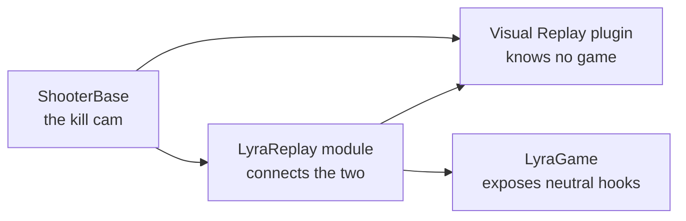

# Integrating a Game

Visual Replay knows nothing about any particular game. It records meshes and replicated properties on its own and gives a game hooks for everything else: moments only the game knows how to replay, state its actors keep outside properties, and live systems that must not mistake a stand-in for the real thing. This page lists those hooks by what a game wants to do, then walks through **LyraReplay**, the integration this framework ships for Lyra, as a worked example.

***

## What a Game Can Hook Into

| I want to… | Hook | Covered in |
| --- | --- | --- |
| Record at all, and line recordings up across machines | `AddRecordingRequest` and `SetClock` on the recorder | [Recording](recording.md) |
| Replay a moment my code produces, such as a cue or an impact | `RecordEvent`, `RegisterEventPlayer` and `RemapToStandIns` | [Events and Cosmetics](events-and-cosmetics.md) |
| Have replays hide the live effects my code spawned | `BeginCosmeticCapture`, `EndCosmeticCapture` and `RecordCosmetics` | [Events and Cosmetics](events-and-cosmetics.md) |
| Give shells my fast arrays' callbacks | `VisualReplay::RegisterFastArray` | [Recording](recording.md) |
| Let replays borrow actors my code keeps for reuse | `VisualReplay::RegisterActorPool` | [Events and Cosmetics](events-and-cosmetics.md#pooled-actors) |
| Keep a struct type out of recordings | `FVisualReplayStateRecorder::AddExcludedPropertyStruct` | [Recording](recording.md) |
| Keep a class out of every replay | `FVisualReplayStateRecorder::AddGloballyExcludedClass` | [Recording](recording.md) |
| Record state my actors keep outside properties | `FVisualReplayStateRecorder::RegisterStateExtra` | [Recording](recording.md) |
| Set up every session the same way, including test replays | `UVisualReplaySession::ConfigureDefaultOptions` | below |
| Adjust shells of my classes as they come up | `UVisualReplayShellSet::OnShellSpawned` | [Puppets and Shells](puppets-and-shells.md) |
| Run something after every replay update | `OnTimeApplied` in the session options | [Sessions](sessions.md) |
| Hide live HUD elements of replayed actors | `UVisualReplaySession::IsReplacedByStandIn` | below |
| Stop live systems reacting to stand-ins | `IsStandIn`, `IsReplayActor`, the sandbox scope | [Writing Replay-Friendly Gameplay Code](replay-friendly-gameplay-code.md) |

***

## Who Depends on Whom



LyraGame never links Visual Replay. Where Lyra code needs to take part in replays, it exposes a plain hook, a delegate or a static callback, and doesn't say who uses it:

* `ULyraGameplayCueManager::OnGameplayCueHandling` and `OnGameplayCueHandled`, around every cue the game runs;
* `ULyraContextEffectsSubsystem::OnContextEffectsSpawned`, after context effects such as footsteps spawn;
* `FIndicatorProjection::OwnerFilter`, which decides whether an indicator is drawn;
* `UAsyncAction_ObserveViewerTeam::FollowsViewerChanges`, which decides whether an observer reports a viewer change now or holds it back, and `CatchUpHeldViewerChanges`, which brings held back observers up to date;
* `ULyraInventoryItemInstance::IsStandIn`, which an item asks before registering itself;
* `ULyraNumberPopComponent::ShouldShowNumberPops`, which damage numbers ask before showing;
* `UGameplayMessageSubsystem::BroadcastFilter`, which every gameplay message passes through.

LyraReplay links both sides and binds those hooks to Visual Replay. None of it is shooter-specific, so any Lyra experience can use replays without ShooterBase. ShooterBase then builds the kill cam on top of both.

***

## What LyraReplay Installs

The module installs everything at startup. Its install function reads as a list of what a Lyra game needs from Visual Replay, so here it is, shortened:

```cpp
void Install()
{
    // Shells apply recorded state to these lists the way replication does, so their callbacks keep equipment,
    // inventory, attachments, cosmetics, tag counts and access rights in step on the shell.
    VisualReplay::RegisterFastArray<FLyraEquipmentList, FLyraAppliedEquipmentEntry>();
    VisualReplay::RegisterFastArray<FLyraInventoryList, FLyraInventoryEntry>();
    // ... attachments, character parts, tag stacks, tag attributes, access rights and permissions

    // A stand-in never takes on an ability system's own bookkeeping.
    FVisualReplayStateRecorder::AddExcludedPropertyStruct(FGameplayAbilitySpecContainer::StaticStruct());
    FVisualReplayStateRecorder::AddExcludedPropertyStruct(FActiveGameplayEffectsContainer::StaticStruct());
    // ... active cues and prediction keys

    // What the ability system owns instead comes across as the tags it held, whatever granted them.
    FVisualReplayStateRecorder::RegisterStateExtra(OwnedTagsExtra, MoveTemp(OwnedTags));

    // Lyra's neutral hooks, bound to the replay.
    ULyraGameplayCueManager::OnGameplayCueHandled.AddStatic(&RecordGameplayCue);
    ULyraContextEffectsSubsystem::OnContextEffectsSpawned.AddStatic(&RecordContextEffects);
    FIndicatorProjection::OwnerFilter.BindStatic(&ShouldDrawIndicatorFor);
    UAsyncAction_ObserveViewerTeam::FollowsViewerChanges.BindStatic(&FollowsViewerChanges);
    ULyraInventoryItemInstance::IsStandIn.BindStatic(/* UVisualReplayShellSet::IsStandIn */);
    ULyraNumberPopComponent::ShouldShowNumberPops.BindStatic(/* !UVisualReplayPlayback::IsPlayingLeadIn() */);
    UVisualReplaySession::ConfigureDefaultOptions.BindStatic(&ConfigureSessionOptions);

    UVisualReplayPlayback::RegisterEventPlayer(GameplayCueChannel, &PlayGameplayCue);
    UVisualReplayPlayback::RegisterEventPlayer(ContextEffectChannel, &PlayContextEffect);
}
```

Each line answers a question a Lyra game raises.

### Equipment, inventory and cosmetics on shells

Lyra keeps equipment, inventory, attachments, character parts, tag stacks and item permissions in fast arrays, whose item callbacks do real work: equipping a weapon, attaching a cosmetic part. Registering each list type makes those callbacks fire on shells, so a replayed character carries the weapon and the parts it had.

### Abilities, effects and tags

An ability system's granted abilities and active effects are left out of recordings. On a shell they would try to run, active cues already replay as cue events, and prediction keys mean nothing outside the live connection. What a shell's ability system needs is the tags it held, so a **state extra** records the owned tags and applies them to the shell's ability system as loose tags. Visuals that key off tags therefore work in replays, while anything that needs a running ability or effect doesn't.

### Gameplay cues and context effects

Cues are recorded around the moment the cue manager handles them, with a cosmetic capture open so the live effects they spawn can be hidden during a replay. They are replayed by calling the cue manager directly on the target's stand-in, never through an ability system, which on a listen server would multicast to every client. Before playing, a cue's parameters are remapped: the component an effect attaches to becomes the mirror drawing that component, which shares its skeleton and sockets, and the effect context and hit result are copied and pointed at stand-ins.

The cue manager keeps the actors of cues it recycles, so LyraReplay registers them as an actor pool, and a replay hands back any it took rather than destroying one the manager still lists.

Context effects, such as footsteps, are recorded as the actual sounds and Niagara systems that played, because the effect libraries that chose them belong to the live actor. They replay attached to the mirror of the part they played on.

### Indicators

A live actor's indicator is hidden while a replay stands in for it, so only its shell's indicator shows, and that one shows the past. This is what keeps an objective marker from appearing twice in a kill cam, once for the live objective and once for its shell. An indicator is hidden too while a replay hides its live actor without standing in for it, as it does a player who respawned after the window opened, so no nameplate floats where nothing is drawn.

### Viewer Changes

A kill cam makes the killer the viewer, so everything that colours by the viewer recolours, the replay's characters for the killer's side. A live character the replay hides would recolour too though no one sees it, so it holds the change back, and catches up when the replay ends only if the view it returns to is really different. After a kill cam that hands the player's own view back, it usually isn't, and the live characters never recolour at all.

### Items

A stand-in item instance must not register itself with the item registry or announce its destruction, or a live lookup could find the stand-in. Items ask the `IsStandIn` hook first, and LyraReplay answers it with `UVisualReplayShellSet::IsStandIn`.

### Damage numbers

Hits repeated during the [lead-in](events-and-cosmetics.md#the-lead-in) happened before the window, so they pop no numbers.

### Every session's options

`ConfigureDefaultOptions` gives LyraReplay a say in every session, including test replays started from the console. It adds an `OnTimeApplied` step that gives each pawn stand-in's player state the view rotation its recorded pawn had at that moment. A remote pawn's view reaches a client through its player state's replicated view rotation, which is what cameras and animation read for a pawn that isn't locally controlled, so a stand-in's view travels the same way. A game can still supply a more exact view through the session, as the kill cam does with the killer's own aim.

***

## Keeping Shells' Messages Out of the Live Game

Shells run their own code, and Lyra code often broadcasts gameplay messages: eliminations, objective changes, UI updates. A shell's broadcast would reach live listeners as if it had happened now. LyraReplay therefore also binds `UGameplayMessageSubsystem::BroadcastFilter`, a hook added to the Gameplay Message Router plugin for this purpose. While the sandbox scope is open, a broadcast is delivered only if its channel has been allowed. Any filter bound before LyraReplay's still runs.

A system whose replay presentation needs to hear a channel allows it once, by name, so it can do so before its tags load:

```cpp
LyraReplayMessageFilter::AllowChannel(TEXT("ShooterGame.KillCam"));
```

The channel and every channel under it get through. ShooterBase allows its kill cam channel this way, so the kill cam's own messages still reach its UI while a replay runs.

***

## Wiring the Module In

LyraReplay is a runtime module in `Source/LyraReplay`. It is listed in the project file and in `ExtraModuleNames` of the Game, Client, Server and Editor targets. It depends on `LyraGame` and `VisualReplayRuntime`, and its startup installs the message filter and then the support above; shutdown removes both in reverse. A project that renames or replaces LyraGame keeps the same shape: one module that links the game and Visual Replay and installs the game's hooks.
