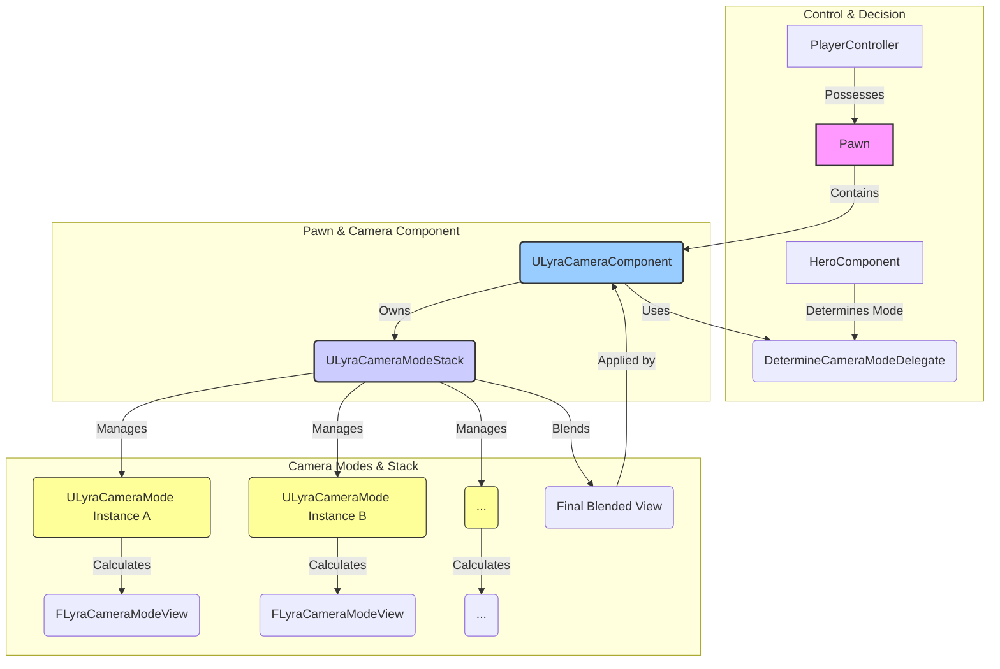

# Camera

The Camera System provides a flexible and powerful way to manage the player's viewpoint within the game world. Built upon principles found in Lyra Starter Game, it allows for dynamic camera behaviors, smooth transitions between different perspectives (like third-person and aiming views), and robust handling of common camera challenges like environmental penetration.

The goal is to provide a modular and extensible system where different camera behaviors can be defined independently and blended together seamlessly based on gameplay context.

### Core Concepts

Understanding these fundamental ideas is key to working with the camera system:

1. **Camera Modes (`ULyraCameraMode`):**
   * These are UObject classes that encapsulate a specific camera behavior. Each mode defines how the camera should calculate its desired position, rotation, and field of view (FOV) based on the target actor (usually the player pawn) and potentially other game states.
   * Examples could include a standard third-person follow camera, an aiming-down-sights (ADS) camera, a spectator camera, or a fixed cinematic camera.
   * Each mode also defines how it should blend in and out (`BlendTime`, `BlendFunction`, `BlendExponent`).
2. **Camera Mode Stack (`ULyraCameraModeStack`):**
   * This is the heart of the system, managed by the `ULyraCameraComponent`. It maintains an ordered list (stack) of active `ULyraCameraMode` instances.
   * The stack determines the final camera view by blending the outputs of the active modes based on their individual blend weights. Modes higher on the stack (added more recently) have priority.
   * The stack handles the instantiation, activation, deactivation, and updating of camera modes.
3. **Blending:**
   * The system uses weighted blending to transition smoothly between camera modes or combine their effects.
   * When a new mode is pushed onto the stack, it typically starts with a low blend weight and interpolates up to 1.0 over its `BlendTime` using a specified `BlendFunction` (Linear, EaseIn, EaseOut, EaseInOut).
   * The final camera view (`FLyraCameraModeView`) is calculated by starting with the view from the bottom-most mode (which always has a weight of 1.0) and iteratively blending in the views from modes higher up the stack according to their current blend weights.
4. **`ULyraCameraComponent`:**
   * This component, derived from UE's standard `UCameraComponent`, should be attached to the actor that owns the camera (typically the player's Pawn).
   * It owns and manages the `ULyraCameraModeStack`.
   * It uses a delegate (`DetermineCameraModeDelegate`) to query other systems (like the `ULyraHeroComponent`) for the primary camera mode that _should_ be active based on the current gameplay state (e.g., default third-person or aiming).
   * In its `GetCameraView` override, it updates the stack, evaluates the blended result, and applies the final Location, Rotation, and FOV to the underlying `UCameraComponent`.

### High-Level Interaction Diagram

**Flow:**

1. The `ULyraHeroComponent` (or another system) determines the desired primary camera mode via the `DetermineCameraModeDelegate`.
2. The `ULyraCameraComponent` receives this desired mode and pushes it onto the `ULyraCameraModeStack`. Abilities or other systems can also push temporary modes onto the stack.
3. The `ULyraCameraModeStack` updates all active modes, allowing each to calculate its ideal view (`FLyraCameraModeView`) and update its blend weight.
4. The `ULyraCameraModeStack` blends the views from all active modes, starting from the bottom and working up, respecting blend weights.
5. The `ULyraCameraComponent` takes the final blended view from the stack and applies it to itself, setting the actual camera position, rotation, and FOV used for rendering.

### Benefits

This stack-based camera system offers several advantages:

* **Modularity:** Camera behaviors are encapsulated in distinct `ULyraCameraMode` classes, making them easy to create, modify, and reuse.
* **Smooth Transitions:** Built-in blending ensures smooth visual transitions when camera modes are activated or deactivated.
* **Flexibility:** Easily layer camera effects or temporarily override the view (e.g., for cinematics, special abilities, or UI interactions) by pushing modes onto the stack.
* **Context-Awareness:** The `DetermineCameraModeDelegate` allows the primary camera mode to be driven dynamically by gameplay state.
* **Extensibility:** Create new `ULyraCameraMode` subclasses to implement virtually any camera behavior needed for your game.

### What's Next?

With this overview, you can explore the specifics of the system:

* **`ULyraCameraComponent`:** Understand the central orchestrator on the Pawn.
* **Camera Modes:** Dive into the `ULyraCameraMode` base class, the `FLyraCameraModeView` data structure, and the `ULyraCameraModeStack` manager.
* **Concrete Implementation:** See how `ULyraCameraMode_ThirdPerson` uses these concepts.
* **Player Camera Management:** Learn about the higher-level `APlayerCameraManager`.
* **Supporting Interfaces:** Discover how other actors can provide hints to the camera.

***

This page sets the stage by explaining the core concepts and the overall flow. Let me know if this captures the essence well enough before moving to the `ULyraCameraComponent` page.
