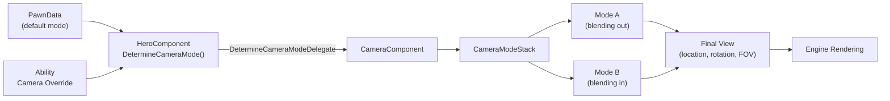
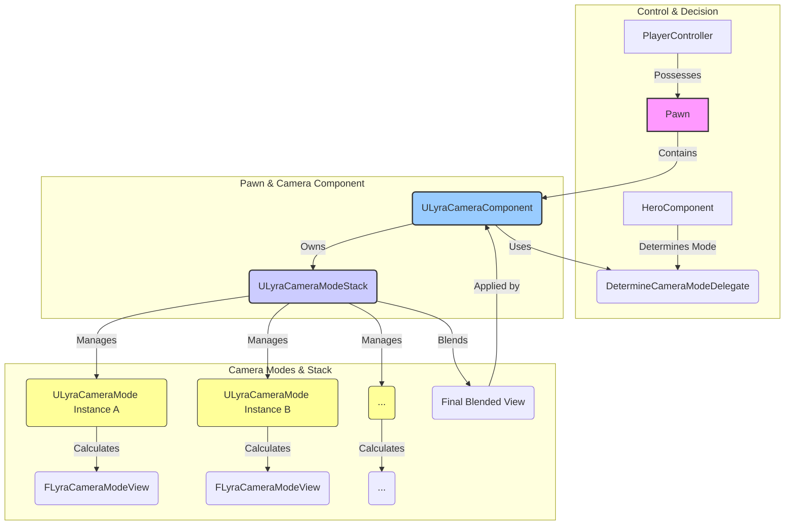

# Camera

Your character runs through a corridor, slides under cover, aims down sights, then returns to exploration. Each situation needs a different camera perspective, and the transitions between them need to feel seamless. The camera system handles this through a stack of camera modes that blend into each other.

***

## How It Works

Each frame, the camera component asks "which camera mode should be active right now?" That question is answered by a delegate, typically bound to the hero component, which checks if a gameplay ability is overriding the camera. If not, it falls back to the default mode defined in PawnData.

The active mode is pushed onto a stack. If the mode changed, the new mode blends in over time (controlled by its blend time, function, and exponent) while the old one blends out. The stack evaluates every mode's weight each frame and produces a final view, location, rotation, control rotation, and FOV, that the engine renders.




```mermaid
flowchart LR
    PawnData["PawnData\n(default mode)"] --> Hero["HeroComponent\nDetermineCameraMode()"]
    Ability["Ability\nCamera Override"] --> Hero
    Hero -- DetermineCameraModeDelegate --> Cam["CameraComponent"]
    Cam --> Stack["CameraModeStack"]
    Stack --> ModeA["Mode A\n(blending out)"]
    Stack --> ModeB["Mode B\n(blending in)"]
    ModeA --> View["Final View\n(location, rotation, FOV)"]
    ModeB --> View
    View --> Engine["Engine Rendering"]
```





```mermaid
graph TD
    subgraph "Control & Decision"
        PlayerController -- Possesses --> Pawn
        HeroComponent -- Determines Mode --> DetermineDelegate(DetermineCameraModeDelegate)
    end

    subgraph "Pawn & Camera Component"
        Pawn -- Contains --> CamComp(ULyraCameraComponent)
        CamComp -- Owns --> CamStack(ULyraCameraModeStack)
        CamComp -- Uses --> DetermineDelegate
    end

    subgraph "Camera Modes & Stack"
        CamStack -- Manages --> ModeA(ULyraCameraMode Instance A)
        CamStack -- Manages --> ModeB(ULyraCameraMode Instance B)
        CamStack -- Manages --> ModeC(...)
        ModeA -- Calculates --> ViewA(FLyraCameraModeView)
        ModeB -- Calculates --> ViewB(FLyraCameraModeView)
        ModeC -- Calculates --> ViewC(...)
        CamStack -- Blends --> FinalView(Final Blended View)
    end

    %% FinalView is outside subgraphs so it can be used globally
    FinalView -->|Applied by| CamComp

    style Pawn fill:#f9f,stroke:#333,stroke-width:2px
    style CamComp fill:#9cf,stroke:#333,stroke-width:2px
    style CamStack fill:#ccf,stroke:#333,stroke-width:2px
    style ModeA fill:#ff9,stroke:#333,stroke-width:1px
    style ModeB fill:#ff9,stroke:#333,stroke-width:1px
    style ModeC fill:#ff9,stroke:#333,stroke-width:1px

```

**Flow:**

1. The `ULyraHeroComponent` (or another system) determines the desired primary camera mode via the `DetermineCameraModeDelegate`.
2. The `ULyraCameraComponent` receives this desired mode and pushes it onto the `ULyraCameraModeStack`. Abilities or other systems can also push temporary modes onto the stack.
3. The `ULyraCameraModeStack` updates all active modes, allowing each to calculate its ideal view (`FLyraCameraModeView`) and update its blend weight.
4. The `ULyraCameraModeStack` blends the views from all active modes, starting from the bottom and working up, respecting blend weights.
5. The `ULyraCameraComponent` takes the final blended view from the stack and applies it to itself, setting the actual camera position, rotation, and FOV used for rendering.


`DetermineCameraModeDelegate`  is what determines the camera mode. Lyra uses the ULyraHeroComponent, so abilities can easily change the camera mode. The `SpectatorDataProxy` in the [Spectator System](../../core-modules/shooter-base/spectator-system/) for ShooterBase plugin is another example that uses `DetermineCamerModeDelegate`.




***

## Key Classes

| Class                         | Role                                                                                                        |
| ----------------------------- | ----------------------------------------------------------------------------------------------------------- |
| `ULyraCameraComponent`        | Attached to the pawn. Evaluates the mode stack each frame and fills the engine's view info.                 |
| `ULyraCameraMode`             | Base class for camera behaviors. Defines FOV, pitch limits, blend settings, and produces a view each frame. |
| `ULyraCameraModeStack`        | Manages active modes. Handles blending weights and removes fully blended-out modes.                         |
| `ULyraCameraMode_ThirdPerson` | Concrete mode with pitch-based offset curves, crouch handling, and collision avoidance.                     |
| `ALyraPlayerCameraManager`    | Engine-level camera manager. Sits above the component in the camera pipeline.                               |
| `ILyraCameraAssistInterface`  | Optional interface for actors to influence collision avoidance behavior.                                    |

***

## Sub-Pages

* [**Camera Modes**](camera-modes.md) — How camera modes work, the blending stack, and the view data each mode produces
* [**Third-Person Camera**](third-person-camera.md) — Pitch-based offsets, crouch handling, and the collision avoidance system
* [**Integration**](integration.md) — How abilities, PawnData, and external systems control which camera mode is active
