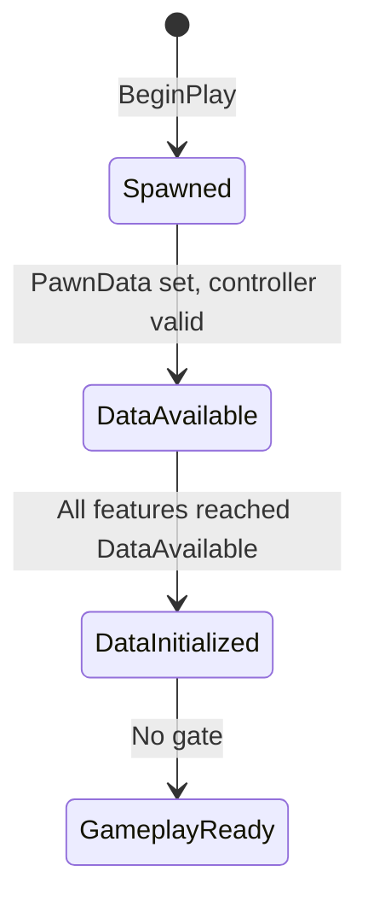

# Initialization

You press play. A pawn spawns into the world. But its PlayerState hasn't replicated yet, so there's no Ability System Component. The HeroComponent tries to bind input, but there's no ASC to bind to. The HealthComponent tries to find its attribute set, but the ASC doesn't exist yet. Everything depends on everything else, and none of it is ready at the same time.

***

## The Problem

In a networked Unreal game, the objects a character needs don't arrive in a predictable order. `BeginPlay` fires before replication delivers the PlayerState. The controller might not be assigned yet. PawnData might still be loading. If any component blindly initializes in `BeginPlay`, it will grab null pointers and crash, or silently fail and leave the character in a broken state.

## The Solution

The solution is a shared state machine. Components register themselves as named **features** and declare what they need before they can advance. A central manager (`UGameFrameworkComponentManager`) tracks every feature's current state. The system advances through phases, and each component only initializes when its dependencies are met.

This system is called the **InitState system**, and it coordinates the entire character lifecycle.

***

## State Progression

### Init States

| State               | Tag                         | In Plain Terms                                                                                                                                     | Prerequisites                                                   |
| ------------------- | --------------------------- | -------------------------------------------------------------------------------------------------------------------------------------------------- | --------------------------------------------------------------- |
| **Spawned**         | `InitState_Spawned`         | "I exist." The pawn is in the world and `BeginPlay` has run.                                                                                       | A valid Pawn.                                                   |
| **DataAvailable**   | `InitState_DataAvailable`   | "I have what I need." Each feature has independently verified that its required data is present.                                                   | Each feature validates its own requirements (see below).        |
| **DataInitialized** | `InitState_DataInitialized` | "Everyone has what they need, so I can wire things together." All features have reached DataAvailable, so cross-component setup can happen safely. | All registered features on the pawn have reached DataAvailable. |
| **GameplayReady**   | `InitState_GameplayReady`   | "Go." The pawn is fully set up and ready for gameplay.                                                                                             | No gate.                                                        |

***

## Component Participation

### `ULyraPawnExtensionComponent` — Feature: `"PawnExtension"`

**Role:** The coordinator. It drives the state machine and acts as the gatekeeper for the DataAvailable-to-DataInitialized transition.

**Problem it solves:** Someone needs to watch all the other features and decide when everyone is ready. Without a coordinator, each component would need to know about every other component.

**What it waits for at each transition:**

* **Spawned:** A valid Pawn must exist.
* **DataAvailable:** `PawnData` must be non-null. If the pawn has authority or is locally controlled, a valid `AController` is also required (because authority and autonomous proxies need a controller to function, while simulated proxies don't).
* **DataInitialized:** All registered features on the pawn must have reached DataAvailable. This is checked via `Manager->HaveAllFeaturesReachedInitState`.
* **GameplayReady:** No gate.

**What it does on state entry:** The PawnExtensionComponent itself performs no actions when entering a new state. It is purely a coordinator, other components listen for its transitions and act accordingly.

**How it coordinates:** It binds to state changes from all features (`BindOnActorInitStateChanged(NAME_None, ...)`). Whenever any feature reaches DataAvailable, it re-runs `CheckDefaultInitialization()` to see if it can now advance to DataInitialized.

### ULyraHeroComponent — Feature: `"Hero"`

**Role:** Player-specific setup. Input binding, camera mode, and ASC event registration.

**Problem it solves:** The ASC lives on the PlayerState (see [ASC Setup](/broken/pages/7f997042ae24d2dfe33ad98a92bceeef1a9f6e5e)), but binding input to abilities and setting up the camera requires the ASC, the PlayerState, the PawnData, and an InputComponent to all be present. The HeroComponent waits until all of these exist before wiring them together.

**What it waits for at each transition:**

* **Spawned:** A valid Pawn must exist.
* **DataAvailable:** A valid `ALyraPlayerState` must exist. Non-simulated-proxy pawns require a Controller that owns the PlayerState. Locally-controlled, non-bot pawns additionally require an `InputComponent` and a valid `LocalPlayer`.
* **DataInitialized:** The `ALyraPlayerState` must still be valid, and the PawnExtensionComponent must have reached DataInitialized (meaning all features have their data).
* **GameplayReady:** No gate.

**What it does when entering DataInitialized:**



#### Initializes the ASC

Gets the `ULyraAbilitySystemComponent` from the PlayerState and calls `PawnExtComp->InitializeAbilitySystem(LyraASC, LyraPS)`. This sets the pawn as the ASC's avatar actor and configures tag relationship mappings.



#### Registers a gameplay tag listener

Registers a gameplay tag listener for `Status_BlockInput` to dynamically enable/disable movement and look input bindings at runtime.



#### Binds player input

If an `InputComponent` and `ALyraPlayerController` exist, calls `InitializePlayerInput(),` which sets up Enhanced Input mapping contexts, binds ability actions to gameplay tags, and binds native actions (move, look, crouch, auto-run).



#### Binds the camera mode delegate

Binds the camera mode delegate on `ULyraCameraComponent`, so the camera system can query the HeroComponent for the active camera mode.



**How it coordinates:** It binds specifically to PawnExtensionComponent state changes. When PawnExtension reaches DataInitialized, the HeroComponent calls `CheckDefaultInitialization()` to attempt its own transition.

### Other Components

Components that don't participate directly in the InitState chain can still react to ASC availability through delegates on the PawnExtensionComponent:

* **`OnAbilitySystemInitialized_RegisterAndCall()`** — Register a delegate that fires when the ASC is initialized. If the ASC is already initialized at the time of registration, the delegate fires immediately.&#x20;
  * This is how `ALyraCharacter` connects its HealthComponent and ResourceComponents to the ASC, it registers in the constructor and the callback calls `HealthComponent->InitializeWithAbilitySystem(LyraASC)`.
* **`OnAbilitySystemUninitialized_Register()`** — Register a delegate that fires when the pawn is removed as the ASC's avatar actor.

What's IGameFrameworkInitStateInterface?

`IGameFrameworkInitStateInterface` is an Unreal interface that lets a component participate in the `UGameFrameworkComponentManager` init state system. Implementing it gives your component these responsibilities:

* **`GetFeatureName()`** — Return a unique name for this feature (e.g., `"PawnExtension"`, `"Hero"`).
* **`CanChangeInitState()`** — Return `true` if the component is ready to advance from the current state to the desired state. This is where you put your prerequisite checks.
* **`HandleChangeInitState()`** — Called after a transition succeeds. This is where you perform the actual initialization work for that phase.
* **`OnActorInitStateChanged()`** — Called when any other feature on the same actor changes state. Use this to react to dependencies becoming ready.
* **`CheckDefaultInitialization()`** — Called to attempt automatic progression through the state chain. Typically calls `ContinueInitStateChain()` with the full list of states.

The interface also provides helper methods like `RegisterInitStateFeature()`, `TryToChangeInitState()`, `BindOnActorInitStateChanged()`, and `ContinueInitStateChain()` that handle the bookkeeping of registration and state transitions.

***

## How Transitions Work

The state machine does not advance on a timer or a tick. Transitions are attempted whenever something relevant changes.

**`CheckDefaultInitialization()`** is the engine. It is called by:

* `BeginPlay` (after transitioning to Spawned)
* `SetPawnData` / `OnRep_PawnData` (PawnData just arrived)
* `HandleControllerChanged` (controller was assigned or changed)
* `HandlePlayerStateReplicated` (PlayerState just replicated to the client)
* `SetupPlayerInputComponent` (InputComponent is now ready)
* `OnActorInitStateChanged` (another feature reached DataAvailable)

Each call does two things:

1. Calls `CheckDefaultInitializationForImplementers()` to give dependent features a chance to advance first.
2. Calls `ContinueInitStateChain()` with the full state chain: `[Spawned, DataAvailable, DataInitialized, GameplayReady]`.

`ContinueInitStateChain` walks the chain from the component's current state and calls `TryToChangeInitState` for the next state. That call invokes `CanChangeInitState()` on the component. If the check passes, the manager transitions the feature and calls `HandleChangeInitState()`. If it fails, the chain stops and waits for the next trigger.

This design means initialization is fully event-driven. No polling, no tick. Each component declares its gates, and the system re-evaluates whenever conditions change.
