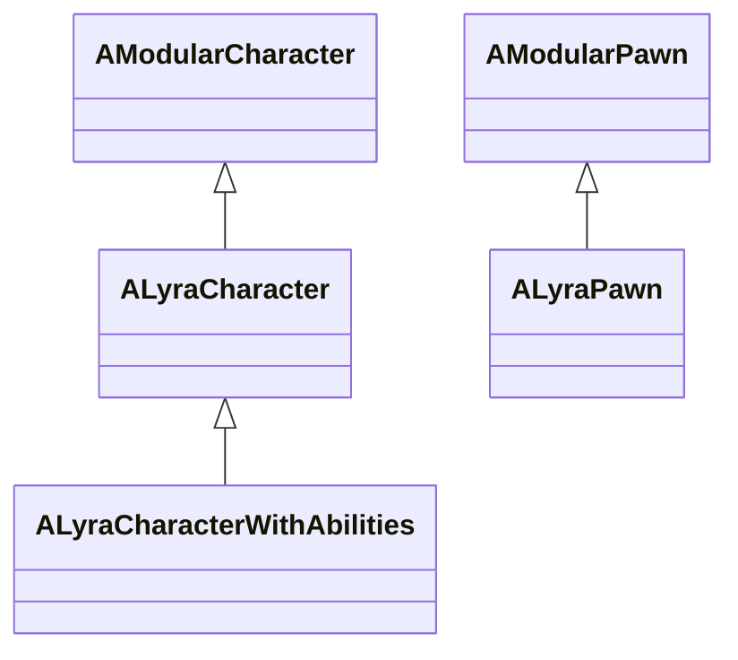

# Pawn Classes

You're setting up a new character. Maybe it's the player's avatar with full input, camera, and networking. Maybe it's a turret that needs health and abilities but no legs. Maybe it's a drone with nothing but team affiliation. Which base class do you start from?

The framework provides three pawn classes, each at a different point on the complexity spectrum. The right choice depends on two questions: does the entity need a humanoid body, and where should its Ability System Component live?

***

### Inheritance Hierarchy

`AModularCharacter` and `AModularPawn` are thin wrappers around `ACharacter` and `APawn` that add hooks for `UGameFrameworkComponentManager`, enabling Game Feature plugins to inject components at runtime.

***

### Feature Comparison

| Feature                       | `ALyraCharacter`                              | `ALyraCharacterWithAbilities`                           | `ALyraPawn`                                         |
| ----------------------------- | --------------------------------------------- | ------------------------------------------------------- | --------------------------------------------------- |
| Skeletal mesh                 | Yes                                           | Yes                                                     | No                                                  |
| Capsule collision             | Yes                                           | Yes                                                     | No                                                  |
| Character movement            | `ULyraCharacterMovementComponent`             | `ULyraCharacterMovementComponent`                       | None                                                |
| `ULyraPawnExtensionComponent` | Yes (constructor)                             | Yes (inherited)                                         | No                                                  |
| `ULyraHealthComponent`        | Yes (constructor)                             | Yes (inherited)                                         | No                                                  |
| `ULyraCameraComponent`        | Yes (constructor)                             | Yes (inherited)                                         | No                                                  |
| ASC location                  | PlayerState                                   | Self                                                    | None                                                |
| Attribute sets                | On PlayerState (`HealthSet`, `CombatSet`)     | On self (`HealthSet`, `CombatSet`)                      | None                                                |
| Team interface                | `ILyraTeamAgentInterface`                     | `ILyraTeamAgentInterface`                               | `ILyraTeamAgentInterface`                           |
| Typical use case              | Player characters, AI bots with a PlayerState | AI characters, intractable actors without a PlayerState | Non-humanoid entities (drones, intractable objects) |

***

### `ALyraCharacter`

This is your go-to for any character a player controls or that needs a full humanoid body. It comes with everything you need for a walking, jumping, crouching character that participates in the Gameplay Ability System.

#### Components created in the constructor

* **`ULyraPawnExtensionComponent`** - Coordinates ASC initialization, holds the PawnData reference, and manages the pawn extension lifecycle.
* **`ULyraHealthComponent`** - Monitors the `HealthSet` on the ASC and drives the death sequence (`OnDeathStarted` / `OnDeathFinished`).
* **`ULyraCameraComponent`** - Provides camera management, positioned at `(-300, 0, 75)` by default.
* **`ULyraCharacterMovementComponent`** - Replaces the default `UCharacterMovementComponent` via `FObjectInitializer::SetDefaultSubobjectClass`. Configured with custom gravity, acceleration, friction, and crouch settings out of the box.

#### Where does the ASC come from?

`ALyraCharacter` does not own an Ability System Component. Instead, it delegates `GetAbilitySystemComponent()` through the `ULyraPawnExtensionComponent`, which resolves the ASC from the owning PlayerState. This means the character's abilities, attributes, and gameplay effects all live on the PlayerState rather than the pawn itself.

Why? Because the PlayerState persists across respawns. When a player dies and a new pawn is spawned, the existing ASC on the PlayerState carries over, cooldowns, stacking effects, and attribute values all survive. The `ULyraPawnExtensionComponent` handles re-binding the new pawn to that existing ASC automatically.

What's a PlayerState?

In Unreal Engine, every player in a multiplayer game gets an `APlayerState`. It is created by the game mode when a player joins and persists for the entire duration of their connection, even across pawn deaths and respawns. This makes it the natural home for data that should outlive any individual pawn, like scores, team assignment, and in Lyra's case, the Ability System Component.

The PlayerState is replicated to all clients, so other players can query it for information about a given player.

#### Interfaces

`ALyraCharacter` implements several interfaces, each serving a distinct purpose:

* **`IAbilitySystemInterface`** - Allows any GAS-aware code to call `GetAbilitySystemComponent()` on the character and receive the ASC from the PlayerState.
* **`IGameplayCueInterface`** - Enables the character to receive and handle Gameplay Cues (visual/audio effects triggered by the ability system).
* **`IGameplayTagAssetInterface`** - Exposes gameplay tag queries (`HasMatchingGameplayTag`, `HasAllMatchingGameplayTags`, etc.) directly on the character.
* **`ILyraTeamAgentInterface`** - Provides team identification, allowing the character to be assigned to and queried for team membership.

***

### `ALyraPawn`

Need something lighter? `ALyraPawn` is a bare-bones pawn with nothing but team identification. No mesh, no movement component, no GAS integration. Just `ILyraTeamAgentInterface`.

This is the right starting point for entities that need to exist in the world and belong to a team, but don't need a humanoid body or abilities. Think spectator pawns, intractable objects that need team awareness, or AI controllers that operate without a physical presence.

Like `ALyraCharacter`, it inherits from a modular base class (`AModularPawn`), so Game Feature plugins can still inject components onto it at runtime.

***

### `ALyraCharacterWithAbilities`

Some actors need the full ability system but don't have a player behind them. `ALyraCharacterWithAbilities` extends `ALyraCharacter` with a self-contained ASC, so it gets everything `ALyraCharacter` has, skeletal mesh, capsule, movement, health, cameram plus its own ability system that doesn't depend on a PlayerState.

#### What it adds on top of ALyraCharacter

* **`ULyraAbilitySystemComponent`** - Created as a default subobject, replicated in `Mixed` mode. The actor's net update frequency is set to 100 Hz to keep ability state synchronized.
* **`ULyraHealthSet`** - Health attribute set, created as a default subobject so the ASC detects it during `InitializeComponent`.
* **`ULyraCombatSet`** - Combat attribute set, same pattern.

During `PostInitializeComponents`, the class calls `AbilitySystemComponent->InitAbilityActorInfo(this, this)`, setting both the owner and avatar to itself. It also overrides `GetAbilitySystemComponent()` to return its local ASC instead of delegating to the PlayerState.

Why not just use ALyraCharacter for AI?

You can, and in some cases you should. If your AI characters are managed by a player controller that has a PlayerState (for example, bots that fill player slots), `ALyraCharacter` works fine because the ASC lives on that PlayerState.

But many AI characters don't have a PlayerState at all. They are spawned by the game mode, controlled by an AI controller, and destroyed when they die. For these actors, there is no PlayerState to host the ASC. `ALyraCharacterWithAbilities` solves this by putting the ASC directly on the pawn. The tradeoff is that ability state dies with the pawn, there is no persistence across respawns.\
\
In shooter game modes where AI are suppose to represent players like team deathmatch or capture the flag, the AI is `ALyraCharacter`. But for a game mode like extraction or zombies where they don't represent players then `ALyraCharacterWithAbilities` would be better suited.

***

### ASC Ownership

Where the Ability System Component lives determines whether ability state survives pawn death. This is the single most important architectural decision when choosing a pawn class.

| ASC location    | Lifetime                                                                   | Survives respawn?           | Used by                       |
| --------------- | -------------------------------------------------------------------------- | --------------------------- | ----------------------------- |
| **PlayerState** | Tied to the PlayerState, which persists for the player's entire connection | Yes                         | `ALyraCharacter`              |
| **Self (pawn)** | Tied to the pawn actor                                                     | No, destroyed with the pawn | `ALyraCharacterWithAbilities` |

Think of it this way: a PlayerState ASC means abilities survive death. A self-contained ASC means abilities die with the pawn. For a player character that respawns, you almost always want the first. For an AI enemy that spawns, fights, and gets destroyed, you almost always want the second.

The `ULyraPawnExtensionComponent` handles the mechanics of binding a pawn to whichever ASC pattern is in use. For the full technical details on how initialization and linking work in each pattern, see [ASC Setup](../gas/asc-setup.md).
