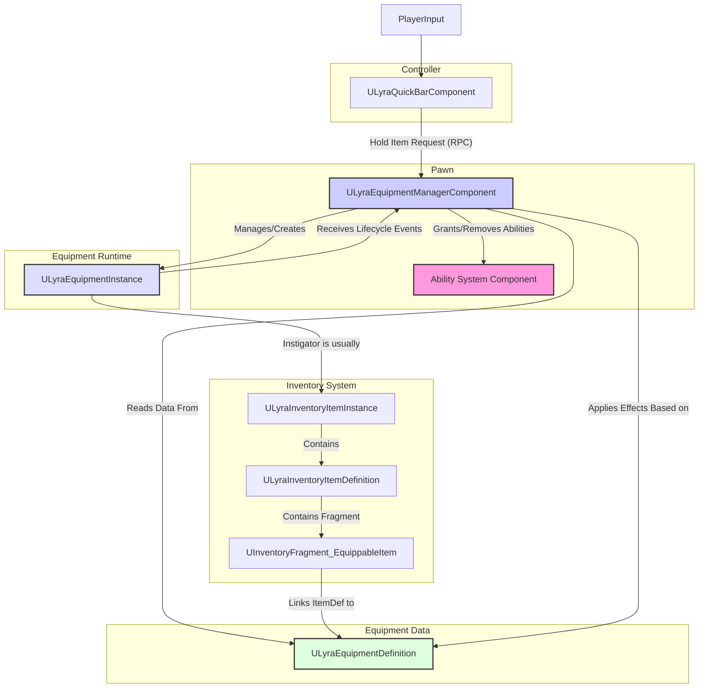

# Equipment

This system is a cornerstone of the shooter asset, providing the essential framework for characters (Pawns) to equip items and gain the gameplay functionality associated with them.

### What is the Equipment System For?

At its core, the Equipment System solves a crucial problem: **How does an item stored in an inventory translate into active gameplay?**

Think about:

* Making a weapon appear in the character's hands.
* Allowing the character to _use_ that weapon (shoot, aim, reload) by granting abilities.
* Showing armor visually on the character model.
* Giving passive benefits (like increased speed or damage resistance) just by _carrying_ certain gear.

The Equipment System manages this entire process, bridging the gap between abstract inventory data and tangible in-world interaction.

***

### Core Philosophy & Design

This system builds upon Lyra's robust foundations and embraces several key design principles:

* **Data-Driven Configuration:** Most equipment behavior is defined in a **data-driven UObject**   `ULyraEquipmentDefinition`. This empowers designers to create and tweak equipment (what abilities it grants, how it looks when equipped) with minimal code changes.\
  **Example:** Defining a rifle might involve linking ability sets for shooting/reloading and specifying the rifle mesh to spawn.
* **Component-Based Architecture:** Functionality is neatly packaged into Unreal Engine **Components**. This promotes modularity and clear separation of concerns.
  * `ULyraEquipmentManagerComponent`: Lives on the **Pawn** and manages _its_ equipment.
  * `ULyraQuickBarComponent`: Lives on the **Controller** (Player or AI) and handles player input for _selecting_ items to hold.
* **Flexible State Management:** A critical distinction is made between:
  * **Holstered:** The item is equipped in a designated slot (e.g., a rifle on the back, a helmet on the head) but not actively used. It can still provide passive effects or visuals.
  * **Held:** The item is actively wielded by the character (e.g., rifle in hands). This state typically unlocks the item's primary actions.
    \
    Different abilities and actors can be tied to _each_ state for the _same_ item.
* **Dynamically Defined Slots via Gameplay Tags:** Instead of hardcoded enums or predefined limits within the manager, equipment slots are identified by flexible GameplayTags.
  * **Why Tags?** This system has **no predefined limits on the number or types of equipment slots within the `ULyraEquipmentManagerComponent` itself.** Slot availability and behavior are entirely determined by the `ULyraEquipmentDefinition` of an item. If an `ULyraEquipmentDefinition` specifies a new `GameplayTag` for a slot in its `EquipmentSlotDetails` map, the `ULyraEquipmentManagerComponent` will recognize and manage items equipped to that tag.
  * This means you can easily experiment with and add new slots like `Equipment.Slot.Weapon.Primary`, `Equipment.Slot.Armor.Chest`, or `Equipment.Slot.Gadget.Tactical` simply by defining the tag and configuring it in your `ULyraEquipmentDefinitions`, without modifying core system code. The manager adapts to what the items define.
* **UI Reflects Manager State:** The User Interface (e.g., `W_EquipmentSlot` widget in the **TetrisInventory GameFeature Plugin**) is responsible for showcasing the current state of the `ULyraEquipmentManagerComponent`. If an item defines a new slot type, and the manager equips an item there, your UI would then need to be able to represent this new slot to allow interaction, allowing arbitrary layout of equipment slots.
* **Seamless Integration:** The system is designed to work hand-in-hand with:
  * **Inventory System:** Directly links `ULyraInventoryItemInstance`s to their equipment behaviors.
  * **Gameplay Ability System (GAS):** Leverages GAS (`ULyraAbilitySet`) to grant and remove abilities dynamically as equipment state changes.

***

### Key Components at a Glance

Here are the main components involved in the Equipment System:

* `ULyraEquipmentDefinition` (**UObject**)
  * **The Blueprint/Recipe:** Defines _what_ an item _does_ when equipped (Abilities, Actors) for both **Holstered** (per-slot) and **Held** states. This is where you define which `GameplayTags` represent valid slots for an item.
* `UInventoryFragment_EquippableItem` (**Item Fragment**)
  * **The Link:** Added to an `ULyraInventoryItemDefinition` to mark it as equippable and point it to its corresponding `ULyraEquipmentDefinition`.
* `ULyraEquipmentManagerComponent` (**Pawn Component**)
  * **The Manager:** Lives on the Pawn. Handles equip/unequip/hold requests, creates/destroys `ULyraEquipmentInstance`s, talks to GAS, and replicates state. The central brain for _this Pawn's_ gear. It does _not_ limit slots but rather manages items in slots defined by their `ULyraEquipmentDefinition`.
* `ULyraEquipmentInstance` (**UObject**)
  * **The Runtime Object:** Represents a single piece of equipment _actually attached_ to the Pawn _right now_. Holds runtime data (like ammo in a specific magazine instance) and receives lifecycle events (like `OnEquipped`).
* `ULyraQuickBarComponent` (**Controller Component**)
  * **The Player Interface:** Optional component on the Controller. Manages a list of items (like a hotbar) and tells the Pawn's `ULyraEquipmentManagerComponent` which item the player wants to _hold_.

***

### High-Level Interaction Diagram

This diagram illustrates how the core components typically interact:

***

### Dependencies

To function correctly, the Equipment System relies on:

* **Inventory System:** Provides the core item definitions (`ULyraInventoryItemDefinition`) and instances (`ULyraInventoryItemInstance`).
* **Gameplay Ability System (GAS):** Essential for granting abilities defined in `ULyraEquipmentDefinition`. You need GAS set up on your Pawns.
* **Gameplay Tags:** Used extensively for defining slots. Ensure the `GameplayTags` plugin is enabled and understand how to create and manage tags.

***

### Exploring Further

This overview provides a foundational understanding. To dive deeper into specific aspects, please explore the following pages:

* **Defining Equippable Items:** Learn how to configure `ULyraEquipmentDefinition` and link inventory items using `UInventoryFragment_EquippableItem`.
* **Equipment Manager Component:** Understand the central `ULyraEquipmentManagerComponent` on the Pawn.
* **Equipment Instance:** Explore the runtime `ULyraEquipmentInstance` and its lifecycle.
* **Quick Bar Component:** See how the `ULyraQuickBarComponent` facilitates player interaction.
* **Advanced Concepts & Integration:** Delve into Replication details, GAS specifics, Gameplay Messaging, and Tag usage.
* **Customization & Examples:** Find practical guides for extending and tailoring the system.
