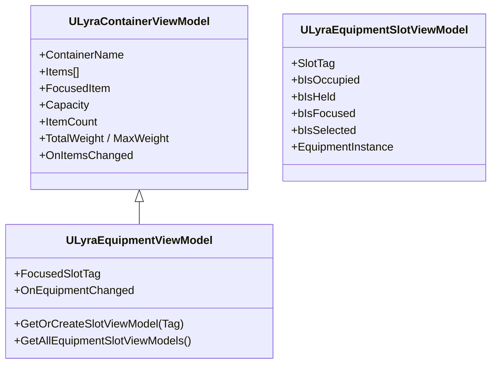

# Equipment ViewModels

You're building a paperdoll screen showing where items are equipped on the player's body, back slot, hip slot, chest slot. Each needs to show what's equipped there and whether the item is currently held or holstered. ViewModels give your widgets a clean interface to this state without coupling to the equipment system's internals.


For the underlying MVVM architecture and why ViewModels exist, see [MVVM](../ui/item-container-ui-system/core-architecture-and-data-structures/mvvm.md) and [Data Layers (View Models)](../ui/item-container-ui-system/data-layers-view-models/). ViewModels are acquired and released through the [Item Container UI Manager](../ui/item-container-ui-system/item-container-ui-manager/).


***

### Class Hierarchy



`ULyraEquipmentViewModel` inherits the shared container properties (items list, weight, capacity, focused item) and layers on tag-based slot management and held-state tracking.

***

### Tag-Based Slots

Equipment slots are identified by `FGameplayTag`, not by index. This means your paperdoll layout is completely decoupled from how the equipment system stores data internally, you request the slots your UI cares about, and each one is created on demand.

```cpp
// Get or create a slot ViewModel by tag
ULyraEquipmentSlotViewModel* BackSlotVM = EquipmentVM->GetOrCreateSlotViewModel(TAG_Equipment_Slot_Back);

// Get all slot ViewModels
TArray<ULyraEquipmentSlotViewModel*> AllSlots = EquipmentVM->GetAllEquipmentSlotViewModels();
```

Requesting a slot that doesn't exist yet creates it. Different UI layouts can request only the slots they care about, a minimal HUD might request only the weapon slot, while a full paperdoll requests every slot on the body.


See [Persistent Slot Pattern](../ui/item-container-ui-system/data-layers-view-models/persistent-slot-pattern.md) for why slot ViewModels persist even when their slot is empty.


***

### The `bIsHeld` Property

This is what makes equipment slots unique. Equipment has two visual states: **holstered** (on your back, in its slot) and **held** (actively in the character's hands).

```cpp
// Rifle equipped on back, currently in hand
BackSlotVM->bIsOccupied  // true
BackSlotVM->bIsHeld      // true

// Player holsters the rifle
BackSlotVM->bIsOccupied  // true
BackSlotVM->bIsHeld      // false - now holstered
```

Use this for visual feedback, glow or highlight when held, dim or desaturate when holstered. The property updates automatically when the equipment system changes held state.

***

### Slot Properties

`ULyraEquipmentSlotViewModel` exposes everything a slot widget needs through FieldNotify-enabled properties.

Slot State:

| Property      | Type           | Description                                |
| ------------- | -------------- | ------------------------------------------ |
| `SlotTag`     | `FGameplayTag` | Equipment slot tag (Back, Hip, Chest)      |
| `bIsOccupied` | `bool`         | Whether an item is equipped here           |
| `bIsHeld`     | `bool`         | Whether the equipped item is actively held |
| `bIsFocused`  | `bool`         | Navigation cursor is on this slot          |
| `bIsSelected` | `bool`         | Slot is selected for interaction           |
| `bIsGhost`    | `bool`         | Predicted but unconfirmed                  |

Proxied Item Data (when occupied):

| Property          | Type          | When Empty |
| ----------------- | ------------- | ---------- |
| `ItemIcon`        | `UTexture2D*` | nullptr    |
| `ItemDisplayName` | `FText`       | Empty text |
| `StackCount`      | `int32`       | 0          |

Equipment-Specific:

| Property            | Type                      | Description                                     |
| ------------------- | ------------------------- | ----------------------------------------------- |
| `EquipmentInstance` | `ULyraEquipmentInstance*` | Direct reference to the equipment instance      |
| `SlotDescriptor`    | `FInstancedStruct`        | Pre-built descriptor for the transaction system |

***

### Equipment Instance Access

For advanced use cases, reading weapon stats, accessing the underlying inventory item, you can reach through to the actual equipment instance:



```cpp
ULyraEquipmentInstance* Equipment = SlotVM->EquipmentInstance;
if (Equipment)
{
    float Damage = Equipment->GetTagAttributeValue(TAG_Weapon_Damage);
    ULyraInventoryItemInstance* Item = Equipment->GetInstigator();
}
```



<figure><figcaption></figcaption></figure>



***

### Delegates

| Delegate               | Signature                                                     | Fires When                                              |
| ---------------------- | ------------------------------------------------------------- | ------------------------------------------------------- |
| `OnEquipmentChanged`   | `()`                                                          | Any equipment slot changes (equip, unequip, held state) |
| `OnFocusedItemChanged` | `(ULyraItemViewModel* Previous, ULyraItemViewModel* Current)` | Navigation focus moves to a different slot              |

***

### Drag-Drop

Slot ViewModels carry a pre-built `SlotDescriptor` that plugs directly into the transaction system:



```cpp
FInstancedStruct SourceSlot = SourceSlotVM->SlotDescriptor;
FInstancedStruct DestSlot = EquipmentSlotVM->SlotDescriptor;
ItemTransactionAbility->MoveItem(SourceSlot, DestSlot);
```



<figure><figcaption><p>Example of getting the slot descriptor to pass to the interaction view model for drag and drop</p></figcaption></figure>




See [UI Transaction Pipeline](../ui/item-container-ui-system/interaction-and-transactions/ui-transaction-pipeline.md) for the full request flow from drag-drop through validation to server execution.


***


For the shared container/slot/item ViewModel architecture, see [Data Layers (View Models)](../ui/item-container-ui-system/data-layers-view-models/). For ghost state styling during prediction, see [Prediction & Visuals](../ui/item-container-ui-system/data-layers-view-models/prediction-and-visuals.md).

