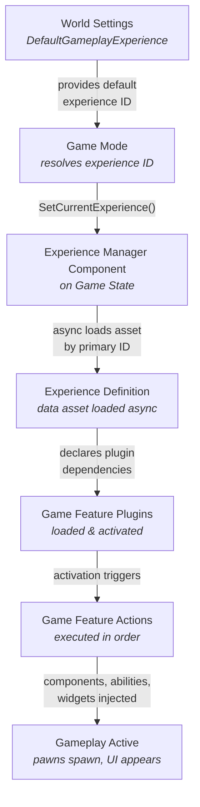

# GameFramework & Experience

This section delves into the core systems that manage the overall game flow, session rules, and modular content delivery within this asset. Building upon Unreal Engine's standard framework (Game Mode, Game State, etc.), it leverages Lyra's **Experience** system and Unreal's **Game Features** plugin infrastructure to create highly modular and customizable gameplay sessions.

In a traditional Unreal project, you create a GameMode subclass per game type. Deathmatch gets one. Elimination gets another. Want the same map to support both? Now you need conditional logic, duplicate configuration, and tight coupling between maps and gameplay rules. Add a battle royale mode six months later, and you're either refactoring the base GameMode or layering in yet another subclass with its own override chain.

Experiences solve this by separating _what gameplay rules apply_ from _which map we're on_. An experience is a data asset that defines everything about a gameplay session, which pawn players control, which abilities they have, which UI appears on screen, and which game feature plugins provide the functionality. The same map can host different experiences. The same experience can run on different maps. You never subclass GameMode to create a new game type.

***

### Design Principles

**Data-driven** — Game modes are data assets, not C++ subclasses. Creating a new mode means creating a new `ULyraExperienceDefinition` in the editor, not writing a new class.

**Modular** — Functionality comes from game feature plugins that are mixed and matched per experience. Weapons, HUD, input bindings, scoring logic, each lives in its own plugin and is composed at runtime.

**Async-ready** — Experiences load asynchronously. Game features and their assets arrive on demand through the asset manager. The loading screen stays visible until everything is ready, and nothing blocks the game thread waiting for content.

**Composable** — Action sets package groups of game feature actions into reusable bundles. A "shooter base" action set can be shared across every FPS-style experience without duplicating a single action.

***

### Architecture

The flow from map load to active gameplay passes through several systems, each with a single responsibility.

When a map loads, the **Game Mode** resolves which experience to use. It checks multiple sources in priority order, matchmaking assignment, URL options, developer settings (PIE only), command line, world settings, falling back through the chain until it finds a valid experience ID. Once resolved, it passes that ID to the **Experience Manager Component** living on the Game State.

The Experience Manager Component drives the entire async pipeline. It loads the experience definition by primary asset ID, identifies every game feature plugin the experience and its action sets depend on, loads and activates those plugins, then executes every game feature action declared by the experience. The loading screen remains up throughout this process via the `ILoadingProcessInterface`. Only when the load state reaches `Loaded` do pawns spawn and gameplay begin.

***

### Sub-pages



[**Experiences**](experiences.md)

The data model, Experience Definitions, Action Sets, User-Facing Experiences, and how they compose together.



[**Experience Lifecycle**](experience-lifecycle.md)

The full lifecycle from map load to gameplay, experience selection, async loading, action execution, and the CallOrRegister pattern.



[**Game Features**](/broken/pages/MMuer3tX1noU84k4jem8)

The modularity system, plugins loaded on demand, all action types, and how the extension system injects functionality.



[**Game Mode & State**](game-mode-and-state.md)

The extended Unreal framework classes, how GameMode orchestrates experiences, GameState hosts them, and WorldSettings configures defaults.



[**Pawn Data**](lyrapawndata.md)

The data asset that defines a pawn's class, abilities, input, camera, and HUD, the complete picture of pawn configuration.


