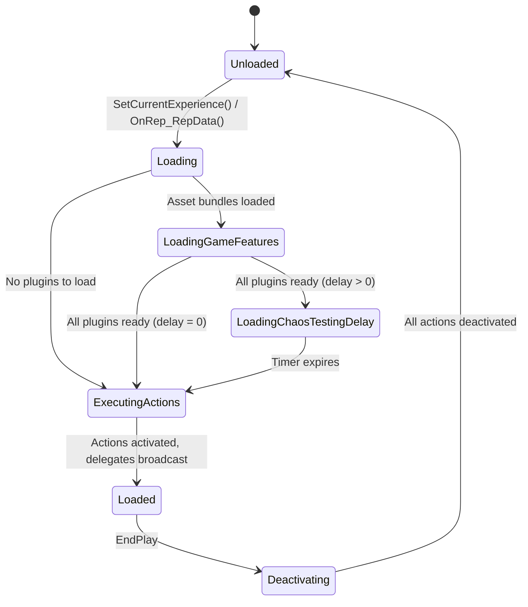

# Experience Lifecycle

This page traces the complete lifecycle from "a map loads" to "a player is playing." Understanding this flow is essential, every system in the framework hooks into it at some point. The experience is the central organizing concept: it determines which game feature plugins activate, which actions inject components and abilities, which pawn the player controls, and how the entire game session behaves. If you understand the six phases described here, you understand the framework.

***

## Phase 1: Experience Selection

When a map loads, `ALyraGameMode::InitGame()` fires. Rather than selecting the experience immediately, it defers to the next tick via a timer, this gives startup settings time to initialize. On that next tick, `HandleMatchAssignmentIfNotExpectingOne()` runs through a precedence chain to determine which experience to load.

The chain checks each source in order, stopping at the first valid result:



#### **URL Options** (`?Experience=...`)

Parsed from the travel URL via `UGameplayStatics::ParseOption()`. This is the primary override for testing, launch a PIE session or use `open MapName?Experience=B_MyExperience` to force a specific experience without touching any other configuration.



#### **Developer Settings** (PIE only)

`ULyraDeveloperSettings::ExperienceOverride` is checked, but only when `World->IsPlayInEditor()` returns true. This lets developers set a global experience override in their editor preferences for rapid iteration without modifying map data. It never applies in packaged builds.



#### **Command Line** (`Experience=...`)

Parsed from `FCommandLine::Get()`. Useful for automated testing, build farm validation, or launching specific experiences from shortcuts. Accepts both a plain name (`B_LyraDefaultExperience`) and a fully qualified `PrimaryAssetType:Name` format.



#### **World Settings**

`ALyraWorldSettings::GetDefaultGameplayExperience()` returns the map's configured default. This is stored as a `TSoftClassPtr<ULyraExperienceDefinition>` on the world settings actor. For most single-player and offline scenarios, this is where the experience comes from, the level designer sets it per map.



#### **Dedicated Server Login**

If no experience has been found and this is a dedicated server on the default map, `TryDedicatedServerLogin()` initiates an online login flow. On success, it calls `HostDedicatedServerMatch()`, which loads a `ULyraUserFacingExperienceDefinition` (selected by command line or marked as the default) and creates a session hosting request. This path handles the matchmaking-driven case: the session system will travel to the correct map with the correct experience URL option.



#### **Hardcoded Default**

If every other source fails, the system falls back to `B_LyraDefaultExperience`. This ensures the game always has _something_ to load, even in a bare-bones test environment.



Once a valid `FPrimaryAssetId` is determined, `OnMatchAssignmentGiven()` passes it to the `ULyraExperienceManagerComponent` on the GameState:

```cpp
ULyraExperienceManagerComponent* ExperienceComponent = GameState->FindComponentByClass<ULyraExperienceManagerComponent>();
ExperienceComponent->SetCurrentExperience(ExperienceId);
```

`SetCurrentExperience()` synchronously resolves the asset path and loads the CDO of the experience definition class. It then stores the experience pointer, bumps the `RepData.InstanceSerial` for replication, and begins the async loading pipeline.

<details>

<summary>Why matchmaking uses a separate path</summary>

The dedicated server login flow does not directly call `SetCurrentExperience()`. Instead, it goes through the session subsystem, which performs a map travel with the experience ID embedded in the URL options. When the new map loads, the normal `HandleMatchAssignmentIfNotExpectingOne()` fires again and picks up the experience from the URL. This two-step approach means the matchmaking path and the local path converge at the same code, there is no special "matchmaking mode" in the experience manager itself.

</details>

***

## Phase 2: Async Loading

The `ULyraExperienceManagerComponent` manages a state machine that drives the entire load process. The component lives on the `ALyraGameState` and implements `ILoadingProcessInterface`, which keeps the loading screen visible until the experience reaches the `Loaded` state.



### Loading Stage

`StartExperienceLoad()` collects every asset that needs to be available before gameplay begins. It builds two sets:

* **Bundle assets**: The experience definition itself, plus every `ULyraExperienceActionSet` referenced in its `ActionSets` array. Each of these is a `UPrimaryDataAsset` with associated asset bundles.
* **Bundle tags**: The `Equipped` bundle is always loaded. Client and Server bundles are loaded conditionally based on net mode, a dedicated server skips client assets, a pure client skips server assets, and the editor loads both.

The asset manager's `ChangeBundleStateForPrimaryAssets()` triggers the async load at high priority. When the handle completes (or if assets were already resident), `OnExperienceLoadComplete()` fires.

### Game Feature Loading Stage

With the base assets loaded, the system now collects game feature plugin URLs. It iterates through `CurrentExperience->GameFeaturesToEnable` and every action set's `GameFeaturesToEnable`, resolving each plugin name to a URL via `UGameFeaturesSubsystem::GetPluginURLByName()`. Duplicates are filtered with `AddUnique()`.

Each URL is then loaded and activated:

```cpp
UGameFeaturesSubsystem::Get().LoadAndActivateGameFeaturePlugin(PluginURL,
    FGameFeaturePluginLoadComplete::CreateUObject(this, &ThisClass::OnGameFeaturePluginLoadComplete));
```

A counter (`NumGameFeaturePluginsLoading`) tracks outstanding loads. Each completion callback decrements it. Only when the counter reaches zero does the pipeline advance. If there are no plugins to load, this stage is skipped entirely.

### Chaos Testing Delay (Optional)

`OnExperienceFullLoadCompleted()` checks two console variables before proceeding:

| CVar                                        | Purpose                                   |
| ------------------------------------------- | ----------------------------------------- |
| `lyra.chaos.ExperienceDelayLoad.MinSecs`    | Fixed minimum delay in seconds            |
| `lyra.chaos.ExperienceDelayLoad.RandomSecs` | Random additional delay (0 to this value) |

If the combined delay is greater than zero, the state machine enters `LoadingChaosTestingDelay` and sets a timer. This exists to flush out race conditions. code that assumes the experience is loaded immediately will fail visibly when this delay is active. In production both values default to zero and this stage is a no-op.

***

## Phase 3: Action Execution

Once all features are loaded (and any chaos delay has elapsed), the state transitions to `ExecutingActions`. This is where the experience's configuration becomes live gameplay.

A `FGameFeatureActivatingContext` is created and scoped to the current world context. Then every action is activated, first from `CurrentExperience->Actions`, then from each action set's `Actions` array:

```cpp
Action->OnGameFeatureRegistering();   // Process-wide static setup
Action->OnGameFeatureLoading();       // Asset preparation
Action->OnGameFeatureActivating(Context);  // World-specific activation (calls AddToWorld)
```

The critical insight is what these actions actually do. Most actions in the framework (such as `UGameFeatureAction_AddComponents`) do not directly modify actors during activation. Instead, they **register interest** with the `UGameFrameworkComponentManager` extension system. An "AddComponents" action targeting `ALyraCharacter` tells the extension manager: "whenever any `ALyraCharacter` spawns in this world, inject these components onto it."

This means actions are not one-shot setup. They establish hooks that fire whenever a matching actor appears, for the entire duration of the experience. A pawn that spawns five minutes into the match receives the same injected components as one that spawned at the start. This is fundamental to how late joiners, respawns, and bot spawning all work without special-case code.

<details>

<summary>Fragment injection for game features</summary>

Before actions execute, the `UFragmentInjectorManager` scans each loaded plugin for fragment injectors, Blueprint assets that declare which item fragments to add or remove from existing item definitions. This allows game feature plugins to modify item behavior without touching the base item assets. For example, an Arena mode plugin can inject shop price fragments onto weapons, and a Prop Hunt plugin can inject size-based damage behavior, all without the base weapon definitions knowing about either mode. The modifications are temporary and restore automatically when the feature unloads. See [Fragment Injector](../items/modularity-fragment-injector.md) for full details.

</details>

***

## Phase 4: Experience Ready

After all actions have activated, the state transitions to `Loaded`. Three delegate tiers then broadcast in strict order:



#### **`OnExperienceLoaded_HighPriority`**

Subsystems that must prepare before general gameplay begins subscribe here. Team creation, game phase initialization, and other foundational systems use this tier to ensure they are ready before anything that depends on them.



#### **`OnExperienceLoaded`**

The standard tier. Most gameplay systems subscribe here. The `ALyraGameMode` itself uses this tier, its `OnExperienceLoaded` callback iterates all connected player controllers and calls `RestartPlayer()` on any that do not yet have a pawn.



#### **`OnExperienceLoaded_LowPriority`**

Systems that need everything else to be ready first. UI overlays, analytics, or any system that reads state established by higher-priority subscribers.



All three delegates are **cleared after broadcasting**, they are strictly one-shot. This is intentional: the experience loads once per world, so there is no reason to keep subscribers around.

Blueprints doesn't use any of the three delegate teirs instead it handles this using the `WaitForExperienceReady` node. This lets you ensure that subsequent code will only run once/if the experience is ready.

<figure><figcaption></figcaption></figure>

### The CallOrRegister Pattern

This is the most important integration pattern in the framework.

Any system that needs the experience to be loaded calls one of three methods:

```cpp
ExperienceComponent->CallOrRegister_OnExperienceLoaded(
    FOnLyraExperienceLoaded::FDelegate::CreateUObject(this, &ThisClass::OnExperienceReady));
```

The method checks `IsExperienceLoaded()`. If the experience is already loaded, the delegate executes **immediately, synchronously, inline**. If not, it queues the delegate onto the multicast and it fires when loading completes.

This eliminates an entire class of timing bugs. Without this pattern, every system would need to handle two cases: "experience is already loaded" and "experience is not loaded yet." In a networked game, those two cases can vary per machine and per frame. The server might load the experience before any client connects. A late-joining client might connect after the experience is fully loaded on the server. With `CallOrRegister`, the calling code does not care, it writes one path and the pattern handles both cases.

<details>

<summary>How the three priority tiers interact with CallOrRegister</summary>

Each tier has its own `CallOrRegister` variant: `CallOrRegister_OnExperienceLoaded_HighPriority`, `CallOrRegister_OnExperienceLoaded`, and `CallOrRegister_OnExperienceLoaded_LowPriority`. When the experience is already loaded, all three behave identically, they execute the delegate immediately. The priority distinction only matters during the initial broadcast, where high-priority delegates fire before standard ones, which fire before low-priority ones. After the broadcast, the delegates are cleared, so any subsequent `CallOrRegister` call (from a late-joining system) always takes the immediate-execution path regardless of which tier it targets.

</details>

***

## Phase 5: Player Spawning

With the experience loaded and actions active, the framework can spawn players.

`ALyraGameMode::HandleStartingNewPlayer_Implementation()` gates on `IsExperienceLoaded()`. If the experience is not yet loaded, it does nothing, the player will be started later when the `OnExperienceLoaded` callback fires and calls `RestartPlayer()` for all pawnless controllers. If the experience is already loaded, it proceeds immediately through the standard `AGameModeBase` spawning path.

The spawning sequence:



#### **Resolve PawnData**

`GetPawnDataForController()` checks the player state first (it may have been set explicitly, for example by a team assignment system). If no pawn data is set, it falls back to `CurrentExperience->DefaultPawnData`. If that is also null, the asset manager's global default is used.



#### **Spawn the Pawn**

`SpawnDefaultPawnAtTransform_Implementation()` spawns with `bDeferConstruction = true`, then finds the `ULyraPawnExtensionComponent` on the new pawn and calls `SetPawnData()` to configure it before `FinishSpawning()`. This deferred construction pattern ensures the pawn data is set before `BeginPlay` fires on any component.



#### **Pawn Initialization**

The `ULyraPawnExtensionComponent` drives its own initialization state machine (see [Character Initialization](../character/initialization.md)). Components bind to the Ability System Component, input mappings are wired, camera modes are configured. By the time this completes, the player is fully interactive.



The spawning manager component (`ULyraPlayerSpawningManagerComponent`) handles spawn point selection, overriding the default `ChoosePlayerStart` with game-mode-specific logic. The game mode also handles spawn failures gracefully, `FailedToRestartPlayer()` will retry on the next frame as long as `PlayerCanRestart()` still returns true.

***

### Phase 6: Experience Deactivation

When the world is torn down (map transition, PIE end, or session disconnect), `EndPlay` on the experience manager component handles cleanup.



#### **Fragment Restoration**

The `UFragmentInjectorManager` restores any fragments that were modified during Phase 3, returning experience definitions to their original state.



#### **Plugin Deactivation**

Each game feature plugin URL is passed to `ULyraExperienceManager::RequestToDeactivatePlugin()`. If no other experience is holding the plugin active (a reference-counting mechanism), `UGameFeaturesSubsystem::DeactivateGameFeaturePlugin()` is called.



#### **Action Deactivation**

If the experience was fully loaded, all actions are deactivated via `OnGameFeatureDeactivating(Context)` followed by `OnGameFeatureUnregistering()`. This reverses the hooks set up in Phase 3, the extension manager removes injected components from existing actors and stops injecting them into new ones.



#### **State Reset**

Once all deactivation completes (including any asynchronous pausers), `OnAllActionsDeactivated()` resets the state to `Unloaded` and clears the `CurrentExperience` pointer.



***

## Replication

The experience replicates to clients through the `FReplicatedExperience` struct on the experience manager component. This struct contains two fields: the `ExperienceId` (a `FPrimaryAssetId`) and an `InstanceSerial` counter that increments each time the server calls `SetCurrentExperience()`.

When a client receives the replicated data, `OnRep_RepData()` fires. If the experience ID differs from what the client currently has (or the client has no experience at all), it resolves the asset path, synchronously loads the experience definition class, and then starts the **same async loading pipeline** that the server used. The client runs through Loading, LoadingGameFeatures, and ExecutingActions independently. Actions execute on the client and inject client-side functionality, UI widgets, input bindings, visual effects, through the same extension manager mechanism.

This is why late joiners work seamlessly. A client that connects after the server has fully loaded the experience simply receives the replicated `ExperienceId` and bootstraps itself through the entire pipeline. The `CallOrRegister` pattern means any system on that client that depends on the experience will either get the immediate callback (if it initializes after loading) or the queued callback (if it initializes before loading). No special "late join" code path is needed.

The `InstanceSerial` field handles a subtler case: if the server were to transition to a new experience without a full map travel, the serial lets the client detect that the experience changed even if the ID happens to be the same asset. The `OnRep` checks both the ID and the serial before deciding whether to restart the loading pipeline.

<details>

<summary>Duplicate world handling</summary>

In standalone mode (primarily for the replay system), Unreal can create “dynamic duplicated levels”. The experience manager detects this via `ELevelCollectionType::DynamicDuplicatedLevels` and short-circuits both `IsExperienceLoaded()` (always returns true for duplicated levels) and `StartExperienceLoad()` (skips loading entirely). This prevents duplicated worlds from running a redundant loading pipeline when they share an already-loaded state.

</details>
