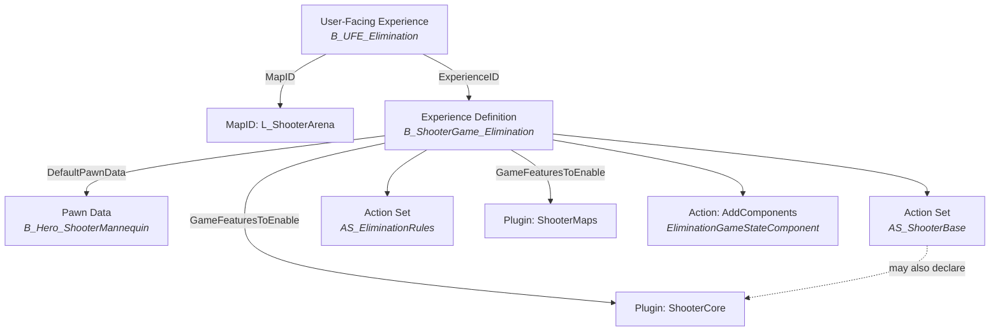

# Experiences

An experience defines a complete gameplay session as data. Rather than encoding game mode rules in C++ subclasses, you author an experience definition asset that declares which pawn players control, which game feature plugins to activate, and which actions to execute when the session begins. The framework loads and activates everything asynchronously, maps know nothing about the experiences that run on them, and experiences know nothing about which map they're on.

Three asset types work together to make this happen: the **Experience Definition** holds the gameplay configuration, **Action Sets** package reusable groups of actions for sharing across experiences, and the **User-Facing Experience** maps display information for lobby screens and mode selectors.

***

## Experience Definition (`ULyraExperienceDefinition`)

The experience definition is the core asset. When you create a new game mode, you create one of these. It is a `UPrimaryDataAsset`, which means it can be loaded by primary asset ID through the asset manager without requiring hard references from any other asset. This is what makes the entire async loading pipeline possible, the Game Mode only needs an ID string, not a loaded object.

<figure><figcaption><p>Experience definition of the headquarters game mode</p></figcaption></figure>

An experience definition declares four things:

### DefaultPawnData

```cpp
UPROPERTY(EditDefaultsOnly, Category=Gameplay)
TObjectPtr<const ULyraPawnData> DefaultPawnData;
```

A direct reference to a [Pawn Data](lyrapawndata.md) asset. This determines the pawn class players control, their granted ability sets, input configuration, input mapping contexts, HUD layout, and default camera mode. When the Game Mode spawns a player and no override exists on their Player State, it falls back to this pawn data from the loaded experience.

### Actions

```cpp
UPROPERTY(EditDefaultsOnly, Instanced, Category="Actions")
TArray<TObjectPtr<UGameFeatureAction>> Actions;
```

Game feature actions that execute directly when this experience loads. These are the same action types used by game feature plugins, add components, grant abilities, inject widgets, bind input, but defined inline on the experience itself rather than inside a plugin. Use these for actions that are unique to this specific experience and don't need to be shared.

### ActionSets

```cpp
UPROPERTY(EditDefaultsOnly, Category=Gameplay)
TArray<TObjectPtr<ULyraExperienceActionSet>> ActionSets;
```

References to reusable bundles of actions and plugin dependencies. Instead of duplicating the same ten actions across every experience that needs "FPS shooter" functionality, you create an action set and reference it. The experience manager collects actions from all referenced action sets and executes them alongside the experience's own actions.

### GameFeaturesToEnable

```cpp
UPROPERTY(EditDefaultsOnly, Category=Gameplay)
TArray<FString> GameFeaturesToEnable;
```

Names of game feature plugins to load and activate for this experience. These are string identifiers resolved by the Game Features subsystem. The experience manager loads these plugins asynchronously, waits for all of them to finish, then proceeds to action execution. Action sets can declare their own plugin dependencies as well, the manager merges both lists.

***

## Action Sets (`ULyraExperienceActionSet`)

An action set packages a group of actions and game feature dependencies into a reusable bundle. This is the primary composition mechanism for experiences.

Consider what goes into a typical FPS experience: weapon abilities, an FPS HUD with crosshair and ammo display, input bindings for fire/reload/aim, a damage number component, hit marker feedback. Every FPS experience in your project needs all of this. Without action sets, you would duplicate those actions on every experience definition and maintain them in parallel. With an action set, you define them once and reference the set.

<figure><figcaption><p>Lyra Action Set for the infection game mode containing standard components</p></figcaption></figure>

An action set contains two things:

### Actions

```cpp
UPROPERTY(EditAnywhere, Instanced, Category="Actions to Perform")
TArray<TObjectPtr<UGameFeatureAction>> Actions;
```

The same game feature actions you would put directly on an experience. When the experience manager processes an experience, it collects actions from all referenced action sets and executes them as part of the same pipeline.

### GameFeaturesToEnable

```cpp
UPROPERTY(EditAnywhere, Category="Feature Dependencies")
TArray<FString> GameFeaturesToEnable;
```

Plugin dependencies this action set needs. If your "ShooterBase" action set grants abilities defined in a `ShooterCore` plugin, that plugin must be active before the actions execute. Declaring it here ensures the experience manager loads it regardless of whether the experience definition itself lists it.

<details>

<summary>Why action sets are primary data assets</summary>

Like experience definitions, action sets inherit from `UPrimaryDataAsset`. This means they participate in the asset manager's bundle system and can have their dependent assets (widget classes, ability classes, input configs) tracked and loaded as part of the experience's async load. The experience definition's `UpdateAssetBundleData()` implementation walks its action sets and aggregates their bundle data, ensuring nothing is missed during the load.

</details>

***

## User-Facing Experience (`ULyraUserFacingExperienceDefinition`)

The user-facing experience is the presentation layer, what players see in lobby screens, mode selectors, and server browsers. It maps display information to an experience-plus-map combination and provides the parameters needed to host a session.

<figure><figcaption><p>User Facing Experience for GunGame game mode</p></figcaption></figure>

### Identity

```cpp
UPROPERTY(BlueprintReadWrite, EditAnywhere, Category=Experience, meta=(AllowedTypes="Map"))
FPrimaryAssetId MapID;

UPROPERTY(BlueprintReadWrite, EditAnywhere, Category=Experience, meta=(AllowedTypes="LyraExperienceDefinition"))
FPrimaryAssetId ExperienceID;
```

`MapID` and `ExperienceID` are primary asset IDs, not hard references. The user-facing experience tells the session system "load this map with this experience" without pulling either into memory until the player actually selects it.

### Display

```cpp
FText TileTitle;
FText TileSubTitle;
FText TileDescription;
TObjectPtr<UTexture2D> TileIcon;
```

Visual information for UI tiles: a primary title, subtitle, full description, and icon texture. Your lobby UI reads these fields to populate mode selection grids.

### Session Configuration

```cpp
int32 MaxPlayerCount = 16;
bool bIsDefaultExperience = false;
bool bShowInFrontEnd = true;
bool bRecordReplay = false;
TMap<FString, FString> ExtraArgs;
TSoftClassPtr<UUserWidget> LoadingScreenWidget;
```

`MaxPlayerCount` sets the lobby size. `bIsDefaultExperience` gives this mode priority in quick-play flows and dedicated server fallback. `bShowInFrontEnd` controls whether it appears in the mode list at all. `ExtraArgs` passes additional URL parameters to the server travel (useful for variant rules on the same experience). `LoadingScreenWidget` allows a custom loading screen per mode.

### Game Mode Options

Each game mode can declare its own configurable options, bot count, score limit, friendly fire, round time, as data on the user-facing experience. The host session screen reads these declarations and generates the appropriate UI controls dynamically. Players adjust the values, and they flow through the same `ExtraArgs` pipeline that already carries URL parameters to the server.

<figure><figcaption></figcaption></figure>

The `GameModeOptions` array holds instanced `ULyraGameModeOption` descriptors. Because the array uses the `Instanced` property specifier, you add options directly inside the data asset, no separate assets to manage. Each descriptor stores an `OptionKey` (the URL parameter name), a `DisplayName` for the UI, an optional `Description` for tooltips, and a `SortOrder` to control display ordering.

Three option types are available:

**Bool** (`ULyraGameModeOption_Bool`) — a toggle with a default on/off state. Serializes to `"1"` or `"0"`.

**Int Range** (`ULyraGameModeOption_IntRange`) — a numeric value with `MinValue`, `MaxValue`, `StepSize`, and `DefaultIntValue`. Displayed as a slider.

**Enum** (`ULyraGameModeOption_Enum`) — a list of named choices. `DisplayOptions` holds the player-visible text, `Values` holds the corresponding URL strings (parallel arrays), and `DefaultIndex` selects the initial choice.

<details>

<summary>In code: ULyraGameModeOption</summary>

```cpp
UPROPERTY(BlueprintReadOnly, EditAnywhere, Instanced, Category=GameModeOptions)
TArray<TObjectPtr<ULyraGameModeOption>> GameModeOptions;
```

The base class provides:

```cpp
UPROPERTY(BlueprintReadOnly, EditAnywhere, Category=Option)
FString OptionKey;          // URL parameter name, e.g. "NumBots"

UPROPERTY(BlueprintReadOnly, EditAnywhere, Category=Option)
FText DisplayName;          // Shown in the host session UI

UPROPERTY(BlueprintReadOnly, EditAnywhere, Category=Option)
FText Description;          // Tooltip

UPROPERTY(BlueprintReadOnly, EditAnywhere, Category=Option)
int32 SortOrder = 0;        // Lower values display first

virtual FString GetDefaultValue() const;  // Returns the default as a URL-ready string
```

</details>

#### **How options flow to the server**

`CreateHostingRequest()` iterates the `GameModeOptions` array after copying `ExtraArgs` and inserts each option's default value for any key not already present. This means hardcoded `ExtraArgs` on the asset still take priority, and the option descriptors provide structured defaults as a fallback.

When the host session screen is active, it builds UI controls from the option descriptors. On "Start Game", it collects the player's chosen values and writes them into the request's `ExtraArgs`, overriding the defaults. The server-side game mode components read these values with the same `UGameplayStatics::GetIntOption()` or `ParseOption()` calls they already use, no server-side changes are needed to support new options.



<figure><figcaption></figcaption></figure>



<figure><figcaption><p>Dynamically populates the options when an experience is selected</p></figcaption></figure>



<figure><figcaption><p>CreateHostingRequest in W_HostSessionScreen</p></figcaption></figure>



#### **UI integration: IGameModeOptionEntry**

Blueprint widgets that display an option implement the `IGameModeOptionEntry` C++ interface. This lets the options panel talk to any option widget without casting to a specific type.

The interface declares three functions:

* `InitFromOption(ULyraGameModeOption*)` — called once to bind the widget to its descriptor and set up the control.
* `GetOptionKey() → FString` — returns the URL parameter key.
* `GetValue() → FString` — returns the current player-chosen value as a string.

The options panel calls `SetExperienceDefinition()` whenever the selected experience changes. It clears its children, iterates the new experience's `GameModeOptions`, creates the correct widget for each type, calls `InitFromOption`, and adds the widget to a scroll box. On start, it calls `GetOptionKey` and `GetValue` on each child to build the values map.



<figure><figcaption><p>InitFromOption interface function of W_GameModeOptionBool</p></figcaption></figure>



<figure><figcaption><p>GetOptionKey interface function of W_GameModeOptionBool</p></figcaption></figure>



<figure><figcaption><p>GetValue interface function of W_GameModeOptionBool</p></figcaption></figure>



#### `CreateHostingRequest()`

```cpp
UFUNCTION(BlueprintCallable, BlueprintPure=false)
UCommonSession_HostSessionRequest* CreateHostingRequest(const UObject* WorldContextObject) const;
```

This method builds a `UCommonSession_HostSessionRequest` from the asset's fields, map ID, experience ID, extra args, max players, ready to hand to the `UCommonSessionSubsystem` for hosting. Dedicated servers use this path when resolving which user-facing experience to host at startup.

This asset is purely presentation and session configuration. The actual gameplay rules, pawn setup, and feature activation are all defined by the Experience Definition it points to.

***

## How They Compose

These three asset types form a layered structure. The experience definition sits at the center, action sets feed reusable functionality into it, and user-facing experiences wrap it for player-visible UI.

```
Experience: "B_ShooterGame_Elimination"
  |
  |-- DefaultPawnData: B_Hero_ShooterMannequin
  |     (pawn class, abilities, input, camera, HUD layout)
  |
  |-- ActionSets:
  |     |-- AS_ShooterBase
  |     |     (weapon abilities, FPS HUD, input bindings, crosshair)
  |     |-- AS_EliminationRules
  |           (round logic, scoring, elimination tracking)
  |
  |-- Actions:
  |     |-- AddComponents: EliminationGameStateComponent
  |           (experience-specific, not shared)
  |
  |-- GameFeaturesToEnable:
        |-- ShooterCore
        |-- ShooterMaps
```



The user-facing experience pairs a map with an experience definition and wraps it in display metadata for the lobby. The experience definition declares the pawn data, references shared action sets, adds any experience-specific actions, and lists the game feature plugins it depends on. Action sets bring their own actions and can declare their own plugin dependencies, which the experience manager merges into the same load.

When a player selects "Elimination" in the lobby, the user-facing experience provides the map and experience IDs to the session system. The server loads the map, the Game Mode resolves the experience ID, and the experience manager takes over from there, loading the definition, activating plugins, executing every action from both the definition and its action sets, then signaling readiness so pawns can spawn.
