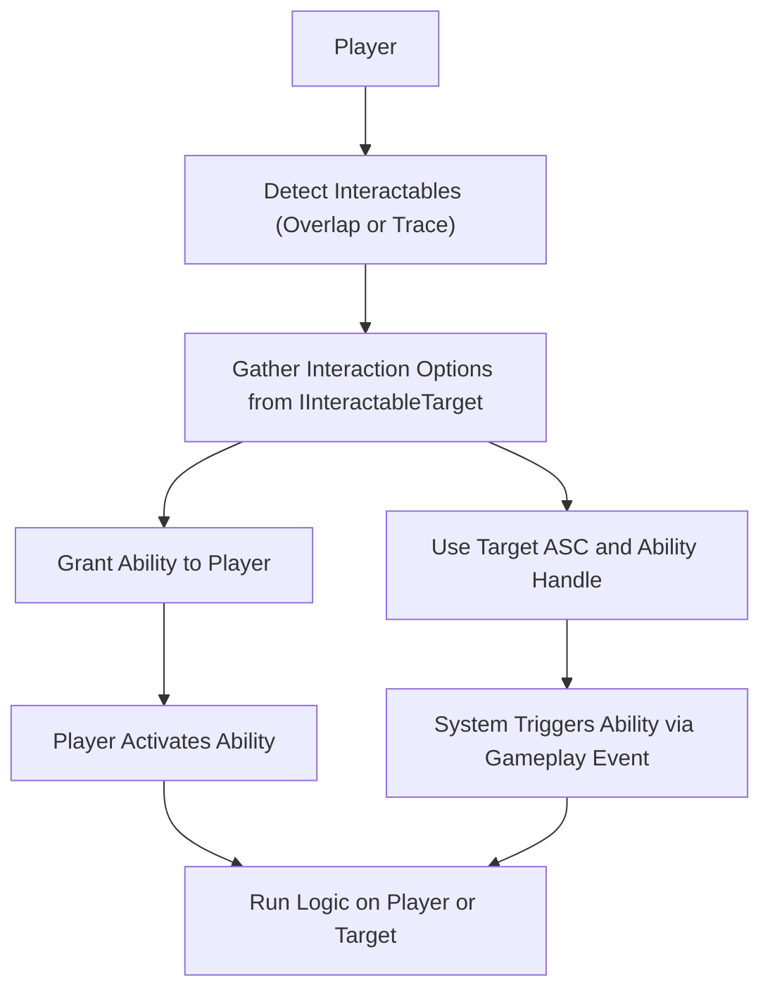

# How Interaction Works

This section explains the full flow of the Lyra Interaction System — how it detects interactables, gathers interaction options, and triggers gameplay logic via GAS (Gameplay Ability System). It also covers how abilities are correctly assigned and executed, either on the player or on external targets.

***

### 1. Detection: Finding Interactable Objects

The system uses one of two scanning methods to find nearby or focused interactables:

#### a. Proximity-Based (Overlap Sphere)

Handled by `UAbilityTask_GrantNearbyInteraction`. It continuously performs a sphere overlap around the player to detect actors implementing `IInteractableTarget`.

* Ideal for ambient interactables like loot, terminals, or pickup zones.

#### b. Line Trace-Based (Raycast)

Handled by `UAbilityTask_WaitForInteractableTargets_SingleLineTrace`. It uses a trace from the player’s camera to detect objects directly in front of them.

* Useful for more intentional or directed interactions like aiming at a door.

Both methods search for actors or components that implement the `IInteractableTarget` interface.

***

### 2. Option Gathering

Once interactables are detected, the system queries them using:

```cpp
void GatherInteractionOptions(const FInteractionQuery& InteractQuery, TArray<FInteractionOption>& OutOptions);
```

Each interactable can return multiple `FInteractionOption`s that describe what interactions are available and how they behave.

These options contain:

* Display text and widget references
* Required hold time (if any)
* Either an ability to grant or a target ability to activate
* UI widget location for prompts or indicators

***

### 3. Ability Assignment: Two Approaches

The `FInteractionOption` struct supports **two distinct modes** of triggering an interaction:

#### **Option 1: Grant Ability to Player**

* Set `InteractionAbilityToGrant` to a valid `UGameplayAbility` class.
* This ability is **granted to the player** temporarily while they are near the interactable.
* When the player activates the interaction input (e.g., presses "E"), the granted ability runs on the **player’s** Ability System Component.

**Use case:**\
Player loots an item, opens a UI, or interacts with an object using their own logic.

***

#### **Option 2: Trigger Ability on Target Actor**

* Set both:
  * `TargetAbilitySystem` to the **target’s ASC** (e.g., a door or machine).
  * `TargetInteractionAbilityHandle` to the **specific ability spec handle** on that ASC.

When the player interacts, the system uses `TriggerAbilityFromGameplayEvent()` to activate the ability directly on the **target**, not the player.

**Use case:**\
Player presses a wall switch that triggers an ability on a separate actor (e.g., opening a distant gate).

> This pattern supports flexible interactions where the interactable object isn’t the thing performing the logic — a common need in level scripting or puzzle mechanics.

***

#### Important:

If neither of these two pathways is properly configured, the interaction **won’t do anything**. The system does **not guess** what ability to trigger — it relies entirely on what is explicitly defined in the `FInteractionOption`.

***

### 4. Event Payload Customization

Before triggering the ability, the system constructs an `FGameplayEventData` payload. This includes:

* The instigating player
* The original interactable target
* A gameplay tag describing the action (typically `TAG_Ability_Interaction_Activate`)

Then, the interactable has the opportunity to customize this payload by overriding:

```cpp
void CustomizeInteractionEventData(const FGameplayTag& InteractionEventTag, FGameplayEventData& InOutEventData);
```

This enables powerful behaviors like:

* Redirecting the `Target` field to a different actor
* Injecting values or context into the payload (e.g., door IDs, interaction reasons)

***

### 5. Triggering the Interaction

When the player chooses to interact:

* If using **Option 1**: The granted ability is activated on the player.
* If using **Option 2**: The system sends the event to the defined `TargetAbilitySystem` and triggers the ability using the `TargetInteractionAbilityHandle`.

This interaction can now run its own logic, trigger animations, modify state, or anything else a GAS ability would typically do.

***

### 6. Visual Feedback

As a final layer, the system provides cosmetic interaction feedback:

* **SetFocused** is called when the player is aiming at an object.
* **Nearby / NoLongerNearby** are called when entering or leaving proximity.
* **InteractionWidgetClass** is used to spawn UMG prompts at the object's world position.

This UI is client-side only and purely cosmetic, ensuring no unintended replication cost.

***

### Summary of Interaction Flow



***

Next up: [Making an Actor Interactable](making-an-actor-interactable.md) — we’ll walk through the exact steps to implement your own interactable actor or component. Ready to continue?
