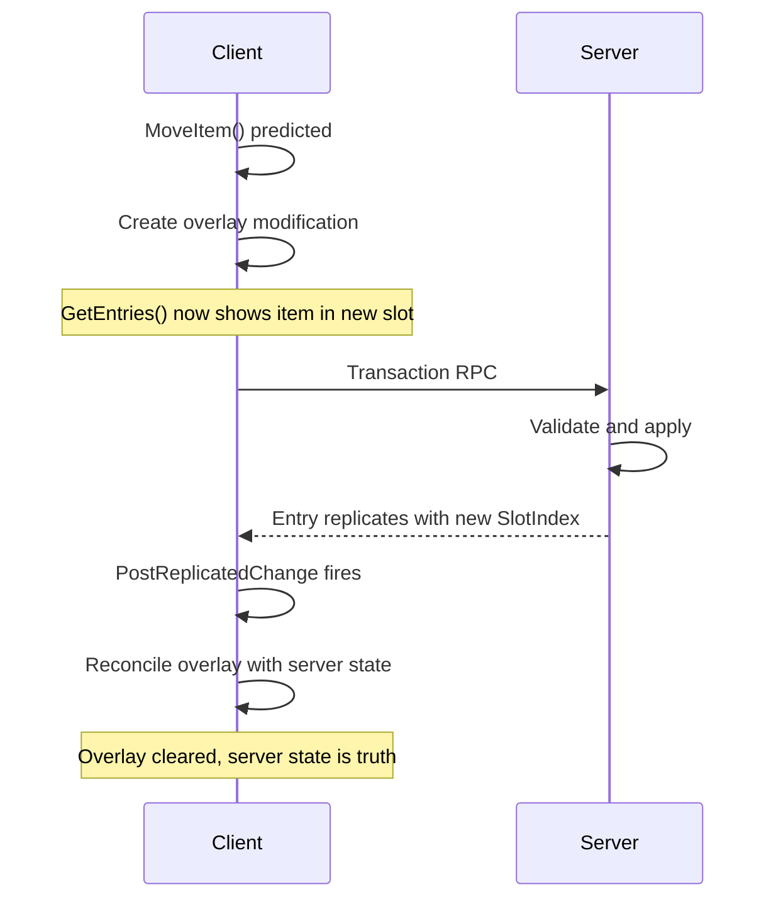

# Inventory Manager Component

You pick up loot from the ground. You open your inventory and see items arranged in slots. You drag an item from slot 3 to slot 7 - it moves instantly. But this is a networked game. How does drag-and-drop feel instant when the server needs to validate everything?

The Inventory Manager handles this. It stores items in numbered slots, enforces capacity limits, and provides responsive feedback through client-side prediction.

***

### Slot-Based Storage

The inventory stores items in numbered positions - slots 0, 1, 2, and so on up to a maximum. This isn't just an implementation detail; it's what makes inventory UIs work.

```
┌─────────────────────────────────────────────────────────────┐
│                    Slot-Based Inventory                     │
├─────────────────────────────────────────────────────────────┤
│                                                             │
│  Slot 0    Slot 1    Slot 2    Slot 3    Slot 4             │
│  ┌─────┐  ┌─────┐  ┌─────┐  ┌─────┐  ┌─────┐                │
│  │Rifle│  │     │  │Ammo │  │     │  │Meds │                │
│  └─────┘  └─────┘  └─────┘  └─────┘  └─────┘                │
│                                                             │
│   Item      Empty     Item      Empty     Item              │
│  at 0     (no item)   at 2    (no item)   at 4              │
│                                                             │
└─────────────────────────────────────────────────────────────┘
```

#### Why Slots Matter

* Grid layouts: Your inventory UI probably shows a grid. Each cell is a slot. Items appear in specific cells, not just "somewhere in the bag."
* Drag and drop: When you drag an item, you're moving it from one slot to another. Source and destination are slot indices.
* Visual consistency: A player's inventory looks the same way every time they open it. Items stay in their slots until moved.

#### What Gets Stored

Each item in the inventory is stored as an entry containing:

* Instance: The actual item (a `ULyraInventoryItemInstance`)
* SlotIndex: Which slot (0 to max)
* Prediction metadata: For reconciliation with server state

When you move an item from slot 2 to slot 5, we don't create a new entry - the existing entry's `SlotIndex` changes from 2 to 5.

<details>

<summary>Entry Structure Deep Dive</summary>

Each inventory entry is stored as `FLyraInventoryEntry`:

```cpp
struct FLyraInventoryEntry : public FFastArraySerializerItem
{
    // Position in the inventory
    int32 SlotIndex;

    // The item
    TObjectPtr<ULyraInventoryItemInstance> Instance;

    // Prediction support
    FContainerPredictionStamp Prediction;  // For reconciliation
};
```

Why FastArray?

* The inventory list uses `FFastArraySerializer` for delta replication:
  * Only changed entries replicate (not the entire array)
  * Built-in callbacks for add/change/remove
  * Integrates with prediction system via those callbacks

The Prediction Stamp

* Each entry carries a `FContainerPredictionStamp` containing:
  * `PredictionKey` - Links to the ability system prediction
  * `Guid` - Unique identifier for this entry across client/server
  * Used during reconciliation to match predicted entries with server entries

</details>

***

### Capacity Limits

The Inventory Manager enforces up to three independent limits:

#### Weight Limit

Each item contributes weight based on its definition. The inventory tracks total weight and rejects items that would exceed the limit.

```cpp
// 0 = unlimited
float MaxWeight = 10.0f;
```

#### Item Count Limit

Total count of items, including stack quantities. A stack of 30 ammo counts as 30 items.

```cpp
// 0 = unlimited
int32 ItemCountLimit = 100;
```

#### Slot Limit

Maximum number of occupied slots (stacks). A stack of 30 ammo occupies 1 slot.

```cpp
// 0 = unlimited
int32 LimitItemInstancesStacks = 20;
```

#### How Limits Interact

When adding an item, all applicable limits must pass:

```
Can this item be added?
├── Weight: CurrentWeight + ItemWeight ≤ MaxWeight?
├── Count: CurrentCount + StackSize ≤ ItemCountLimit?
└── Slots: If new slot needed, OccupiedSlots < SlotLimit?

All must pass → Item accepted
Any fails → Item rejected (or partial acceptance for stackables)
```

This allows flexible configuration:

* Weight-based inventory: Set MaxWeight, leave counts unlimited. Realistic survival games.
* Grid inventory: Set slot limit to match grid size. Tetris-style inventories.
* Simple inventory: Just limit total items. Casual games.

***

### Auto-Compaction

When items are removed from the inventory, gaps can appear in the slot indices. The auto-compact feature automatically shifts items to fill these gaps.

#### Enabling Auto-Compaction

```cpp
// Items automatically fill gaps when removed
UPROPERTY(EditDefaultsOnly, BlueprintReadOnly, Category = "Inventory|Behavior")
bool bAutoCompactOnRemoval = false;
```

When enabled, removing an item triggers compaction:

```
Before removal (removing slot 2):
Slot 0    Slot 1    Slot 2    Slot 3    Slot 4
┌─────┐  ┌─────┐  ┌─────┐  ┌─────┐  ┌─────┐
│Rifle│  │Ammo │  │Meds │  │Armor│  │Food │
└─────┘  └─────┘  └─────┘  └─────┘  └─────┘

After removal with bAutoCompactOnRemoval = true:
Slot 0    Slot 1    Slot 2    Slot 3
┌─────┐  ┌─────┐  ┌─────┐  ┌─────┐
│Rifle│  │Ammo │  │Armor│  │Food │
└─────┘  └─────┘  └─────┘  └─────┘

After removal with bAutoCompactOnRemoval = false:
Slot 0    Slot 1    Slot 2    Slot 3    Slot 4
┌─────┐  ┌─────┐  ┌─────┐  ┌─────┐  ┌─────┐
│Rifle│  │Ammo │  │     │  │Armor│  │Food │
└─────┘  └─────┘  └─────┘  └─────┘  └─────┘
```

#### Use Cases

**Auto-compact ON:**

* List-based inventories (like Apex Legends)
* Simple bag inventories where slot position doesn't matter

**Auto-compact OFF:**

* Grid inventories where players arrange items manually
* Hotbar-style inventories where slot = keybind
* Games where item position has gameplay meaning

#### Prediction Support

Auto-compaction is fully client-predicted. When you remove an item:

1. The removal AND all slot shifts happen with the same prediction key
2. UI updates immediately show compacted state
3. Server validates and confirms (or rejects both together)

This means drag-and-drop and item removal feel instant, even in networked games.


Manual slot rearrangement can be controlled via the permission system (`UItemPermissionComponent`). Auto-compaction only affects removal, it doesn't prevent players from manually arranging items.


***

### Item Filtering

You can restrict what items can enter the inventory:

#### Allowlist

If non-empty, **ONLY** these items can be added:

```cpp
TArray<ULyraInventoryItemDefinition*> AllowedItems;
// Example: [AmmoDef, GrenadesDef] - ammo pouch
```

#### Denylist

These items can **NEVER** be added:

```cpp
TArray<ULyraInventoryItemDefinition*> DisallowedItems;
// Example: [WeaponDef] - no weapons in this container
```

If both are empty, all items are allowed.

Use cases:

* Ammo pouch: Allowlist with only ammo types
* Medical bag: Allowlist with only healing items
* General storage: No filtering
* Backpack: Deny other backpacks

***

### How Items Enter and Move

Items don't just appear in inventory, they arrive through the transaction system. When a pickup adds an item:



#### Validate

Check limits, filtering, slot availability.



#### Find slot

Either a specific target slot or the first available.



#### Create entry

Create the entry with item instance + slot index + prediction metadata.



#### Update item

Set the item's `CurrentSlot` to point to this inventory.



#### Replicate

FastArray replicates the new entry to clients.



Moving an item between slots follows the same pattern, validate the destination, update the entry's slot index, replicate.


For how transactions work across all containers, see [Item Container Transactions](../item-container/transactions/).


<details>

<summary>Replication Internals</summary>

Inventory uses multiple replication mechanisms:

**FastArray for Entries** The inventory list (`FLyraInventoryList`) extends `FFastArraySerializer`. When entries change, only the delta replicates - not the entire inventory.

**Why ReplicateSubobjects Matters**

Unlike Actor properties, UObjects don't replicate automatically. When you mark a `UPROPERTY` as `Replicated` on an Actor, Unreal handles it. But `ULyraInventoryItemInstance` is a UObject owned by the component, not the Actor - it won't replicate unless you explicitly tell the engine to do so.

This is what `ReplicateSubobjects` does. The Inventory Manager overrides it to register each item instance with the replication system:

```cpp
bool ULyraInventoryManagerComponent::ReplicateSubobjects(UActorChannel* Channel,
    FOutBunch* Bunch, FReplicationFlags* RepFlags)
{
    bool bWroteSomething = Super::ReplicateSubobjects(Channel, Bunch, RepFlags);

    for (FLyraInventoryEntry& Entry : InventoryList.Entries)
    {
        if (Entry.Instance)
        {
            // Register the item instance for replication
            bWroteSomething |= Channel->ReplicateSubobject(Entry.Instance, *Bunch, *RepFlags);

            // Also replicate any runtime fragments on the item
            for (UTransientRuntimeFragment* Fragment : Entry.Instance->GetRuntimeFragments())
            {
                bWroteSomething |= Channel->ReplicateSubobject(Fragment, *Bunch, *RepFlags);
            }
        }
    }
    return bWroteSomething;
}
```

Without this, clients would receive the FastArray entries (slot indices, GUIDs) but the actual item instances would be null - the UObject data wouldn't exist on the client.

**What Replicates vs Local-Only**

| Data                 | Replicates | Notes                          |
| -------------------- | ---------- | ------------------------------ |
| Inventory entries    | Yes        | Via FastArray delta            |
| Item instances       | Yes        | Via `ReplicateSubobjects`      |
| Runtime fragments    | Yes        | Also via `ReplicateSubobjects` |
| Prediction overlays  | **No**     | Local to owning client         |
| Permission component | Yes        | Separate replication           |

**Why UObjects Instead of Actors?**

Items are UObjects (subobject replication) rather than Actors because:

* **Performance:** Actor spawning is expensive. Picking up 50 items would spawn 50 networked actors.
* **Stable identity:** The same UObject exists on client and server, referenced by GUID.
* **Ownership hierarchy:** Items are logically owned by the inventory component, not the world.

**For Custom Runtime Fragments**

If you create a runtime fragment that owns other UObjects (like the attachment system does), you must also override `ReplicateSubobjects` on your fragment to replicate those nested objects.

</details>

***

### Reading Inventory State

Now that you understand how items are stored, here's how to query them.

#### "How many of this item do I have?"

For ammo counters, crafting checks, or quest objectives:

```cpp
// Total count across all stacks
int32 AmmoCount = InventoryManager->GetTotalItemCountByDefinition(AmmoDef);

// Find the first stack of this item type
ULyraInventoryItemInstance* FirstStack = InventoryManager->FindFirstItemStackByDefinition(AmmoDef);
```

#### "Is there room for this pickup?"

Before picking up an item, check if the inventory can accept it:

```cpp
// Returns how many can be accepted (may be less than requested for partial stacking)
int32 CanAccept = InventoryManager->CanAcceptItem(SlotInfo, Item, Instigator);

// Or find any available slot
FInstancedStruct OutSlot;
bool HasRoom = InventoryManager->FindAvailableSlot(ItemDef, Item, OutSlot);
```

#### "What's in slot 3?"

For UI or direct slot access:

```cpp
ULyraInventoryItemInstance* Item = InventoryManager->GetItemInSlot(SlotInfo);
```

#### "Show all items in the inventory"

For building the inventory UI:

```cpp
const TArray<FLyraInventoryEntry>& Entries = InventoryManager->GetEntries();

for (const FLyraInventoryEntry& Entry : Entries)
{
    int32 Slot = Entry.SlotIndex;
    ULyraInventoryItemInstance* Item = Entry.Instance;

    // Display in UI...
}
```

`GetEntries()` returns the effective view, what the player should actually see right now. On the server, this is the authoritative inventory. On the owning client, it combines server state with any pending predictions. When you drag an item to a new slot, `GetEntries()` immediately reflects the new position, even before the server confirms, because the prediction is part of the effective view.

This is why drag-and-drop feels instant.

***

### Starting Items

A shop NPC needs a fixed inventory of goods for sale. A loot chest needs pre-determined contents. A player's backpack starts with a medkit and some ammo. Rather than writing custom spawn logic for each case, the Inventory Manager has a `DefaultStartingItems` array that populates items automatically during initialization.

#### **The Starting Item Structure**

Each entry describes one item to add:

```cpp
USTRUCT(BlueprintType)
struct FInventoryStartingItem
{
    // Which item to create
    TSubclassOf<ULyraInventoryItemDefinition> ItemDef;

    // How many items in this stack (default 1)
    int32 StackCount = 1;

    // Target slot index (-1 = first available)
    int32 SlotIndex = INDEX_NONE;

    // Per-instance overrides applied when the item is created
    TArray<FInstancedStruct> FragmentInitData;
};
```

| Field              | Purpose                                                                         |
| ------------------ | ------------------------------------------------------------------------------- |
| `ItemDef`          | The item definition class to instantiate                                        |
| `StackCount`       | Number of items in this stack (clamped to minimum 1)                            |
| `SlotIndex`        | Specific slot to place in, or `INDEX_NONE` to auto-place in first available     |
| `FragmentInitData` | Polymorphic per-instance overrides applied before the item enters the inventory |

#### **Slot Placement**

When `SlotIndex` is left at its default (`INDEX_NONE`), the item is placed in the first available slot. Set it to a specific number to control exact placement, useful for shop inventories or containers where item position matters.

#### **Fragment Init Data**

`FragmentInitData` lets you customize each starting item without creating a separate item definition for every variation. The same medkit definition can start with different durability values. The same rifle can start with different ammo counts or attachments.

Each entry is an `FInstancedStruct` derived from `FLyraFragmentInitBase`. When the item is created, each init struct's `ApplyToItem()` is called to modify the instance before it enters the inventory.

For the full details on available init types and how to create custom ones, see Fragment Initialization.

#### **The Flow**

```
BeginPlay (server-authority only)
       │
       ▼
AddStartingItems()
       │
       ▼
┌──────────────────────────────────────────────┐
│  For each FInventoryStartingItem:            │
│                                              │
│  1. Create item instance from ItemDef        │
│  2. Apply FragmentInitData to the instance   │
│  3. Add to inventory (bForceAdd = true)      │
│     └─ SlotIndex or first available          │
│                                              │
└──────────────────────────────────────────────┘
```

Starting items bypass normal capacity checks (`bForceAdd = true`) since they represent the designed initial state of the container. They only run on the server, clients receive the items through normal replication.

#### **Practical Example**

A shop NPC selling medical supplies and ammunition:

```
DefaultStartingItems:
┌─────────────────────────────────────────────────────────────────┐
│ [0] Medkit                                                      │
│     ItemDef:        ID_Consumable_Medkit                        │
│     StackCount:     3                                           │
│     SlotIndex:      0                                           │
│     FragmentInitData: (empty - use definition defaults)         │
│                                                                 │
│ [1] Assault Rifle                                               │
│     ItemDef:        ID_Rifle_Assault                            │
│     StackCount:     1                                           │
│     SlotIndex:      1                                           │
│     FragmentInitData:                                           │
│       └─ FStatTagsFragmentInit { Ammo.Magazine: 30,             │
│                                  Ammo.Reserve: 120 }            │
│                                                                 │
│ [2] Ammo Box                                                    │
│     ItemDef:        ID_Ammo_Rifle                               │
│     StackCount:     60                                          │
│     SlotIndex:      INDEX_NONE  (auto-place)                    │
│     FragmentInitData: (empty)                                   │
└─────────────────────────────────────────────────────────────────┘
```


`DefaultStartingItems` is configured directly on the Inventory Manager Component in your Blueprint. Different Blueprints (shop NPCs, loot chests, player backpacks) can each have different starting item configurations without any code changes.


***

### Client Prediction

When a player drags an item, they expect it to move immediately. The Inventory Manager supports client-side prediction to make this happen.



#### Client predicts

Move operation is applied locally; entry appears in new slot.



#### Server validates

Server receives the request, checks it's valid, applies the change.



#### Reconciliation

When server state arrives, client merges it with predictions.



#### If rejected

Prediction is rolled back; item returns to original position.



#### Change Notifications

When the inventory changes (for any reason), delegates fire:

```cpp
// Something changed - rebuild UI
InventoryManager->GetOnViewDirtied()->AddUObject(this, &HandleChange);
```


For UI, use [ViewModels](inventory-viewmodels-and-ui/) instead of these delegates directly. ViewModels handle prediction complexity for you.



For the complete prediction model, see [Prediction Architecture](../item-container/prediction/prediction-architecture.md).


<details>

<summary>How Prediction is Wired for Inventory</summary>

Inventory uses `FInventoryPredictionRuntime`, a PIMPL wrapper around `TGuidKeyedPredictionRuntime<FLyraInventoryEntry>`.

The Overlay Model

* Prediction works through "overlays" - client-side modifications layered on top of server state:

```
GetEntries() returns:
┌─────────────────────────────────┐
│     Server Entries (replicated) │
│  + Overlay Adds (predicted)     │
│  - Overlay Removes (predicted)  │
│  ~ Overlay Modifications        │
└─────────────────────────────────┘
```

Timeline of a Move Operation



OnRep Callbacks Drive Reconciliation

* When server state arrives:
  * `PostReplicatedAdd` - New entry from server, check if we predicted it
  * `PostReplicatedChange` - Entry modified, merge with predictions
  * `PostReplicatedRemove` - Entry removed, clear any predictions for it

</details>

***

***
