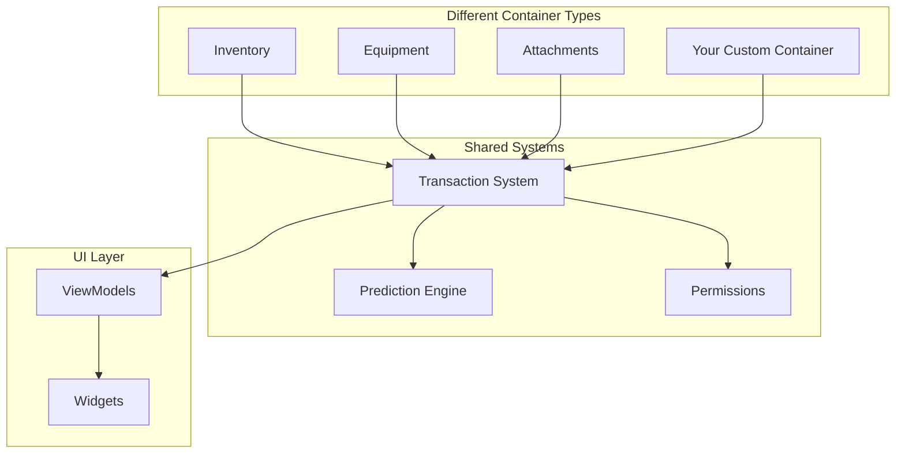

# Item Container

Every game with items faces the same challenge: where do those items live? A player's backpack, an equipment loadout, a weapon's attachment rail, a vendor's stock, a crafting station's input slots. Each of these is a **container**, something that holds items in addressable locations.

The naive approach is to build each container as a separate system. Your inventory has its own code. Equipment has its own code. Attachments have their own code. Before long, you're maintaining three (or more) parallel implementations of fundamentally similar logic: add items, remove items, move items, validate operations, handle multiplayer prediction.

This framework takes a different approach.

***

### The Core Idea

All containers implement a single interface: `ILyraItemContainerInterface`. This creates a unified abstraction where:

* **One transaction system** handles all item operations
* **One prediction system** provides responsive multiplayer for all containers
* **One permission model** controls access across the board
* **One UI architecture** displays any container type

The result: you write container-specific logic once (how slots work, what items fit where), and everything else comes for free.

***

### What This Section Covers

This documentation explains the **container-agnostic core**—the systems that make any container work. You'll learn:

| Section             | What You'll Understand                                                       |
| ------------------- | ---------------------------------------------------------------------------- |
| Architecture        | The interface contract, polymorphic slot descriptors, and design philosophy  |
| Transactions        | How operations are validated, executed atomically, and recorded for rollback |
| Prediction          | Client-side prediction, the overlay model, and server reconciliation         |
| Creating Containers | How to implement your own container types                                    |

Specific container implementations (Inventory, Equipment, Attachments, Tetris Inventory) have their own documentation sections. This section focuses on the machinery they all share.

***

### Reading Paths

Choose based on what you're trying to accomplish:

#### "I want to understand the system"

Start with The Container Contract to see what all containers have in common, then read How Transactions Work to understand how operations flow through the system.

#### "I need to debug a multiplayer issue"

Jump to The Overlay Model to understand how prediction works, then Reconciliation to see what happens when the server confirms or rejects.

#### "I want to create my own container type"

Read the Architecture section first, then go to Implementing the Interface for a step-by-step guide.

#### "I want to understand why it's designed this way"

Design Philosophy explains the trade-offs and reasoning behind major architectural decisions.

***

### Key Concepts at a Glance

Before diving in, here are the terms you'll encounter:

| Concept             | What It Means                                                                       |
| ------------------- | ----------------------------------------------------------------------------------- |
| **Container**       | Anything that holds items in slots (inventory, equipment, attachments, etc.)        |
| **Slot Descriptor** | A polymorphic struct that identifies a specific slot in any container type          |
| **Transaction**     | A batch of operations (move, split, remove, etc.) that succeeds or fails atomically |
| **Overlay**         | Client-side predicted state layered on top of server-authoritative state            |
| **Prediction Key**  | A GAS construct that tracks predicted operations for confirmation/rejection         |
