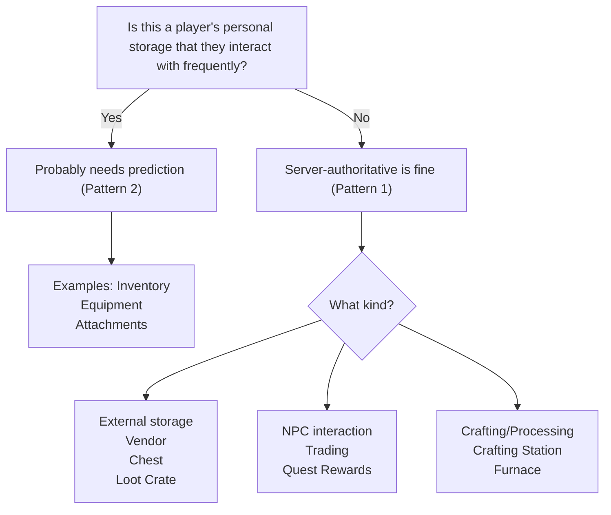

# Creating Containers

This section guides you through building custom item containers that integrate with the transaction system, prediction engine, and UI layer.

### When You Need a Custom Container

The framework ships with three container types:

* **Inventory** - Grid-based or list-based item storage
* **Equipment** - Tag-based equipment slots
* **Attachments** - Item-to-item attachment points

Create a custom container when you need:

* **Different slot semantics** - Slots identified by something other than index, tag, or attachment point
* **Specialized validation** - Rules that don't fit the standard containers
* **External storage** - Vendors, loot crates, trading posts, crafting stations

### About This Section

Throughout this section, we use a **Vendor** as our running example. It's simple to implement, different enough from the built-in containers to be interesting, and the patterns transfer to whatever custom container you're actually building.

***

### What's in This Section

| Page                                                        | Description                                            |
| ----------------------------------------------------------- | ------------------------------------------------------ |
| [Implementing the Interface](implementing-the-interface.md) | Step-by-step guide using a Vendor as example           |
| [Adding Prediction](adding-prediction.md)                   | How prediction changes the implementation pattern      |
| [Example: Predicted Vendor](example-predicted-vendor.md)    | Advanced example with atomic currency prediction       |
| [UI Integration](ui-integration.md)                         | Connect your container to the Item Container UI system |

### Why Implement the Interface?

You might wonder: why not just create a server RPC for your vendor's "Buy" function and handle it directly?

The answer is **integration**. When your container implements `ILyraItemContainerInterface`, it plugs into existing systems:

* **Transaction support** - Standard item moves automatically handle purchasing when `CanRemoveItem` validates currency
* **Validation pipeline** - Your `CanAcceptItem` and `CanRemoveItem` participate in pre-validation
* **Prediction ready** - If you later need client prediction, the infrastructure is already in place
* **UI compatibility** - Drag-and-drop, tooltips, and item displays work through the interface

The key insight is that **buying is just moving items**. When a player drags an item from a vendor to their inventory, the transaction system:

1. Calls `CanRemoveItem` on the vendor (validates currency, stock)
2. Calls `CanAcceptItem` on the inventory (validates space)
3. Executes the move if both pass

Your vendor's `CanRemoveItem` validates affordability, that's where the "purchase logic" lives. No special `Buy()` method needed.

### Two Implementation Patterns

#### Pattern 1: Server-Authoritative (No Prediction)

For containers where a brief network delay is acceptable:

* Vendors (server validates currency/stock)
* Loot crates (server controls spawning)
* Quest reward containers
* Trading with NPCs

Characteristics:

* Interface methods contain the actual logic
* Simple `UPROPERTY(Replicated)` for storage
* No `FFastArraySerializer` required
* `CanParticipateInClientPrediction` returns `false`

#### Pattern 2: Client-Predicted

For containers where instant feedback matters:

* Player inventory (constant interaction during gameplay)
* Equipment (weapon swapping in combat)
* Attachments (modding weapons)

Characteristics:

* Interface methods become thin wrappers
* Logic moves to traits + prediction runtime
* Requires `FFastArraySerializer` for replication callbacks
* `CanParticipateInClientPrediction` returns `true`


Start without prediction. Get your container working with Pattern 1 first. Add prediction later if the latency bothers players. Many containers (vendors, loot, crafting) work perfectly fine without it.


### Vendor Container Overview

Here's the mental model and structure we'll build.

#### The Mental Model



Player drags an item from vendor catalog to their inventory.



`CanRemoveItem` validates: stock available? player can afford?



`CanAcceptItem` validates: inventory has space?



Move executes: item created, stock decremented.



Ability deducts currency after successful transaction.



#### Minimal Vendor Sketch

```
VendorComponent implements ILyraItemContainerInterface
│
│  // Query methods (for UI display)
├── GetBuyPrice(CatalogIndex)         → Price to buy
├── GetSellPrice(ItemDef)             → What vendor pays
├── CanPlayerAfford(PC, CatalogIndex) → Affordability check
│
│  // Interface methods (called by transaction system)
├── CanAcceptItem        → Does vendor buy this item type?
├── CanRemoveItem        → Can player afford? Stock available?
├── AddItemToSlot        → Vendor receives item (sell)
├── RemoveItemFromSlot   → Vendor gives item (buy)
├── GetItemInSlot        → Item for catalog entry
├── ForEachItem          → Iterate catalog for UI
├── CanParticipateInClientPrediction → false (server authority)
│
│  // Data
└── Catalog: Array of (ItemDef, Stock, BuyPrice, SellPrice)
```

See [Implementing the Interface](implementing-the-interface.md) for the complete walkthrough.

### Prerequisites

Before creating a custom container, you should understand:

1. **The Container Contract** - What methods you need to implement and what guarantees you must provide. See [The Container Contract](../item-container-architecture/the-container-contract.md).
2. **Slot Descriptors** - How to define your slot type and integrate with the polymorphic slot system. See [Slot Descriptors](../item-container-architecture/slot-descriptors.md).
3. **Transactions** - How the transaction system calls into your container. See [How Transactions Work](../transactions/how-transactions-work/).

### Decision Guide


