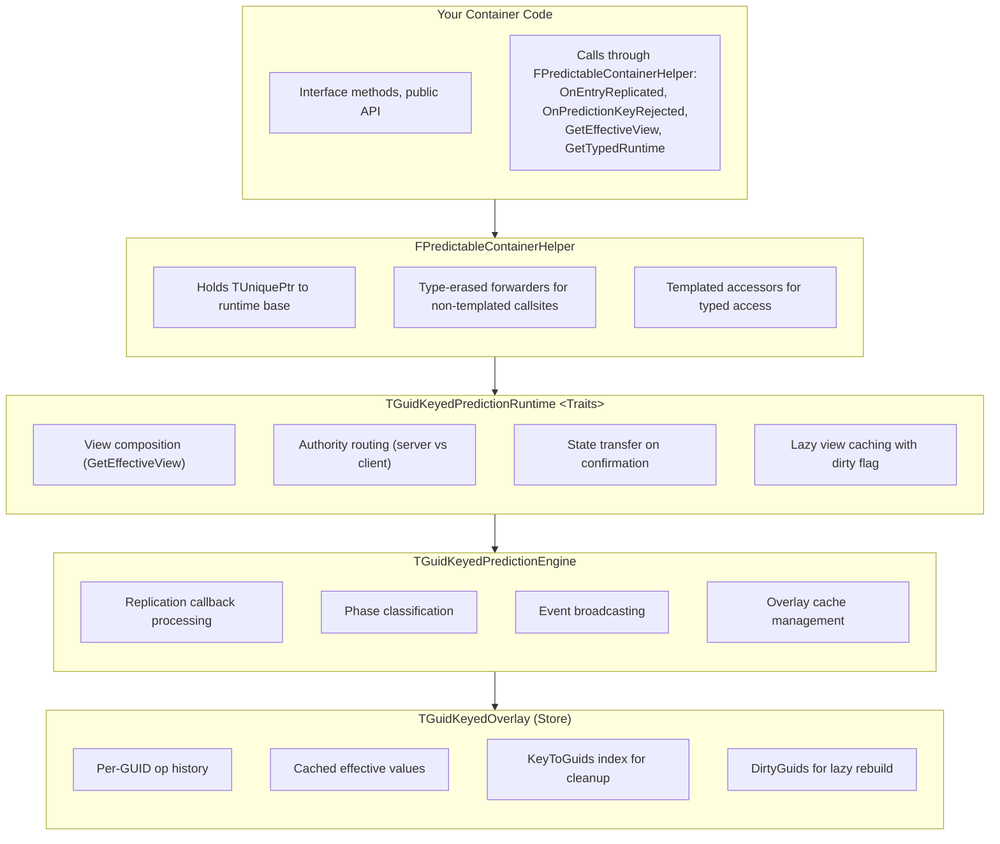
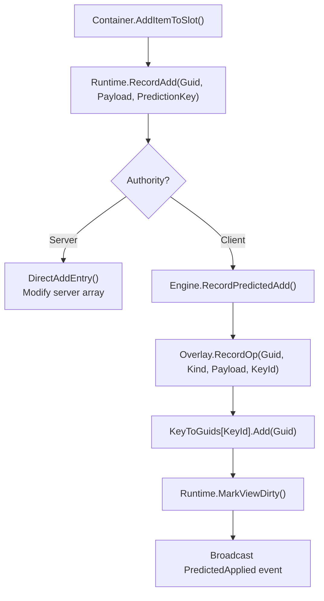
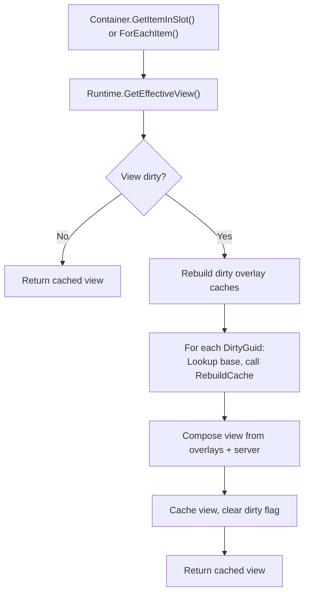
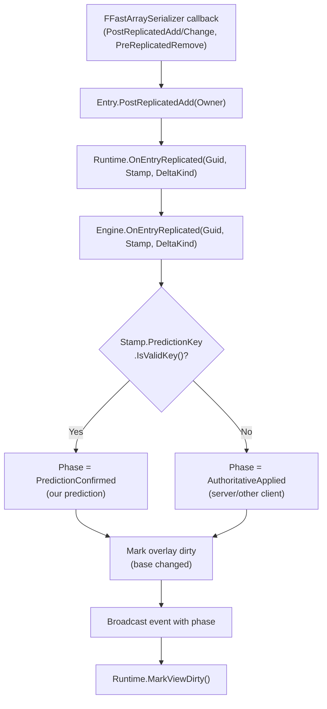

# Prediction Architecture

Before diving into overlays and reconciliation, it helps to understand the prediction system's structure: what components exist, how they connect, and where data flows. This page provides that top-down view.

***

## Component Overview

The prediction system is built from layered components, each with a specific responsibility:

<table><thead><tr><th width="262.3333740234375">Component</th><th>Purpose</th><th width="248.6666259765625">Key File</th></tr></thead><tbody><tr><td><strong><code>FPredictableContainerHelper</code></strong></td><td>Composition helper containers hold; type-erased owner of the runtime</td><td><code>PredictableContainerHelper.h</code></td></tr><tr><td><strong><code>FPredictableFastArrayItem</code></strong></td><td>Base USTRUCT entry structs derive from; carries the inherited prediction stamp</td><td><code>PredictableFastArrayItem.h</code></td></tr><tr><td><strong><code>TGuidKeyedPredictionRuntime</code></strong></td><td>Templated runtime instantiated per container traits; held by the helper</td><td><code>LyraGuidKeyedPredictionRuntime.h</code></td></tr><tr><td><strong><code>FGuidKeyedPredictionRuntimeBase</code></strong></td><td>Non-templated polymorphic base of the runtime; lets the helper hold it</td><td><code>GuidKeyedPredictionRuntimeBase.h</code></td></tr><tr><td><strong><code>TGuidKeyedPredictionEngine</code></strong></td><td>Replication processing, event broadcasting</td><td><code>LyraGuidKeyedPredictionEngine.h</code></td></tr><tr><td><strong><code>TGuidKeyedOverlay</code></strong></td><td>Storage for predicted operations</td><td><code>LyraGuidKeyedPredictionStore.h</code></td></tr><tr><td><strong>Traits</strong></td><td>Container-specific adapter methods</td><td>Per-container <code>*Traits.h</code> files</td></tr><tr><td><strong><code>FContainerPredictionStamp</code></strong></td><td>Inherited by FPredictableFastArrayItem; carried on every replicated entry</td><td><code>PredictableFastArrayItem.h</code></td></tr></tbody></table>

***

## Layered Architecture

The components form a layered stack. Your container code interacts with the top layer, which delegates downward:



### **Layer Responsibilities**

**Helper (Composition Layer)**

* The handle your container holds as a member field
* Owns the typed runtime through a non-templated polymorphic base so non-templated callsites can reach it through a single uniform pointer
* Forwards entry-replication callbacks, prediction-key handlers, and view-dirtied delegates straight to the runtime base
* Templated accessors (`GetTypedRuntime<Traits>`, `GetEffectiveView<Traits>`) return the typed runtime for callsites that need the recording API or the typed view

**Runtime (Templated Core)**

* The actual prediction algorithm, parameterised on the container's traits
* Routes operations based on authority (server modifies arrays directly, client records overlays)
* Composes the effective view by merging server state with overlay caches
* Maintains GUID index for O(1) base lookup

**Engine (Middle Layer)**

* Processes FFastArraySerializer replication callbacks
* Classifies phases (PredictionConfirmed vs AuthoritativeApplied)
* Manages overlay lifecycle (recording, clearing)
* Broadcasts events for side effects

**Store (Bottom Layer)**

* Per-GUID overlay with operation history
* Cached effective values (rebuilt lazily when dirty)
* KeyToGuids index for O(affected) CaughtUp/Rejected handling
* DirtyGuids tracking for incremental cache rebuild

***

## Data Flows

Understanding the three main data flows helps you trace what happens during prediction.



When a client predicts an operation:





When UI queries container state:





When server state replicates to client:





***

## The Traits Pattern

The prediction templates are generic, they don't know about your specific container types. Traits bridge this gap.

### Why Traits Exist

The prediction system needs to work with any container's data types. Consider what the runtime must do:

* Extract a GUID from your payload struct
* Iterate your server entries array
* Convert your entry to a view entry
* Modify your `FFastArray` directly

Each container has different types: `FLyraInventoryEntry` vs `FLyraAppliedEquipmentEntry` vs `FAttachmentEntry`. The runtime template needs a way to call the right methods on the right types.

**Why not inheritance?** \
A base class would force all containers to inherit from `UPredictedContainerBase`. But containers can be anything, `UActorComponent`, `URuntimeTransientFragment`, or any other `UObjec`t type. Adding an inheritance requirement creates coupling and limits flexibility.

**Why not a prediction interface?** \
An interface like `ILyraPredictedContainer` could define virtual methods. But interfaces work with pointers, not value types. The prediction system operates on structs (`FPayload`, `FServerEntry`) that are stored by value. Virtual methods require object pointers and `vtable` lookups, overhead that adds up when composing views every frame.

**Why not template parameters directly?** \
You could template the runtime on `TPayload, TServerEntry, TViewEntry`. But then you'd need to pass conversion functions somehow. Traits bundle the types _and_ the operations together in one place.

### What Traits Do

Traits are a struct of static methods that the templates call to interact with your container:

```cpp
struct FMyContainerTraits
{
    // Type definitions
    using TOwner = UMyContainerComponent;
    using FPayload = FMyContainerPayload;
    using FServerEntry = FMyContainerEntry;
    using FViewEntry = FMyContainerEntry;

    // Methods the templates call
    static FGuid GetGuid(const FPayload& Payload);
    static const TArray<FServerEntry>& GetServerEntries(const TOwner* Owner);
    static FViewEntry PayloadToViewEntry(const FPayload& Payload, const FPredictedOpMeta& Meta);
    // ... more methods
};
```

### Why Static Methods?



Compile-time binding

No vtable overhead, templates can inline.



No inheritance required

Your container doesn't need to inherit from anything.



Type safety

Compiler catches missing methods at compile time.



Explicit types

Clear mapping between container types and prediction types.



### Required Trait Methods

| Category            | Methods                                                                | Purpose                                                                         |
| ------------------- | ---------------------------------------------------------------------- | ------------------------------------------------------------------------------- |
| **Types**           | `TOwner`, `FPayload`, `FServerEntry`, `FViewEntry`                     | Type aliases for templates                                                      |
| **GUID**            | `GetGuid`, `GetGuidFromServerEntry`                                    | Extract stable identifier                                                       |
| **Server Access**   | `GetServerEntries`                                                     | Read the server array; the runtime owns mutable lookups itself                  |
| **View Conversion** | `PayloadToViewEntry`, `ServerEntryToViewEntry`, `ServerEntryToPayload` | Build unified view entries                                                      |
| **Authority**       | `IsAuthority`                                                          | Route operations correctly                                                      |
| **Direct Ops**      | `DirectAddEntry`, `DirectRemoveEntry`, `DirectChangeEntry`             | Server-side array mutations                                                     |
| **Slot**            | `PayloadToSlotStruct`                                                  | Build the slot descriptor written onto the item's CurrentSlot                   |
| **Replication**     | `TearOffReplicatedSubObject`                                           | Tear off a single sub-object; the runtime calls this for fragments and the item |
| **Stamping**        | `GetPredictionStampMutable`, `MarkEntryDirty`                          | Access prediction stamp                                                         |
| **Optional**        | `TransferPredictionState`, `PreparePredictedPayload`                   | Hooks for containers that move state from the overlay onto the confirmed entry  |


Don't be intimidated by the list. While the table above looks like a lot, traits follow a simple, repetitive pattern. Most methods are one-liners that just access your container's data structures, `GetGuid` returns a field, `GetServerEntries` returns an array reference, `IsAuthority` checks `HasAuthority()`. Once you've seen one traits file, you've seen them all.

Also remember: prediction is opt-in. You don't need any of this to create a working ItemContainer. Basic containers implement `ILyraItemContainerInterface` and work perfectly. Traits are only needed when you want client-side prediction for responsive multiplayer feel.


***

## Key Types

### `FPredictedOp`

A single predicted operation stored in the overlay:

```cpp
template<typename TPayload>
struct FPredictedOp
{
    int32 PredictionKeyId;   // FPredictionKey.Current
    EItemDeltaKind Kind;     // Add, Change, Remove
    TPayload Payload;        // State after this op
};
```

### `FGuidOverlay`

Per-GUID overlay with operation history and cached effective state:

```cpp
template<typename TPayload>
struct FGuidOverlay
{
    TArray<FPredictedOp<TPayload>> Ops;  // Operation history
    bool bCacheDirty;                     // Needs rebuild
    bool bCachedIsTombstone;              // Effective state is "removed"
    TPayload CachedValue;                 // Cached effective value
};
```

### `TGuidKeyedOverlay`

The overlay store with indices for efficient operations:

```cpp
template<typename TPayload>
struct TGuidKeyedOverlay
{
    TMap<FGuid, FGuidOverlay<TPayload>> Overlays;
    TSet<FGuid> DirtyGuids;                    // For lazy cache rebuild
    TMap<int32, TSet<FGuid>> KeyToGuids;       // For O(affected) CaughtUp/Rejected
};
```

### `FContainerPredictionStamp`

Embedded in each replicated entry to track prediction metadata:

```cpp
struct FContainerPredictionStamp
{
    // The GAS prediction key that last modified this entry
    FPredictionKey LastModifyingPredictionKey;

    // Local-only tracking (not replicated)
    int32 LastLocalPredictedKeyId = INDEX_NONE;
};
```

**`LastModifyingPredictionKey`**: Stamped by the server when a predicted operation is applied. Due to `FPredictionKey`'s network serialization, `IsValidKey()` returns true only on the originating client, enabling phase classification.

**`LastLocalPredictedKeyId`**: Used locally to track whether this entry has a pending prediction. Set when the client records an overlay, cleared when the prediction is confirmed or rejected.

### `EReplicatedDeltaKind`

Indicates what kind of change occurred during replication:

```cpp
enum class EReplicatedDeltaKind : uint8
{
    Added,    // Entry was added to the server array
    Changed,  // Entry was modified in the server array
    Removed   // Entry was removed from the server array
};
```

***

## How Components Connect

Here's how a typical predicted container wires everything together:

```cpp
// Container can be any UObject type: UActorComponent, UTransientRuntimeFragment, etc.
// The entry struct derives from FPredictableFastArrayItem so the prediction stamp is inherited.
UCLASS()
class UMyContainer : public UActorComponent, public ILyraItemContainerInterface
{
    // Replicated storage (FFastArraySerializer for callbacks).
    UPROPERTY(Replicated)
    FMyContainerList ItemList;

public:
    virtual void InitializeComponent() override
    {
        Super::InitializeComponent();
        PredictionHelper.InitRuntimeAs<FMyContainerTraits>(this);
        ItemList.OwnerComponent = this;
    }

    // Interface methods delegate to the typed runtime through the helper.
    virtual bool AddItemToSlot(...) override
    {
        PredictionHelper.GetTypedRuntime<FMyContainerTraits>()->RecordAdd(Guid, Payload, PredictionKey);
        return true;
    }

    // Query methods use the composed effective view.
    virtual ULyraInventoryItemInstance* GetItemInSlot(...) const override
    {
        for (const auto& Entry : PredictionHelper.GetEffectiveView<FMyContainerTraits>())
        {
            if (MatchesSlot(Entry, SlotInfo))
                return Entry.Item;
        }
        return nullptr;
    }

    // Prediction-key handlers route through the helper.
    virtual void OnPredictionKeyRejected(int32 KeyId) override { PredictionHelper.OnPredictionKeyRejected(KeyId); }
    virtual void OnPredictionKeyCaughtUp(int32 KeyId) override { PredictionHelper.OnPredictionKeyCaughtUp(KeyId); }

    FPredictableContainerHelper* GetPredictionHelper() { return &PredictionHelper; }

private:
    FPredictableContainerHelper PredictionHelper;
};

// FFastArray callbacks on the list route through the helper.
void FMyContainerList::PostReplicatedAdd(const TArrayView<int32> AddedIndices, int32 FinalSize)
{
    UMyContainer* Comp = Cast<UMyContainer>(OwnerComponent);
    FPredictableContainerHelper* Helper = Comp ? Comp->GetPredictionHelper() : nullptr;

    for (int32 Index : AddedIndices)
    {
        if (Entries.IsValidIndex(Index))
        {
            FMyContainerEntry& Entry = Entries[Index];
            const FGuid EntryGuid = Entry.Item ? Entry.Item->GetItemInstanceId() : FGuid();
            if (Helper && EntryGuid.IsValid())
            {
                Helper->OnEntryReplicated(EntryGuid, Entry.Prediction, EReplicatedDeltaKind::Added);
            }
        }
    }
}

// PostReplicatedChange and PreReplicatedRemove follow the same shape with the matching delta kind.
// PostReplicatedReceive marks the helper's view dirty so consumers rebuild against the new state.
```


This is a very simple example showing the key wiring points. For the complete implementation, see [Adding Prediction](../creating-containers/adding-prediction.md).


***
