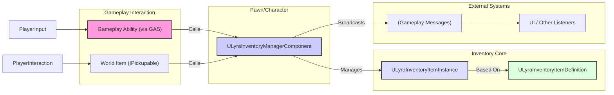
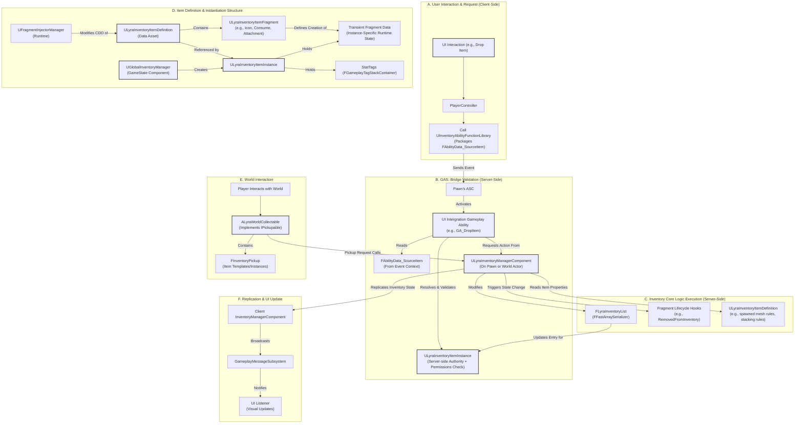

# Items

This system provides a robust, flexible, and networked foundation for managing items within your game. It builds upon Lyra's core concepts but significantly extends them to offer a feature-rich solution suitable for complex shooter and RPG mechanics.

### Purpose: Beyond Simple Storage

This inventory system goes far beyond just holding a list of items. It's designed to:

* Define complex item types with modular behaviors (**Fragments**).
* Allow items to store unique, instance-specific data (**Transient Data**).
* Handle sophisticated item interactions (Combining, Attaching).
* Integrate seamlessly and safely with the Gameplay Ability System (**GAS**) for item usage and UI interactions.
* Manage item representation in the game world (**Pickups**).
* Enforce fine-grained access control in multiplayer environments (**Permissions & Access Rights**).
* Provide efficient ways to query and track inventory contents (**Item Query**).
* Support extensibility through external game features (**Fragment Injector**).
* Offer centralized item management (**Global Inventory Manager**).

Essentially, it aims to be the backbone for any gameplay systems involving item acquisition, management, modification, and usage.

***

### Core Philosophy & Design

The design adheres to several key principles:

* **Modularity via Fragments:** Item functionality is broken down into composable `ULyraInventoryItemFragment`s. Instead of deep inheritance chains, items gain behaviors (like being equippable, consumable, attachable, or having a grid icon) by adding the relevant fragments to their definition.
* **Data-Driven:** Item types (`ULyraInventoryItemDefinition`) and their core behaviors are defined primarily in Data Assets, empowering designers and reducing the need for code changes for simple item variations.
* **Instance-Specific State:** Recognizing that identical items can have different runtime states (e.g., different ammo counts, durability, attachments), the system introduces **Transient Fragments** (`FTransientFragmentData` and `UTransientRuntimeFragment`) allowing `ULyraInventoryItemInstance`s to store unique data beyond simple stack counts.
* **Networked & Secure:** Built for multiplayer, the system uses Unreal's replication features (including `FFastArraySerializer` and subobject replication). It includes **Access Rights** and **Permissions** to control who can see and interact with inventories. Crucially, **GAS integration** is designed to prevent clients from directly manipulating server-side inventory state, using events and data structs for safe communication.
* **Decoupled & Extensible:** Components like the Inventory Manager operate independently of UI. UI interacts via GAS and listens to Gameplay Messages. The **Fragment Injector** allows external plugins (Game Features) to modify existing item definitions non-destructively.

***

### Major Features & Enhancements

This system includes numerous features beyond a basic inventory:

* **Item Definition & Instance:** Core Lyra concepts maintained.
* **Modular Fragments:** Define item behavior piece by piece (Equippable, Consumable, Attachment, Pickup, Category, Icon, etc.).
* **Transient Data:** Instance-specific data storage via `FTransientFragmentData` (Structs) and `UTransientRuntimeFragment` (UObjects).
* **Runtime Fragments:** UObject-based transient fragments for complex logic and networking needs.
* **Inventory Manager Component:** The primary container with support for limits (Weight, Count, Slots, Item Types) and permission controls.
* **Access Rights & Permissions:** Fine-grained control over inventory visibility and interaction per player.
* **GAS Integration Layer:** Safe UI-to-Server interaction via `UInventoryAbilityFunctionLibrary` and `FAbilityData_SourceItem` structs.
* **Attachment System:** A robust fragment-based system allowing items to have attachments, including nested attachments.
* **Pickup System:** `IPickupable` interface and `ALyraWorldCollectable` actor for representing items in the world.
* **Global Inventory Manager:** Centralized creation of item instances and management of world containers.
* **Item Query System:** Efficiently track specific items in an inventory using `ULyraInventoryQuery` and `UAsyncAction_ItemQuery`.
* **Fragment Injector:** Allows Game Features/Plugins to add fragments to existing item definitions at runtime.

***

### Key Components at a Glance

* **`ULyraInventoryItemDefinition`:** The static definition (template) of an item type.
* **`ULyraInventoryItemInstance`:** A runtime instance of an item, holding unique state (Stat Tags, Transient/Runtime Fragments).
* **`ULyraInventoryItemFragment`:** Base class for modular item behaviors/data added to Definitions.
  * `FTransientFragmentData` / `UTransientRuntimeFragment`: Bases for instance-specific data/logic.
* **`ULyraInventoryManagerComponent`:** The Actor Component that holds and manages a list of items (`FLyraInventoryList`). Enforces rules, permissions, and replication.
* **`UInventoryAbilityFunctionLibrary`:** Provides Blueprint functions for safe GAS interaction (UI -> Server).
* **`FAbilityData_SourceItem` (and derivatives):** Structs used to safely identify item locations (Inventory, Equipment, Attachment) when triggering GAS abilities.
* **`IPickupable` / `ALyraWorldCollectable`:** Interface and Actor for world item representation and pickup logic.
* **`UGlobalInventoryManager`:** GameState Component for central item creation and world container tracking.
* **`ULyraInventoryQuery` / `UAsyncAction_ItemQuery`:** Classes for tracking inventory contents efficiently.
* **`UFragmentInjector` / `UFragmentInjectorManager`:** System for modularly adding fragments from plugins.

***

### High-Level Interaction Diagram









This example uses the inventory manager component, but the gameplay ability could call other components like the quickbar component or equipment component. It can even have it's own logic inside.




***

### Exploring Further

This inventory system is extensive. Use the following sections to dive into specific areas:

* **Core Concepts: Items & Fragments:** Understanding Definitions, Instances, Stat Tags, and the different Fragment types (Base, Transient Struct, Transient UObject).
* **Inventory Manager Component:** Details on the primary inventory container, its rules, operations, and crucially, Access Rights & Permissions.
* **GAS & UI Integration Layer:** How the UI safely interacts with the inventory via GAS, Ability Source Structs, and the Function Library.
* **World Interaction & Global Management:** How items exist outside inventories (`IPickupable`, `ALyraWorldCollectable`) and the role of the `UGlobalInventoryManager`.
* **Item Query System:** Efficiently tracking inventory contents.
* **Modularity: Fragment Injector:** Adding functionality via plugins.
* **Item Fragments In-Depth:** Detailed explanations and usage for specific fragments (Attachment, Consume, Icon, Category, Pickup, SetStats).

***

This overview sets the stage for the deep dive into the Inventory System's components and features. Let's proceed to the next page on "Core Concepts: Items & Fragments".
