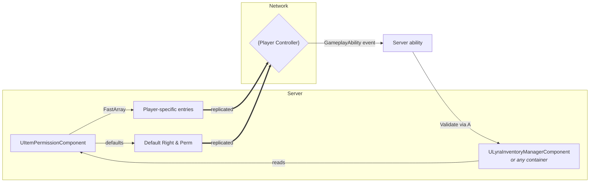

# Access Rights & Permissions

> _“Can this client **see** the container at all?_\
> _And if so, what exactly are they **allowed to do** with the things inside it?”_

That two-step question is the entire purpose of the Access Rights & Permissions layer.\
Everything else – replication filters, UI greying-out, GAS security checks – flows from those two answers.

***

### Why the system exists

* **Bandwidth & privacy** – In a networked game you rarely want to replicate every inventory to every client.\
  By rating each client **No Access → Read-Only → Full Access** you cut bandwidth and keep sneaky eyes away from loot they shouldn’t even know exists.
* **Authoritative security** – Even if a client can _see_ an item, the server still decides what the client may _do_ with it: move, equip, consume, split stacks, etc.\
  Those fine-grained decisions live in the **Permissions** bitmask so you never end up with spaghetti RPC checks scattered around inventory code.
* **Reuse & composition** – The entire layer is a lightweight `UObject` that any container (inventory, equipment, world stash, crafting grid) can plug in.\
  No inheritance webs, no duplicated enums – one component, one interface.

***

### Core concepts at a glance

| Concept          | What it answers                                 | Type    | Typical values                                                                               |
| ---------------- | ----------------------------------------------- | ------- | -------------------------------------------------------------------------------------------- |
| **Access Right** | “Do I replicate this container to you?”         | Enum    | `NoAccess`, `ReadOnly`, `FullAccess`                                                         |
| **Permission**   | “If you _can_ see it, which actions are legal?” | Bitmask | `MoveItems`, `PutInItems`, `TakeOutItems`, `EquipItems`, `UseItems` (or the combined `Full`) |

#### Evaluation order

1. **Access Right** gate – if the result is below _ReadOnly_, replication for that container is skipped and every gameplay call instantly fails.
2. **Permissions** check – only evaluated when Access Right is _FullAccess_.

This strict order means a single `NoAccess` can short-circuit a thousand later checks.

***

### High-level data flow

* **FastArray** replication keeps per-player overrides small and incremental.
* Containers fetch the component once per call – no caches, no globals.
* Every client gets _exactly_ the data their access level affords, nothing more.

***

### A mental model to keep in mind

> _Access Right decides **visibility**,_\
> _Permission decides **ability**._

If you remember that sentence you can usually predict how the container, GAS bridge, or UI will behave before writing a line of code.
