# GAS & UI Integration Layer

A critical challenge in networked games is allowing client-side actions (like a player clicking buttons in their inventory UI) to safely trigger changes to server-authoritative state (like moving or using an item in their `ULyraInventoryManagerComponent`). Directly calling server functions from the UI is generally insecure and couples the UI tightly to the backend logic.

Item containers (inventory, equipment, attachments) that manipulate items utilize the **Gameplay Ability System (GAS)** as a **secure and flexible integration layer** between the client-side UI and the server-side state modification.

### The Problem: Direct UI-to-Server Calls

* **Security Risks:** Allowing UI widgets (which exist only on the client) to directly call RPCs on item containers could allow malicious clients to cheat by sending invalid requests.
* **Coupling:** Tightly couples the UI implementation to the specific functions and structure of the item containers.
* **Prediction Complexity:** Implementing client-side prediction for direct interactions becomes difficult.
* **Code Bloat:** Often leads to routing UI requests through intermediate objects like the Player Controller, bloating its responsibilities.

### The Solution: GAS as an Interface

This system leverages GAS to overcome these issues:

1. **Gameplay Events:** The UI triggers generic **Gameplay Events** via GAS (e.g., `Event.Inventory.MoveItem`, `Event.Inventory.UseItem`).
2. **Gameplay Abilities:** Server and potentially client instances of **Gameplay Abilities** listen for these events. These abilities contain the actual logic for interacting with item containers.
3. **Data Payloads (`FAbilityData_SourceItem`):** Instead of passing raw `ULyraInventoryItemInstance` pointers (which are insecure and might not exist on the client triggering the event), the Gameplay Event carries **data structs** (derived from `FAbilityData_SourceItem`) that describe _how to find_ the relevant item(s) based on their location (e.g., "Item at index 5 in Player Inventory Component" or "Item in Equipment Slot Primary").
4. **Server Validation:** The server-side Gameplay Ability receives the event and the source data struct. It uses the struct's `GetSourceItem` function (which includes **permission checks**) to securely resolve the actual `ULyraInventoryItemInstance` on the server.
5. **Authoritative Action:** Only after validating the source and permissions does the server-side ability call the appropriate function on the `ULyraInventoryManagerComponent`.
6. **Client Prediction (Optional):** Client-side versions of the Gameplay Abilities can potentially run predictive logic based on the event data, providing smoother feedback, although the server remains authoritative.
7. **Decoupling & UI Simplification:** The UI only needs to know which Gameplay Event tag to send and how to package the source data struct. It doesn't need direct knowledge of the `ULyraInventoryManagerComponent`'s functions or even the specific type of source/destination (inventory, equipment, etc.). This abstraction allows for simpler UI, such as a single type of "dragged item visual" that can represent an item from any source, as it just carries the standardized `FInstancedStruct` payload.

### Key Components of the Integration Layer

* **`UInventoryAbilityFunctionLibrary`:** A Blueprint Function Library providing convenient nodes for UI Blueprints to easily trigger Gameplay Events with the necessary data payloads (`FAbilityData_SourceItem` structs). It handles wrapping the data correctly for GAS.
* **`FAbilityData_SourceItem` (and derived structs):** Abstract base struct and concrete implementations (`FInventoryAbilityData_SourceItem`, `FEquipmentAbilityData_SourceEquipment`, `FAttachmentAbilityData_SourceAttachment`, `FNullSourceSlot`) that act as safe "pointers" or identifiers for item locations within different contexts. They contain the logic (`GetSourceItem`) to resolve the actual item instance _on the authority_ while checking permissions.
* **Gameplay Abilities (Derived from `UGameplayAbility` or `ULyraGameplayAbility`):** These abilities are granted to the player/character and are triggered by specific Gameplay Event Tags sent from the UI (via the function library). They contain the core logic: receive event -> get source data struct -> resolve item instance -> call item container function.
* **Gameplay Event Tags:** Simple `FGameplayTag`s used to link UI actions to specific Gameplay Abilities (e.g., `Ability.Inventory.RequestMoveItem`).
* **Gameplay Messages:** Used for the _reverse_ communication (Item Container -> UI). The item container broadcasts messages using the `UGameplayMessageSubsystem` (e.g., inventory broadcasts `TAG_Lyra_Inventory_Message_StackChanged`) when its state changes authoritatively. UI widgets listen for these messages via the `UGameplayMessageSubsystem` to update their display without direct polling or references.

### High Level Diagram

```mermaid
flowchart LR
    %% ────────── LANE-WIDE STYLES ──────────
    classDef laneTitle font-weight:bold,fill:#ffffff,stroke-width:0
    classDef ui   fill:#eaeaff,stroke:#333,stroke-width:2px
    classDef gas  fill:#cce6ff,stroke:#333,stroke-width:2px
    classDef comp fill:#d4ffd4,stroke:#333,stroke-width:2px
    classDef net  fill:#ffeacc,stroke:#333,stroke-width:2px

    %% ────────── 0 · PLAYER / UI ──────────
    lane0["PLAYER / UI"]:::laneTitle
    UI_Event(["UI Action<br>(drag / drop / split)"]):::ui
    PC(["Player Controller"]):::ui
    lane0 --> UI_Event --> PC

    %% ────────── 1 · ABILITY BRIDGE ──────────
    lane1["ABILITY BRIDGE"]:::laneTitle
    FuncLib["Ability Func Library<br>packages FAbilityData_SourceItem"]:::gas
    ASC(["AbilitySystemComponent"]):::gas
    lane1 --> FuncLib --> ASC
    PC --> FuncLib

    %% ────────── 2 · GAMEPLAY ABILITY ──────────
    lane2["GAMEPLAY ABILITY"]:::laneTitle
    GA(["Orchestrator GA"]):::gas
    SourceData["FAbilityData_SourceItem"]:::gas
    ValidItem["Resolved & validated<br>ULyraInventoryItemInstance"]:::gas
    lane2 --> GA
    ASC --> GA
    GA --> SourceData --> ValidItem
    GA -- "delegate request<br>+ ValidItem" --> TargetComp

    %% ────────── 3 · TARGET COMPONENT ──────────
    lane3["TARGET COMPONENT<br>(Inventory / Equip / etc.)"]:::laneTitle
    TargetComp["Component that owns the item<br>(e.g., ULyraInventoryManagerComponent,<br>EquipmentManager, WorldContainer)"]:::comp
    CompState["Component-internal state<br>(e.g., InventoryList, EquipSlots)"]:::comp
    lane3 --> TargetComp
    TargetComp -- mutate --> CompState
    TargetComp -- "ReplicateSubObjects" --> NetDrv[/"Network Channel"/]:::net

    %% ────────── 4 · CLIENT SYNC & UI ──────────
    lane4["CLIENT SYNC & UI"]:::laneTitle
    ClientComp["Client copy of component"]:::net
    GMS["GameplayMessageSubsystem"]:::net
    UI_Listener["UI Listener<br>(refresh widget)"]:::ui
    lane4 --> ClientComp
    NetDrv --> ClientComp --> GMS --> UI_Listener

    %% ────────── SIDE-PATH : WORLD PICKUP ──────────
    Pickup["World Pickup<br>(ALyraWorldCollectable)"]:::ui
    PC -. interact .-> Pickup -. pickupRequest .-> TargetComp
```

### Structure of this Section

The following pages will detail the components and workflow of this integration layer:

* **The Problem & Solution:** A more detailed look at why this GAS layer is necessary.
* **Inventory Ability Function Library (`UInventoryAbilityFunctionLibrary`):** Explaining the available Blueprint nodes for triggering abilities from UI.
* **Slot Address (`FAbilityData_SourceItem`):** Detailing the base struct and its derivatives for identifying item locations safely.
* **Workflow Example:** A step-by-step walkthrough of a typical UI interaction (e.g., moving an item).
* **UI Updates via Gameplay Messages:** How the UI listens for authoritative state changes.

***

This overview introduces the GAS-based integration layer as the recommended, secure, and flexible way for UI and other client-side systems to request inventory actions. It leverages standard GAS mechanisms while providing specialized data structures and helper functions tailored for item operations.
