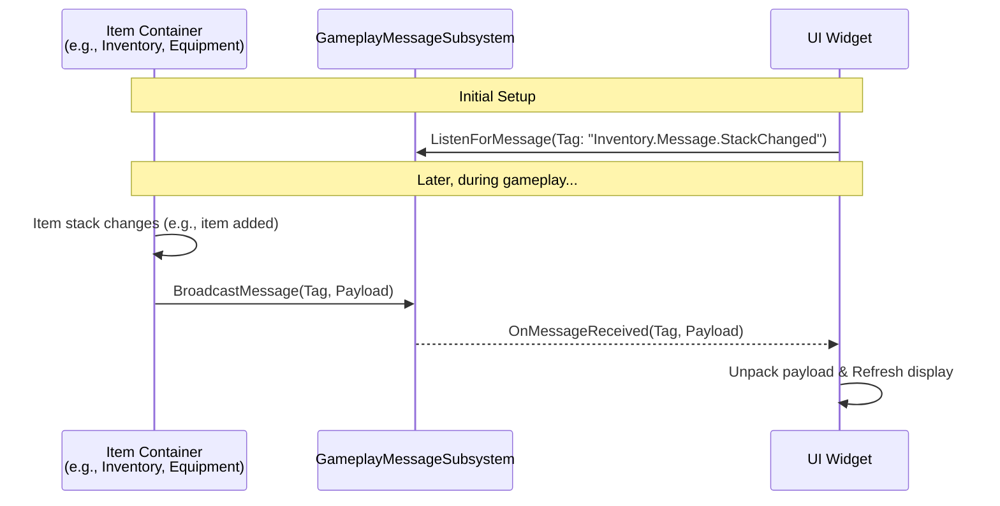

# UI Updates via Gameplay Message

While the GAS integration layer handles requests flowing _from_ the UI _to_ the system, **Gameplay Messages** handle communication in the reverse direction: informing the UI and other interested systems about authoritative state changes _within any item container_.

This creates a robust, decoupled architecture that is essential for a scalable and maintainable UI system.

### The Problem: Keeping UI Synchronized

When the state of an item container (an inventory, equipment component, attachment slot, etc.) changes on the server, clients need to be notified so their UI can reflect the correct information. Common but problematic approaches include:

* **Ticking/Polling:** The UI constantly checks the container's state for changes. This is inefficient and performs a lot of unnecessary work.
* **Direct-Coupling:** The container component holds a direct reference to the UI widget and calls functions on it. This tightly couples the backend logic to a specific UI implementation, making both systems brittle and hard to change.
* **Complex `OnRep` Logic:** Relying solely on `OnRep` functions within UI widgets can lead to tangled logic, especially when a single UI needs to respond to changes from multiple sources.

### The Solution: A Decoupled Broadcast System

This asset uses the **`UGameplayMessageSubsystem`** as a central bus for communication. Item containers broadcast messages about their state changes without needing to know who, if anyone, is listening. UI widgets listen for these messages to reactively update themselves.

**The Pattern:**

1. **State Change:** An item container's state changes authoritatively (e.g., an item is added to an inventory, an item is equipped, an attachment is modified).
2. **Broadcast:** After the change is confirmed (typically on the server or in a client-side `OnRep` callback), the container component broadcasts a specific Gameplay Message with a descriptive tag (e.g., `Inventory.Message.StackChanged`) and a data payload (a struct containing relevant info like the item instance and new count).
3. **Listen:** A UI widget, upon being created, registers with the `UGameplayMessageSubsystem` to listen for one or more message tags. It can filter these messages to only act on those relevant to the specific container it is displaying.
4. **React:** When a relevant message is received, the widget's callback function is executed. It unpacks the message payload and uses the data to update its visual state (e.g., re-drawing an item slot, updating a weight bar, enabling/disabling a button).

**Key Benefits of this Pattern:**

* **Decoupling:** Item containers have no knowledge of the UI. You can add, remove, or completely change the UI without ever touching the container's code.
* **Efficiency:** UI updates are event-driven, not polled. Code only runs when a relevant change actually happens.
* **Scalability:** New types of item containers can be easily integrated into the system. As long as they broadcast the standard messages, existing UI will work with them automatically. Likewise, new UI widgets can be created to listen for messages from any container.
* **Clarity:** The responsibility is clear. Containers announce their state. UI listens and reflects that state.

#### Example Workflow: Listening for an Inventory Change

A typical inventory panel widget would implement the following logic in its Blueprint `EventGraph`:

1. **On Initialized:**
   * Get the `GameplayMessageSubsystem`.
   * Call `Begin Reregistering` and `End Reregistering` to manage listener handles.
   * Inside, call `Listen for Message` with the tag `Inventory.Message.StackChanged`.
   * Bind a custom event (e.g., `OnInventoryStackChanged`) to the message delegate.
   * In the "Options" for the listener, set the `Match Any` payload struct to the `ULyraInventoryManagerComponent` it cares about, ensuring it only gets messages for its specific inventory.
2. **In the `OnInventoryStackChanged` Event:**
   * The event receives the message payload (`FLyraInventoryChangeMessage`).
   * From the payload, get the `ItemInstance`, `NewCount`, and `Delta`.
   * Call a function to refresh the entire inventory display or, more efficiently, find the specific slot widget for that `ItemInstance` and update its count.

#### Finding Specific Messages

Each type of item container broadcasts its own set of messages. For a detailed list of what messages a specific component sends, please refer to its dedicated documentation page.

* **Inventory Manager Component** -> [Broadcasted Gameplay Messages](../inventory-manager-component/broadcasted-gameplay-messages.md)
* **Equipment** -> **Advanced Concepts & Integration** -> [Gameplay Messaging](../../equipment/advanced-concepts-and-integration.md#gameplay-messaging)
* **Attachment System -> GAS & API** -> [Gameplay Messages](../item-fragments-in-depth/attachment-system/gas-and-api.md#gameplay-messages)
