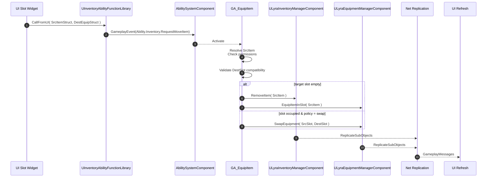

# Workflow

To solidify understanding of how the UI, GAS, Function Library, and Source Data Structs work together to handle diverse item interactions, let's walk through a common example: **Equipping an item by dragging it (as a "Move Icon") from any compatible source slot and dropping it onto an equipment slot UI.**

**Scenario:** The player drags an "Assault Rifle" (represented by a generic "Move Icon" widget during the drag operation) from their backpack (main inventory) and drops this Move Icon onto the "Primary Weapon" equipment slot in the UI.

**Assumptions:**

* The UI system uses a `UDragDropOperation`-derived class that stores an `FInstancedStruct` payload. This payload contains an `FAbilityData_SourceItem`-derived struct identifying the original location of the dragged item.
* The Equipment Slot UI widget can determine its corresponding location (i.e., it knows which `ULyraEquipmentManagerComponent` it relates to and the `FGameplayTag` identifying the specific equipment slot it represents).
* The character has a Gameplay Ability (e.g., `GA_EquipItem`) granted, which is set to trigger on a Gameplay Event Tag (e.g., `Ability.Inventory.EquipItem`).
  * This ability is responsible for validating the entire move operation, including item compatibility with the target equipment slot.
  * It orchestrates the item's removal from its source and its placement into the target equipment slot by calling appropriate functions on the relevant components (e.g., `ULyraInventoryManagerComponent`, `ULyraEquipmentManagerComponent`).
  * **Crucially, the policy for handling an item already present in the target equipment slot is defined&#x20;**_**within this Gameplay Ability**_**.** For example:
    * If the source is _not_ an equipment slot, the ability might decide to prevent equipping if the target slot is occupied, or it might instruct the `ULyraEquipmentManagerComponent` to unequip the existing item first (which could then trigger logic within the `EquipmentManagerComponent` to move that item to inventory or drop it).
    * If both source and destination are equipment slots, the ability might implement a "swap" logic, checking if both items can occupy the other's slot, then orchestrating a series of unequip and equip calls on the `ULyraEquipmentManagerComponent`.
  * The `ULyraEquipmentManagerComponent` provides the functions to change equipment state (e.g., `EquipItemInSlot`, `UnequipItemFromSlot`), but the _decision-making process and sequence of operations_ for complex moves (like swaps or handling occupied slots) resides in the Gameplay Ability.
* Appropriate permissions and access rights (e.g., `EItemContainerPermissions::TakeItems` from source, ability to interact with equipment) are expected by the ability.

**Steps:**

1. **UI Drag Operation (Client):**
   * The player initiates a drag from a source slot (e.g., an inventory cell widget showing the "Assault Rifle").
   * The source slot widget creates a `UDragDropOperation` object.
   * It populates this `UDragDropOperation` with an `FInstancedStruct` containing an `FInventoryAbilityData_SourceItem` detailing its origin (manager and index).
   * A "Move Icon" widget is created, associated with this `DragDropOperation`.
2. **UI Drop Interaction (Client - Equipment Slot Widget):**
   * The player drops the "Move Icon" onto the "Primary Weapon" equipment slot UI element.
   * The `OnDrop` event on the "Primary Weapon" slot widget fires, receiving the `DragDropOperation`.
3. **Prepare Source & Destination Data (Client - Equipment Slot Widget `OnDrop`):**
   * **Source Data:** The widget retrieves the `FInstancedStruct` payload (which contains `FInventoryAbilityData_SourceItem`) from the `DragDropOperation`. Let's call this `SourceSlotInstancedStruct`.
   * **Destination Data:** The "Primary Weapon" slot widget constructs an `FEquipmentAbilityData_SourceEquipment` struct, providing:
     * The player's `ULyraEquipmentManagerComponent` (obtained via the owning player).
     * The `FGameplayTag` for the "Primary Weapon" slot (e.g., `Equipment.Slot.WeaponPrimary`).


**Key Abstraction & UI Generality:** The Equipment Slot widget (`OnDrop`) simply processes the `FInstancedStruct` from the drop operation as the source and creates its own location descriptor as the destination. It doesn't need to know the concrete type of the item's origin.


4. **Call Function Library (Client - Equipment Slot Widget `OnDrop`):**
   * The widget obtains the `ALyraPlayerState` (e.g., via `GetOwningPlayer()->GetPlayerState<ALyraPlayerState>()`).
   * It calls the `Call Gameplay Ability From UI (Move Item)` node from `UInventoryAbilityFunctionLibrary`:
     * `Lyra Player State`: Connect the obtained `ALyraPlayerState`.
     * `Event Tag`: Select the appropriate tag (e.g., `Ability.Inventory.RequestMoveItem`).
     * `Source Slot`: Connect `SourceSlotInstancedStruct`.
     * `Destination Slot`: Connect the newly created `FEquipmentAbilityData_SourceEquipment` struct.
5. **GAS Event Sent (Client -> Server):**
   * The function library packages the source and destination data into an `FAbilityData_MoveItem` struct, wraps it in an `FInstancedStruct`, and sends the Gameplay Event.
6. **Ability Activation (Server):**
   * The server's ASC receives the event and activates the corresponding Gameplay Ability (e.g., `GA_Inventory_RequestMoveItemToEquipmentSlot`).
7. **Retrieve Data (Server - Gameplay Ability):**
   * The ability extracts the `FAbilityData_MoveItem` struct (`MoveData`) from the event payload.
8. **Resolve & Validate Source Item (Server - Gameplay Ability):**
   * The ability calls `UInventoryAbilityFunctionLibrary::GetItemFromAbilitySourceItemStruct` using `MoveData.SourceSlot`.
   * The `GetSourceItem()` method of `FInventoryAbilityData_SourceItem` runs, performing permission/access checks and retrieving the `SourceItemInstance` from the specified inventory and index.
   * The ability also checks if the `SourceItemInstance` is valid and potentially if it _can_ be equipped (e.g., based on item tags or fragments).
9. **Resolve & Validate Destination Context (Server - Gameplay Ability):**
   * The ability inspects `MoveData.DestinationSlot`, identifying it as an `FEquipmentAbilityData_SourceEquipment` struct.
   * It uses the `EquipmentManager` reference and `EquipmentSlot` tag from this struct.
   * It validates if the `SourceItemInstance` can indeed be placed into this specific `EquipmentSlot` (e.g., type compatibility, level requirements, etc., often checked via the `ULyraEquipmentManagerComponent` or definition fragments).
10. **Execute Equip Action (Server - Gameplay Ability):**
    * The Gameplay Ability now takes control, having validated the source item (`SourceItemInstance`) and the target equipment slot context. The exact logic here depends on the ability's designed policy for this type of move:
      * **Scenario 1: Target Equipment Slot is Empty OR Ability Policy allows overwriting/unequipping.**
        1. **Remove from Source:** The ability commands the source container (e.g., `InventoryManagerComponent` from `MoveData.SourceSlot`) to remove the `SourceItemInstance`. Example: `InventoryManagerComponent->RemoveItemInstance(SourceItemInstance)`. This must succeed for the operation to continue.
        2. **Equip to Destination:** The ability then instructs the `ULyraEquipmentManagerComponent` (from `MoveData.DestinationSlot`) to equip the `SourceItemInstance` into the specified `EquipmentSlot` tag. Example: `EquipmentManagerComponent->EquipItemInSlot(TargetEquipmentSlotTag, SourceItemInstance)`.
           * The `EquipmentManagerComponent->EquipItemInSlot` function itself might have internal logic to handle what happens to an item previously in that slot if it's being replaced (e.g., attempting to move it to the player's main inventory).
      * **Scenario 2: Target Equipment Slot is Occupied AND Ability Policy is to prevent equipping OR to perform a swap.**
        * **Prevent Equip:** If the policy is to prevent equipping into an occupied slot (unless the source is also an equipment slot for a swap), the ability might end here, possibly sending a "slot occupied" feedback message.
        * **Swap Logic (if source is also an equipment slot):**
          1. The ability would first need to resolve the item currently in the `DestinationSlot` (let's call it `DestinationItemInstance`) and the item in the `SourceSlot` (which is an equipment slot in this sub-scenario, `SourceItemInstance`).
          2. It validates if `SourceItemInstance` can go into `DestinationSlot` AND `DestinationItemInstance` can go into `SourceSlot`.
          3. If valid, it could orchestrate the swap by calling, for example:
             * `EquipmentManagerComponent->UnequipItemFromSlot(SourceSlotTag)`
             * `EquipmentManagerComponent->UnequipItemFromSlot(DestinationSlotTag)`
             * `EquipmentManagerComponent->EquipItemInSlot(DestinationSlotTag, SourceItemInstance)`
             * `EquipmentManagerComponent->EquipItemInSlot(SourceSlotTag, DestinationItemInstance)`_(The exact order and atomicity of these operations would need careful consideration, or the `EquipmentManagerComponent` might offer a dedicated `SwapEquipmentInSlots` function that handles this internally.)_
      * **Other Policies:** The ability could implement any other custom logic, such as dropping the currently equipped item if the new item is equipped and there's no room in inventory.
    * If any step fails based on the ability's policy or a component function returns failure (e.g., `RemoveItemInstance` fails), the ability should gracefully handle the failure, potentially revert any intermediate steps if possible, and end, possibly sending feedback.
11. **State Replication (Server -> Clients):**
    * Changes to the source inventory and the equipment manager are replicated to clients.
12. **Client Update (Client):**
    * Client components receive replicated data.
13. **UI Refresh (Client - UI Widget Blueprint):**
    * UI widgets update based on gameplay messages triggered by the replicated changes, reflecting the item's new equipped state and its removal from the source inventory.

**(Optional Client Prediction):**

* Could be implemented for smoother UI feedback, though equipment changes can be complex to predict accurately.

***

### High-Level Diagram

***

This workflow demonstrates how the system uses GAS events and the versatile `FAbilityData_SourceItem` hierarchy (wrapped in `FInstancedStruct`) to allow client UI interactions to securely trigger diverse server-authoritative inventory and equipment actions. The key takeaway is the UI's ability to describe "source" and "destination" abstractly, letting the server-side Gameplay Ability interpret these contexts and act accordingly. This is not limited to just `ULyraInventoryManagerComponent` interactions but extends to any system that can be represented by an `FAbilityData_SourceItem` derivative.

