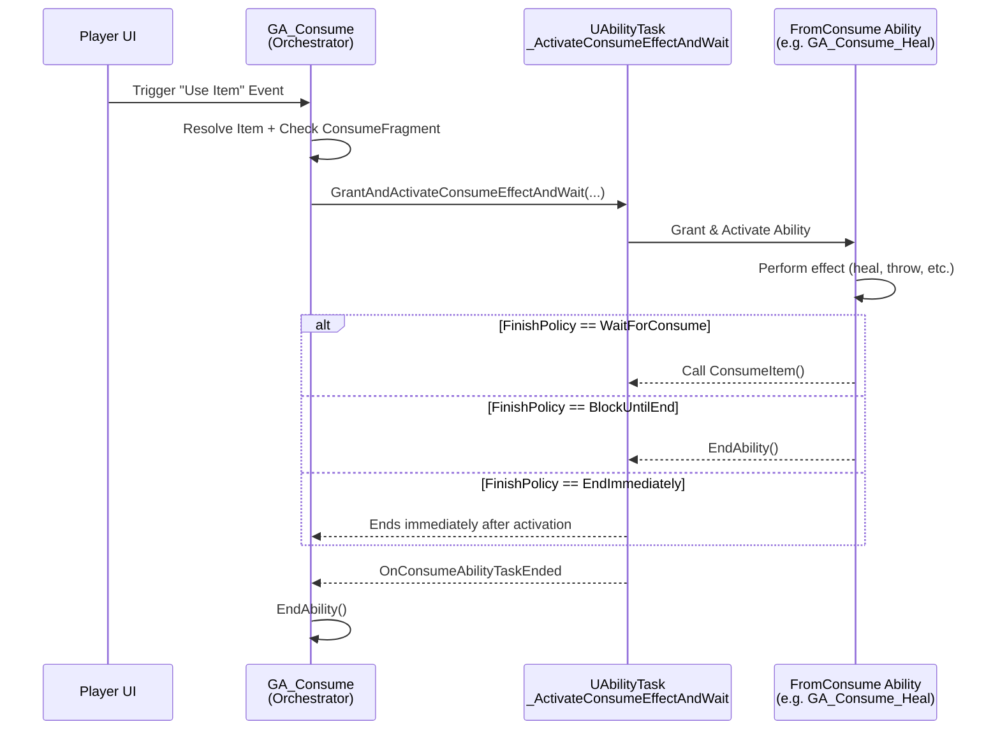

# Consumable Items

This section details the system for creating items that players can "use" or "consume" to trigger specific gameplay-affecting actions, such as drinking a potion, eating food, throwing a grenade, or activating a special device. This functionality is primarily enabled by the `UInventoryFragment_Consume` and works in conjunction with specialized Gameplay Abilities.

### What counts as a “consumable”?

* **Instant** buffs (food, stat potions)
* **Channelled** actions (med-kits, shield drinks)
* **Throwables / placeables** (grenades, traps)

All of them follow the same recipe: **data flag → generic trigger → specific effect**.

### Purpose: Triggering Effects from Items

Every item feels different, yet designers expect a **single UI button** (“Use”) to handle them all.\
The **Consume Fragment** turns that expectation into a **data-driven pipeline**:

1. **Flag** an item definition as “usable”.
2. **Link** it to a Gameplay Ability that does the real work.
3. **Choose** how long, if at all, the player is blocked from using the next item.

The core goal is to provide a standardized and flexible way to:

1. **Designate Items as Usable:** Mark specific item types as consumable or activatable.
2. **Link Item to Effect:** Associate an item type with a specific Gameplay Ability that defines the _actual consequence_ of using the item (e.g., healing, applying a buff, etc).
3. **Define Cost:** Specify how much of the item (e.g., stack count, charges) should be consumed _if_ the usage is successful.
4. **Conditional Consumption:** Allow the specific effect ability to determine if the use was "successful" in a gameplay sense (e.g., health potion doesn't work if health is full), preventing unnecessary cost application.
5. **Integrate with GAS:** Leverage the Gameplay Ability System for activation, permission checking, networking, and executing the effects.
6. **Decouple Logic:** Separate the generic "use item" request (often from UI) from the specific item's effect and cost application logic.

***

### Big-picture architecture

| Layer             | Your task                                                                             | Engine pieces                                      |
| ----------------- | ------------------------------------------------------------------------------------- | -------------------------------------------------- |
| **Data**          | Add a **Consume Fragment** to the item definition and pick an _Effect Ability_ class. | `UInventoryFragment_Consume`                       |
| **Orchestration** | Nothing, handled automatically when the player presses **Use**.                       | `ULyraGameplayAbility_Consume` (lightweight)       |
| **Effect**        | Build or tweak the Gameplay Ability that actually heals, spawns, throws, etc.         | `ULyraGameplayAbility_FromConsume` (your subclass) |
| **Plumbing**      | Nothing, manages grant/activate/wait/cleanup.                                         | `UAbilityTask_ActivateConsumeEffectAndWait`        |

***

## Life of a consumable

1. **UI** sends `Ability.Item.UseItem` event with the inventory slot.
2. **GA\_Consume** (server predicted)
   1. finds the item instance,
   2. checks the **Consume Fragment**,
   3. launches the **Ability Task** with the chosen policy.
3. **Ability Task** grants & activates the **Effect Ability** (your subclass).
4. **Effect Ability**
   * performs its gameplay (heal, spawn, delay, etc.),
   * when appropriate calls **`ConsumeItem()`** to deduct the stack,
   * ends itself when finished.
5. Ability Task fires a delegate → **GA\_Consume** ends → prediction resolves.

Blueprint example of a Consumable Ability (<code>GA_Consume_DirtyWater</code>)

<figure><figcaption></figcaption></figure>

### Simplified Workflow Diagram

### Structure of this Section

The following pages will detail the components involved in this workflow:

* **Consume Fragment: `UInventoryFragment_Consume`:** Configuring the item to be consumable.
* **Consume Action Trigger: `ULyraGameplayAbility_Consume`** and  **`UAbilityTask_ActivateConsumeEffectAndWait`:** The generic ability handling the use request.
* **Consumed Item Effect Base: `ULyraGameplayAbility_FromConsume`:** The base gameplay abiliy class for implementing the actual item effect.

***

This overview introduces the streamlined approach to consumable items, centered around the static `UInventoryFragment_Consume` providing data, a generic orchestrator ability (`ULyraGameplayAbility_Consume`) handling the request flow. \
(`ULyraGameplayAbility_FromConsume` subclasses) performing the actual gameplay logic and item consume logic.
