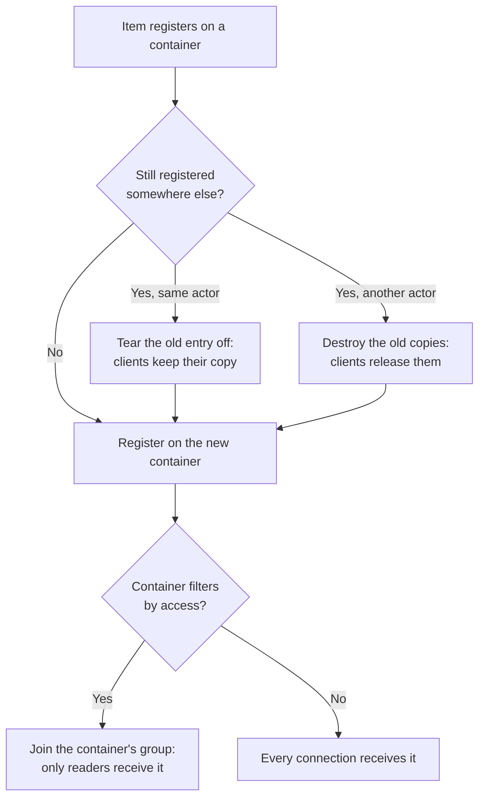

# Item Replication

An item is a UObject, not an actor, so it never replicates on its own. A backpack full of items, a rifle with a scope fitted, a chest only one player has opened: each is a set of objects that has to reach exactly the clients that should see it, follow the item when it moves to another container or another actor, and leave every client cleanly when it is destroyed. This page explains how that works: where an item registers, who receives it, and what clients see when it moves or is destroyed.

***

## Items Register on the Container Holding Them

Unreal replicates a UObject only when an actor or component lists it as a replicated subobject, and under Iris only the **registered subobject list** counts. Every item registers on the list of the container that holds it, through the item itself rather than through container code. When a container adds an item it calls `NotifyAddedToContainer` on it, and the item registers its instance and its runtime fragments on that container. A container built on the prediction runtime makes that call for you, on the server and on a predicting client alike; the registration itself only happens on the server.

| Object | Registered on | By |
| --- | --- | --- |
| An item instance and its runtime fragments | The container holding it: an inventory, equipment, or a pickup actor | The item, from `NotifyAddedToContainer` |
| Items fitted to an item, such as attachments | The same container as the item they are fitted to | The attachment fragment's `RegisterNestedSubObjectReplication` |
| An equipment instance | The equipment manager | The equipment prediction traits, as the entry is added |
| A container's permission component | Its container | The container, in `ReadyForReplication` |

Fitted items follow the item they hang off, so a scope reaches exactly the clients that receive the rifle, wherever the rifle is.

***

## Who Receives an Item

A container with a [permission component](access-rights-and-permissions/) decides who receives its items from its **default access right**, at the moment each item registers.

* **A container that starts with no access** filters its items. They replicate through the container's **net condition group**, and a player's connection is in that group only while their access right is `ReadOnly` or `ReadWrite`. Granting or removing a player's access adds or removes their connection, so the items arrive or leave with the access.
* **A container that starts readable** replicates its items to every connection. Access rights still decide who may interact with it and what the UI shows.

The framework's own containers show both. An inventory starts at `NoAccess` and grants its owning player `ReadWrite` when the experience loads, so only that player receives its items. The equipment manager starts at `ReadOnly`, so everyone sees what a player has equipped. A container without a permission component, such as a pickup, replicates its items to every connection.


**To keep items off a player's machine, start the container at `NoAccess` and grant access.** Setting one player to `NoAccess` on a container that starts readable blocks their interactions, but its items still replicate to them. Decide the default when the container is set up, since each item takes its filtering from the default as it registers.


### Containers inside containers

A container can answer permission questions with another container's permissions. A [Tetris child container](../../core-modules/tetris-inventory/tetris-inventory-manager-component/nested-containers.md) answers with the inventory at the root of its hierarchy, so its items join the root's group and reach whoever can read the root. When an item carrying a child container lands somewhere new, everything inside the child container, and inside any containers nested in it, registers again through `RefreshSubObjectReplication`, so it reaches whoever can read the item's new place.

***

## Moving an Item

Removing an item from a container leaves it registered there. Its next registration decides what clients see, because only then is it known whether the item stayed on the same actor.



* **Between two containers on the same actor**, clients keep the copy they have. Every reference a client holds to the item stays good.
* **To another actor**, clients' old copies are destroyed. Most moves are of this kind: equipping an item takes it from the inventory on the controller to the equipment on the pawn, and dropping it, putting it in a chest or putting it in a child container, which lives on the game state, all change actor. A client that can read the new container receives a fresh copy with the same item id, and one that can't is simply told the item left.

Tearing the item off across actors would leave each client holding its old copy. A client that couldn't read the new container would keep a stale item in its old slot, one that could would end up holding two, and Iris would keep the old actor waiting on those copies, so a collected pickup was never released.

A move across actors that a client predicted, such as an equip, is still confirmed when the item arrives on the other actor as a new copy. The new copy registers under the item's id in place of the copy being destroyed and takes over the slot the client predicted. [Phase Classification](../item-container/prediction/reconciliation/phase-classification.md) covers how.

***

## Destroying an Item

Destroying an item ends its replication on the container it is registered on and destroys its copies on clients, whichever container or system destroys it. The work happens in the item's `PrepareForDestruction`, which both the container interface's default `DestroyItem` and the item subsystem's `DestroyItem` call, so a container a game adds gets it without doing anything.

***

## What a Client Sees When Its Copy Goes

A client's copy stops replicating for three reasons: the item was destroyed, it moved to an actor this client can't read, or its actor stopped being relevant. The client can't tell which, so it treats them alike. Before the copy is destroyed, its slot is reset to the null slot and the move message is marked as the end of replication, so windows and other logic bound to the item release it. `HasReplicationEnded` answers whether this machine's copy is on its way out.

An item lives in the world rather than in the actor holding it, and a client keeps every copy it received until the server ends it. Seamless travel can carry an actor the server hasn't destroyed yet into the next world while the items it holds stay behind, so as a client's world is cleaned up, its replication system lets go of the item copies left in it, and the old world is released.

***

## Writing a Container

A container in C++ gets item replication by following the same pattern as the framework's containers.

* Use the registered subobject list: set `bReplicateUsingRegisteredSubObjectList` to true in the constructor.
* Call `NotifyAddedToContainer(this)` on an item as it is added and `NotifyRemovedFromContainer(this)` as it is removed, unless the prediction runtime already does. Never unregister an item on removal; its next registration takes care of that.
* Destroy items through `DestroyItem`. An override with teardown of its own calls the default after it.
* Register persistent subobjects of the container itself, such as its permission component, in `ReadyForReplication`.
* A runtime fragment that carries replicated objects of its own overrides `RegisterNestedSubObjectReplication` and registers them on the container it is given, the way the attachment fragment registers fitted items.

<details>

<summary>In code: registering a container's permission component</summary>

The inventory manager registers its permission component once it is ready to replicate. Items need nothing here, since they register themselves.

```cpp
void ULyraInventoryManagerComponent::ReadyForReplication()
{
	Super::ReadyForReplication();

	if (IsUsingRegisteredSubObjectList() && IsReadyForReplication() && IsValid(PermissionComponent))
	{
		AddReplicatedSubObject(PermissionComponent);
	}
}
```

`RegisterSubObjectReplication`, `RefreshSubObjectReplication` and `DestroySubObjectReplication` on the item instance hold the rules above, and the permission component's `SetItemGroupRegistration` and `RefreshConnectionGroupMembership` manage its group. The network tests under `Lyra.ItemContainers.Network` describe the moves, pickups and access filtering one behaviour each.

</details>
