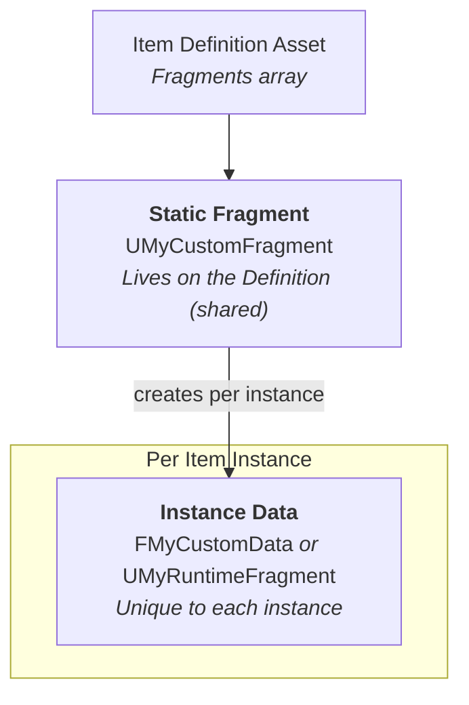

# Creating Custom Fragments


**Prerequisite:** Creating new fragment types currently requires C++ programming.


You want to add a new behavior to items, maybe durability decay, a charge meter, or a crafting recipe reference. The fragment system lets you encapsulate this as a self-contained module that any Item Definition can opt into. Here's how the pieces connect:



The static fragment holds editor-configurable properties (shared across all instances) and creates per-instance data when an item spawns. Instance data is optional, some fragments are purely static.



#### Define the Static Fragment

Every custom fragment starts here. Subclass `ULyraInventoryItemFragment`, add static properties as `UPROPERTY(EditDefaultsOnly)` for designer configuration, and override the virtual functions your fragment needs.


```cpp
UCLASS()
class UMyCustomFragment : public ULyraInventoryItemFragment
{
    GENERATED_BODY()

public:

    // Static properties — configured per Item Definition in the editor
    UPROPERTY(EditDefaultsOnly, BlueprintReadOnly, Category = "CustomFragment")
    float StaticModifierValue = 1.0f;

    UPROPERTY(EditDefaultsOnly, BlueprintReadOnly, Category = "CustomFragment")
    bool bEnableCoolFeature = false;

    // Lifecycle — runs once when an instance is created
    virtual void OnInstanceCreated(ULyraInventoryItemInstance* Instance) const override;

    // Data contribution — how much weight does this fragment add?
    virtual float GetWeightContribution(
        const ULyraInventoryItemDefinition* InItemDef,
        ULyraInventoryItemInstance* InItemInstance) override;
};
```



```cpp
void UMyCustomFragment::OnInstanceCreated(ULyraInventoryItemInstance* Instance) const
{
    Super::OnInstanceCreated(Instance);

    if (bEnableCoolFeature && Instance)
    {
        Instance->AddStatTagStack(TAG_MyFeature_IsEnabled, 1);
    }
}

float UMyCustomFragment::GetWeightContribution(
    const ULyraInventoryItemDefinition* InItemDef,
    ULyraInventoryItemInstance* InItemInstance)
{
    return 0.0f; // Override if this fragment contributes weight
}
```


At this point you have a working fragment, it can hold static data, react to instance creation, and contribute to weight calculations. If you don't need per-instance state, skip ahead to adding the fragment to an Item Definition.



#### Choose Instance Data (Optional)

Most fragments eventually need data that varies per instance, durability, charge level, an internal ID. Three mechanisms exist, each at a different complexity level:

| Decision Criterion            | Stat Tags                  | FTransientFragmentData             | UTransientRuntimeFragment                  |
| ----------------------------- | -------------------------- | ---------------------------------- | ------------------------------------------ |
| **Data shape**                | Single tag + int           | Any USTRUCT fields                 | Full UObject (vars + functions)            |
| **Replicates automatically?** | Built-in                   | Whole struct                       | You implement `GetLifetimeReplicatedProps` |
| **Per-field `OnRep`?**        | No                         | No (whole-struct only)             | Yes                                        |
| **Blueprint exposure**        | Read-only (tag queries)    | Read & write values                | Read, write + call functions               |
| **Per-frame / timer logic?**  | No                         | No                                 | Yes (Tick, timers, delegates)              |
| **Overhead**                  | Minimal                    | Low                                | Highest                                    |
| **Use when you need**         | Lightweight counters/flags | Small structured per-instance data | Complex state _plus_ behavior              |

* **No instance data needed?** Skip to the final step.
* **Simple structured data?** Use Option A (struct-based).
* **UObject features (OnRep, ticking, Blueprint methods)?** Use Option B (UObject-based).



#### Option A: Struct-Based Instance Data

Create a `USTRUCT` inheriting from `FTransientFragmentData`. Add fields and optionally override lifecycle callbacks.


```cpp
USTRUCT(BlueprintType)
struct FMyCustomFragmentData : public FTransientFragmentData
{
    GENERATED_BODY()

public:
    UPROPERTY(EditAnywhere, BlueprintReadWrite)
    float CurrentValue = 0.0f;

    UPROPERTY(EditAnywhere, BlueprintReadWrite)
    FName InstanceSpecificName = NAME_None;

    // React to the item's lifecycle
    virtual void AddedToContainer(UObject* Container,
        ULyraInventoryItemInstance* ItemInstance) override;
    virtual void DestroyTransientFragment(
        ULyraInventoryItemInstance* ItemInstance) override;
};
```


Then link it from your static fragment by overriding two functions:


```cpp
UScriptStruct* UMyCustomFragment::GetTransientFragmentDataStruct() const
{
    return FMyCustomFragmentData::StaticStruct();
}

bool UMyCustomFragment::CreateNewTransientFragment(
    AActor* ItemOwner, ULyraInventoryItemInstance* ItemInstance,
    FInstancedStruct& NewInstancedStruct)
{
    FMyCustomFragmentData Data;
    Data.CurrentValue = StaticModifierValue; // Initialize from static config
    NewInstancedStruct.InitializeAs<FMyCustomFragmentData>(Data);
    return true;
}
```


The struct is stored in a replicated `TArray<FInstancedStruct>` on the item instance. Changes replicate automatically.



#### Option B: UObject-Based Instance Data

Create a `UObject` subclass of `UTransientRuntimeFragment`. Add replicated properties, implement `GetLifetimeReplicatedProps`, and override lifecycle callbacks.


```cpp
UCLASS(BlueprintType)
class UMyTransientRuntimeFragment : public UTransientRuntimeFragment
{
    GENERATED_BODY()
public:
    virtual bool IsSupportedForNetworking() const override { return true; }
    virtual void GetLifetimeReplicatedProps(
        TArray<FLifetimeProperty>& OutLifetimeProps) const override;

    UPROPERTY(ReplicatedUsing = OnRep_SomeValue, BlueprintReadOnly)
    int32 ReplicatedInstanceValue = 0;

    UFUNCTION()
    void OnRep_SomeValue();

    UFUNCTION(BlueprintCallable)
    void DoSomethingInstanceSpecific();
};
```



```cpp
void UMyTransientRuntimeFragment::GetLifetimeReplicatedProps(
    TArray<FLifetimeProperty>& OutLifetimeProps) const
{
    Super::GetLifetimeReplicatedProps(OutLifetimeProps);
    DOREPLIFETIME(UMyTransientRuntimeFragment, ReplicatedInstanceValue);
}
```


Link it from your static fragment:


```cpp
TSubclassOf<UTransientRuntimeFragment> UMyCustomFragment::GetTransientRuntimeFragment() const
{
    return UMyTransientRuntimeFragment::StaticClass();
}

bool UMyCustomFragment::CreateNewRuntimeTransientFragment(
    AActor* ItemOwner, ULyraInventoryItemInstance* ItemInstance,
    UTransientRuntimeFragment*& OutFragment)
{
    auto* Fragment = NewObject<UMyTransientRuntimeFragment>(ItemInstance);
    OutFragment = Fragment;
    return true;
}
```




#### Compile and Add to an Item Definition

Compile your C++ code, then open the Item Definition asset in the editor. Add your fragment class to the `Fragments` array and configure any `EditDefaultsOnly` properties.



#### Access Instance Data at Runtime

Both struct and UObject instance data are accessed through `ResolveTransientFragment<T>()` on the item instance, where `T` is the _static_ fragment class:

```cpp
// Struct-based
if (auto* Data = ItemInstance->ResolveTransientFragment<UMyCustomFragment>())
{
    float Val = Data->CurrentValue;
}

// UObject-based (same template, different return type)
if (auto* Runtime = ItemInstance->ResolveTransientFragment<UMyCustomFragment>())
{
    Runtime->DoSomethingInstanceSpecific();
}
```

For Blueprint access, see the accessing sections in [Transient Data Fragments](transient-data-fragments.md) and [Transient Runtime Fragments](transient-runtime-fragments.md).


