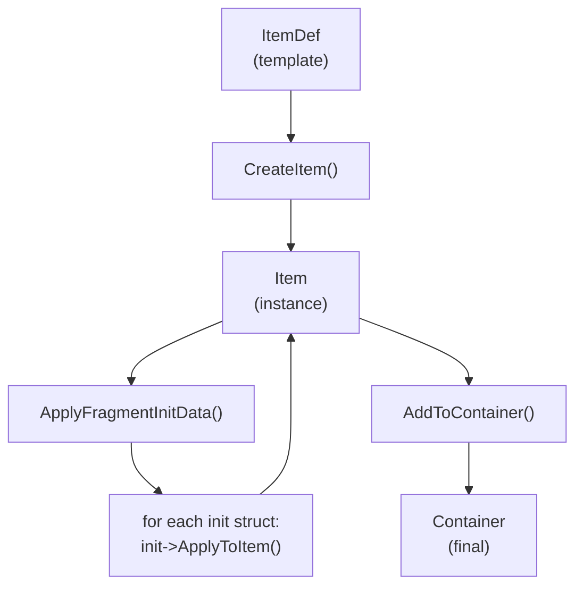

# fragment initialization

You want every rifle to spawn with a red-dot sight and 60 rounds of ammo. But you also want a "Golden" variant with a 4x scope and 120 rounds, without creating a separate item definition. How do you customize individual item instances at spawn time?

Fragment Initialization solves this. It lets you attach per-instance overrides to any starting item entry, so the same item definition can produce different items depending on where it spawns.

***

### The Core Concept

An Item Definition describes _what_ an item is. Fragment Initialization describes _how a particular instance_ of that item should differ from the defaults.

Every starting item entry, whether it lives on an Equipment Manager, Inventory Manager, or Tetris Inventory, carries an optional `FragmentInitData` array. This array holds polymorphic structs derived from `FLyraFragmentInitBase`, each one targeting a different aspect of the item (stat tags, attachments, container contents, etc.).



```
┌──────────────────────────────────────────────────────────────────┐
│                     Starting Item Entry                          │
├──────────────────────────────────────────────────────────────────┤
│                                                                  │
│   ItemDef:  ID_Rifle_AR15                                        │
│   StackCount: 1                                                  │
│                                                                  │
│   FragmentInitData: TArray<FInstancedStruct>                     │
│   ┌────────────────────────────────────────────────────────┐     │
│   │ [0] FStatTagsFragmentInit                              │     │
│   │     Lyra.Weapon.Ammo = 60                              │     │
│   ├────────────────────────────────────────────────────────┤     │
│   │ [1] FAttachmentFragmentInit                            │     │
│   │     Optic → ID_Attachment_RedDot                       │     │
│   └────────────────────────────────────────────────────────┘     │
│                                                                  │
└──────────────────────────────────────────────────────────────────┘
```



<figure><figcaption></figcaption></figure>



The key properties of this design:

* **Polymorphic**: each entry in the array can be a different struct type, stored via `FInstancedStruct`
* **Composable**: stack multiple initializers on one item (ammo _and_ attachments)
* **Plugin-extensible**: plugins define their own init types without modifying core code
* **Editor-friendly:** the `"+ Add Section"` dropdown automatically discovers all available init types the item can implement

***

### The Initialization Flow

When a container processes its starting items, every item follows the same lifecycle:



**Item Created**

The container asks `ULyraItemSubsystem` to create a new item instance from the definition.



**Fragment Init Applied**

`ULyraStartingItemHelpers::ApplyFragmentInitData()` iterates through the `FragmentInitData` array, calling `ApplyToItem()` on each initializer struct.



**Item Added to Container**

The now-customized item is placed into its container slot. Any fragments that were modified (attachments, stat tags) are already in their final state.





<details>

<summary>How ApplyFragmentInitData Works Internally</summary>

The implementation is intentionally simple -- it just iterates and delegates:

```cpp
void ULyraStartingItemHelpers::ApplyFragmentInitData(
    ULyraInventoryItemInstance* Item,
    const TArray<FInstancedStruct>& FragmentInitData,
    UObject* WorldContext)
{
    if (!Item) return;

    for (const FInstancedStruct& InitStruct : FragmentInitData)
    {
        if (!InitStruct.IsValid()) continue;

        // Cast to base type and call virtual ApplyToItem()
        const FLyraFragmentInitBase* InitData = InitStruct.GetPtr<FLyraFragmentInitBase>();
        if (InitData)
        {
            InitData->ApplyToItem(Item, WorldContext);
        }
    }
}
```

There is also a convenience function that combines item creation and initialization in one call:

```cpp
// Creates the item and applies init data before returning it
ULyraInventoryItemInstance* NewItem = ULyraStartingItemHelpers::CreateItemWithInit(
    WorldContext, ItemDef, StackCount, FragmentInitData);
```

Every container type (Equipment Manager, Inventory Manager, Tetris Inventory) uses `CreateItemWithInit()` internally when processing starting items.

</details>

***

### The Base Type: FLyraFragmentInitBase

All fragment initializers inherit from this struct. It provides three virtual methods:

```cpp
USTRUCT(BlueprintType)
struct FLyraFragmentInitBase
{
    // Apply this initialization to an item instance.
    // Called after creation, before the item enters a container.
    virtual bool ApplyToItem(ULyraInventoryItemInstance* Item, UObject* WorldContext) const;

    // Editor display text for the collapsible section header (e.g., "Ammo=60, Quality=3").
    virtual FText GetSummaryText() const;

    // Editor-only: should this init type appear in the dropdown for a given item definition?
    // Return false to hide it when the item doesn't have the relevant fragment.
    virtual bool IsAvailableForItem(TSubclassOf<ULyraInventoryItemDefinition> ItemDef) const;
};
```

| Method                 | Purpose                                            | When to Override                                                   |
| ---------------------- | -------------------------------------------------- | ------------------------------------------------------------------ |
| `ApplyToItem()`        | Modify the item instance at spawn time             | Always, this is the core of your initializer                       |
| `GetSummaryText()`     | Show a human-readable summary in the editor header | Recommended for usability                                          |
| `IsAvailableForItem()` | Filter the dropdown to only relevant items         | When your init type only applies to items with a specific fragment |

***

### Built-in Initializers

#### Stat Tags

**Struct:** `FStatTagsFragmentInit` (Display Name: "Stat Tags")

Sets gameplay tag stacks on item instances. This is the most common initializer,  use it for ammo counts, durability, quality tiers, charge levels, or any numeric value tracked by a gameplay tag.

```cpp
USTRUCT(BlueprintType, DisplayName = "Stat Tags")
struct FStatTagsFragmentInit : public FLyraFragmentInitBase
{
    // Map of tag -> value to set on the item
    UPROPERTY(EditAnywhere)
    TMap<FGameplayTag, int32> StatTags;
};
```

**How it works:** For each entry in the map, calls `Item->SetStatTagStack(Tag, Value)`. This overwrites whatever default the item definition may have set.

**Common use cases:**

| Tag                       | Value | Effect                     |
| ------------------------- | ----- | -------------------------- |
| `Lyra.Weapon.Ammo`        | 60    | Item spawns with 60 rounds |
| `Lyra.Item.Quality`       | 3     | Sets quality tier to 3     |
| `Lyra.Item.Durability`    | 500   | Sets max durability        |
| `Lyra.Weapon.ChargeLevel` | 2     | Pre-charged weapon         |


Stat Tags is always available for every item definition, there is no `IsAvailableForItem()` filter because any item can have stat tag stacks.


***

#### Attachments

**Struct:** `FAttachmentFragmentInit` (Display Name: "Attachments")

Overrides the default attachments on an item. When this initializer has entries, it replaces the `DefaultAttachments` defined on the item's `InventoryFragment_Attachment`.

```cpp
USTRUCT(BlueprintType, DisplayName = "Attachments")
struct FAttachmentFragmentInit : public FLyraFragmentInitBase
{
    // Attachments to apply. Overrides DefaultAttachments if non-empty.
    UPROPERTY(EditAnywhere)
    TArray<FAttachmentEntry> Attachments;
};
```

Each `FAttachmentEntry` specifies:

| Field              | Type                                        | Purpose                                                                    |
| ------------------ | ------------------------------------------- | -------------------------------------------------------------------------- |
| `AttachmentSlot`   | `FGameplayTag`                              | Which slot to place the attachment in (e.g., `Lyra.Attachment.Slot.Optic`) |
| `AttachmentDef`    | `TSubclassOf<ULyraInventoryItemDefinition>` | The attachment item definition                                             |
| `FragmentInitData` | `TArray<FInstancedStruct>`                  | Nested init data for the attachment itself                                 |

**The recursive part:** Each attachment entry carries its own `FragmentInitData` array. This means you can set stat tags on an attachment, or even attach sub-attachments to attachments. The system calls `CreateItemWithInit()` for each attachment, which applies nested init data recursively.

```
Rifle (FAttachmentFragmentInit)
├── Optic Slot → ID_Attachment_4xScope
│   └── FragmentInitData:
│       └── FStatTagsFragmentInit { Magnification = 4 }
│
└── Muzzle Slot → ID_Attachment_Suppressor
    └── FragmentInitData: (empty, uses defaults)
```


This init type only appears in the editor dropdown for items that have an `InventoryFragment_Attachment`. The `IsAvailableForItem()` override checks for this fragment and hides the option otherwise.


<details>

<summary>How Attachment Overrides Work Internally</summary>

The implementation removes existing attachments from each specified slot, then creates and adds the new ones:

```cpp
bool FAttachmentFragmentInit::ApplyToItem(ULyraInventoryItemInstance* Item, UObject* WorldContext) const
{
    // Resolve the item's attachment fragment (runtime container)
    auto* AttachFrag = Item->ResolveTransientFragment<UInventoryFragment_Attachment>();
    if (!AttachFrag) return false;

    for (const FAttachmentEntry& Entry : Attachments)
    {
        // Remove whatever is currently in this slot
        AttachFrag->RemoveItemFromSlot(Entry.AttachmentSlot, ...);

        // Create the attachment item with its own init data (recursive!)
        ULyraInventoryItemInstance* AttachItem = ULyraStartingItemHelpers::CreateItemWithInit(
            WorldContext, Entry.AttachmentDef, 1, Entry.FragmentInitData);

        // Place it in the slot
        AttachFrag->AddItemToSlot(Entry.AttachmentSlot, AttachItem, ...);
    }
    return true;
}
```

Because `CreateItemWithInit()` is called for each attachment, the nested `FragmentInitData` on the attachment entry goes through the same pipeline. This is what makes the recursion work -- attachments-on-attachments-on-attachments, each with their own stat tags.

</details>

***

### Plugin-Provided Initializers

#### Container Contents (TetrisInventory Plugin)

**Struct:** `FContainerFragmentInit` (Display Name: "Container Contents")

Overrides the starting items in an item's child inventory. Use this when you want a specific backpack or ammo crate to spawn pre-filled with particular contents, different from what the item definition normally provides.

```cpp
USTRUCT(BlueprintType, DisplayName = "Container Contents")
struct FContainerFragmentInit : public FLyraFragmentInitBase
{
    // Starting items for the child inventory (overrides defaults if non-empty)
    UPROPERTY(EditAnywhere)
    TArray<FTetrisInventoryStartingItem> StartingItems;
};
```

**How it works:** When applied, it replaces the default starting items from `InventoryFragment_Container` with the ones specified here. Each starting item in the array can itself carry `FragmentInitData`, enabling deeply nested customization.

**Common use cases:**

| Scenario            | Configuration                                   |
| ------------------- | ----------------------------------------------- |
| Pre-filled backpack | Container with specific weapons and ammo inside |
| Ammo crate          | Container with exact ammo types and quantities  |
| Loot box            | Container whose contents vary per spawn point   |
| Starter kit         | Backpack pre-loaded with beginner gear          |


This init type only appears for items that have an `InventoryFragment_Container`. It is provided by the TetrisInventory plugin and is not available if that plugin is not enabled.


***

### Where FragmentInitData Appears

The `FragmentInitData` array is a shared pattern across all starting item structs. Every system that spawns items supports it:

| Struct                         | Container Type           | Unique Fields                                      |
| ------------------------------ | ------------------------ | -------------------------------------------------- |
| `FEquipmentStartingItem`       | Equipment Manager        | `EquipmentSlot`, `bAutoHold`                       |
| `FInventoryStartingItem`       | Inventory Manager        | `StackCount`, `SlotIndex`                          |
| `FTetrisInventoryStartingItem` | Tetris Inventory Manager | `AmountToAdd`, `Position`, `Clump`, `ItemRotation` |
| `FAttachmentEntry`             | Nested on attachments    | `AttachmentSlot`, `AttachmentDef`                  |

All four carry the same `TArray<FInstancedStruct> FragmentInitData` field, meaning you get the same initialization capabilities regardless of which container type spawns the item.

```
FEquipmentStartingItem ──────┐
FInventoryStartingItem ──────┤
FTetrisInventoryStartingItem ┤──── All share: TArray<FInstancedStruct> FragmentInitData
FAttachmentEntry ────────────┘
```

***

### Creating Custom Fragment Init Types

Need to initialize something specific to your game? Create a new struct that inherits from `FLyraFragmentInitBase`.



**Define the Struct**

Create a new `USTRUCT` that inherits from `FLyraFragmentInitBase`. Add a `DisplayName` so the editor dropdown shows a readable name.

```cpp
#include "Loadout/LyraFragmentInitTypes.h"

USTRUCT(BlueprintType, DisplayName = "Enchantment")
struct FEnchantmentFragmentInit : public FLyraFragmentInitBase
{
    GENERATED_BODY()

    /** The enchantment type to apply */
    UPROPERTY(EditAnywhere, BlueprintReadWrite, Category = "Enchantment")
    FGameplayTag EnchantmentType;

    /** Power level of the enchantment */
    UPROPERTY(EditAnywhere, BlueprintReadWrite, Category = "Enchantment",
        meta = (ClampMin = "1", ClampMax = "5"))
    int32 PowerLevel = 1;
};
```



**Implement ApplyToItem**

This is where your initialization logic lives. Modify the item instance however your system needs.

```cpp
bool FEnchantmentFragmentInit::ApplyToItem(
    ULyraInventoryItemInstance* Item, UObject* WorldContext) const
{
    if (!Item || !EnchantmentType.IsValid()) return false;

    // Your custom logic: apply enchantment to the item
    auto* EnchantFrag = Item->ResolveTransientFragment<UInventoryFragment_Enchantment>();
    if (!EnchantFrag) return false;

    EnchantFrag->ApplyEnchantment(EnchantmentType, PowerLevel);
    return true;
}
```



**Implement GetSummaryText (Optional)**

Return a short string that describes this initializer's configuration. It appears in the collapsible section header in the editor.

```cpp
FText FEnchantmentFragmentInit::GetSummaryText() const
{
    if (!EnchantmentType.IsValid()) return NSLOCTEXT("FragInit", "NoEnchant", "(none)");

    return FText::Format(
        NSLOCTEXT("FragInit", "EnchantSummary", "{0} (Level {1})"),
        FText::FromName(EnchantmentType.GetTagName()),
        FText::AsNumber(PowerLevel));
}
```



**Implement IsAvailableForItem (Optional)**

If your initializer only makes sense for items with a specific fragment, override this to filter the editor dropdown.

```cpp
#if WITH_EDITORONLY_DATA
bool FEnchantmentFragmentInit::IsAvailableForItem(
    TSubclassOf<ULyraInventoryItemDefinition> ItemDef) const
{
    if (!ItemDef) return true;  // If unknown, allow it

    const ULyraInventoryItemDefinition* CDO = GetDefault<ULyraInventoryItemDefinition>(ItemDef);
    return CDO && CDO->FindFragmentByClass<UInventoryFragment_Enchantment>() != nullptr;
}
#endif
```



That is it. The editor automatically discovers your new struct type through Unreal's reflection system. The next time you open the `"+ Add Section"` dropdown on a starting item entry, your "Enchantment" option will appear.

***

### Practical Example: Configuring a Starting Rifle

Suppose you want your player to spawn with an AR-15 that has 60 rounds of ammo and a red-dot sight in the optic slot. Here is what the starting item entry looks like on an Equipment Manager component:

```
Equipment Manager Component
└── Starting Items
    └── [0] FEquipmentStartingItem
        ├── ItemDef: ID_Rifle_AR15
        ├── EquipmentSlot: Lyra.Equipment.Slot.Back
        ├── bAutoHold: true
        │
        └── FragmentInitData:
            ├── [0] Stat Tags
            │   └── StatTags:
            │       └── Lyra.Weapon.Ammo → 60
            │
            └── [1] Attachments
                └── Attachments:
                    └── [0] FAttachmentEntry
                        ├── AttachmentSlot: Lyra.Attachment.Slot.Optic
                        ├── AttachmentDef: ID_Attachment_RedDot
                        └── FragmentInitData: (empty)
```

At runtime, this produces:

1. An AR-15 item instance is created from `ID_Rifle_AR15`
2. `FStatTagsFragmentInit` sets `Lyra.Weapon.Ammo` to 60 on the item
3. `FAttachmentFragmentInit` removes whatever default optic the AR-15 has, creates a Red Dot item from `ID_Attachment_RedDot`, and places it in the optic slot
4. The fully configured rifle is equipped to the Back slot and auto-held

Now imagine you want a "Golden" variant for a special game mode. You use the _exact same_ `ID_Rifle_AR15` definition but with different `FragmentInitData`:

```
FragmentInitData:
├── [0] Stat Tags
│   └── StatTags:
│       ├── Lyra.Weapon.Ammo → 120
│       └── Lyra.Item.Quality → 5
│
└── [1] Attachments
    └── Attachments:
        ├── [0] AttachmentSlot: Lyra.Attachment.Slot.Optic
        │       AttachmentDef: ID_Attachment_4xScope
        │       FragmentInitData:
        │       └── [0] Stat Tags { Magnification = 4 }
        │
        └── [1] AttachmentSlot: Lyra.Attachment.Slot.Muzzle
                AttachmentDef: ID_Attachment_GoldMuzzleBrake
                FragmentInitData: (empty)
```

Same item definition, completely different loadout. One definition, infinite variants.
