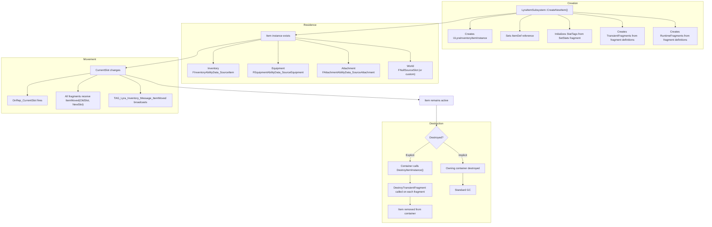
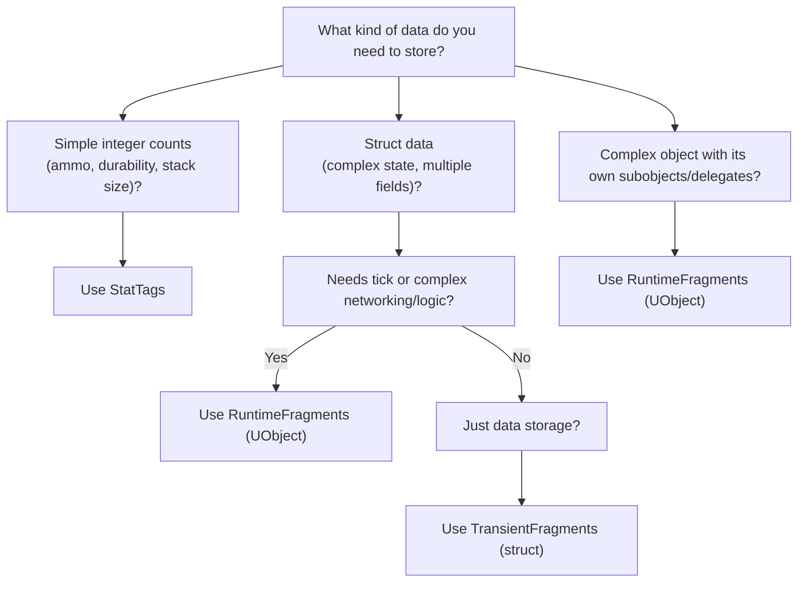

# Item Instance

An Item Definition says "this is an assault rifle." But when a player picks up that rifle, they get a _specific_ rifle, one with 24 rounds loaded, a red dot scope attached, and 80% durability. That specific rifle is an **Item Instance**.

The `ULyraInventoryItemInstance` is the runtime object representing an item that actually exists in the game. If a player has three Health Potions, there's one definition but potentially multiple instances (depending on stacking).

***

## The Lifecycle of an Item

Understanding when items are created, where they live, and when they're destroyed clarifies the whole system.



```
┌─────────────────────────────────────────────────────────────────────────┐
│                         ITEM INSTANCE LIFECYCLE                          │
├──────────────────────────────────────────────────────────────────────────┤
│                                                                          │
│  CREATION                                                                │
│  ────────                                                                │
│  LyraItemSubsystem::CreateNewItem()                                      │
│      │                                                                   │
│      ├── Creates ULyraInventoryItemInstance                              │
│      ├── Sets ItemDef reference                                          │
│      ├── Initializes StatTags from SetStats fragment                     │
│      ├── Creates TransientFragments from fragment definitions            │
│      └── Creates RuntimeFragments from fragment definitions              │
│                                                                          │
│  RESIDENCE                                                               │
│  ─────────                                                               │
│  Item lives in a container, tracked by CurrentSlot:                      │
│      │                                                                   │
│      ├── Inventory → FInventoryAbilityData_SourceItem                    │
│      ├── Equipment → FEquipmentAbilityData_SourceEquipment               │
│      ├── Attachment → FAttachmentAbilityData_SourceAttachment            │
│      └── World → FNullSourceSlot (or custom)                             │
│                                                                          │
│  MOVEMENT                                                                │
│  ────────                                                                │
│  When CurrentSlot changes:                                               │
│      │                                                                   │
│      ├── OnRep_CurrentSlot fires                                         │
│      ├── All fragments receive ItemMoved(OldSlot, NewSlot)               │
│      └── TAG_Lyra_Inventory_Message_ItemMoved broadcasts                 │
│                                                                          │
│  DESTRUCTION                                                             │
│  ───────────                                                             │
│  Explicit: Container calls DestroyItemInstance()                         │
│      │                                                                   │
│      ├── DestroyTransientFragment called on each fragment                │
│      └── Item removed from container                                     │
│                                                                          │
│  Implicit: Owning container destroyed → standard GC                      │
│                                                                          │
└──────────────────────────────────────────────────────────────────────────┘
```







### Creation

Items are created through `ULyraItemSubsystem::CreateNewItem()`, not manually constructed. This function:



Creates the `ULyraInventoryItemInstance` UObject



Sets the `ItemDef` reference to the definition class



Calls each fragment's initialization hooks to set up instance data



You don't typically call this directly, the item transaction system handles this internally.

#### Where Items Live

Items can exist in different container types:

<table><thead><tr><th width="126.5333251953125">Container</th><th>CurrentSlot Type</th><th>Example</th></tr></thead><tbody><tr><td>Inventory</td><td><code>FInventoryAbilityData_SourceItem</code></td><td>Player backpack</td></tr><tr><td>Equipment</td><td><code>FEquipmentAbilityData_SourceEquipment</code></td><td>Equipped weapon</td></tr><tr><td>Attachment</td><td><code>FAttachmentAbilityData_SourceAttachment</code></td><td>Scope on a rifle</td></tr><tr><td>World/Transit</td><td><code>FNullSourceSlot</code></td><td>Being dropped</td></tr></tbody></table>

The `CurrentSlot` uses `FInstancedStruct` to hold **any** of these types polymorphically. This is how one item type can exist in inventory, then equipment, then attached to another item, without the item itself needing to know about each container type. This prevents coupling the item instance to each item container.


For more details on how the slot system works, see [Slot Descriptors](../../item-container/item-container-architecture/slot-descriptors.md).


### Destruction

Items are destroyed in two ways:

Explicit destruction (consuming an item, deleting from inventory):

```cpp
ItemSubsystem->DestroyItem(ItemInstance);
```

This triggers `DestroyTransientFragment` on each fragment for cleanup.

Implicit destruction happens when the owning container is destroyed (actor death, level transition) via standard garbage collection.

***

## Where to Store Instance Data

Items have three storage mechanisms for per-instance data. Choosing the right one matters.

#### Decision Tree




These three types of storage will be covered in more detail in the subsequent pages


### StatTags: Integer Counts

```cpp
FGameplayTagStackContainer StatTags;
```

For simple integer values keyed by gameplay tags:

```cpp
// Add/modify (authority only)
Item->AddStatTagStack(TAG_Item_Ammo, 30);
Item->SetStatTagStack(TAG_Item_Durability, 100);
Item->RemoveStatTagStack(TAG_Item_Ammo, 5);

// Query (any context)
int32 Ammo = Item->GetStatTagStackCount(TAG_Item_Ammo);
bool HasAmmo = Item->HasStatTag(TAG_Item_Ammo);
```

Best for: Ammo counts, durability, charges, stack quantity (`TAG_Lyra_Inventory_Item_Count`).

### TransientFragments: Struct Data

```cpp
TArray<FInstancedStruct> TransientFragments;
```

For custom struct data per instance:

```cpp
// Define the struct
USTRUCT()
struct FTransientFragmentData_WeaponState : public FTransientFragmentData
{
    float CurrentHeat;
    float SpreadMultiplier;
    int32 ShotsFired;
};

// Access on the item
FTransientFragmentData_WeaponState* State = Item->ResolveTransientFragment<FTransientFragmentData_WeaponState>();
if (State)
{
    State->CurrentHeat = 0.5f;
}
```

Best for: Multiple related values, complex data that doesn't need UObject features.

### RuntimeFragments: UObject Instances

```cpp
TArray<TObjectPtr<UTransientRuntimeFragment>> RuntimeFragments;
```

For complex logic requiring a UObject:

```cpp
// Define the class
UCLASS()
class UTransientRuntimeFragment_Attachment : public UTransientRuntimeFragment
{
    // Can have its own:
    // - Tick function
    // - Delegates
    // - Subobjects
    // - Complex logic
};

// Access on the item
UTransientRuntimeFragment_Attachment* Attach = Item->ResolveTransientFragment<UTransientRuntimeFragment_Attachment>();
```

Best for: Attachment systems, container fragments (items holding items), anything needing complex networking or delegates.

***

## Reacting to Movement

When an item moves between containers, its `CurrentSlot` changes. All fragments are notified:



<figure><figcaption></figcaption></figure>



```cpp
// Called on each TransientFragment and RuntimeFragment
void ItemMoved(ULyraInventoryItemInstance* Item,
               const FInstancedStruct& OldSlot,
               const FInstancedStruct& NewSlot);
```



This is how:

* Attachment fragments know when their parent item is equipped
* Container fragments update their state
* Fragments can apply/remove effects based on location

A `TAG_Lyra_Inventory_Message_ItemMoved` gameplay message also broadcasts for external systems.

***

## Accessing Definition Data

The instance links to its definition via `ItemDef`:



<figure><figcaption></figcaption></figure>



```cpp
// Get the definition class
TSubclassOf<ULyraInventoryItemDefinition> Def = Item->GetItemDef();

// Get the CDO for static data
const ULyraInventoryItemDefinition* DefCDO = Def.GetDefaultObject();

// Find a specific fragment on the definition
const UInventoryFragment_InventoryIcon* IconFrag = Item->FindFragmentByClass<UInventoryFragment_InventoryIcon>();
if (IconFrag)
{
    UTexture2D* Icon = IconFrag->Icon;
}
```



The instance holds runtime state; the definition holds static configuration. Read static data from the definition, mutable data from the instance.

***

## Duplication

When splitting a stack or transferring items, you may need a new instance:

```cpp
ULyraInventoryItemInstance* NewItem = OriginalItem->DuplicateItemInstance(NewOuter);
```

This performs a **deep copy**:

* Copies all StatTags
* Duplicates TransientFragments
* Duplicates RuntimeFragments

The new instance is independent, modifying one doesn't affect the other.

***

## Client Prediction

For prediction support, items have:

```cpp
bool bIsClientPredicted;
```

Client-predicted items are temporary, they exist to provide instant feedback while waiting for server confirmation. When the server's authoritative item arrives, the predicted instance is replaced.


For details on how prediction works, see [Prediction Architecture](../../item-container/prediction/prediction-architecture.md).


***

## Networking

Items replicate as **subobjects** of their container:

```cpp
bool IsSupportedForNetworking() override { return true; }
```

The owning component (`ULyraInventoryManagerComponent`, `ULyraEquipmentManagerComponent`) handles subobject replication. This means:

* `ItemDef` replicates (so clients know the item type)
* `StatTags` replicate (so clients see stack counts)
* `TransientFragments` replicate (so clients have struct data)
* `RuntimeFragments` replicate as subobjects (so clients have UObject state)
* `CurrentSlot` replicates (so clients know where items are)

***
