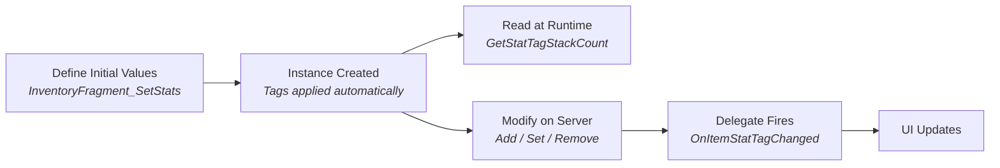

# Stat Tags

Your rifle shows 30/30 in the magazine. Your potion stack reads 5. Your pickaxe has 87 durability remaining. All of these are **Stat Tags**, persistent integer counts stored directly on an item instance, keyed by Gameplay Tags.

Stat Tags are the simplest form of per-instance data. Each `ULyraInventoryItemInstance` contains a `StatTags` property (an `FGameplayTagStackContainer`) that maps Gameplay Tags to integer values. Different instances of the same item can have different counts, and those counts persist across inventory moves, drops, and pickups as long as the instance survives.

### Common Use Cases

| Gameplay Tag                | Represents                                                          |
| --------------------------- | ------------------------------------------------------------------- |
| `Lyra.Inventory.Item.Count` | Stack size (used by `InventoryFragment_InventoryIcon` for stacking) |
| `Weapon.Ammo.Magazine`      | Current magazine ammo                                               |
| `Weapon.Ammo.Reserve`       | Reserve ammo pool                                                   |
| `Item.Charges.Current`      | Remaining charges on a consumable                                   |
| `Item.Durability`           | Durability points                                                   |

Any Gameplay Tag can be used. A stack count > 0 can also serve as a boolean flag (e.g., `Item.State.IsJammed`).

***

## The Typical Workflow





### Initialize with `InventoryFragment_SetStats`

Add the `InventoryFragment_SetStats` fragment to your Item Definition and configure its `InitialItemStats` map. When an instance is created, `OnInstanceCreated` automatically calls `AddStatTagStack` for each entry.

Example configuration:

* `Lyra.Inventory.Item.Count` → `1`
* `Weapon.Ammo.Magazine` → `30`
* `Item.Charges.Current` → `3`



### Read and Modify at Runtime



```cpp
// Read (Client & Server)
int32 Ammo = ItemInstance->GetStatTagStackCount(TAG_Weapon_Ammo_Magazine);
bool bHasAmmo = ItemInstance->HasStatTag(TAG_Weapon_Ammo_Magazine);

// Modify (Server Only)
ItemInstance->SetStatTagStack(TAG_Weapon_Ammo_Magazine, 30);  // Set to exact value
ItemInstance->AddStatTagStack(TAG_Weapon_Ammo_Magazine, 5);   // Add to current
ItemInstance->RemoveStatTagStack(TAG_Weapon_Ammo_Magazine, 1); // Subtract from current
```



<figure><figcaption></figcaption></figure>



Modification functions are **authority-only** to maintain network consistency. If a count reaches zero or below, the tag is removed entirely.



### Listen for Changes

When any stat tag changes, the item instance broadcasts a delegate:

```cpp
UPROPERTY(BlueprintAssignable, Category="Inventory|Stats")
FOnGameplayTagStackChangedDynamic OnItemStatTagChanged;
// Signature: (FGameplayTag Tag, int32 NewCount, int32 OldCount)
```



```cpp
ItemInstance->OnItemStatTagChanged.AddDynamic(this, &UMyWidget::HandleStatChanged);

void UMyWidget::HandleStatChanged(FGameplayTag Tag, int32 NewCount, int32 OldCount)
{
    if (Tag == TAG_Weapon_Ammo_Magazine)
    {
        UpdateAmmoDisplay(NewCount);
    }
}
```



<figure><figcaption></figcaption></figure>



This same delegate pattern is used consistently across the framework:

| Class                        | Delegate                 | Tracks                                       |
| ---------------------------- | ------------------------ | -------------------------------------------- |
| `ULyraInventoryItemInstance` | `OnItemStatTagChanged`   | Item-level stats (ammo, durability, charges) |
| `ALyraPlayerState`           | `OnPlayerStatTagChanged` | Player-level stats (kills, deaths, score)    |
| `ALyraTeamInfoBase`          | `OnTeamTagChanged`       | Team-level stats (objectives, resources)     |

All three share the same signature: `(FGameplayTag Tag, int32 NewCount, int32 OldCount)`.



***

## Prediction Support

In a networked game, waiting for the server to confirm a stat change before updating the UI creates visible lag, the player fires their weapon but the ammo counter doesn't decrement for a round trip. The stat tag system includes client prediction to solve this.

`RecordPredictedTagDelta(Tag, Delta, PredKey)` records a predicted change that immediately affects `GetStatTagStackCount()` results and fires the delegate. The prediction system handles the rest:

1. **Predicted delta recorded** — delegate fires with the predicted value, UI updates instantly
2. **Server replicates** — the authoritative value arrives separately
3. **Prediction confirmed** — `ClearPredictedDeltasForKey` removes the delta, delegate fires with the final value
4. **Prediction rejected** — rollback broadcasts the corrected value

This allows UI to show immediate feedback (ammo decrementing on fire) while the server remains authoritative.

***

## Replication

The `StatTags` container is `UPROPERTY(Replicated)` and uses `FFastArraySerializer` internally, so changes replicate efficiently. Clients can safely call the read functions (`GetStatTagStackCount`, `HasStatTag`) against the replicated state.

***

### Stat Tags vs. Transient Fragments

Stat Tags are the right choice for simple integer tracking. For anything more complex, see the Transient Fragment system.
