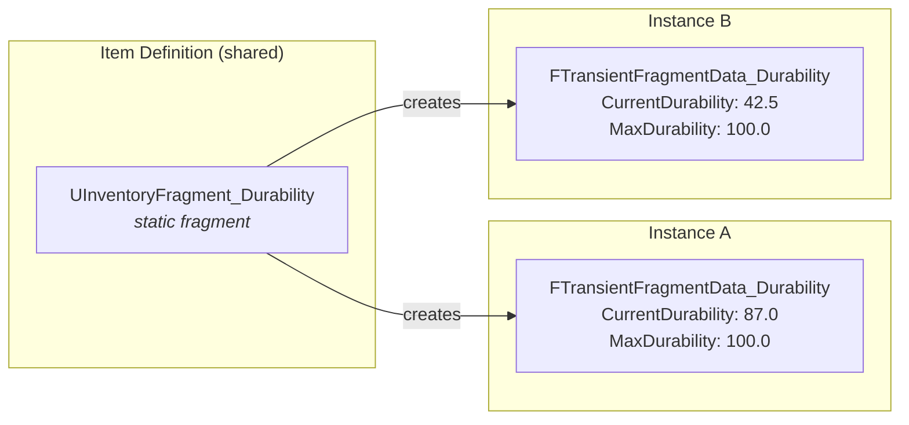

# Transient Data Fragments

Your scope needs to remember its zoom level. Your sword tracks its durability as a float. Your procedural weapon stores a random seed that makes it unique. These are per-instance values that don't fit neatly into a single integer [Stat Tag](stat-tags.md), they need a struct with named fields, and each item instance needs its own copy.

`FTransientFragmentData` solves this. It's a lightweight, replicated `USTRUCT` that lives on a specific `ULyraInventoryItemInstance` and is logically tied to the static `ULyraInventoryItemFragment` that created it. The struct travels with the item, across inventory moves, drops, and pickups.



***

### When to Use This

Use `FTransientFragmentData` when your per-instance data:

* Can be represented as a `USTRUCT` (fields, not methods)
* Doesn't need per-property `OnRep` callbacks
* Doesn't need ticking, timers, or UObject lifecycle
* Is logically owned by a specific fragment

For anything requiring full UObject behavior, see [Transient Runtime Fragments](transient-runtime-fragments.md). For simple integer counters, [Stat Tags](stat-tags.md) are lighter still.


Still unsure? Jump to the [instance-data comparison](creating-custom-fragments.md#choose-and-define-instance-data-optional).


***

## Implementation



**Define the Data Struct**

Create a `USTRUCT` inheriting from `FTransientFragmentData`. Add your instance-specific fields and optionally override lifecycle callbacks.

```cpp
USTRUCT(BlueprintType)
struct FTransientFragmentData_Durability : public FTransientFragmentData
{
    GENERATED_BODY()

public:
    UPROPERTY(EditAnywhere, BlueprintReadWrite)
    float CurrentDurability = 100.0f;

    UPROPERTY(EditAnywhere, BlueprintReadWrite)
    float MaxDurability = 100.0f;

    virtual void DestroyTransientFragment(ULyraInventoryItemInstance* ItemInstance) override
    {
        // Cleanup when the item instance is permanently destroyed
    }
};
```



**Link from the Static Fragment**

Override two functions on your `ULyraInventoryItemFragment` subclass to tell the system what struct to create and how to initialize it.

```cpp
UScriptStruct* GetTransientFragmentDataStruct() const override
{
    return FTransientFragmentData_Durability::StaticStruct();
}

bool CreateNewTransientFragment(AActor* ItemOwner, ULyraInventoryItemInstance* ItemInstance,
    FInstancedStruct& NewInstancedStruct) override
{
    FTransientFragmentData_Durability Data;
    Data.MaxDurability = 100.0f;
    Data.CurrentDurability = Data.MaxDurability;
    NewInstancedStruct.InitializeAs<FTransientFragmentData_Durability>(Data);
    return true;
}
```



**Add the Static Fragment to Your Item Definition**

Add your fragment (e.g., `UInventoryFragment_Durability`) to the `Fragments` array on the Item Definition asset. The transient data is created automatically when instances spawn.



***

## Accessing the Data at Runtime



Use the templated `ResolveTransientFragment<T>()` on the item instance, where `T` is the _static_ fragment type. The template deduces the associated struct type automatically.

```cpp
if (auto* DurabilityData = ItemInstance->ResolveTransientFragment<UInventoryFragment_Durability>())
{
    float Percent = DurabilityData->CurrentDurability / DurabilityData->MaxDurability;
}
```



**From Blueprint/C++:** Use `ResolveStructTransientFragment(FragmentClass)` on the `ULyraInventoryItemInstance`. This returns an `FInstancedStruct`. You'll need to use `GetInstancedStructValue` and specific the transient struct from the wildcard `value` pin.

<figure><figcaption></figcaption></figure>


The wildcard pin must match the **transient struct type** that corresponds to the fragment class you specified. Selecting the wrong type will silently return nothing.





**Updating:** To update the struct, you can create a new instance of your data struct, modify it, and then call `ULyraInventoryItemInstance::SetTransientFragmentData()` with the new struct wrapped in an `FInstancedStruct`. This replaces the existing entry in the `TransientFragments` array.


<figure><figcaption><p>Example of setting values for the gun transient fragment to record staged reload</p></figcaption></figure>

***

## Lifecycle Callbacks

The struct provides virtual functions that fire at key moments in the owning item's life. Override the ones you need.

| Callback                         | When It Fires                                                                                                                                     |
| -------------------------------- | ------------------------------------------------------------------------------------------------------------------------------------------------- |
| `DestroyTransientFragment`       | The item instance is being permanently destroyed. Use for final cleanup of any external references.                                               |
| `AddedToContainer`               | The item was added to any container (inventory, equipment, attachment slot).                                                                      |
| `RemovedFromContainer`           | The item was removed from a container (but not necessarily destroyed).                                                                            |
| `ItemMoved`                      | The item's `CurrentSlot` changed. Receives old and new slot as `FInstancedStruct`, inspect the slot type to determine what kind of move occurred. |
| `ReconcileWithPredictedFragment` | During prediction reconciliation, transfers local client state from a predicted copy to the server-authoritative instance.                        |

<details>

<summary>Save interface</summary>

For persistence support, three additional methods exist:

* `PrepareForSave()` — clear UObject references or other non-serializable data before saving
* `RestoreFromSavedCopy()` — restore nested data after loading from a save
* `HasNestedSaveData()` — return `true` if the struct contains nested data that needs special save handling

</details>

***

## Replication

The `TransientFragments` array on `ULyraInventoryItemInstance` is `TArray<FInstancedStruct>` and is replicated. `FInstancedStruct` handles polymorphic serialization of the underlying struct data. Changes to fields within the struct are automatically detected and replicated, no manual dirty-marking required.
