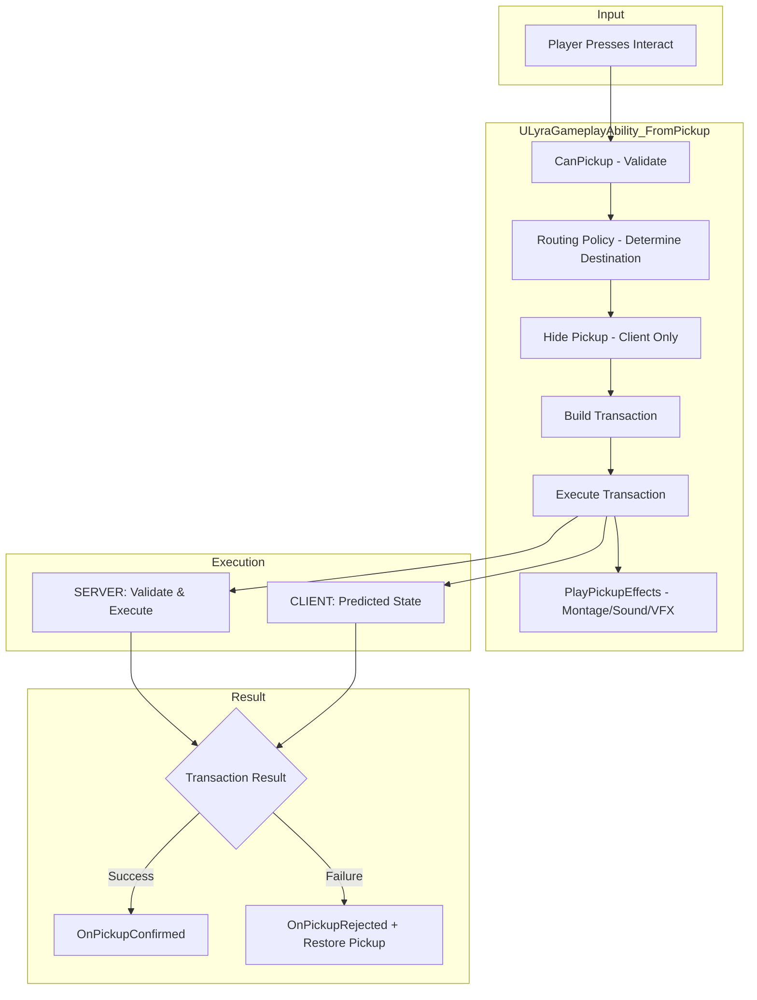
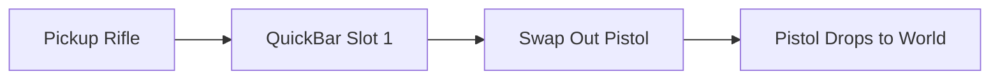
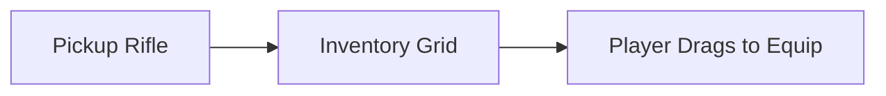
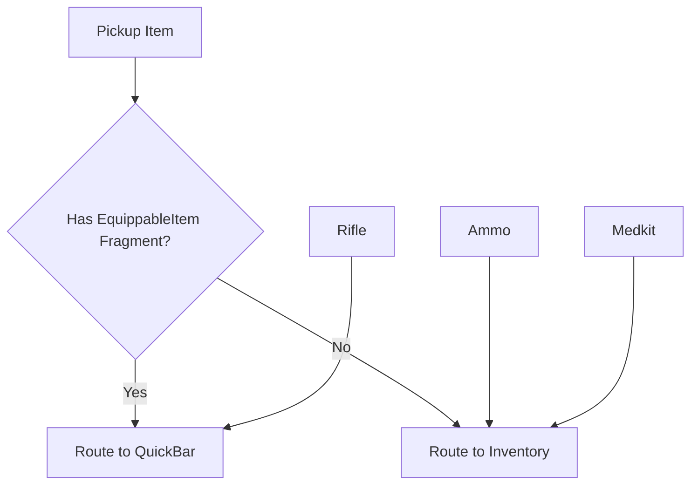
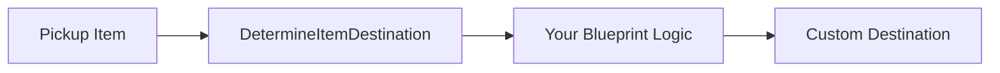
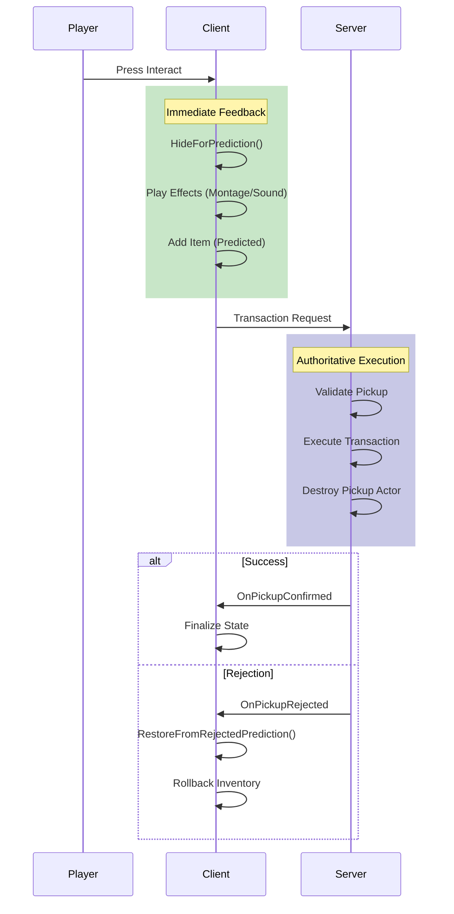
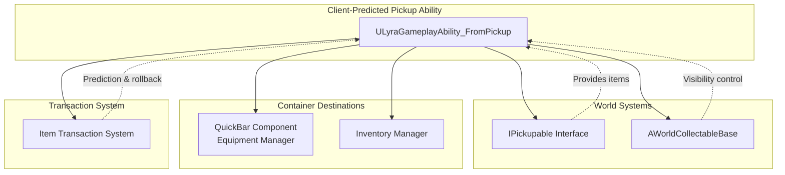

# Client Predicted Pickup Ability

The standard pickup workflow described in [Pickup System](pickup-system.md) is server-authoritative, the client requests a pickup, waits for the server to process it, and only then sees the result. While correct, this introduces noticeable latency that can break immersion in fast-paced games.

The **Client-Predicted Pickup Ability** (`ULyraGameplayAbility_FromPickup`) solves this by letting the client optimistically execute the pickup locally while the server validates. If the server agrees, everything proceeds smoothly. If rejected, the system automatically rolls back the client's prediction.

Beyond responsiveness, this ability introduces **routing policies**, a way to configure where items go based on your game mode's needs.

***

#### The Routing Problem

Different game modes have fundamentally different pickup expectations:

| Game Mode          | Pickup Behavior                                                       |
| ------------------ | --------------------------------------------------------------------- |
| **TDM / Arena**    | Everything goes directly to QuickBar. Full? Swap with current weapon. |
| **Battle Royale**  | Weapons to QuickBar, ammo/consumables to inventory grid.              |
| **Survival / RPG** | Everything to inventory. Player manually equips.                      |
| **Custom**         | Per-item logic defined in Blueprint.                                  |

A single hardcoded pickup flow can't serve all these needs. The routing policy system makes pickup behavior data-driven and game-mode agnostic.

***

### Architecture Overview



#### Key Components

| Component                         | Purpose                                                           |
| --------------------------------- | ----------------------------------------------------------------- |
| `ULyraGameplayAbility_FromPickup` | Abstract base class for pickup abilities. Subclass per game mode. |
| `FPickupAbilityConfig`            | Data-driven configuration for routing and behavior.               |
| `EPickupRoutingPolicy`            | Enum defining the routing strategy.                               |
| `FPickupAbilityResult`            | Result struct passed to Blueprint events.                         |

***

### Routing Policies

#### `EPickupRoutingPolicy`



**Use Case:** TDM, Arena, Gun Game

All items route directly to the QuickBar (equipment slots). If the target slot is occupied, the existing item is swapped out and dropped to the world.



**Configuration:**

```cpp
FPickupAbilityConfig Config;
Config.RoutingPolicy = EPickupRoutingPolicy::QuickBarOnly;
Config.SlotPolicy = EQuickSwapSlotPolicy::PreferActiveSlot;
Config.bAutoHold = true;  // Immediately equip after pickup
```



**Use Case:** Survival, RPG, Looter

All items route to the inventory container. Nothing goes directly to equipment—the player must manually equip items.



**Configuration:**

```cpp
FPickupAbilityConfig Config;
Config.RoutingPolicy = EPickupRoutingPolicy::InventoryOnly;
Config.bMergeStacks = true;  // Combine with existing stacks
```



**Use Case:** Battle Royale, Tactical Shooters

Items are routed based on their type:

* **Equipment** (has `InventoryFragment_EquippableItem`) → QuickBar
* **Everything else** (ammo, consumables, resources) → Inventory



**Configuration:**

```cpp
FPickupAbilityConfig Config;
Config.RoutingPolicy = EPickupRoutingPolicy::SmartRouting;
Config.SlotPolicy = EQuickSwapSlotPolicy::AnySlot;
Config.bAutoHold = false;  // Don't auto-equip in BR
Config.bMergeStacks = true;
```



**Use Case:** Unique game mechanics

Blueprint decides the destination for each item. Override `DetermineItemDestination` to implement custom logic.



**Example Use Cases:**

* Quest items go to a special quest inventory
* Faction-specific items check faction before accepting
* Weight-based routing (heavy items to backpack, light to pockets)



***

### Configuration Reference

<figure><figcaption></figcaption></figure>

#### `FPickupAbilityConfig`

| Property                   | Type                                 | Description                                                                          |
| -------------------------- | ------------------------------------ | ------------------------------------------------------------------------------------ |
| `RoutingPolicy`            | `EPickupRoutingPolicy`               | How items are routed to containers. Default: `SmartRouting`                          |
| `SlotPolicy`               | `EQuickSwapSlotPolicy`               | Which QuickBar slot to target. Options: `PreferActiveSlot`, `AnySlot`, `PreferEmpty` |
| `bAutoHold`                | `bool`                               | Automatically equip after QuickBar pickup. Default: `true`                           |
| `bMergeStacks`             | `bool`                               | Merge with existing stacks in inventory. Default: `true`                             |
| `DropParams`               | `FDropParams`                        | Parameters for dropping displaced items.                                             |
| `StaticCollectableClass`   | `TSubclassOf<AWorldCollectableBase>` | Class to spawn for dropped static mesh items.                                        |
| `SkeletalCollectableClass` | `TSubclassOf<AWorldCollectableBase>` | Class to spawn for dropped skeletal mesh items.                                      |

***

### Client Prediction Flow

The prediction system ensures pickups feel instant while maintaining server authority.



#### Visibility Management

When the client predicts a pickup, the world collectable is hidden immediately using `HideForPrediction()`. This provides instant visual feedback without destroying the actor (which only the server can do).

If the server rejects the pickup, `RestoreFromRejectedPrediction()` makes the collectable visible again, and the predicted inventory changes are rolled back automatically by the transaction system.

***

### Blueprint Extension Points

The ability provides several hooks for game-mode specific customization:

#### Validation

<figure><figcaption></figcaption></figure>


**`CanPickup`** _(BlueprintNativeEvent)_

Called before any pickup logic. Return `false` to prevent the pickup entirely.

**Use Cases:**

* Check player has inventory space
* Validate faction/level requirements
* Prevent pickup during certain game states


#### Routing

<figure><figcaption></figcaption></figure>


**`DetermineItemDestination`** _(BlueprintNativeEvent)_

Only called when `RoutingPolicy == Custom`. Determines where each item should go.

**Parameters:**

* `ItemDef` - The item definition being picked up
* `Pickup` - The world collectable actor
* `OutDestContainer` - Set this to the target container
* `OutDestSlot` - Set this to the target slot (or leave empty for auto-placement)
* `OutEquipmentSlot` - Set this for equipment routing


#### Feedback

<figure><figcaption></figcaption></figure>


**`PlayPickupEffects`** _(BlueprintImplementableEvent)_

Called immediately after prediction executes. Use for:

* Animation montages (pickup grab animation)
* Sound effects (pickup sound)
* VFX (particle burst, UI flash)

**Parameters:**

* `Pickup` - The world collectable being picked up
* `Items` - Array of item instances being picked up


#### Result Callbacks

| Event               | When Called                       | Typical Use                            |
| ------------------- | --------------------------------- | -------------------------------------- |
| `OnPickupPredicted` | Immediately after client predicts | Update UI optimistically               |
| `OnPickupConfirmed` | Server confirms the pickup        | Finalize any pending UI states         |
| `OnPickupRejected`  | Server rejects the pickup         | Show error message, play failure sound |

***

### Creating a Game-Mode Pickup Ability



#### Create Blueprint Subclass

Create a new Blueprint class inheriting from `ULyraGameplayAbility_FromPickup`.\
Name it appropriately (e.g., `GA_Pickup_BattleRoyale`).



#### Configure Default Settings

In the Blueprint defaults, set up `DefaultConfig`:



#### Implement Effects (Optional)

Override `PlayPickupEffects` to add your pickup feel:



#### Wire Up Interaction

Grant this ability and trigger it from the [interaction system](../../interaction/). The pickup is passed via the `TriggerEventData->Target` field.



***

### Common Configurations

#### TDM

```cpp
// Instant swap, always equip what you pick up
Config.RoutingPolicy = EPickupRoutingPolicy::QuickBarOnly;
Config.SlotPolicy = EQuickSwapSlotPolicy::PreferActiveSlot;
Config.bAutoHold = true;
```

#### Battle Royale

```cpp
// Smart routing, manual equip, merge ammo stacks
Config.RoutingPolicy = EPickupRoutingPolicy::SmartRouting;
Config.SlotPolicy = EQuickSwapSlotPolicy::AnySlot;
Config.bAutoHold = false;
Config.bMergeStacks = true;
```

#### Survival / RPG

```cpp
// Everything to inventory, player manages equipment
Config.RoutingPolicy = EPickupRoutingPolicy::InventoryOnly;
Config.bMergeStacks = true;
```

***

### Relationship to Other Systems



| System                                                                                               | Relationship                                                        |
| ---------------------------------------------------------------------------------------------------- | ------------------------------------------------------------------- |
| [Pickup System](pickup-system.md)                                                                    | Provides `IPickupable` interface and `AWorldCollectableBase` actors |
| [Item Transaction System](../../item-container/transactions/)                                        | Handles the actual container mutations with prediction support      |
| [QuickBar Component](../../equipment/quick-bar-component.md) / [Equipment Manager](../../equipment/) | Destination for `QuickBarOnly` and equipment in `SmartRouting`      |
| [Inventory Manager](../../inventory/inventory-manager-component.md)                                  | Destination for `InventoryOnly` and non-equipment in `SmartRouting` |

***

### Troubleshooting


**Pickup disappears then reappears**

The server rejected the pickup. Check:

* Does the player have inventory space?
* Is another player picking up simultaneously?
* Are there permission/validation failures?



**Items go to wrong destination**

Verify your `RoutingPolicy` setting. For `SmartRouting`, ensure equipment items have the `InventoryFragment_EquippableItem` fragment.



**No pickup effects playing**

Ensure you've overridden `PlayPickupEffects` in your Blueprint subclass. The base C++ class doesn't play any effects by default.

