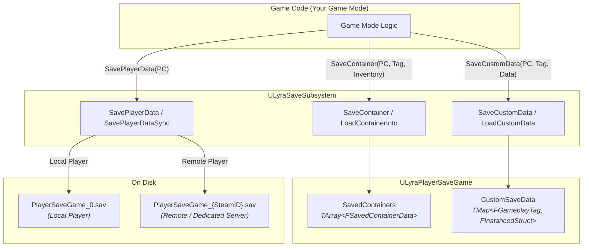

# Save System

Your player spends ten minutes organizing their inventory, fitting a rifle into the grid, mounting attachments, stashing ammo in a nested backpack. They close the game, come back tomorrow, and everything is exactly how they left it. The same items, the same positions, the same fragment state.

The Save System provides the persistence layer that makes this possible. It serializes any item container, inventories, equipment, attachment slots, nested backpacks, into a format that survives game restarts. It works for both local and dedicated server players out of the box, and it's generic enough for any game mode to use.

## What You Get

```
┌────────────────────────────────────────────────────────────────────┐
│                        Save System                                 │
├──────────────────────┬─────────────────────────────────────────────┤
│                      │                                             │
│   Per-Player Saves   │   Each player gets their own save file      │
│   Container Save     │   Serialize any ILyraItemContainerInterface │
│   Fragment Persist   │   Struct + runtime fragment opt-in          │
│   Custom Data        │   Arbitrary data under gameplay tags        │
│   Dedicated Server   │   Local + remote player support             │
│   Nested Containers  │   Backpack-in-backpack round-trips          │
│   Config Preservation│   Grid layout, weight limits, etc.          │
│                      │                                             │
└──────────────────────┴─────────────────────────────────────────────┘
```

The system is container-agnostic. It doesn't know about tetris grids, equipment slots, or attachment points, it works through the `ILyraItemContainerInterface` and `FInstancedStruct`, so any container type, including ones you create, can participate without modifying the save system itself.

## How It Builds on the Item System

The save system extends the existing item and container architecture. It doesn't replace anything, it adds a persistence layer on top:

| Base System                                                  | Save Extension                                                                                  |
| ------------------------------------------------------------ | ----------------------------------------------------------------------------------------------- |
| [`ILyraItemContainerInterface`](../item-container/)          | `SaveContainer` / `LoadContainerInto` serialize any container's contents by iterating its items |
| [`ULyraInventoryItemInstance`](../items/)                    | `FSavedItemData` captures definition, GUID, stat tags, slot position, and all fragment data     |
| [`FTransientFragmentData`](../items/items-and-fragments/)    | Struct fragments auto-save; `PrepareForSave()` clears UObject refs before serialization         |
| [`UTransientRuntimeFragment`](../items/items-and-fragments/) | Opt-in via `WantsSave()` / `SaveFragmentData()` / `LoadFragmentData()`                          |
| `FInstancedStruct` slot data                                 | Slot position round-trips through save (grid position, equipment slot, attachment slot)         |


You should be familiar with the [Item System](../items/) and [Item Container Architecture](../item-container/) before diving into save-specific concepts. This documentation focuses on what the save system adds.


## Key Concepts

A quick orientation of the major ideas you'll encounter:

* **Save Tags** — Every saved container is identified by an `FGameplayTag`. Your game mode defines its own tags (e.g., `Save.PlayerInventory`, `Save.PlayerEquipment`, `Save.BankStorage`) and the save system stores data under those keys. It never needs to know what your containers represent, it just serializes and deserializes by tag.
* **Container Serialization** — `SaveContainer` walks every item in a container, captures its definition, GUID, stat tags, slot position, and fragment data into `FSavedItemData` structs. `LoadContainerInto` reverses the process, recreating live item instances and placing them back in their original slots.
* **Fragment Persistence** — Struct-based transient fragments (`FTransientFragmentData`) are saved automatically. UObject-based runtime fragments (`UTransientRuntimeFragment`) opt in by overriding `WantsSave()`. This lets attachments, child inventories, and custom fragment data survive a save/load cycle.
* **Player Controller API** — All save methods take `APlayerController*`, not `ULocalPlayer*`. The subsystem detects whether the player is local or remote and uses the appropriate storage path. Local players use UE's `ULocalPlayerSaveGame` API; remote players (dedicated server) use `UGameplayStatics` with a slot name derived from their platform ID.


### Dedicated server saves require a stable online subsystem

On a dedicated server, remote player save files are keyed by `PlayerState->GetUniqueId()`, the player's platform ID (SteamID, EOS ProductUserId, etc.). In PIE without a real online subsystem, this ID contains random suffixes that change every session, so remote player saves won't persist between PIE sessions. This is not a bug, configure Steam, EOS, or another online subsystem for persistent dedicated server saves.


* **Object Config** — Any UObject that implements `ILyraSaveableInterface` can persist its configuration through `SaveObjectConfig` and `LoadObjectConfig`. The object defines its own config struct; the save system stores it as opaque data under a gameplay tag. This works for containers (where it's called automatically during `SaveContainer`/`LoadContainerInto`) and for non-container objects like custom actors or components.
* **Custom Data** — `SaveCustomData` and `LoadCustomData` let you store arbitrary `FInstancedStruct` data under gameplay tag keys, quest progress, currency, unlocks, without touching the container system. Blueprint users can create User Defined Structs and save/load them with zero C++.

## Architecture Overview



The save subsystem sits between your game logic and the save file. You call `SaveContainer` to serialize a container into the in-memory save game, then `SavePlayerData` to flush it to disk. Loading is the reverse: `GetOrCreateSaveGame` loads from disk (or returns the cached version), then `LoadContainerInto` populates a live container from the saved data.

## Documentation Structure

| Section                                                       | What It Covers                                                                                                                                   |
| ------------------------------------------------------------- | ------------------------------------------------------------------------------------------------------------------------------------------------ |
| [**Save Subsystem**](save-subsystem.md)                       | `ULyraSaveSubsystem` — the central API for saving and loading. Local vs remote handling, cache lifecycle, container and custom data operations   |
| [**Save Data Structs**](save-data-structs.md)                 | `FSavedItemData`, `FSavedContainerData`, `ULyraPlayerSaveGame` — what gets stored, how items are represented on disk, stale reference protection |
| [**Extending the Save System**](extending-the-save-system.md) | Adding save support to custom containers, fragments, and game data. Replacing the disk backend with a database for production scaling            |
