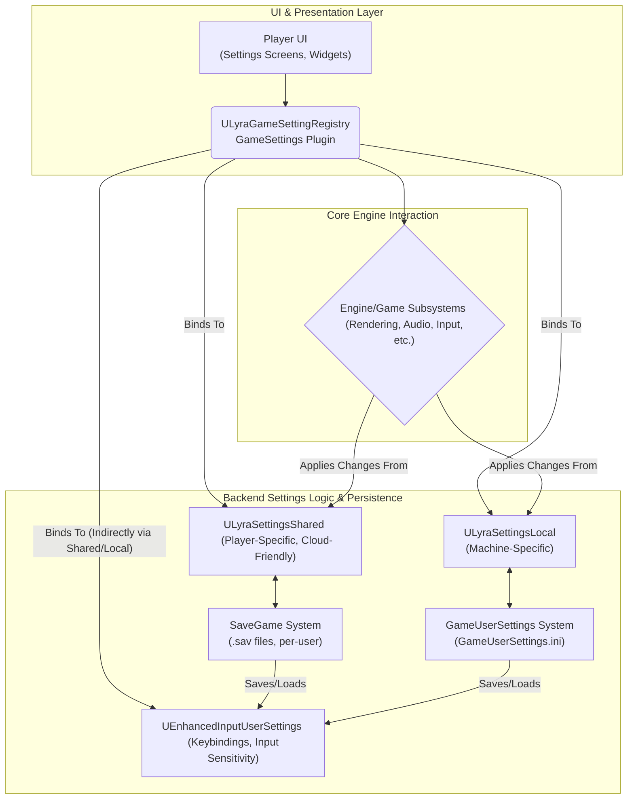

# Settings

At its core, Lyra's settings system is designed to provide a flexible and comprehensive way for players to customize their gameplay experience and for the game to adapt to different hardware configurations. This includes:

* **Player Preferences:** Allowing users to tailor aspects like controls, visual aids (colorblind modes, subtitles), audio preferences (background audio), and interface language to their liking.
* **Hardware Configuration:** Enabling the game to adjust performance-related settings such as graphics quality (resolution, texture detail, VSync), audio output devices, and frame rate limits to suit the capabilities of the player's machine.
* **Accessibility:** Providing options to make the game more accessible to a wider range of players.
* **Platform Adaptability:** Structuring settings in a way that can gracefully handle differences across various platforms (PC, consoles, mobile).

The system aims to achieve these goals by being:

* **Modular:** Breaking down settings into logical categories.
* **Data-Driven:** Allowing UI elements to be generated and managed based on defined setting objects.
* **Persistent:** Ensuring player choices are saved and restored across game sessions and potentially across devices.
* **Integrated:** Working closely with core Unreal Engine systems for a seamless experience.

***

### **Key Design Principles**

Lyra's settings system is built upon several key design principles that guide its architecture:

1. **Separation of Concerns:**
   * A fundamental distinction is made between settings that are **player-specific** (and potentially shareable across devices, like keybindings or colorblind preferences) and settings that are **machine-specific** (like graphics quality or selected audio hardware). This separation dictates how and where settings are stored and managed.
2. **Leveraging Unreal Engine Systems:**
   * The system intelligently utilizes existing Unreal Engine features rather than reinventing the wheel.
     * **`USaveGame` Framework:** Used for player-specific settings that are intended to be saved per-player and are suitable for cloud synchronization (e.g., `ULyraSettingsShared`).
     * **`UGameUserSettings` Framework:** The standard UE mechanism for machine-specific settings, typically saved to configuration files like `GameUserSettings.ini` (e.g., `ULyraSettingsLocal`).
     * **Enhanced Input System:** Leveraged for managing user input configurations, with its own `UEnhancedInputUserSettings` that integrates with Lyra's saving flow.
     * **GameSettings Plugin (CommonUI):** Provides the foundational classes for creating a data-driven settings UI (`UGameSettingRegistry`, `UGameSettingCollection`, `UGameSettingValue`, etc.), allowing for easier definition and management of settings screens.
3. **Data-Driven UI:**
   * The settings menus are largely constructed by defining `UGameSetting` objects in C++. These objects describe the setting's type (slider, dropdown, boolean), its display name, description, and how to get/set its value from the C++ backend. This makes the UI more maintainable and extensible.
4. **Event-Driven Updates:**
   * The system incorporates mechanisms (like delegates and events) to allow various parts of the game to react immediately when a setting is changed, rather than only when settings are formally applied.

***

### **System Architecture Overview (High-Level)**

Understanding how the different pieces fit together is crucial. At a high level, Lyra's settings system can be visualized as follows:

**Key Components and Interactions:**

* **Player UI (Settings Screens):** What the player directly interacts with. Built using Unreal Motion Graphics (UMG) and often leveraging widgets from the CommonUI plugin that are designed to work with the GameSettings plugin.
* **`ULyraGameSettingRegistry`:** The central C++ class that defines and organizes all available settings. It acts as the bridge between the UI and the backend C++ logic. It creates `UGameSetting` objects that represent individual settings.
* **`ULyraSettingsShared`:** Manages settings that are specific to a player and are suitable for cloud saving (e.g., gameplay preferences, accessibility options). It inherits from `ULocalPlayerSaveGame`.
* **`ULyraSettingsLocal`:** Manages settings that are specific to the machine the game is running on (e.g., graphics quality, audio device selection). It inherits from `UGameUserSettings`.
* **`UEnhancedInputUserSettings`:** Part of the Enhanced Input plugin, this handles player-specific input mappings and sensitivities. Lyra integrates its saving and application into its own settings flow.
* **SaveGame System / GameUserSettings System:** The underlying Unreal Engine mechanisms for persisting `ULyraSettingsShared` (to `.sav` files) and `ULyraSettingsLocal` (to `.ini` files) respectively.
* **Engine/Game Subsystems:** The actual parts of the engine or game logic that consume and are affected by the settings (e.g., the rendering engine for graphics settings, the audio engine for volume, the input system for controls).

In the following sections, we will delve deeper into each of these components to provide a more granular understanding of their roles and interactions.
