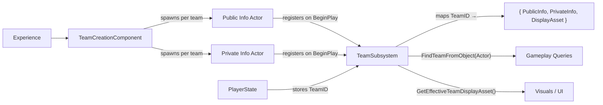
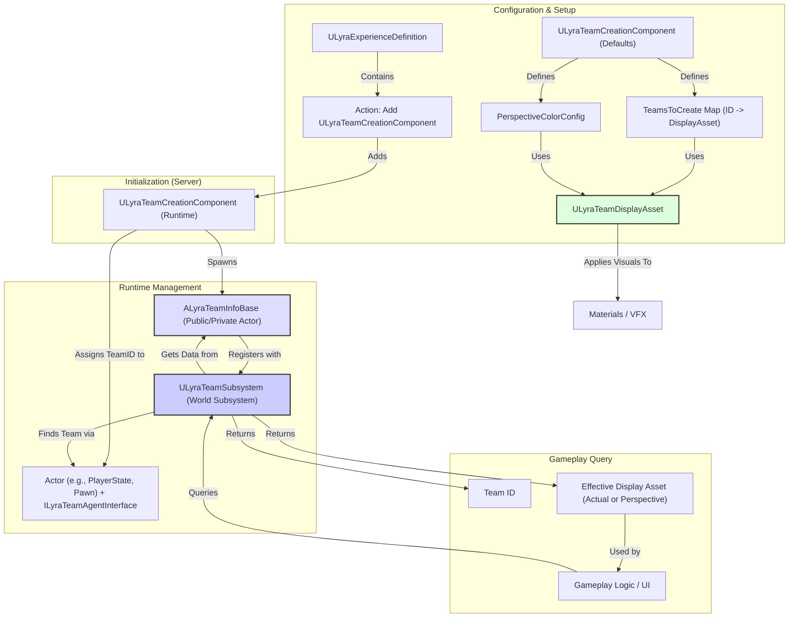

# Team

Welcome to the Team System documentation. This system provides the framework for grouping players and AI into distinct teams, managing their affiliations, applying team-specific visuals, and enabling gameplay logic based on team relationships (e.g., friendly fire, team scoring, objective ownership).

The team system manages team identity, membership, visual representation, and cross-team queries for every actor in a match. It is designed around four principles:

* **Data-driven** — teams are defined in the Experience, not hardcoded. A `ULyraTeamCreationComponent` on the GameState reads a simple `TeamsToCreate` map (team ID to display asset) and builds everything at runtime.
* **Replicated** — team state flows from server to all clients automatically. Each team is represented by a pair of always-relevant info actors that carry the team's ID, tags, and visuals.
* **Visually flexible** — display assets define named color, scalar, and texture parameters that materials and UI read by key. A perspective mode can override these so the local player always sees allies as blue and enemies as red, regardless of actual team IDs.
* **Query-friendly** — the `ULyraTeamSubsystem` answers "is X on the same team as Y?" without the actors knowing about each other. Any system that needs team information goes through this single entry point.

***

## Architecture








**Explanation:**

1. The active Experience typically adds a subclassed `ULyraTeamCreationComponent` to the Game State.
2. The Creation Component reads its configuration (which teams to create, display assets, perspective settings).
3. On the server, it spawns `ALyraTeamInfoBase` actors for each team and registers them with the `ULyraTeamSubsystem`.
4. It assigns initial Team IDs to players/AI implementing `ILyraTeamAgentInterface`.
5. During gameplay, other systems query the `ULyraTeamSubsystem` to find an actor's team ID or compare affiliations.
6. The subsystem provides team data, including the appropriate `ULyraTeamDisplayAsset` (which might be the actual team's asset or an Ally/Enemy perspective asset).
7. Visual systems use the Display Asset data to apply team colors/textures to actors and UI elements.



## Structure of this Section



[**Team Model**](team-model.md)

What a team actually is at runtime, info actors, membership interface, display assets, and how they connect.



[**Team Setup**](team-setup.md)

How the creation component spawns teams from Experience data, assigns players, and supports asymmetric setups.



[**Runtime Queries**](runtime-queries.md)

The subsystem's role: finding teams, comparing teams, friendly fire checks, team tags, and viewer tracking.



[**Team Visuals**](team-visuals.md)

Display assets, perspective colors, async actions for reactive UI, and safe color accessors.



***
