# Item Container UI System

Welcome to the Item Container UI system.

Building an for item containers interface in a multiplayer game is notoriously difficult. It requires balancing replication latency, complex input requirements (Mouse vs. Gamepad), and tight coupling between gameplay logic and visual widgets.

This system is designed to solve those problems using a **Disconnected, Opt-In MVVM (Model-View-ViewModel)** architecture.

Instead of your UMG widgets talking directly to the server or casting to specific Item Instances, they communicate with a robust layer of **ViewModels**. This layer acts as a "Client-Side Projection" of the server state. It handles the complexity of prediction, replication, and data formatting so your widgets can focus entirely on being visual.

***

### The Design Philosophy

#### 1. The Disconnected UI

The UI does not "own" the data; it leases it. When a player opens an inventory window, the system creates a ViewModel that acts as a live proxy for the underlying component. When the window closes, the ViewModel is released and cleaned up.

This means your UI logic is **container-agnostic**. The same generic code handles a 1D Inventory list, a Tetris grid, an Equipment slot, or an Attachment hierarchy. The system uses **Polymorphic Descriptors** to bridge the gap, allowing the UI to interact with any container type without knowing its specific implementation.

#### 2. The "Ghost World" (Prediction)

In a high-latency environment, waiting for the server to confirm a drag-and-drop operation makes the UI feel sluggish.

This system implements a **Predictive "Ghost" Layer**. When a player moves an item, the UI updates instantly, marking the item as a "Ghost." It then sends a transaction request to the server.

* **Success:** The server confirms the move, and the "Ghost" status is silently removed.
* **Rejection:** The server denies the move, and the UI automatically rolls back to the correct state.

#### 3. Unified Interaction

Whether the player is using a Mouse (Drag & Drop), a Gamepad (Navigation & Context Actions), or a Keyboard (Shortcuts), the underlying logic is identical. The **Interaction Engine** unifies all inputs into a single transaction pipeline, ensuring that gameplay abilities are triggered consistently regardless of the input method.

***

### Why This System Exists

Building inventory UI sounds simple until you hit these walls:

| Challenge                | The Naive Approach                                                                   | This System's Solution                                                        |
| ------------------------ | ------------------------------------------------------------------------------------ | ----------------------------------------------------------------------------- |
| **Multiplayer lag**      | Player clicks, waits 100ms+ for server, UI finally updates                           | Items appear instantly as "ghosts," confirmed seamlessly when server responds |
| **Multiple containers**  | One giant widget trying to show everything                                           | Separate windows that can be opened, closed, dragged, and navigated between   |
| **Data binding**         | Manual refresh calls scattered everywhere and the widget is tightly coupled to logic | Reactive binding, change the data, UI updates automatically                   |
| **Empty slots**          | Null checks and special cases                                                        | Slots always exist as ViewModels, even when empty                             |
| **Keyboard/gamepad nav** | Custom focus logic per widget                                                        | Unified navigation system across all panels and windows                       |

***

### The Ghost World

When a player picks up an item in a networked game, there's a moment of uncertainty. The client _thinks_ the pickup should succeed, but only the server knows for sure. Rather than freeze the UI waiting for confirmation, this system shows **ghost items**, predicted state that appears immediately but hasn't been confirmed yet.

```mermaid
sequenceDiagram
    participant Player
    participant Client UI
    participant Server

    Player->>Client UI: Picks up item
    Client UI->>Client UI: Item appears (ghost state)
    Client UI->>Server: Request pickup
    Note over Client UI: Player sees item immediately
    Server->>Client UI: Confirmed!
    Client UI->>Client UI: Ghost → Solid
```

Ghost items can be styled differently (transparency, different color, pulsing effect) so players understand the item is "in transit." If the server rejects the action, the ghost simply disappears.

***

### The Big Picture

**Three layers, clear responsibilities:**

<table><thead><tr><th width="174">Layer</th><th>What It Does</th><th>Key Classes</th></tr></thead><tbody><tr><td><strong>Backend</strong></td><td>Owns the actual data, handles server authority</td><td><code>LyraInventoryManagerComponent</code>, <code>LyraEquipmentManagerComponent</code></td></tr><tr><td><strong>ViewModel</strong></td><td>Transforms backend data into UI-friendly format, handles interactions</td><td><code>LyraContainerViewModel</code>, <code>LyraItemViewModel</code>, <code>LyraInteractionViewModel</code></td></tr><tr><td><strong>Presentation</strong></td><td>Displays data, captures input</td><td><code>LyraItemContainerWindowShell</code>, <code>LyraInventoryListPanel</code>, <code>LyraInventoryTilePanel</code></td></tr></tbody></table>

***

### Where Should I Start?



This documentation is split into several detailed sections to help you navigate the architecture:

* [**Core Architecture & Data Structures**](core-architecture-and-data-structures/) Explains the foundational types like `FInstancedStruct`, the ViewModel hierarchy, and the polymorphic descriptors that allow the system to be container-agnostic and gives an overview into the window model.
* [**Item Container UI Manager**](item-container-ui-manager/) A deep dive into the subsystem that run the show: The Item container UI Manager
* [**The Data Layer (ViewModels)**](data-layers-view-models/) Learn how `ContainerViewModel`, `SlotViewModel`, and `ItemViewModel` work together to solve common UMG problems like "Null Bindings" and persistent selection states.
* [**Interaction & Transactions**](interaction-and-transactions/) The complex logic behind moving items. Covers the Interaction ViewModel, UI Transaction Pipeline, and Context Actions.
* [**The Windowing System**](the-windowing-system/) An overview of the optional windowing framework, including the Window Shell, Content Interfaces, and Dynamic Reparenting.
* [**Geometric Navigation**](geometric-navigation/) How the system provides "Destiny-style" cursor navigation on Gamepads by calculating geometric neighbors across different windows.



[**Extension Guide**](extension-and-integration-guide/) Practical guides on how to create new container types, custom windows, and debug the system using built-in logging tools.






